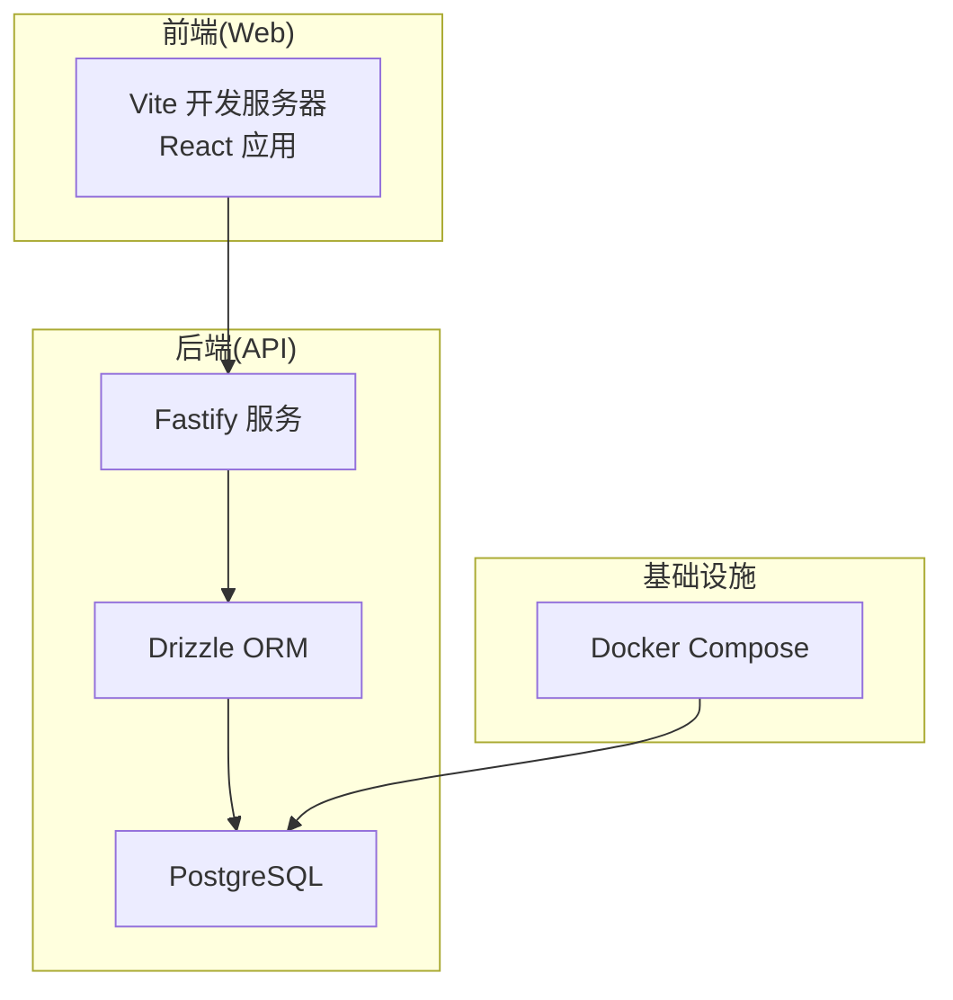
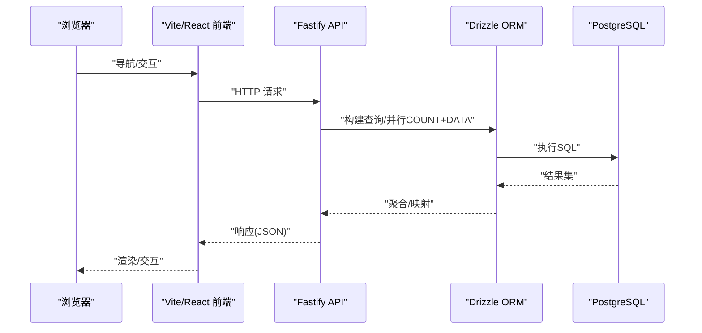
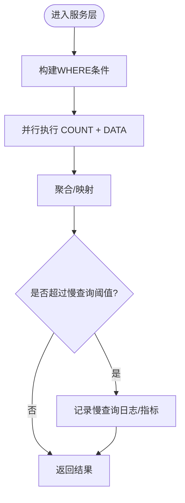
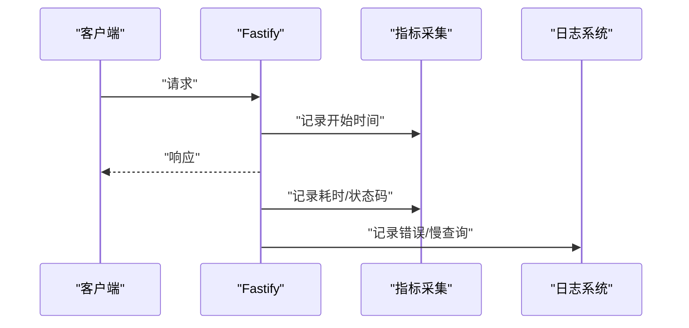
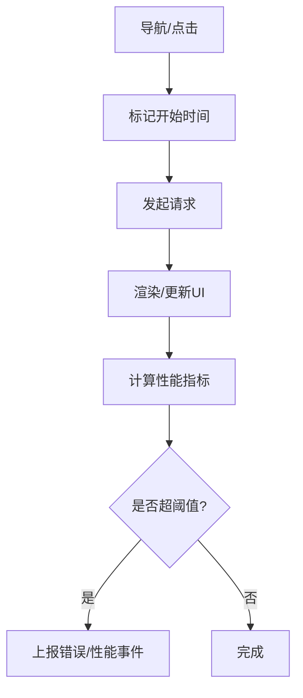
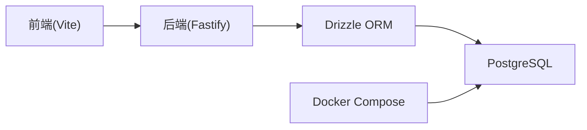

# 性能监控

<cite>
**本文引用的文件**
- [docker-compose.yml](file://workspace/dev/docker-compose.yml)
- [db.ts](file://packages/api/src/db.ts)
- [config.ts](file://packages/api/drizzle/config.ts)
- [project.service.ts](file://packages/api/src/services/project.service.ts)
- [organization.service.ts](file://packages/api/src/services/organization.service.ts)
- [coding-convention-backend.md](file://docs/04-tech-design/coding-convention-backend.md)
- [phase1-infrastructure-plan.md](file://docs/04-tech-design/phase1-infrastructure-plan.md)
- [f-m1-03-detail.spec.ts](file://packages/e2e/tests/project-management/f-m1-03-detail.spec.ts)
- [inspect-ui.mjs](file://packages/e2e/inspect-ui.mjs)
- [openapi-schema.test.ts](file://packages/api/tests/openapi/openapi-schema.test.ts)
- [2026-05-08-conversation.md](file://logs-important/2026-05-08-conversation.md)
</cite>

## 目录
1. [简介](#简介)
2. [项目结构](#项目结构)
3. [核心组件](#核心组件)
4. [架构总览](#架构总览)
5. [详细组件分析](#详细组件分析)
6. [依赖分析](#依赖分析)
7. [性能考虑](#性能考虑)
8. [故障排查指南](#故障排查指南)
9. [结论](#结论)
10. [附录](#附录)

## 简介
本文件面向AI原型管理系统（APM）的性能监控与优化，围绕系统关键指标（CPU、内存、网络I/O、磁盘I/O）、API性能（响应时间、吞吐量、错误率）、数据库性能（查询执行时间、连接池、索引效率）、前端性能（页面加载、交互响应）进行系统化梳理，并结合现有代码实现提出可落地的瓶颈识别与优化建议，辅以基准测试与容量规划指导。

## 项目结构
- 后端API采用Fastify框架，使用Drizzle ORM访问PostgreSQL，开发环境通过Docker Compose启动数据库服务。
- 前端采用React+Vite，配合Playwright进行端到端测试，覆盖页面加载、错误边界与重试等性能相关场景。
- 仓库包含基础设施初始化文档、数据库连接与迁移配置、服务层查询模式规范以及OpenAPI契约测试。

图表来源
- [docker-compose.yml:458-478](file://workspace/dev/docker-compose.yml#L458-L478)
- [db.ts:507-523](file://packages/api/src/db.ts#L507-L523)
- [config.ts:527-538](file://packages/api/drizzle/config.ts#L527-L538)

章节来源
- [phase1-infrastructure-plan.md:456-492](file://docs/04-tech-design/phase1-infrastructure-plan.md#L456-L492)
- [docker-compose.yml:458-478](file://workspace/dev/docker-compose.yml#L458-L478)
- [db.ts:507-523](file://packages/api/src/db.ts#L507-L523)

## 核心组件
- 数据库连接与迁移
  - 连接模块负责建立Drizzle连接与原始SQL连接，支持迁移与查询分离。
  - Drizzle配置文件定义Schema路径、迁移输出目录与数据库凭据。
- 服务层查询模式
  - 列表查询普遍采用“并行COUNT+DATA”策略，降低往返次数。
  - 复杂统计通过关联子查询或JOIN+GROUP BY聚合，避免N+1。
- 前端性能测试
  - E2E测试覆盖慢网络下的Skeleton占位、错误边界与重试逻辑，验证页面加载与交互响应。
- API契约与端点规模
  - OpenAPI契约测试确保端点数量与规范一致性，便于后续埋点与监控范围收敛。

章节来源
- [db.ts:507-523](file://packages/api/src/db.ts#L507-L523)
- [config.ts:527-538](file://packages/api/drizzle/config.ts#L527-L538)
- [project.service.ts:124-157](file://packages/api/src/services/project.service.ts#L124-L157)
- [organization.service.ts:197-232](file://packages/api/src/services/organization.service.ts#L197-L232)
- [coding-convention-backend.md:763-817](file://docs/04-tech-design/coding-convention-backend.md#L763-L817)
- [openapi-schema.test.ts:29-56](file://packages/api/tests/openapi/openapi-schema.test.ts#L29-L56)
- [f-m1-03-detail.spec.ts:363-422](file://packages/e2e/tests/project-management/f-m1-03-detail.spec.ts#L363-L422)

## 架构总览
下图展示从浏览器到数据库的关键调用链，以及性能监控可切入的位置（日志、指标、追踪）：

图表来源
- [project.service.ts:124-157](file://packages/api/src/services/project.service.ts#L124-L157)
- [organization.service.ts:197-232](file://packages/api/src/services/organization.service.ts#L197-L232)
- [db.ts:507-523](file://packages/api/src/db.ts#L507-L523)

## 详细组件分析

### 数据库性能监控
- 查询执行时间
  - 列表查询普遍采用并行COUNT+DATA，减少RTT；复杂统计通过子查询或JOIN+GROUP BY聚合，避免N+1。
  - 建议在Drizzle层增加查询耗时埋点与慢查询阈值告警。
- 连接池使用情况
  - 连接字符串来自环境变量，Drizzle默认使用prepared statements；迁移使用非prepared连接。
  - 建议监控连接池活跃/空闲数、等待队列长度与超时次数。
- 索引使用效率
  - 模糊搜索使用ILIKE/LIKE，建议对高频搜索字段建立合适索引（如GIN/GiST）。
  - 复合条件WHERE常用于分页列表，建议评估复合索引覆盖度。

图表来源
- [project.service.ts:124-157](file://packages/api/src/services/project.service.ts#L124-L157)
- [organization.service.ts:197-232](file://packages/api/src/services/organization.service.ts#L197-L232)

章节来源
- [db.ts:507-523](file://packages/api/src/db.ts#L507-L523)
- [config.ts:527-538](file://packages/api/drizzle/config.ts#L527-L538)
- [project.service.ts:124-157](file://packages/api/src/services/project.service.ts#L124-L157)
- [organization.service.ts:197-232](file://packages/api/src/services/organization.service.ts#L197-L232)
- [coding-convention-backend.md:763-817](file://docs/04-tech-design/coding-convention-backend.md#L763-L817)

### API性能监控
- 响应时间与吞吐量
  - 通过中间件或拦截器记录请求开始/结束时间，计算P50/P90/P99响应时间与QPS。
  - 对高频端点（如项目列表、组织统计）设置独立SLA与告警。
- 错误率与错误分类
  - 统计4xx/5xx错误分布，区分业务校验错误与系统异常。
  - 结合OpenAPI契约测试，确保端点变更不影响监控口径。
- 并发与资源占用
  - 监控并发请求数、CPU使用率、内存占用，定位峰值瓶颈。

图表来源
- [openapi-schema.test.ts:29-56](file://packages/api/tests/openapi/openapi-schema.test.ts#L29-L56)

章节来源
- [openapi-schema.test.ts:29-56](file://packages/api/tests/openapi/openapi-schema.test.ts#L29-L56)

### 前端性能监控
- 页面加载时间
  - 使用Navigation Timing API与PerformanceObserver测量首屏、交互时间（FCP/FID/LCP/TBT等）。
  - E2E测试模拟慢网络，验证Skeleton占位与错误边界，辅助评估用户体验阈值。
- 用户交互响应时间
  - 监控按钮点击、路由切换到UI更新的延迟，结合错误边界与重试逻辑评估稳定性。
- 可观测性集成
  - 建议在前端埋点上报性能指标与错误事件，与后端日志/指标联动分析。

图表来源
- [f-m1-03-detail.spec.ts:363-422](file://packages/e2e/tests/project-management/f-m1-03-detail.spec.ts#L363-L422)
- [inspect-ui.mjs:46-74](file://packages/e2e/inspect-ui.mjs#L46-L74)

章节来源
- [f-m1-03-detail.spec.ts:363-422](file://packages/e2e/tests/project-management/f-m1-03-detail.spec.ts#L363-L422)
- [inspect-ui.mjs:46-74](file://packages/e2e/inspect-ui.mjs#L46-L74)

### 缓存策略与优化建议
- 读多写少场景
  - 对稳定列表（如项目、组织）启用Redis缓存，设置合理TTL与失效策略。
  - 使用ETag/Cache-Control控制静态资源缓存，减少重复传输。
- 查询优化
  - 依据WHERE条件与排序字段建立复合索引，避免全表扫描。
  - 将频繁使用的统计聚合结果物化（Materialized View）或定期刷新。
- 代码与并发
  - 保持并行COUNT+DATA模式，避免串行查询。
  - 控制一次性批量查询的数据量，分批处理或流式输出。

章节来源
- [coding-convention-backend.md:763-817](file://docs/04-tech-design/coding-convention-backend.md#L763-L817)
- [project.service.ts:124-157](file://packages/api/src/services/project.service.ts#L124-L157)
- [organization.service.ts:197-232](file://packages/api/src/services/organization.service.ts#L197-L232)

## 依赖分析
- 组件耦合
  - API服务层依赖Drizzle ORM与数据库连接模块；Drizzle依赖PostgreSQL。
  - 前端通过HTTP接口与API交互，受API性能与可用性影响。
- 外部依赖
  - Docker Compose提供数据库容器；Drizzle用于Schema与迁移管理。
- 潜在风险
  - 环境变量覆盖数据库连接串，需确保生产环境安全配置。
  - 端口占用与容器健康检查需纳入运维监控。

图表来源
- [docker-compose.yml:458-478](file://workspace/dev/docker-compose.yml#L458-L478)
- [db.ts:507-523](file://packages/api/src/db.ts#L507-L523)

章节来源
- [phase1-infrastructure-plan.md:456-492](file://docs/04-tech-design/phase1-infrastructure-plan.md#L456-L492)
- [2026-05-08-conversation.md:100-111](file://logs-important/2026-05-08-conversation.md#L100-L111)

## 性能考虑
- CPU与内存
  - 监控容器CPU/内存使用率，识别高负载时段与热点接口。
  - 对大对象序列化/反序列化进行优化，避免不必要的拷贝。
- 网络I/O
  - 评估请求/响应体大小，启用压缩（gzip/br）与CDN缓存静态资源。
  - 控制跨域与TLS握手成本，合并小请求。
- 磁盘I/O
  - 数据库日志与WAL目录挂载独立磁盘，监控IO等待与队列长度。
  - 定期清理日志与临时文件，避免磁盘空间不足导致性能退化。

## 故障排查指南
- 数据库连接与迁移
  - 确认连接串与容器健康状态；迁移脚本使用非prepared连接避免缓存干扰。
- 查询性能问题
  - 通过慢查询日志与指标定位长尾请求；核对WHERE条件与索引覆盖。
- 前端加载异常
  - 使用E2E测试模拟网络异常与慢响应，验证错误边界与重试逻辑。
- 端点与契约
  - 通过OpenAPI契约测试确保端点数量与规范一致，避免监控口径漂移。

章节来源
- [db.ts:507-523](file://packages/api/src/db.ts#L507-L523)
- [config.ts:527-538](file://packages/api/drizzle/config.ts#L527-L538)
- [f-m1-03-detail.spec.ts:363-422](file://packages/e2e/tests/project-management/f-m1-03-detail.spec.ts#L363-L422)
- [openapi-schema.test.ts:29-56](file://packages/api/tests/openapi/openapi-schema.test.ts#L29-L56)

## 结论
本系统在服务层已具备并行查询与统计聚合的良好实践，建议在此基础上完善指标采集、慢查询告警与前端性能埋点，形成端到端的可观测闭环。通过缓存、索引与查询优化持续降低数据库压力，结合容量规划与压测，保障在业务增长下的稳定性能表现。

## 附录
- 基准测试与容量规划
  - 基于现有端点规模（约66个）制定压测目标，覆盖高频列表与详情接口。
  - 以P95/P99响应时间与错误率作为容量阈值，结合CPU/内存/磁盘I/O进行容量配额设计。
- 运维与监控清单
  - 后端：请求耗时、错误率、连接池状态、慢查询日志。
  - 数据库：查询执行时间、锁等待、缓冲区命中率、WAL写入速率。
  - 前端：首屏时间、交互延迟、错误边界触发频率、重试次数。