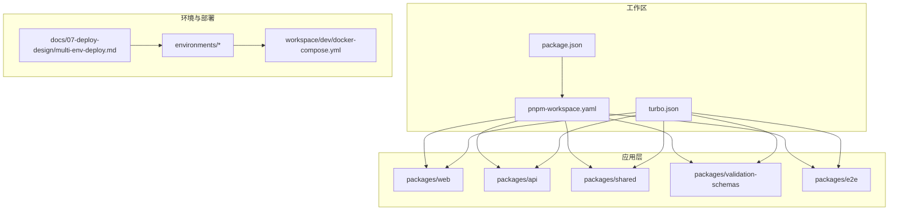
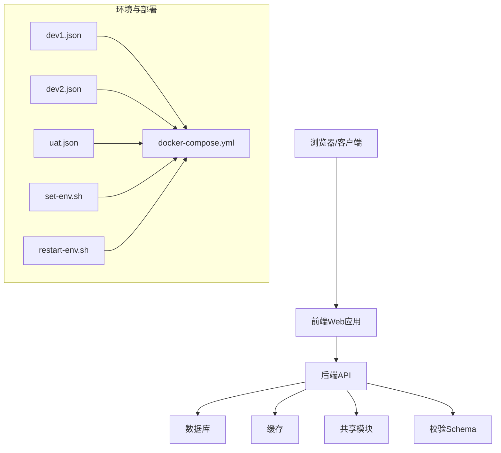
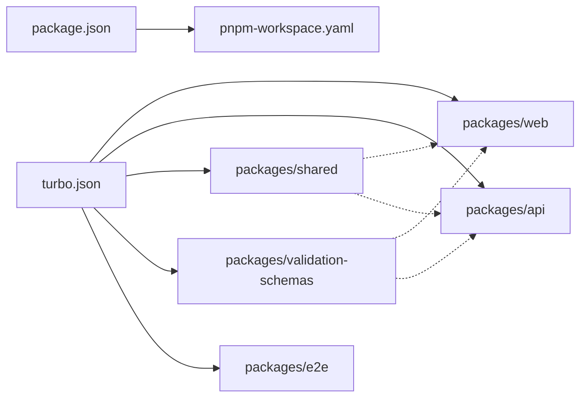
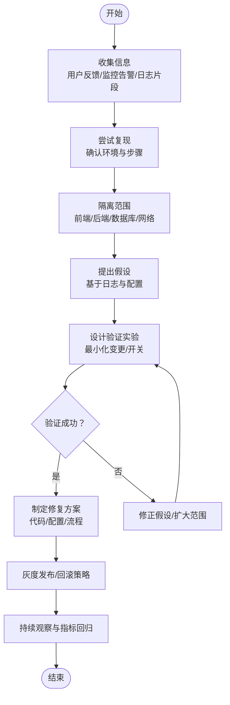

# 故障排查

<cite>
**本文引用的文件**
- [README.md](file://README.md)
- [package.json](file://package.json)
- [pnpm-workspace.yaml](file://pnpm-workspace.yaml)
- [turbo.json](file://turbo.json)
- [workspace/dev/docker-compose.yml](file://workspace/dev/docker-compose.yml)
- [environments/README.md](file://environments/README.md)
- [environments/set-env.sh](file://environments/set-env.sh)
- [environments/restart-env.sh](file://environments/restart-env.sh)
- [environments/dev1.json](file://environments/dev1.json)
- [environments/dev2.json](file://environments/dev2.json)
- [environments/uat.json](file://environments/uat.json)
- [packages/api/package.json](file://packages/api/package.json)
- [packages/web/package.json](file://packages/web/package.json)
- [packages/shared/package.json](file://packages/shared/package.json)
- [packages/validation-schemas/package.json](file://packages/validation-schemas/package.json)
- [packages/e2e/package.json](file://packages/e2e/package.json)
- [docs/07-deploy-design/multi-env-deploy.md](file://docs/07-deploy-design/multi-env-deploy.md)
- [logs-important/2026-04-25-conversation.md](file://logs-important/2026-04-25-conversation.md)
- [logs-important/2026-04-26-conversation.md](file://logs-important/2026-04-26-conversation.md)
- [logs-important/2026-04-29-conversation.md](file://logs-important/2026-04-29-conversation.md)
- [logs-important/2026-05-03-conversation.md](file://logs-important/2026-05-03-conversation.md)
- [logs-important/2026-05-06-conversation.md](file://logs-important/2026-05-06-conversation.md)
- [logs-important/2026-05-08-conversation.md](file://logs-important/2026-05-08-conversation.md)
- [logs-important/2026-05-11-conversation.md](file://logs-important/2026-05-11-conversation.md)
- [logs-important/2026-05-13-conversation.md](file://logs-important/2026-05-13-conversation.md)
</cite>

## 目录
1. [简介](#简介)
2. [项目结构](#项目结构)
3. [核心组件](#核心组件)
4. [架构总览](#架构总览)
5. [详细组件分析](#详细组件分析)
6. [依赖分析](#依赖分析)
7. [性能考量](#性能考量)
8. [故障排查指南](#故障排查指南)
9. [结论](#结论)
10. [附录](#附录)

## 简介
本故障排查文档面向AI原型管理系统，聚焦于开发与运维实践中的常见问题定位与处置流程。内容覆盖问题定位、根因分析、解决方案制定、日志分析技巧、调试工具与命令、应急响应机制以及故障预防与系统加固建议。文档以仓库现有配置与部署设计为依据，结合多环境部署与容器化方案，帮助快速恢复服务可用性并降低故障影响面。

## 项目结构
系统采用多包工作区（monorepo）组织方式，包含前端Web应用、后端API、共享模块、校验Schema与E2E测试等子包；同时提供多环境配置与容器编排文件，便于在不同阶段进行部署与验证。

**图表来源**
- [pnpm-workspace.yaml](file://pnpm-workspace.yaml)
- [turbo.json](file://turbo.json)
- [packages/web/package.json](file://packages/web/package.json)
- [packages/api/package.json](file://packages/api/package.json)
- [packages/shared/package.json](file://packages/shared/package.json)
- [packages/validation-schemas/package.json](file://packages/validation-schemas/package.json)
- [packages/e2e/package.json](file://packages/e2e/package.json)
- [workspace/dev/docker-compose.yml](file://workspace/dev/docker-compose.yml)
- [docs/07-deploy-design/multi-env-deploy.md](file://docs/07-deploy-design/multi-env-deploy.md)

**章节来源**
- [pnpm-workspace.yaml](file://pnpm-workspace.yaml)
- [turbo.json](file://turbo.json)
- [package.json](file://package.json)

## 核心组件
- 前端Web应用：负责用户交互与业务展示，通过API进行数据访问。
- 后端API：提供REST接口与业务逻辑，承载核心数据处理与对外服务。
- 共享模块：封装通用工具、类型定义与跨包复用能力。
- 校验Schema：统一数据契约与输入输出校验。
- E2E测试：端到端验证系统集成与关键流程。
- 多环境配置：dev1/dev2/uat等环境参数与切换脚本。
- 容器编排：docker-compose用于本地开发与联调。

**章节来源**
- [packages/web/package.json](file://packages/web/package.json)
- [packages/api/package.json](file://packages/api/package.json)
- [packages/shared/package.json](file://packages/shared/package.json)
- [packages/validation-schemas/package.json](file://packages/validation-schemas/package.json)
- [packages/e2e/package.json](file://packages/e2e/package.json)
- [environments/README.md](file://environments/README.md)
- [workspace/dev/docker-compose.yml](file://workspace/dev/docker-compose.yml)

## 架构总览
系统采用前后端分离架构，前端通过HTTP访问后端API；数据库与缓存等基础设施由容器编排文件定义，支持本地开发与多环境部署。多环境配置文件与脚本提供环境切换与重启能力，便于快速定位问题所在环境。

**图表来源**
- [workspace/dev/docker-compose.yml](file://workspace/dev/docker-compose.yml)
- [environments/dev1.json](file://environments/dev1.json)
- [environments/dev2.json](file://environments/dev2.json)
- [environments/uat.json](file://environments/uat.json)
- [environments/set-env.sh](file://environments/set-env.sh)
- [environments/restart-env.sh](file://environments/restart-env.sh)
- [docs/07-deploy-design/multi-env-deploy.md](file://docs/07-deploy-design/multi-env-deploy.md)

## 详细组件分析

### 前端Web应用
- 职责：用户界面渲染、状态管理、API调用与错误提示。
- 关键点：网络请求失败、鉴权异常、路由跳转、资源加载失败等。
- 排查要点：检查API基础URL、鉴权令牌、CORS设置、静态资源路径与版本。

**章节来源**
- [packages/web/package.json](file://packages/web/package.json)

### 后端API
- 职责：接收请求、执行业务逻辑、访问数据库与外部服务、返回标准化响应。
- 关键点：数据库连接、缓存命中、第三方接口超时、并发与资源限制。
- 排查要点：查看服务日志、慢查询、连接池状态、健康检查端点。

**章节来源**
- [packages/api/package.json](file://packages/api/package.json)

### 共享模块与校验Schema
- 职责：提供类型定义、工具函数、输入输出校验规则，确保跨包一致性。
- 关键点：Schema变更导致的请求拒绝、类型不匹配、序列化/反序列化异常。
- 排查要点：核对Schema版本、对比请求/响应样本、定位具体字段。

**章节来源**
- [packages/shared/package.json](file://packages/shared/package.json)
- [packages/validation-schemas/package.json](file://packages/validation-schemas/package.json)

### E2E测试
- 职责：验证端到端流程，覆盖关键业务场景。
- 关键点：测试环境一致性、依赖服务可用性、断言失败定位。
- 排查要点：重放失败用例、抓取网络与日志、比对期望结果。

**章节来源**
- [packages/e2e/package.json](file://packages/e2e/package.json)

### 多环境配置与容器编排
- 职责：提供不同环境的参数与启动脚本，支撑本地开发与联调。
- 关键点：环境变量覆盖、端口冲突、容器健康状态、卷挂载与权限。
- 排查要点：确认当前环境、检查容器日志、验证端口占用与网络连通。

**章节来源**
- [environments/README.md](file://environments/README.md)
- [environments/set-env.sh](file://environments/set-env.sh)
- [environments/restart-env.sh](file://environments/restart-env.sh)
- [workspace/dev/docker-compose.yml](file://workspace/dev/docker-compose.yml)
- [docs/07-deploy-design/multi-env-deploy.md](file://docs/07-deploy-design/multi-env-deploy.md)

## 依赖分析
- 工作区管理：通过工作区配置与任务编排文件，统一管理各子包的构建、测试与发布。
- 包间依赖：共享模块与校验Schema被多个包依赖，变更需谨慎评估影响范围。
- 运行时依赖：API与Web分别维护各自运行时依赖，避免冲突并保持最小化。

**图表来源**
- [pnpm-workspace.yaml](file://pnpm-workspace.yaml)
- [turbo.json](file://turbo.json)
- [package.json](file://package.json)

**章节来源**
- [pnpm-workspace.yaml](file://pnpm-workspace.yaml)
- [turbo.json](file://turbo.json)
- [package.json](file://package.json)

## 性能考量
- API响应时间：关注慢查询、缓存未命中、第三方接口延迟与并发峰值。
- 数据库性能：索引缺失、锁竞争、连接池耗尽、批量写入优化。
- 前端性能：资源体积、懒加载、CDN与缓存策略、首屏渲染时间。
- 容器资源：CPU/内存限制与配额、健康检查间隔、重启策略。

[本节为通用指导，无需引用具体文件]

## 故障排查指南

### 一、问题定位流程

[本图为概念流程图，不对应具体源码文件]

### 二、常见故障类型与处理方法
- 服务不可用
  - 现象：API 5xx、页面白屏、接口无响应。
  - 快速检查：容器健康状态、端口占用、进程存活、负载均衡状态。
  - 处理：重启容器/进程、检查防火墙与安全组、核对入口网关配置。
- 数据库连接失败
  - 现象：启动报错、事务失败、连接池耗尽。
  - 快速检查：连接串、凭据、网络连通、实例状态、最大连接数。
  - 处理：调整连接池参数、优化SQL、扩容实例或分片。
- API响应超时
  - 现象：接口超时、队列堆积、下游依赖延迟。
  - 快速检查：慢查询、缓存命中率、限流与熔断、上游依赖健康。
  - 处理：引入超时与重试策略、异步化、降级与熔断。

**章节来源**
- [workspace/dev/docker-compose.yml](file://workspace/dev/docker-compose.yml)
- [environments/dev1.json](file://environments/dev1.json)
- [environments/dev2.json](file://environments/dev2.json)
- [environments/uat.json](file://environments/uat.json)

### 三、日志分析技巧
- 错误日志解读
  - 关注时间戳、服务名、线程/进程ID、错误码与消息体。
  - 使用关键词过滤（如“error”、“exception”、“fail”），并按模块聚合。
- 堆栈跟踪分析
  - 定位异常发生位置，优先查看业务层调用链，再深入底层依赖。
  - 对比版本差异，确认是否为已知缺陷或回归问题。
- 性能瓶颈识别
  - 观察慢查询Top N、GC与内存峰值、I/O等待、CPU热点。
  - 结合分布式追踪（如Trace ID）串联请求链路。

**章节来源**
- [logs-important/2026-04-25-conversation.md](file://logs-important/2026-04-25-conversation.md)
- [logs-important/2026-04-26-conversation.md](file://logs-important/2026-04-26-conversation.md)
- [logs-important/2026-04-29-conversation.md](file://logs-important/2026-04-29-conversation.md)
- [logs-important/2026-05-03-conversation.md](file://logs-important/2026-05-03-conversation.md)
- [logs-important/2026-05-06-conversation.md](file://logs-important/2026-05-06-conversation.md)
- [logs-important/2026-05-08-conversation.md](file://logs-important/2026-05-08-conversation.md)
- [logs-important/2026-05-11-conversation.md](file://logs-important/2026-05-11-conversation.md)
- [logs-important/2026-05-13-conversation.md](file://logs-important/2026-05-13-conversation.md)

### 四、调试工具与命令
- Docker容器检查
  - 查看容器状态与日志：确认容器是否健康、端口映射是否正确。
  - 进入容器排查：检查进程、网络连通与磁盘空间。
- 网络连接测试
  - 使用连通性工具验证API可达性、DNS解析与端口开放情况。
- 数据库查询诊断
  - 检查连接数、慢查询日志、锁等待与事务隔离级别。
  - 执行计划分析与索引使用情况，必要时添加或重构索引。
- 环境切换与重启
  - 使用环境脚本切换目标环境，执行重启脚本恢复服务。

**章节来源**
- [workspace/dev/docker-compose.yml](file://workspace/dev/docker-compose.yml)
- [environments/set-env.sh](file://environments/set-env.sh)
- [environments/restart-env.sh](file://environments/restart-env.sh)

### 五、应急响应机制
- 故障升级流程
  - 一线值班：快速止损与降级，控制影响面。
  - 二线支持：根因分析与修复方案评审。
  - 三线专家：架构层面加固与长期改进。
- 备份恢复策略
  - 数据库快照与增量备份、配置文件版本化、镜像与制品库。
  - 制定RTO/RPO目标，定期演练恢复流程。
- 紧急修复程序
  - 热修复与灰度发布，确保变更可回滚；记录变更日志与影响评估。

**章节来源**
- [environments/README.md](file://environments/README.md)
- [docs/07-deploy-design/multi-env-deploy.md](file://docs/07-deploy-design/multi-env-deploy.md)

### 六、故障预防与系统加固建议
- 配置治理
  - 环境参数集中管理与审批，避免硬编码与分散配置。
- 监控与告警
  - 建立关键指标阈值与告警通道，覆盖可用性、延迟、错误率与饱和度。
- 容灾与弹性
  - 多副本与多可用区部署、自动扩缩容、熔断与隔离。
- 安全加固
  - 最小权限原则、密钥轮换、入站/出站访问控制、漏洞扫描与补丁管理。
- 文化与流程
  - 变更评审、发布门禁、事后复盘与知识沉淀。

[本节为通用指导，无需引用具体文件]

## 结论
通过明确的问题定位流程、完善的日志分析方法、实用的调试工具与命令、规范的应急响应机制，以及持续的故障预防与加固，可以显著提升系统的稳定性与可维护性。建议在团队内固化标准操作手册，并结合实际运行情况进行迭代优化。

## 附录
- 多环境部署设计参考：[多环境部署设计](file://docs/07-deploy-design/multi-env-deploy.md)
- 环境说明与脚本：[环境说明](file://environments/README.md)、[切换脚本](file://environments/set-env.sh)、[重启脚本](file://environments/restart-env.sh)
- 开发容器编排：[docker-compose](file://workspace/dev/docker-compose.yml)