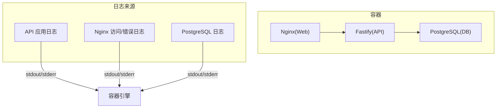
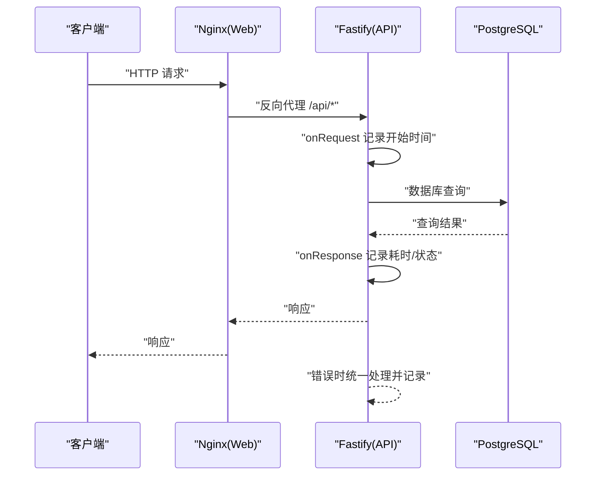
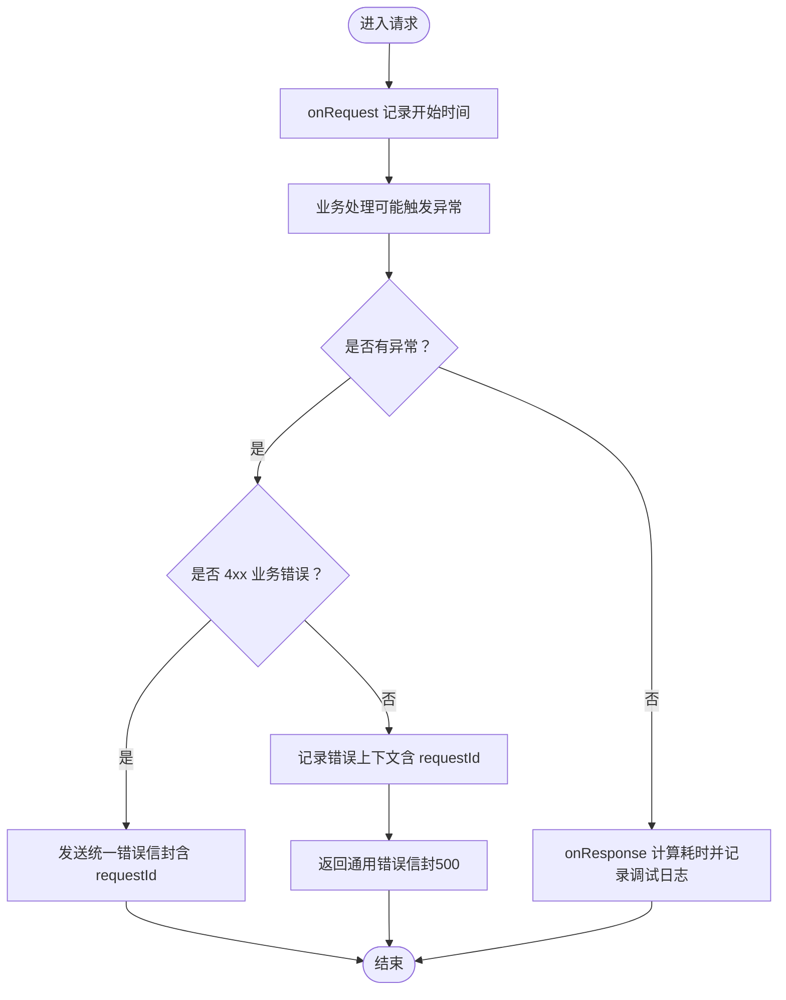
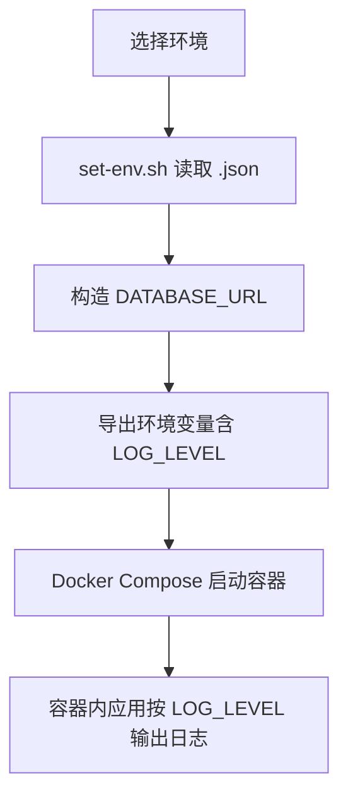
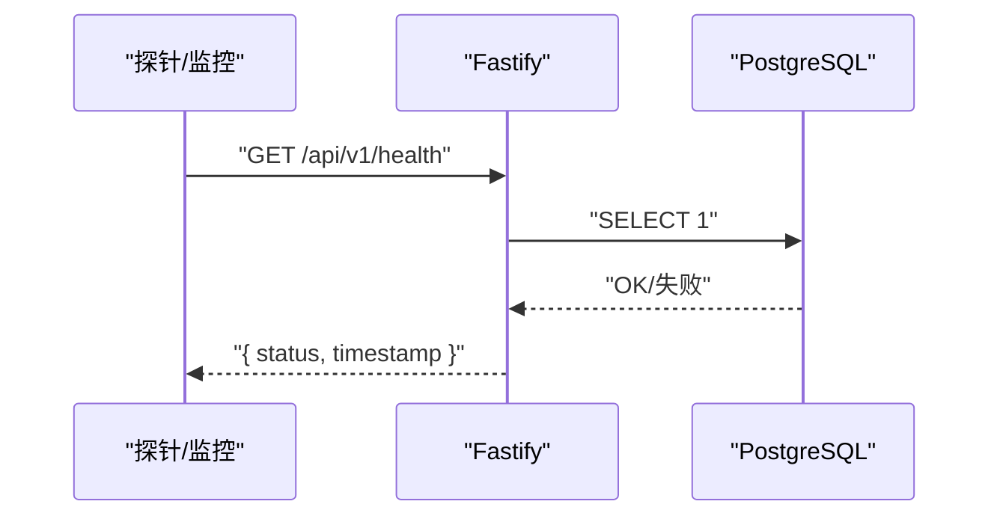
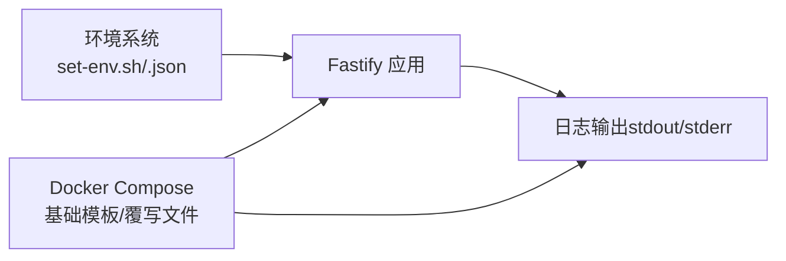

# 日志管理

<cite>
**本文引用的文件**
- [packages/api/src/app.ts](file://packages/api/src/app.ts)
- [docs/04-tech-design/phase1-infrastructure-plan.md](file://docs/04-tech-design/phase1-infrastructure-plan.md)
- [docs/07-deploy-design/multi-env-deploy.md](file://docs/07-deploy-design/multi-env-deploy.md)
- [packages/api/src/db.ts](file://packages/api/src/db.ts)
- [packages/api/drizzle/config.ts](file://packages/api/drizzle/config.ts)
- [environments/set-env.sh](file://environments/set-env.sh)
- [environments/restart-env.sh](file://environments/restart-env.sh)
- [environments/README.md](file://environments/README.md)
</cite>

## 目录
1. [简介](#简介)
2. [项目结构](#项目结构)
3. [核心组件](#核心组件)
4. [架构总览](#架构总览)
5. [详细组件分析](#详细组件分析)
6. [依赖分析](#依赖分析)
7. [性能考虑](#性能考虑)
8. [故障排查指南](#故障排查指南)
9. [结论](#结论)
10. [附录](#附录)

## 简介
本文件面向“AI原型管理系统”的日志管理，基于仓库中已有的实现与部署文档，系统性梳理日志采集、分类、级别与格式、存储与轮转、分析与监控、以及安全与隐私保护等实践建议。当前系统采用 Fastify 应用内置日志、Docker Compose 容器化部署，并通过环境变量控制日志级别；后续可在此基础上扩展结构化日志、集中式日志收集与分析。

## 项目结构
围绕日志管理的关键位置如下：
- 应用日志：Fastify 应用在启动时通过环境变量设置日志级别，并在请求生命周期中记录调试信息。
- 容器日志：Docker Compose 以标准输出/错误输出形式输出容器日志，便于统一收集。
- 环境变量：通过环境系统脚本与覆写文件注入 LOG_LEVEL、DATABASE_URL 等，影响日志行为与连接。
- 健康检查与日志：健康检查路由与错误处理器共同构成可观测性基础。

图表来源
- [docs/07-deploy-design/multi-env-deploy.md:312-374](file://docs/07-deploy-design/multi-env-deploy.md#L312-L374)
- [packages/api/src/app.ts:105-135](file://packages/api/src/app.ts#L105-L135)

章节来源
- [docs/07-deploy-design/multi-env-deploy.md:312-374](file://docs/07-deploy-design/multi-env-deploy.md#L312-L374)
- [packages/api/src/app.ts:105-135](file://packages/api/src/app.ts#L105-L135)

## 核心组件
- Fastify 应用日志与错误处理
  - 日志级别：通过环境变量 LOG_LEVEL 控制，默认为 info。
  - 请求日志：在 onRequest/onResponse 钩子中记录方法、URL、状态码与耗时。
  - 全局错误处理：对 4xx 业务错误与 500 未预期异常进行统一返回，并记录错误上下文。
- 环境与日志级别
  - LOG_LEVEL 在不同环境覆写文件中分别设置为 debug（dev1/dev2）、info（uat）。
- 数据库连接与日志
  - DATABASE_URL 由环境系统注入，未设置时抛出明确错误提示，避免静默失败。
- 健康检查
  - 提供 /api/v1/health，用于快速判断服务与数据库连通性。

章节来源
- [docs/04-tech-design/phase1-infrastructure-plan.md:1217-1221](file://docs/04-tech-design/phase1-infrastructure-plan.md#L1217-L1221)
- [packages/api/src/app.ts:74-99](file://packages/api/src/app.ts#L74-L99)
- [packages/api/src/app.ts:105-135](file://packages/api/src/app.ts#L105-L135)
- [docs/07-deploy-design/multi-env-deploy.md](file://docs/07-deploy-design/multi-env-deploy.md#L396)
- [docs/07-deploy-design/multi-env-deploy.md](file://docs/07-deploy-design/multi-env-deploy.md#L426)
- [docs/07-deploy-design/multi-env-deploy.md](file://docs/07-deploy-design/multi-env-deploy.md#L456)
- [packages/api/src/db.ts:5-12](file://packages/api/src/db.ts#L5-L12)
- [packages/api/drizzle/config.ts:7-9](file://packages/api/drizzle/config.ts#L7-L9)

## 架构总览
下图展示日志在系统中的流向：应用日志经容器标准输出输出，由容器编排系统统一收集；健康检查与错误处理为可观测性提供基础。

图表来源
- [packages/api/src/app.ts:105-135](file://packages/api/src/app.ts#L105-L135)
- [docs/07-deploy-design/multi-env-deploy.md:320-354](file://docs/07-deploy-design/multi-env-deploy.md#L320-L354)

## 详细组件分析

### Fastify 应用日志与错误处理
- 日志级别
  - 应用启动时根据 LOG_LEVEL 初始化日志级别。
- 请求日志
  - onRequest 钩子记录请求开始时间；onResponse 钩子计算耗时并输出调试日志。
- 错误处理
  - 4xx 业务错误：返回统一错误信封，包含错误码、消息与请求追踪 ID。
  - 500 未预期异常：记录错误上下文并返回通用错误信封，不泄露堆栈细节。

图表来源
- [packages/api/src/app.ts:74-99](file://packages/api/src/app.ts#L74-L99)
- [packages/api/src/app.ts:105-135](file://packages/api/src/app.ts#L105-L135)

章节来源
- [docs/04-tech-design/phase1-infrastructure-plan.md:1217-1221](file://docs/04-tech-design/phase1-infrastructure-plan.md#L1217-L1221)
- [packages/api/src/app.ts:74-99](file://packages/api/src/app.ts#L74-L99)
- [packages/api/src/app.ts:105-135](file://packages/api/src/app.ts#L105-L135)

### 环境变量与日志级别
- LOG_LEVEL
  - dev1/dev2：debug
  - uat：info
- DATABASE_URL
  - 由环境系统注入，未设置时抛错，避免静默失败。
- 环境切换
  - set-env.sh 读取环境 JSON，构造 DATABASE_URL 并导出；restart-env.sh 提供端口清理与服务重启流程。

图表来源
- [environments/set-env.sh:78-94](file://environments/set-env.sh#L78-L94)
- [docs/07-deploy-design/multi-env-deploy.md](file://docs/07-deploy-design/multi-env-deploy.md#L396)
- [docs/07-deploy-design/multi-env-deploy.md](file://docs/07-deploy-design/multi-env-deploy.md#L426)
- [docs/07-deploy-design/multi-env-deploy.md](file://docs/07-deploy-design/multi-env-deploy.md#L456)

章节来源
- [docs/07-deploy-design/multi-env-deploy.md](file://docs/07-deploy-design/multi-env-deploy.md#L396)
- [docs/07-deploy-design/multi-env-deploy.md](file://docs/07-deploy-design/multi-env-deploy.md#L426)
- [docs/07-deploy-design/multi-env-deploy.md](file://docs/07-deploy-design/multi-env-deploy.md#L456)
- [environments/set-env.sh:78-94](file://environments/set-env.sh#L78-L94)
- [packages/api/src/db.ts:5-12](file://packages/api/src/db.ts#L5-L12)
- [packages/api/drizzle/config.ts:7-9](file://packages/api/drizzle/config.ts#L7-L9)

### 健康检查与可观测性基线
- 健康检查路由：快速验证 API 与数据库连通性，返回状态与时间戳。
- 错误处理：统一错误信封，便于日志分析与告警。

图表来源
- [packages/api/src/app.ts:120-131](file://packages/api/src/app.ts#L120-L131)

章节来源
- [packages/api/src/app.ts:120-131](file://packages/api/src/app.ts#L120-L131)

## 依赖分析
- 应用层依赖
  - Fastify 实例初始化时读取 LOG_LEVEL，决定日志级别。
  - 错误处理器依赖请求 ID（由框架提供）进行统一错误输出。
- 环境层依赖
  - set-env.sh 读取环境 JSON，生成 DATABASE_URL 并导出；restart-env.sh 负责端口清理与服务重启。
- 部署层依赖
  - Docker Compose 基础模板定义服务与健康检查；环境覆写文件注入 LOG_LEVEL 与数据库连接。

图表来源
- [environments/set-env.sh:78-94](file://environments/set-env.sh#L78-L94)
- [docs/07-deploy-design/multi-env-deploy.md:312-374](file://docs/07-deploy-design/multi-env-deploy.md#L312-L374)
- [docs/07-deploy-design/multi-env-deploy.md](file://docs/07-deploy-design/multi-env-deploy.md#L396)

章节来源
- [docs/04-tech-design/phase1-infrastructure-plan.md:1217-1221](file://docs/04-tech-design/phase1-infrastructure-plan.md#L1217-L1221)
- [packages/api/src/app.ts:74-99](file://packages/api/src/app.ts#L74-L99)
- [environments/set-env.sh:78-94](file://environments/set-env.sh#L78-L94)
- [docs/07-deploy-design/multi-env-deploy.md:312-374](file://docs/07-deploy-design/multi-env-deploy.md#L312-L374)

## 性能考虑
- 日志级别
  - 开发环境使用 debug 以获取详细请求轨迹；生产/UAT 使用 info 降低日志体量。
- 请求耗时记录
  - onResponse 钩子记录耗时，有助于识别慢请求与潜在瓶颈。
- 建议
  - 在高并发场景下，避免在高频路径中输出大对象或敏感字段，减少序列化开销。
  - 结合结构化日志与采样策略，进一步优化日志体积与解析效率。

## 故障排查指南
- 环境未激活导致 DATABASE_URL 未设置
  - 现象：数据库连接初始化时报错，提示需先激活环境。
  - 处理：使用 set-env.sh 激活目标环境，确认导出的 DATABASE_URL 正确。
- 端口占用导致服务无法启动
  - 现象：启动失败或端口冲突。
  - 处理：使用 restart-env.sh 清理占用端口的进程后重试。
- 健康检查失败
  - 现象：/api/v1/health 返回降级状态。
  - 处理：检查数据库连通性与连接字符串，确认 LOG_LEVEL 未过高导致 I/O 压力增大。

章节来源
- [packages/api/src/db.ts:5-12](file://packages/api/src/db.ts#L5-L12)
- [environments/set-env.sh:78-94](file://environments/set-env.sh#L78-L94)
- [environments/restart-env.sh:62-70](file://environments/restart-env.sh#L62-L70)
- [packages/api/src/app.ts:120-131](file://packages/api/src/app.ts#L120-L131)

## 结论
当前系统已具备基础的日志能力：应用层通过钩子记录请求耗时，错误处理统一输出错误信封，日志级别由环境变量控制。结合 Docker Compose 的容器化输出，可为后续接入集中式日志收集与分析打下基础。建议在下一阶段引入结构化日志、日志轮转与归档策略，并完善监控与告警体系。

## 附录

### 日志收集策略
- 容器日志聚合
  - 利用容器标准输出/错误输出，结合容器编排平台的日志收集功能，统一采集 API、Web、DB 三类日志。
- 应用日志分类
  - 请求日志：onResponse 钩子输出的方法、URL、状态码与耗时。
  - 错误日志：全局错误处理器统一记录错误上下文与请求追踪 ID。
- 错误追踪
  - 使用请求 ID（request.id）贯穿一次请求的全链路日志，便于串联分析。

章节来源
- [packages/api/src/app.ts:105-135](file://packages/api/src/app.ts#L105-L135)
- [packages/api/src/app.ts:74-99](file://packages/api/src/app.ts#L74-L99)

### 日志级别与格式规范
- 日志级别
  - 开发环境：debug
  - UAT 环境：info
- 日志格式
  - 当前为文本格式（方法、URL、状态码、耗时）。建议引入结构化日志（JSON），包含时间戳、级别、模块、请求 ID、消息与上下文字段，便于机器解析与检索。

章节来源
- [docs/07-deploy-design/multi-env-deploy.md](file://docs/07-deploy-design/multi-env-deploy.md#L396)
- [docs/07-deploy-design/multi-env-deploy.md](file://docs/07-deploy-design/multi-env-deploy.md#L426)
- [docs/07-deploy-design/multi-env-deploy.md](file://docs/07-deploy-design/multi-env-deploy.md#L456)
- [docs/04-tech-design/phase1-infrastructure-plan.md:1217-1221](file://docs/04-tech-design/phase1-infrastructure-plan.md#L1217-L1221)

### 日志存储与轮转
- 存储位置
  - 容器标准输出/错误输出，由容器运行时管理。
- 轮转机制
  - 建议在容器运行时或宿主机侧配置日志驱动的轮转策略（如基于大小与时间的轮转），并设置保留天数/数量上限，避免磁盘占满。
- 建议
  - 将容器日志持久化到独立卷或外部存储，配合轮转策略实现长期归档。

### 日志分析与监控
- 分析工具
  - 建议引入 ELK/EFK 或类似方案，采集容器日志并建立索引，支持按时间、级别、请求 ID、URL 等维度检索。
- 监控与告警
  - 错误率监控：统计 5xx 错误占比，设定阈值告警。
  - 异常检测：基于错误类型分布与耗时分布的异常检测，辅助定位问题。
  - 健康检查：结合 /api/v1/health 的状态变化，联动告警。

### 日志安全与隐私保护
- 最小披露
  - 错误处理不泄露堆栈与内部细节，仅返回通用错误信封。
- 敏感信息脱敏
  - 在结构化日志中避免输出数据库密码、令牌等敏感字段；对请求体与响应体进行必要脱敏。
- 访问控制
  - 日志系统访问权限最小化，审计日志访问行为，防止未授权查看。