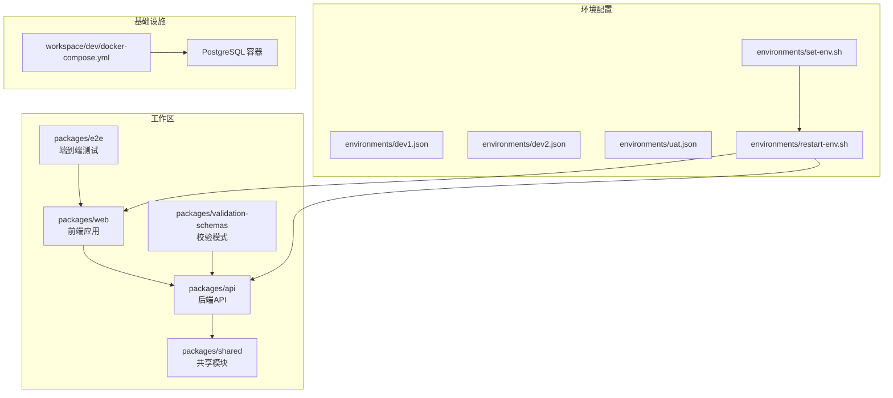
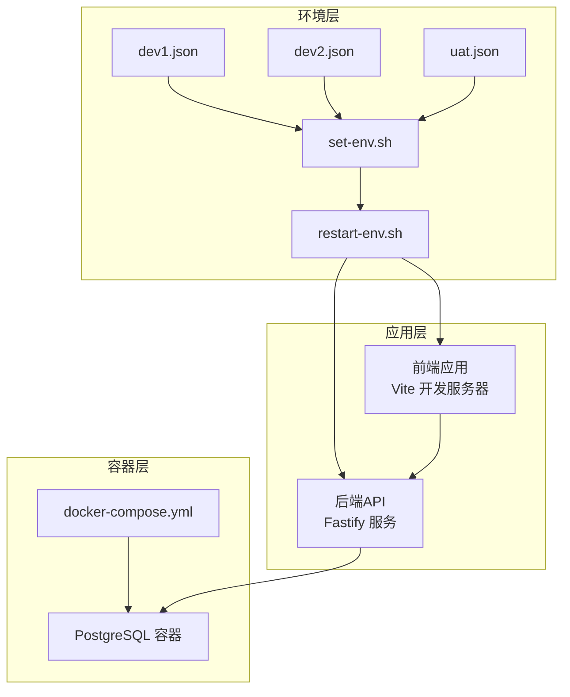
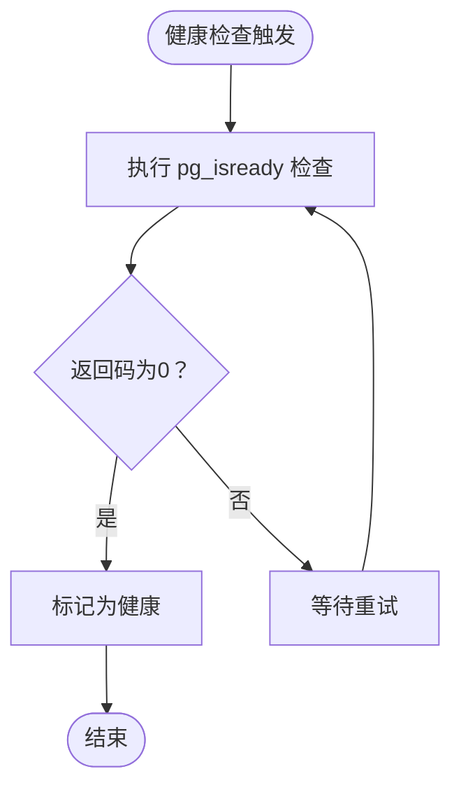
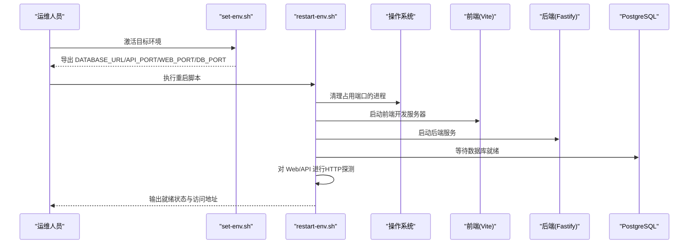
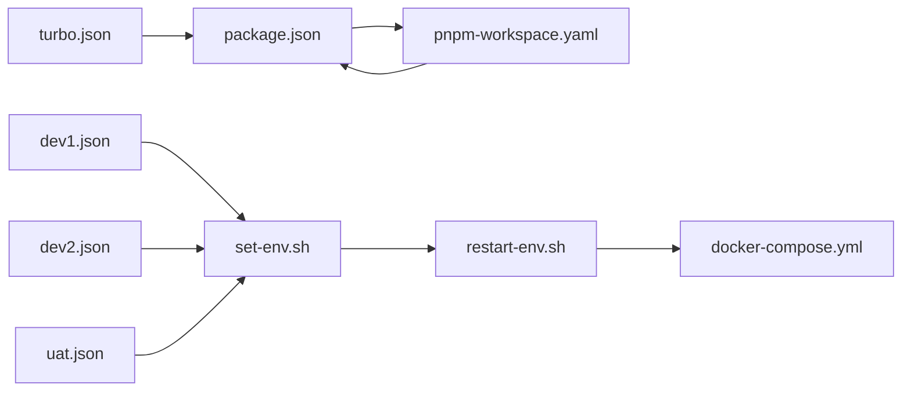

# 监控运维

<cite>
**本文引用的文件**
- [docker-compose.yml](file://workspace/dev/docker-compose.yml)
- [restart-env.sh](file://environments/restart-env.sh)
- [set-env.sh](file://environments/set-env.sh)
- [dev1.json](file://environments/dev1.json)
- [dev2.json](file://environments/dev2.json)
- [uat.json](file://environments/uat.json)
- [package.json](file://package.json)
- [turbo.json](file://turbo.json)
- [pnpm-workspace.yaml](file://pnpm-workspace.yaml)
</cite>

## 目录
1. [简介](#简介)
2. [项目结构](#项目结构)
3. [核心组件](#核心组件)
4. [架构总览](#架构总览)
5. [详细组件分析](#详细组件分析)
6. [依赖关系分析](#依赖关系分析)
7. [性能考虑](#性能考虑)
8. [故障排查指南](#故障排查指南)
9. [结论](#结论)
10. [附录](#附录)

## 简介
本文件面向AI原型管理系统运维团队，提供一套可落地的监控与运维方案。内容覆盖容器健康状态、API响应时间、数据库性能等关键指标的观测与告警；日志采集与分析策略（容器日志聚合、应用日志分类、错误追踪）；运维工具使用（Docker Compose操作、部署脚本、健康检查）；系统性能监控与优化建议（资源使用、瓶颈识别、容量规划）；以及故障排查流程与应急响应机制，并给出运维最佳实践与安全加固要点，帮助运维团队稳定高效地支撑系统运行。

## 项目结构
本项目采用多包工作区（monorepo）组织方式，前端与后端分别作为独立包进行开发与构建。环境配置通过JSON文件集中管理，配合环境激活与重启脚本实现快速切换与一键启动。数据库通过Docker Compose编排，提供健康检查能力，便于容器化环境下的可观测性。

**图表来源**
- [pnpm-workspace.yaml:1-20](file://pnpm-workspace.yaml#L1-L20)
- [package.json:1-200](file://package.json#L1-L200)
- [turbo.json:1-200](file://turbo.json#L1-L200)
- [docker-compose.yml:1-20](file://workspace/dev/docker-compose.yml#L1-L20)
- [set-env.sh:1-104](file://environments/set-env.sh#L1-L104)
- [restart-env.sh:1-158](file://environments/restart-env.sh#L1-L158)
- [dev1.json:1-1](file://environments/dev1.json#L1-L1)
- [dev2.json:1-1](file://environments/dev2.json#L1-L1)
- [uat.json:1-1](file://environments/uat.json#L1-L1)

**章节来源**
- [pnpm-workspace.yaml:1-200](file://pnpm-workspace.yaml#L1-L200)
- [package.json:1-200](file://package.json#L1-L200)
- [turbo.json:1-200](file://turbo.json#L1-L200)
- [docker-compose.yml:1-20](file://workspace/dev/docker-compose.yml#L1-L20)
- [set-env.sh:1-104](file://environments/set-env.sh#L1-L104)
- [restart-env.sh:1-158](file://environments/restart-env.sh#L1-L158)
- [dev1.json:1-1](file://environments/dev1.json#L1-L1)
- [dev2.json:1-1](file://environments/dev2.json#L1-L1)
- [uat.json:1-1](file://environments/uat.json#L1-L1)

## 核心组件
- 容器编排与健康检查：通过Docker Compose定义PostgreSQL服务，内置健康检查命令，周期性探测数据库可用性，支持重试与超时控制，便于CI/CD与运维平台集成。
- 环境管理与一键启动：环境激活脚本负责解析环境配置文件，导出数据库连接串与端口等环境变量；重启脚本负责清理端口占用、启动开发服务并进行健康探测，输出就绪状态与访问地址。
- 应用层可观测性：前端与后端均属于可观察域，建议结合APM与日志平台实现端到端链路追踪与错误归因。

**章节来源**
- [docker-compose.yml:1-20](file://workspace/dev/docker-compose.yml#L1-L20)
- [set-env.sh:78-94](file://environments/set-env.sh#L78-L94)
- [restart-env.sh:101-147](file://environments/restart-env.sh#L101-L147)

## 架构总览
下图展示从环境配置到容器与应用服务的整体拓扑，以及健康检查与就绪探测的关键节点。

**图表来源**
- [docker-compose.yml:1-20](file://workspace/dev/docker-compose.yml#L1-L20)
- [set-env.sh:66-94](file://environments/set-env.sh#L66-L94)
- [restart-env.sh:50-147](file://environments/restart-env.sh#L50-L147)
- [dev1.json:1-1](file://environments/dev1.json#L1-L1)
- [dev2.json:1-1](file://environments/dev2.json#L1-L1)
- [uat.json:1-1](file://environments/uat.json#L1-L1)

## 详细组件分析

### 容器健康检查（PostgreSQL）
- 健康检查命令：基于pg_isready的命令行检测，验证数据库登录与连通性。
- 调度参数：检查间隔、超时与重试次数，确保在短暂网络抖动下不误报。
- 集成建议：将该健康检查结果接入Kubernetes探针或监控平台，作为滚动更新与自愈决策依据。

**图表来源**
- [docker-compose.yml:12-16](file://workspace/dev/docker-compose.yml#L12-L16)

**章节来源**
- [docker-compose.yml:12-16](file://workspace/dev/docker-compose.yml#L12-L16)

### 环境激活与端口占用清理
- 环境变量导出：根据环境配置文件动态生成DATABASE_URL、API_PORT、WEB_PORT、DB_PORT等变量。
- 端口清理：扫描占用端口的进程列表，逐个终止并等待端口释放，超时则提示人工干预。
- 就绪探测：对Web与API端口发起HTTP探测，记录就绪时间与最终状态。

**图表来源**
- [set-env.sh:78-94](file://environments/set-env.sh#L78-L94)
- [restart-env.sh:61-147](file://environments/restart-env.sh#L61-L147)

**章节来源**
- [set-env.sh:66-94](file://environments/set-env.sh#L66-L94)
- [restart-env.sh:61-147](file://environments/restart-env.sh#L61-L147)

### 环境配置文件（dev1/dev2/uat）
- 端口与URL：每个环境定义了独立的Web与API端口及基础路径，避免冲突。
- 数据库：不同环境指向不同的数据库实例（端口与名称），便于隔离测试与数据管理。
- 默认环境：dev1标记为默认环境，便于首次启动与快速体验。

**章节来源**
- [dev1.json:1-1](file://environments/dev1.json#L1-L1)
- [dev2.json:1-1](file://environments/dev2.json#L1-L1)
- [uat.json:1-1](file://environments/uat.json#L1-L1)

## 依赖关系分析
- 包管理与任务编排：工作区通过pnpm与Turbo统一管理依赖与任务流水线，提升构建与测试效率。
- 多包协作：前端依赖后端提供的接口契约与共享模块，测试包覆盖端到端场景。
- 环境耦合：环境脚本与配置文件强耦合，变更任一环节需同步更新以保证一致性。

**图表来源**
- [package.json:1-200](file://package.json#L1-L200)
- [pnpm-workspace.yaml:1-200](file://pnpm-workspace.yaml#L1-L200)
- [turbo.json:1-200](file://turbo.json#L1-L200)
- [set-env.sh:66-76](file://environments/set-env.sh#L66-L76)
- [restart-env.sh:50-55](file://environments/restart-env.sh#L50-L55)
- [docker-compose.yml:1-20](file://workspace/dev/docker-compose.yml#L1-L20)
- [dev1.json:1-1](file://environments/dev1.json#L1-L1)
- [dev2.json:1-1](file://environments/dev2.json#L1-L1)
- [uat.json:1-1](file://environments/uat.json#L1-L1)

**章节来源**
- [package.json:1-200](file://package.json#L1-L200)
- [pnpm-workspace.yaml:1-200](file://pnpm-workspace.yaml#L1-L200)
- [turbo.json:1-200](file://turbo.json#L1-L200)
- [set-env.sh:66-76](file://environments/set-env.sh#L66-L76)
- [restart-env.sh:50-55](file://environments/restart-env.sh#L50-L55)
- [docker-compose.yml:1-20](file://workspace/dev/docker-compose.yml#L1-L20)

## 性能考虑
- 资源使用情况
  - CPU与内存：建议在容器编排中设置CPU/内存限制与请求，防止资源争抢；结合Prometheus/Grafana采集容器指标，建立基线与阈值。
  - 存储I/O：数据库卷挂载与WAL策略直接影响写入性能，建议对事务批量提交与索引策略进行压测与优化。
- 瓶颈识别
  - API响应时间：通过APM采样慢请求，结合数据库查询计划与锁等待事件定位热点SQL。
  - 前端渲染：利用浏览器性能面板与网络面板，识别大包、阻塞渲染的脚本与重复渲染。
- 容量规划
  - 基于历史峰值与增长趋势，估算并发连接数、QPS与存储容量需求，提前扩容数据库与应用实例。
  - 环境隔离：dev1/dev2/uat三套环境应按资源上限区分，避免跨环境互相影响。

[本节为通用性能指导，无需特定文件引用]

## 故障排查指南
- 容器健康异常
  - 现象：数据库健康检查持续失败。
  - 排查：查看容器日志、确认凭据与网络连通、检查初始化脚本是否成功执行。
  - 处置：修复凭据或网络策略，必要时重建容器。
- 端口占用与服务未就绪
  - 现象：重启后Web/API端口不可达。
  - 排查：使用脚本自带的端口清理逻辑，确认进程已被终止并释放端口；检查curl探测超时与返回码。
  - 处置：若仍占用，按脚本提示进行人工kill；检查应用日志定位启动异常。
- 环境变量缺失
  - 现象：数据库连接失败或端口未导出。
  - 排查：确认使用source方式加载环境脚本；核对环境配置文件是否存在且格式正确。
  - 处置：重新执行环境激活，或手动导出所需变量。

**章节来源**
- [docker-compose.yml:12-16](file://workspace/dev/docker-compose.yml#L12-L16)
- [restart-env.sh:61-147](file://environments/restart-env.sh#L61-L147)
- [set-env.sh:14-19](file://environments/set-env.sh#L14-L19)

## 结论
通过容器健康检查、环境脚本化与就绪探测，本项目已具备基础的可观测性与可运维性。建议在此基础上引入统一的日志与指标平台、完善的告警策略与应急演练机制，持续优化数据库与应用性能，确保系统在开发、测试与生产各阶段的稳定性与可预测性。

[本节为总结性内容，无需特定文件引用]

## 附录

### 监控指标与告警建议
- 容器健康状态
  - 指标：容器存活、健康检查成功率、重启次数。
  - 告警：连续失败超过阈值触发告警，自动拉起或通知值班。
- API响应时间
  - 指标：P50/P90/P99延迟、错误率、吞吐量。
  - 告警：延迟突增或错误率上升触发分级告警。
- 数据库性能
  - 指标：连接数、查询耗时、锁等待、缓冲池命中率、磁盘I/O。
  - 告警：连接池耗尽、慢查询占比过高、锁等待超时。

[本节为通用监控建议，无需特定文件引用]

### 日志收集与分析策略
- 容器日志聚合：使用集中式日志平台收集容器stdout/stderr，按服务与级别过滤。
- 应用日志分类：区分业务日志、调试日志与错误日志，设置统一字段（traceId、spanId、level、service）。
- 错误追踪：结合APM链路追踪，将错误日志与调用链关联，快速定位根因。

[本节为通用日志策略，无需特定文件引用]

### 运维工具使用方法
- Docker Compose
  - 启停与健康检查：通过compose文件定义服务与健康探针，便于CI/CD集成。
  - 卷与网络：明确数据卷与网络命名，避免冲突。
- 部署脚本
  - 环境激活：使用环境脚本导出变量，确保应用连接正确。
  - 一键重启：结合端口清理与就绪探测，缩短恢复时间。
- 健康检查
  - 数据库：使用pg_isready进行连通性与认证检查。
  - 应用：对Web/API端口进行HTTP探测，判断服务就绪。

**章节来源**
- [docker-compose.yml:1-20](file://workspace/dev/docker-compose.yml#L1-L20)
- [set-env.sh:78-94](file://environments/set-env.sh#L78-L94)
- [restart-env.sh:119-146](file://environments/restart-env.sh#L119-L146)

### 运维最佳实践与安全加固
- 最佳实践
  - 环境隔离：dev1/dev2/uat严格分离，避免交叉污染。
  - 版本化配置：环境配置文件版本化管理，变更走评审与回滚预案。
  - 自动化：将健康检查与就绪探测纳入自动化流程，减少人工干预。
- 安全加固
  - 凭据管理：数据库密码与密钥通过安全渠道注入，避免硬编码。
  - 网络隔离：容器间与环境间网络策略最小化开放。
  - 审计日志：开启数据库与应用审计，保留合规证据。

[本节为通用运维与安全建议，无需特定文件引用]