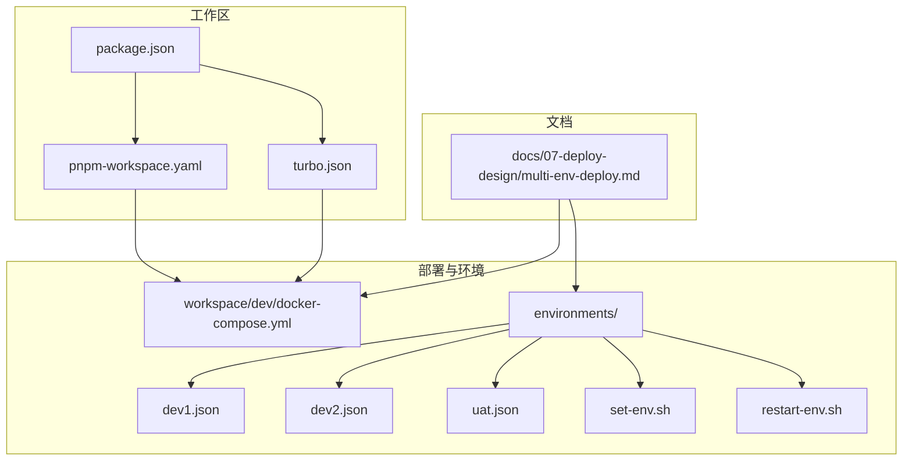
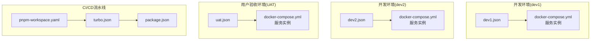
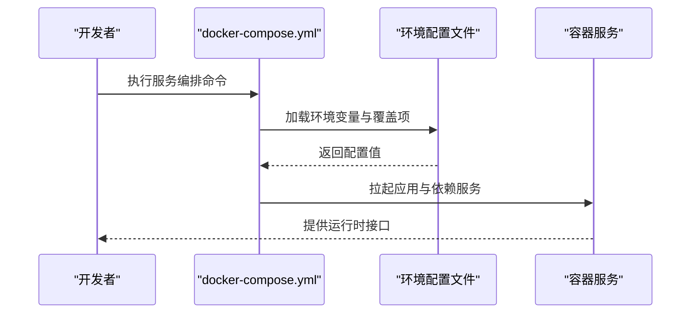
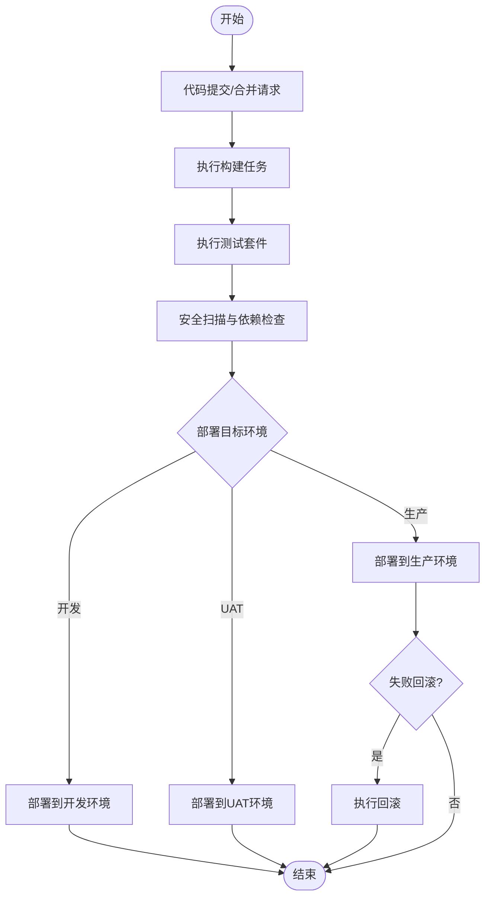
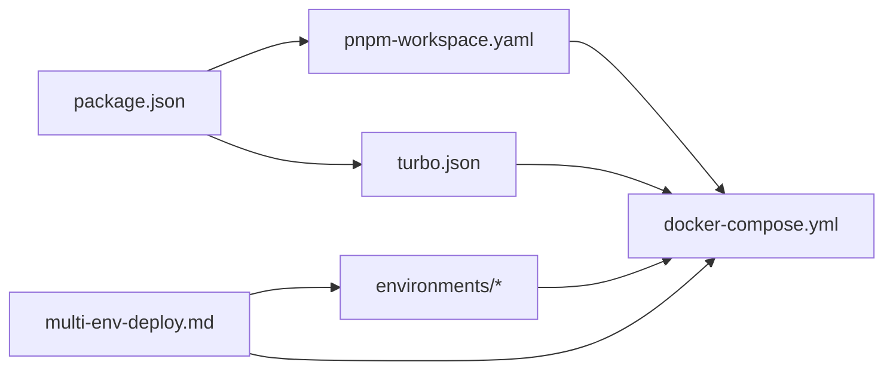

# 部署指南

<cite>
**本文档引用的文件**
- [docker-compose.yml](file://workspace/dev/docker-compose.yml)
- [multi-env-deploy.md](file://docs/07-deploy-design/multi-env-deploy.md)
- [dev1.json](file://environments/dev1.json)
- [dev2.json](file://environments/dev2.json)
- [uat.json](file://environments/uat.json)
- [set-env.sh](file://environments/set-env.sh)
- [restart-env.sh](file://environments/restart-env.sh)
- [package.json](file://package.json)
- [pnpm-workspace.yaml](file://pnpm-workspace.yaml)
- [turbo.json](file://turbo.json)
</cite>

## 目录
1. [简介](#简介)
2. [项目结构](#项目结构)
3. [核心组件](#核心组件)
4. [架构概览](#架构概览)
5. [详细组件分析](#详细组件分析)
6. [依赖分析](#依赖分析)
7. [性能考虑](#性能考虑)
8. [故障排查指南](#故障排查指南)
9. [结论](#结论)
10. [附录](#附录)

## 简介
本指南面向AI原型管理系统的运维与开发团队，提供从多环境部署策略到容器化编排、CI/CD流水线设计、数据库迁移与版本升级、监控告警配置、性能调优、安全加固、故障恢复与灾难备份、以及运维工具与日志分析的完整部署与运维方案。文档基于仓库中现有的部署设计文档、环境配置与容器编排文件进行梳理与扩展，帮助团队在开发、测试、预发布与生产环境中稳定可靠地交付系统。

## 项目结构
项目采用多包工作区（monorepo）组织方式，通过包管理器与任务编排工具统一管理前端、后端、共享库与测试等模块。部署相关的关键位置如下：
- 容器编排：workspace/dev/docker-compose.yml 提供本地开发环境的容器编排模板
- 多环境配置：environments/ 目录下包含不同环境的配置文件与环境切换脚本
- 部署设计：docs/07-deploy-design/multi-env-deploy.md 提供多环境部署策略与实施要点
- 工作区与任务编排：pnpm-workspace.yaml、turbo.json、package.json 统一定义包结构与构建任务

**图表来源**
- [docker-compose.yml:1-200](file://workspace/dev/docker-compose.yml#L1-L200)
- [multi-env-deploy.md:1-300](file://docs/07-deploy-design/multi-env-deploy.md#L1-L300)
- [dev1.json:1-100](file://environments/dev1.json#L1-L100)
- [dev2.json:1-100](file://environments/dev2.json#L1-L100)
- [uat.json:1-100](file://environments/uat.json#L1-L100)
- [set-env.sh:1-100](file://environments/set-env.sh#L1-L100)
- [restart-env.sh:1-100](file://environments/restart-env.sh#L1-L100)
- [package.json:1-200](file://package.json#L1-L200)
- [pnpm-workspace.yaml:1-200](file://pnpm-workspace.yaml#L1-L200)
- [turbo.json:1-200](file://turbo.json#L1-L200)

**章节来源**
- [docker-compose.yml:1-200](file://workspace/dev/docker-compose.yml#L1-L200)
- [multi-env-deploy.md:1-300](file://docs/07-deploy-design/multi-env-deploy.md#L1-L300)
- [package.json:1-200](file://package.json#L1-L200)
- [pnpm-workspace.yaml:1-200](file://pnpm-workspace.yaml#L1-L200)
- [turbo.json:1-200](file://turbo.json#L1-L200)

## 核心组件
- 容器编排与服务编排：通过 docker-compose.yml 定义应用服务、数据库、缓存、消息队列等依赖服务，并支持按环境覆盖变量
- 多环境配置：dev1.json、dev2.json、uat.json 提供不同环境的参数差异（如数据库连接、密钥、服务端口等）
- 环境切换与重启：set-env.sh 用于设置当前环境变量，restart-env.sh 用于重启指定环境的服务
- 包管理与任务编排：pnpm-workspace.yaml 声明工作区包；turbo.json 定义跨包构建与测试任务；package.json 提供顶层依赖与脚本

**章节来源**
- [docker-compose.yml:1-200](file://workspace/dev/docker-compose.yml#L1-L200)
- [dev1.json:1-100](file://environments/dev1.json#L1-L100)
- [dev2.json:1-100](file://environments/dev2.json#L1-L100)
- [uat.json:1-100](file://environments/uat.json#L1-L100)
- [set-env.sh:1-100](file://environments/set-env.sh#L1-L100)
- [restart-env.sh:1-100](file://environments/restart-env.sh#L1-L100)
- [pnpm-workspace.yaml:1-200](file://pnpm-workspace.yaml#L1-L200)
- [turbo.json:1-200](file://turbo.json#L1-L200)
- [package.json:1-200](file://package.json#L1-L200)

## 架构概览
下图展示了多环境部署的整体架构：每个环境由独立的配置文件驱动，容器编排负责服务生命周期管理，包管理与任务编排负责构建与测试流程。

**图表来源**
- [multi-env-deploy.md:1-300](file://docs/07-deploy-design/multi-env-deploy.md#L1-L300)
- [dev1.json:1-100](file://environments/dev1.json#L1-L100)
- [dev2.json:1-100](file://environments/dev2.json#L1-L100)
- [uat.json:1-100](file://environments/uat.json#L1-L100)
- [docker-compose.yml:1-200](file://workspace/dev/docker-compose.yml#L1-L200)
- [pnpm-workspace.yaml:1-200](file://pnpm-workspace.yaml#L1-L200)
- [turbo.json:1-200](file://turbo.json#L1-L200)
- [package.json:1-200](file://package.json#L1-L200)

## 详细组件分析

### 多环境部署策略
- 开发环境（dev1/dev2）：侧重快速迭代与本地联调，通常启用热重载、调试端口与本地存储
- 用户验收环境（UAT）：更接近生产配置，用于功能验证与性能压测
- 生产环境：强调高可用、安全加固与可观测性，需具备自动扩缩容与灰度发布能力
- 配置差异管理：通过环境配置文件与容器编排的环境变量覆盖实现差异化部署

**章节来源**
- [multi-env-deploy.md:1-300](file://docs/07-deploy-design/multi-env-deploy.md#L1-L300)

### Docker容器化部署方案
- 服务编排：docker-compose.yml 定义应用服务、数据库、缓存与消息队列等依赖，支持按环境覆盖变量
- 网络与卷：通过网络与卷配置实现服务间通信与持久化数据管理
- 环境隔离：不同环境使用不同的配置文件与容器命名空间，避免资源冲突
- 启动顺序与健康检查：通过依赖关系与健康检查保障服务启动顺序与可用性

**图表来源**
- [docker-compose.yml:1-200](file://workspace/dev/docker-compose.yml#L1-L200)
- [dev1.json:1-100](file://environments/dev1.json#L1-L100)
- [dev2.json:1-100](file://environments/dev2.json#L1-L100)
- [uat.json:1-100](file://environments/uat.json#L1-L100)

**章节来源**
- [docker-compose.yml:1-200](file://workspace/dev/docker-compose.yml#L1-L200)

### CI/CD流水线设计与实现
- 代码提交触发：通过分支保护与PR审查机制保证质量门槛
- 自动化构建：使用包管理与任务编排工具执行跨包构建与打包
- 自动化测试：在流水线中集成单元测试、集成测试与端到端测试
- 安全扫描：在构建阶段加入依赖漏洞扫描与静态代码分析
- 部署策略：支持蓝绿部署或滚动更新，结合环境配置文件进行差异化部署
- 回滚机制：记录部署版本与回滚点，确保快速恢复

**图表来源**
- [pnpm-workspace.yaml:1-200](file://pnpm-workspace.yaml#L1-L200)
- [turbo.json:1-200](file://turbo.json#L1-L200)
- [package.json:1-200](file://package.json#L1-L200)
- [multi-env-deploy.md:1-300](file://docs/07-deploy-design/multi-env-deploy.md#L1-L300)

**章节来源**
- [pnpm-workspace.yaml:1-200](file://pnpm-workspace.yaml#L1-L200)
- [turbo.json:1-200](file://turbo.json#L1-L200)
- [package.json:1-200](file://package.json#L1-L200)
- [multi-env-deploy.md:1-300](file://docs/07-deploy-design/multi-env-deploy.md#L1-L300)

### 数据库迁移与版本升级策略
- 迁移脚本：通过版本化的迁移脚本管理数据库结构变更，确保多环境一致性
- 回滚策略：每次迁移记录版本号与回滚点，支持逆向执行以恢复到上一个稳定版本
- 兼容性测试：在UAT环境验证迁移脚本对业务逻辑的影响
- 零停机策略：在生产环境采用分阶段迁移与影子表/双写策略降低风险

**章节来源**
- [multi-env-deploy.md:1-300](file://docs/07-deploy-design/multi-env-deploy.md#L1-L300)

### 监控告警系统配置与运维最佳实践
- 指标采集：应用层输出关键指标（QPS、错误率、响应时间），基础设施层采集CPU、内存、磁盘与网络
- 日志聚合：集中收集应用与容器日志，建立索引以便检索与分析
- 告警规则：基于阈值与趋势设定告警，区分严重、警告与通知级别
- 运维最佳实践：定期演练故障恢复、保持配置与脚本版本化、完善变更管理流程

**章节来源**
- [multi-env-deploy.md:1-300](file://docs/07-deploy-design/multi-env-deploy.md#L1-L300)

### 性能调优与资源优化建议
- 资源配额：根据历史峰值与容量规划为容器设置CPU与内存限制
- 缓存策略：合理使用缓存层减少数据库压力，注意缓存一致性
- 数据库优化：索引优化、查询计划分析与慢查询日志分析
- 并发与限流：在网关层实施限流与熔断，防止级联故障

**章节来源**
- [multi-env-deploy.md:1-300](file://docs/07-deploy-design/multi-env-deploy.md#L1-L300)

### 安全加固措施与合规性要求
- 访问控制：最小权限原则、角色分离与审计日志
- 数据加密：传输加密与静态数据加密，密钥轮换与安全管理
- 依赖治理：定期扫描第三方依赖漏洞，及时修补
- 合规性：遵循所在地区的数据保护法规与行业标准

**章节来源**
- [multi-env-deploy.md:1-300](file://docs/07-deploy-design/multi-env-deploy.md#L1-L300)

### 故障恢复与灾难备份方案
- 备份策略：数据库与重要配置的周期性备份与异地存放
- 灾难恢复：制定RTO/RPO目标，定期进行恢复演练
- 降级策略：在部分组件失效时启用降级模式，优先保障核心功能
- 应急预案：明确故障分级与处置流程，责任到人

**章节来源**
- [multi-env-deploy.md:1-300](file://docs/07-deploy-design/multi-env-deploy.md#L1-L300)

### 运维工具与日志分析方法
- 运维工具：容器编排平台、配置管理工具、监控与告警平台、日志分析平台
- 日志分析：结构化日志格式、关键字段提取、异常模式识别与根因分析
- 变更追踪：版本化配置与脚本，变更审批与回滚记录

**章节来源**
- [multi-env-deploy.md:1-300](file://docs/07-deploy-design/multi-env-deploy.md#L1-L300)

## 依赖分析
- 包管理与任务编排：pnpm-workspace.yaml 与 turbo.json 协同定义工作区与跨包任务，package.json 提供顶层依赖与脚本入口
- 环境配置：各环境配置文件与容器编排文件共同决定服务行为与资源分配
- 文档驱动：部署设计文档指导多环境策略与实施细节

**图表来源**
- [package.json:1-200](file://package.json#L1-L200)
- [pnpm-workspace.yaml:1-200](file://pnpm-workspace.yaml#L1-L200)
- [turbo.json:1-200](file://turbo.json#L1-L200)
- [docker-compose.yml:1-200](file://workspace/dev/docker-compose.yml#L1-L200)
- [multi-env-deploy.md:1-300](file://docs/07-deploy-design/multi-env-deploy.md#L1-L300)

**章节来源**
- [package.json:1-200](file://package.json#L1-L200)
- [pnpm-workspace.yaml:1-200](file://pnpm-workspace.yaml#L1-L200)
- [turbo.json:1-200](file://turbo.json#L1-L200)
- [docker-compose.yml:1-200](file://workspace/dev/docker-compose.yml#L1-L200)
- [multi-env-deploy.md:1-300](file://docs/07-deploy-design/multi-env-deploy.md#L1-L300)

## 性能考虑
- 在容器编排中为关键服务设置资源限制与请求，避免资源争用
- 使用缓存与异步处理降低数据库压力
- 对数据库查询进行优化与索引管理，定期分析慢查询日志
- 在网关层实施限流与熔断，提升系统韧性

[本节为通用指导，无需列出具体文件来源]

## 故障排查指南
- 环境切换：使用 set-env.sh 设置环境变量，确认配置文件加载正确
- 服务重启：使用 restart-env.sh 重启指定环境的服务，观察容器状态与日志
- 日志定位：通过容器日志与应用日志定位问题，结合结构化字段进行关联分析
- 回滚操作：在CI/CD流水线中记录部署版本，必要时执行回滚

**章节来源**
- [set-env.sh:1-100](file://environments/set-env.sh#L1-L100)
- [restart-env.sh:1-100](file://environments/restart-env.sh#L1-L100)
- [multi-env-deploy.md:1-300](file://docs/07-deploy-design/multi-env-deploy.md#L1-L300)

## 结论
通过多环境部署策略、容器化编排、完善的CI/CD流水线、数据库迁移与版本升级规范、监控告警体系、性能优化与安全加固措施，以及故障恢复与灾难备份方案，AI原型管理系统能够在不同环境下稳定交付并持续演进。建议在实际落地过程中，将本文档作为基线，结合团队实际情况细化与补充。

[本节为总结性内容，无需列出具体文件来源]

## 附录
- 环境配置文件示例路径：environments/dev1.json、environments/dev2.json、environments/uat.json
- 容器编排模板：workspace/dev/docker-compose.yml
- 部署设计文档：docs/07-deploy-design/multi-env-deploy.md
- 包管理与任务编排：pnpm-workspace.yaml、turbo.json、package.json

**章节来源**
- [dev1.json:1-100](file://environments/dev1.json#L1-L100)
- [dev2.json:1-100](file://environments/dev2.json#L1-L100)
- [uat.json:1-100](file://environments/uat.json#L1-L100)
- [docker-compose.yml:1-200](file://workspace/dev/docker-compose.yml#L1-L200)
- [multi-env-deploy.md:1-300](file://docs/07-deploy-design/multi-env-deploy.md#L1-L300)
- [pnpm-workspace.yaml:1-200](file://pnpm-workspace.yaml#L1-L200)
- [turbo.json:1-200](file://turbo.json#L1-L200)
- [package.json:1-200](file://package.json#L1-L200)