# 项目概述

<cite>
**本文档引用的文件**
- [README.md](file://README.md)
- [package.json](file://package.json)
- [pnpm-workspace.yaml](file://pnpm-workspace.yaml)
- [turbo.json](file://turbo.json)
- [docs/00-project/roadmap/phase0.md](file://docs/00-project/roadmap/phase0.md)
- [docs/00-project/roadmap/phase2.md](file://docs/00-project/roadmap/phase2.md)
- [docs/00-project/roadmap/phase3.md](file://docs/00-project/roadmap/phase3.md)
- [docs/01-design-idea/01-design-idea.md](file://docs/01-design-idea/01-design-idea.md)
- [docs/02-domain-model/domain-model.md](file://docs/02-domain-model/domain-model.md)
- [docs/04-tech-design/phase1-design-tech.md](file://docs/04-tech-design/phase1-design-tech.md)
- [docs/04-tech-design/phase1-infrastructure-plan.md](file://docs/04-tech-design/phase1-infrastructure-plan.md)
- [docs/04-tech-design/mcp-interface.md](file://docs/04-tech-design/mcp-interface.md)
- [docs/04-tech-design/object-lifecycle.md](file://docs/04-tech-design/object-lifecycle.md)
- [docs/00-project/workflow/dev-test-loop-design.md](file://docs/00-project/workflow/dev-test-loop-design.md)
</cite>

## 目录
1. [引言](#引言)
2. [项目结构](#项目结构)
3. [核心组件](#核心组件)
4. [架构总览](#架构总览)
5. [详细组件分析](#详细组件分析)
6. [依赖分析](#依赖分析)
7. [性能考量](#性能考量)
8. [故障排除指南](#故障排除指南)
9. [结论](#结论)
10. [附录](#附录)

## 引言

本项目旨在成为“AI时代的软件产品定义与生命周期管理平台”，以“给AI用的结构化语义”为核心理念，连接产品定义、研发实现与测试验证全链路。传统原型工具（如Figma/Sketch）聚焦“给人看的高保真视觉”，但真正构建可用软件系统的关键信息（业务逻辑、交互逻辑、数据关系）在这些产物中会丢失，导致Coding Agent无法还原设计意图。

本系统不仅是原型设计工具，更是“产品定义的单一事实来源（Single Source of Truth）”。它承载完整的产品语义信息，向下连接研发实现和测试验证，确保原型中包含的业务逻辑、交互逻辑、数据关系等关键信息能够完整传递给下游Coding Agent。

## 项目结构

项目采用Monorepo结构，通过pnpm workspaces与Turborepo进行统一管理和构建编排。核心包包括：

- packages/api：后端服务（Fastify）
- packages/web：前端应用（React + Vite）
- packages/shared：共享类型与工具
- packages/validation-schemas：TypeBox Schema定义包
- packages/e2e：端到端测试（预留）

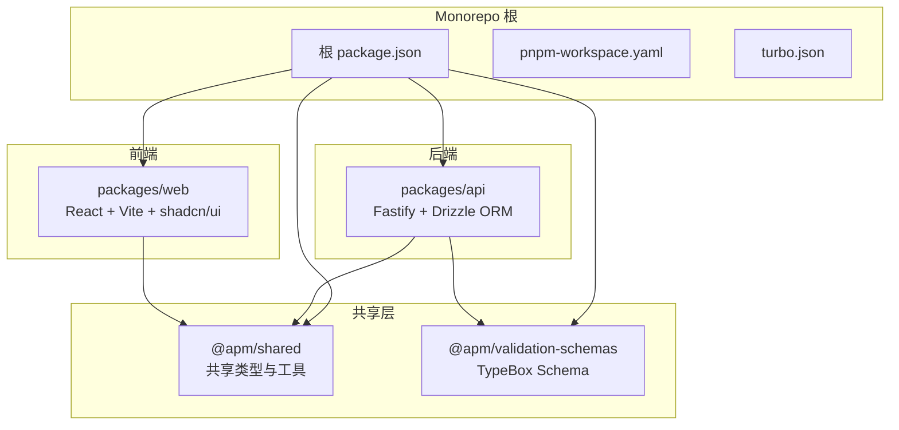

**图表来源**
- [pnpm-workspace.yaml:1-3](file://pnpm-workspace.yaml#L1-L3)
- [turbo.json:1-1](file://turbo.json#L1-L1)
- [package.json:1-2](file://package.json#L1-L2)

**章节来源**
- [README.md:32-52](file://README.md#L32-L52)
- [pnpm-workspace.yaml:1-3](file://pnpm-workspace.yaml#L1-L3)
- [turbo.json:1-1](file://turbo.json#L1-L1)

## 核心组件

### 六阶段工作流

系统采用A-F六阶段工作流，确保从领域建模到测试验证的完整产品定义生命周期：

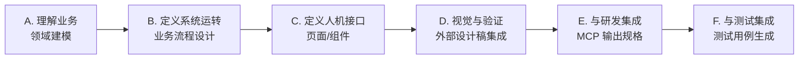

**图表来源**
- [README.md:11-16](file://README.md#L11-L16)

### 技术栈选择

- **B/S架构，Node.js技术栈**：统一技术栈便于前后端协作与AI集成
- **后端**：Fastify + PostgreSQL + Drizzle ORM + TypeBox + Ajv
- **前端**：React + Vite + TypeScript + shadcn/ui + React Router v6 + ReactFlow
- **项目结构**：Monorepo（pnpm workspaces + Turborepo）
- **原型产物格式**：HTML + CSS + JS（双轨制：视觉层 + 语义层分离）

**章节来源**
- [README.md:24-31](file://README.md#L24-L31)

## 架构总览

系统采用分层架构，核心理念是“结构化语义优先”的原型管理：

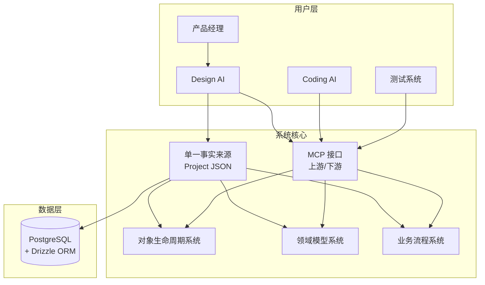

**图表来源**
- [docs/01-design-idea/01-design-idea.md:84-106](file://docs/01-design-idea/01-design-idea.md#L84-L106)
- [docs/04-tech-design/mcp-interface.md:10-31](file://docs/04-tech-design/mcp-interface.md#L10-L31)

## 详细组件分析

### 领域模型系统

领域模型是系统的「元模型」，为用户定义项目领域模型提供参考。系统包含五大领域：

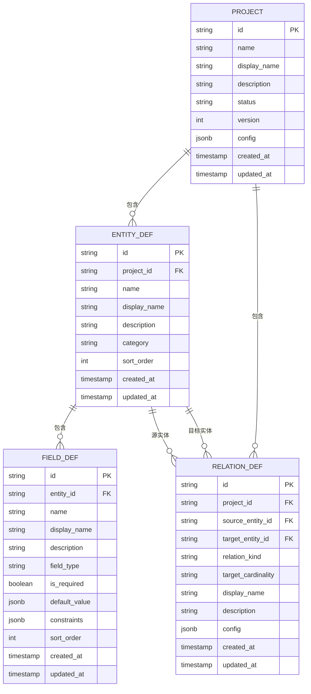

**图表来源**
- [docs/02-domain-model/domain-model.md:514-551](file://docs/02-domain-model/domain-model.md#L514-L551)

**章节来源**
- [docs/02-domain-model/domain-model.md:16-26](file://docs/02-domain-model/domain-model.md#L16-L26)
- [docs/02-domain-model/domain-model.md:718-775](file://docs/02-domain-model/domain-model.md#L718-L775)

### 对象生命周期系统

对象生命周期系统提供统一的交互范式，定义每个组件类型能响应的事件和Hook执行模型：

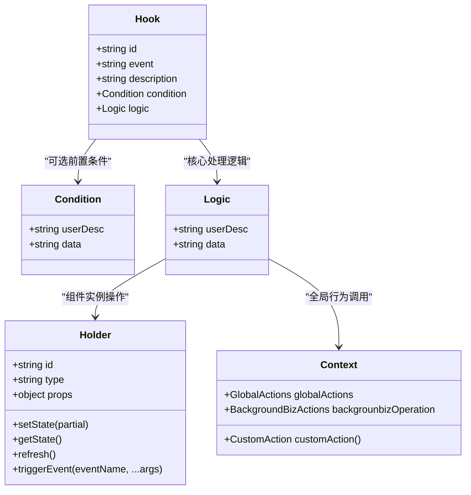

**图表来源**
- [docs/04-tech-design/object-lifecycle.md:187-230](file://docs/04-tech-design/object-lifecycle.md#L187-L230)

**章节来源**
- [docs/04-tech-design/object-lifecycle.md:57-120](file://docs/04-tech-design/object-lifecycle.md#L57-L120)
- [docs/04-tech-design/object-lifecycle.md:181-300](file://docs/04-tech-design/object-lifecycle.md#L181-L300)

### MCP接口设计

MCP（Model Collaboration Protocol）接口分为上游和下游两个方向：

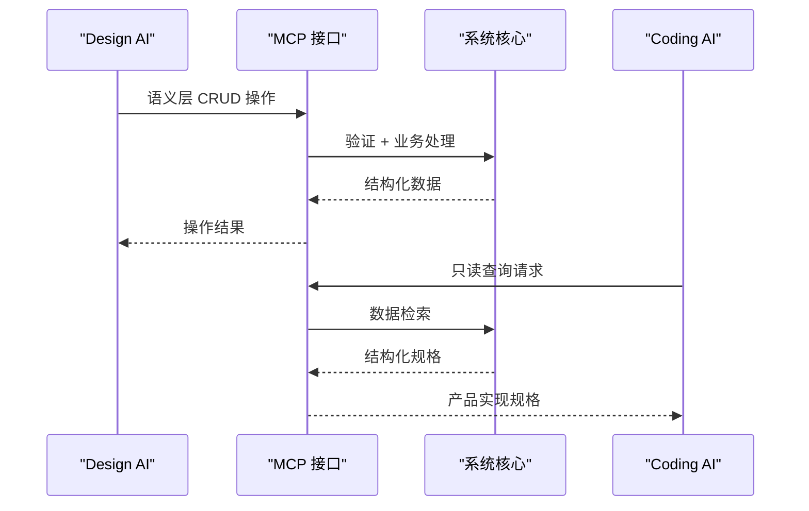

**图表来源**
- [docs/04-tech-design/mcp-interface.md:12-31](file://docs/04-tech-design/mcp-interface.md#L12-L31)

**章节来源**
- [docs/04-tech-design/mcp-interface.md:71-170](file://docs/04-tech-design/mcp-interface.md#L71-L170)
- [docs/04-tech-design/mcp-interface.md:280-300](file://docs/04-tech-design/mcp-interface.md#L280-L300)

### 开发-测试闭环工作流

系统采用AI驱动的开发-测试闭环，实现自动化问题分析、修复和验证：

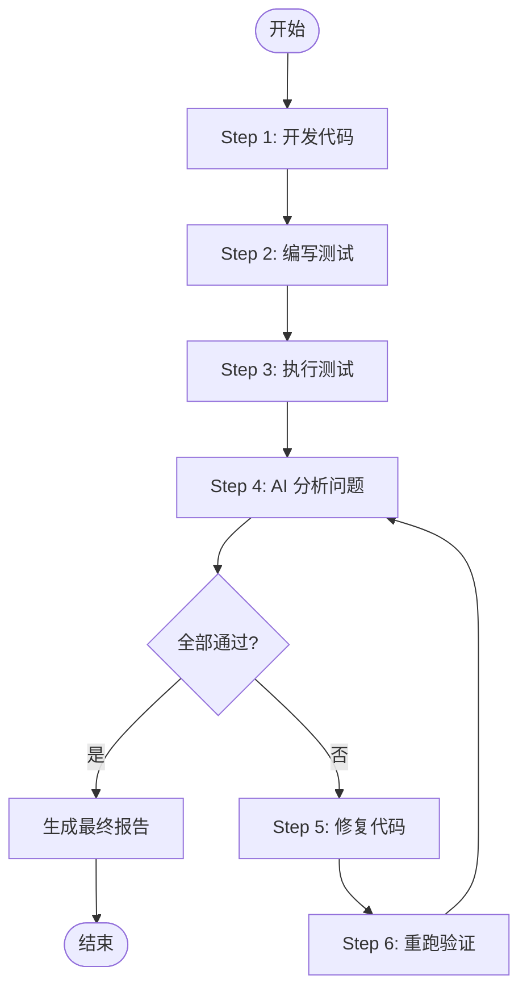

**图表来源**
- [docs/00-project/workflow/dev-test-loop-design.md:481-501](file://docs/00-project/workflow/dev-test-loop-design.md#L481-L501)

**章节来源**
- [docs/00-project/workflow/dev-test-loop-design.md:332-477](file://docs/00-project/workflow/dev-test-loop-design.md#L332-L477)

## 依赖分析

### 技术栈依赖关系

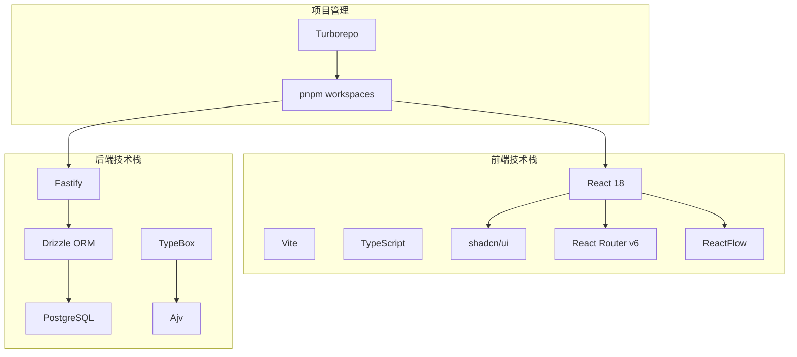

**图表来源**
- [docs/04-tech-design/phase1-design-tech.md:51-69](file://docs/04-tech-design/phase1-design-tech.md#L51-L69)
- [docs/04-tech-design/phase1-infrastructure-plan.md:9-10](file://docs/04-tech-design/phase1-infrastructure-plan.md#L9-L10)

### 包依赖关系

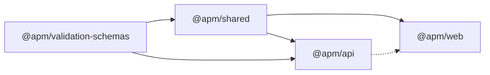

**图表来源**
- [docs/04-tech-design/phase1-design-tech.md:168-176](file://docs/04-tech-design/phase1-design-tech.md#L168-L176)

**章节来源**
- [docs/04-tech-design/phase1-design-tech.md:168-176](file://docs/04-tech-design/phase1-design-tech.md#L168-L176)

## 性能考量

### 架构优势

1. **Monorepo优势**：统一构建、共享类型、减少重复依赖
2. **TypeBox + Ajv**：一套定义三处复用，提升开发效率
3. **Drizzle ORM**：类型安全、SQL-like API、轻量高效
4. **React + Vite**：快速HMR、原生ESM、开发体验优秀

### 性能优化建议

1. **数据库优化**：合理索引设计、查询优化、连接池配置
2. **前端优化**：组件懒加载、代码分割、缓存策略
3. **API优化**：分页查询、条件过滤、数据压缩
4. **构建优化**：增量构建、缓存利用、并行处理

## 故障排除指南

### 常见问题

1. **开发环境启动失败**
   - 检查Docker容器状态
   - 验证数据库连接字符串
   - 确认端口占用情况

2. **TypeScript编译错误**
   - 检查共享类型定义
   - 验证TypeBox Schema一致性
   - 确认模块解析配置

3. **API测试失败**
   - 检查测试数据工厂
   - 验证数据库迁移状态
   - 确认环境变量配置

**章节来源**
- [docs/04-tech-design/phase1-design-tech.md:463-510](file://docs/04-tech-design/phase1-design-tech.md#L463-L510)

## 结论

AI原型管理系统以"给AI用的结构化语义"为核心理念，通过六阶段工作流连接产品定义、研发实现与测试验证。项目采用先进的技术栈和架构设计，为AI时代的软件产品定义提供了完整的解决方案。

当前处于Phase 1数据模型中心+MVP阶段，已完成核心设计规格的87%，M1 PRD编写中。未来将继续推进Phase 2-5的开发，逐步完善原型系统、自动化能力和测试验证体系。

## 附录

### 项目路线图

```mermaid
gantt
title 项目路线图
dateFormat X
axisFormat %Y-%m
section Phase 0
设计规格冻结 :milestone, 0, 0d
section Phase 1
数据模型中心+MVP :active, 0, 8w
section Phase 2
核心引擎+交互原型 :0, 12w
section Phase 3
原型系统成熟度提升 :0, 16w
section Phase 4
与Coding AI集成 :0, 12w
section Phase 5
与测试系统集成 :0, 12w
```

**图表来源**
- [docs/00-project/roadmap/phase0.md:1-47](file://docs/00-project/roadmap/phase0.md#L1-L47)
- [docs/00-project/roadmap/phase2.md:1-49](file://docs/00-project/roadmap/phase2.md#L1-L49)
- [docs/00-project/roadmap/phase3.md:1-27](file://docs/00-project/roadmap/phase3.md#L1-L27)

### 核心交互机制

系统采用"完整性框架驱动问答"机制，确保AI被约束在严格的框架内进行原型构建：

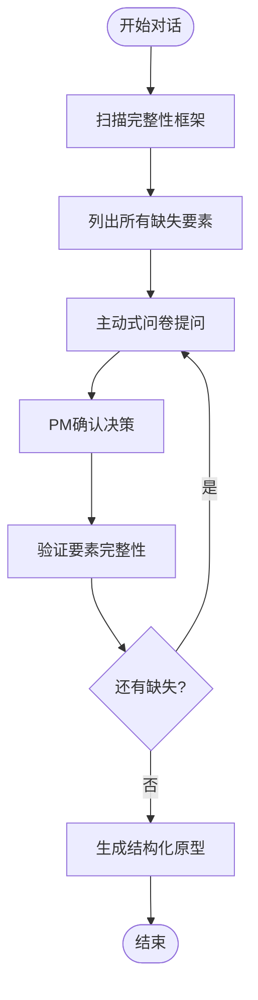

**图表来源**
- [docs/01-design-idea/01-design-idea.md:154-181](file://docs/01-design-idea/01-design-idea.md#L154-L181)

**章节来源**
- [docs/01-design-idea/01-design-idea.md:154-181](file://docs/01-design-idea/01-design-idea.md#L154-L181)