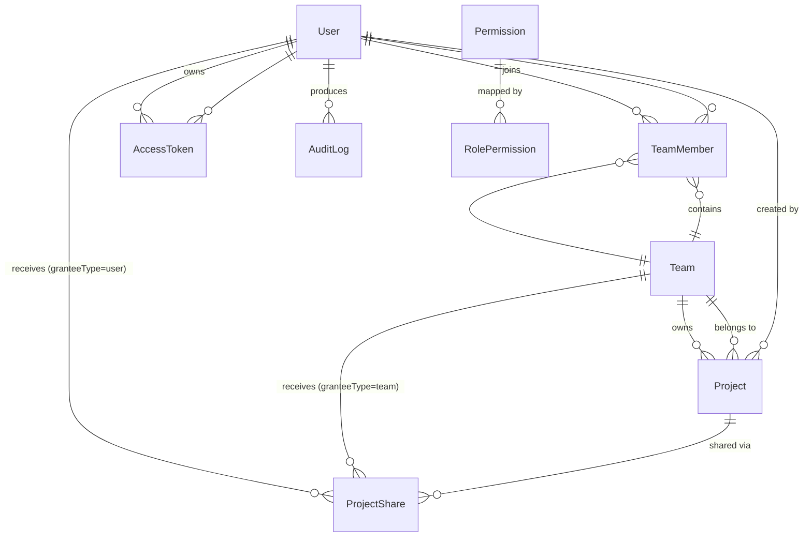

# M6 团队/用户/权限管理 — 领域模型设计 (S1)

> **日期**: 2026-07-15
> **状态**: S1 设计中
> **前置**: S0 方向决策 → `docs/01-design-idea/team-permission-design.md`
> **定位**: 定义 M6 模块新增的领域对象、属性、关系、状态图，作为 S2（PRD）和 S4（技术方案）的输入
> **与现有领域模型的关系**: 本文档描述的是**平台设施层**的领域对象（用户/团队/权限），与 `domain-model.md` 中的**业务建模层**（Project/Role/Company 等用户创作内容）平行独立。现有 `domain-model.md §2.2 Member` 概念被本模型中的 `User + TeamMember + ProjectShare` 三元组**正式替代**。

---

## 1. 概述

### 1.1 新增领域

| # | 领域 | 实体数 | 职责 |
|---|------|--------|------|
| **6** | **平台身份与权限** | 8 | 用户认证、团队管理、项目共享、访问令牌、权限校验、审计日志 |

### 1.2 实体清单

| 实体 | 中文名 | 职责 |
|------|--------|------|
| **User** | 平台用户 | 登录系统的自然人，是所有操作的主体 |
| **Team** | 团队 | 项目归属与协作隔离的顶层容器 |
| **TeamMember** | 团队成员 | User × Team 的关联，携带 TeamRole |
| **ProjectShare** | 项目共享 | 项目显式授权给外部 Team 或 User |
| **AccessToken** | 访问令牌 (PAT) | MCP/API 的长期 Bearer Token |
| **Permission** | 权限点 | `resource.action` 格式的功能操作标识（代码常量，DB 同步） |
| **RolePermission** | 角色-权限映射 | 哪种角色拥有哪些权限点（DB 可配置） |
| **AuditLog** | 审计日志 | 认证/授权/关键操作的不可变事件流 |

### 1.3 现有实体变更

| 实体 | 变更 |
|------|------|
| **Project** | 新增 `team_id`、`created_by`、`visibility` 三个字段 |

---

## 2. 实体定义

### 2.1 User（平台用户）

系统的登录主体。一个 User 可以属于多个 Team、可以被多个 Project 共享授权。

```
User
├── id: string                     // UUID 主键
├── email: string                  // 唯一，登录标识
├── displayName: string            // 前端显示名称
├── passwordHash: string           // bcrypt hash（cost ≥ 10）
├── avatar?: string                // 头像 URL
├── platformRole: enum             // "super_admin" | "user"
├── status: enum                   // "active" | "disabled" | "deleted"
├── lastLoginAt?: datetime         // 最后登录时间
├── createdAt: datetime
├── updatedAt: datetime
│
├── 关联关系：
│   ├── 1:N → TeamMember[]        // 参与的团队列表
│   ├── 1:N → ProjectShare[]      // 被授权的项目列表
│   ├── 1:N → AccessToken[]       // 持有的 PAT 列表
│   └── 1:N → AuditLog[]          // 产生的审计事件
│
├── 业务行为：
│   ├── register(email, password)  // 创建账号（仅 SuperAdmin 或开放注册）
│   ├── login(email, password)     // 登录，返回 JWT
│   ├── changePassword(old, new)   // 修改密码（自动作废所有 PAT）
│   ├── disable()                  // 禁用账号（SuperAdmin 操作）
│   └── delete()                   // 软删除（status → deleted）
│
└── 约束：
    ├── email 全局唯一（不区分大小写）
    ├── password ≥ 12 位，含大小写+数字+符号
    └── 修改密码时所有 AccessToken 自动 revoke
```

### 2.2 Team（团队）

项目归属与协作隔离的顶层容器。团队私有 = 未被共享的项目仅本团队成员可见。

```
Team
├── id: string                     // UUID 主键
├── name: string                   // 唯一标识名（英文小写+连字符）
├── displayName: string            // 前端显示名称
├── description?: string           // 团队描述
├── avatar?: string                // 团队头像
├── parentId?: string              // 预留树形层级（v1 始终为 NULL）
├── status: enum                   // "active" | "dissolved"
├── createdAt: datetime
├── updatedAt: datetime
│
├── 关联关系：
│   ├── 1:N → TeamMember[]        // 团队成员列表
│   ├── 1:N → Project[]           // 归属本团队的项目
│   └── 1:N → ProjectShare[]      // 被共享到本团队的项目
│
├── 业务行为：
│   ├── create(name, displayName)  // 创建团队（SuperAdmin 或达到条件的 User）
│   ├── updateInfo(...)            // 修改名称/描述/头像
│   ├── dissolve()                 // 解散（Owner 操作，需确认无未迁移项目）
│   └── transferOwnership(newOwner)// 转让 Owner 身份
│
└── 约束：
    ├── name 全局唯一
    ├── 每个 Team 至少有一个 Owner（不可为空）
    └── dissolve 前必须确认所有归属项目已迁移或删除
```

### 2.3 TeamMember（团队成员）

User 与 Team 的多对多关系，携带团队内角色。

```
TeamMember
├── id: string                     // UUID 主键
├── userId: string                 // → User.id
├── teamId: string                 // → Team.id
├── teamRole: enum                 // "owner" | "admin" | "member"
├── joinedAt: datetime             // 加入时间
├── invitedBy?: string             // → User.id（邀请人）
│
├── 关联关系：
│   ├── N:1 → User
│   └── N:1 → Team
│
├── 业务行为：
│   ├── invite(userId, teamRole)   // 邀请用户加入（Admin+ 操作）
│   ├── changeRole(newRole)        // 变更角色（Owner 操作）
│   ├── leave()                    // 主动退出
│   └── remove()                   // 被移除（Admin+ 操作）
│
└── 约束：
    ├── (userId, teamId) 唯一
    ├── Owner 不可 leave（需先 transferOwnership）
    ├── 最后一个 Admin/Owner 不可 remove
    └── TeamRole 权力阶梯：owner > admin > member（只能管理比自己低的）
```

### 2.4 ProjectShare（项目共享）

将项目显式授权给**外部**团队或用户。授权粒度为整个项目（D4 决策）。

```
ProjectShare
├── id: string                     // UUID 主键
├── projectId: string              // → Project.id（被共享的项目）
├── granteeType: enum              // "team" | "user"
├── granteeId: string              // → Team.id 或 User.id
├── projectRole: enum              // "editor" | "viewer"
├── sharedBy: string               // → User.id（执行共享操作的人）
├── sharedAt: datetime             // 共享时间
│
├── 关联关系：
│   ├── N:1 → Project
│   ├── N:1 → Team (当 granteeType = "team")
│   └── N:1 → User (当 granteeType = "user")
│
├── 业务行为：
│   ├── share(project, grantee, role)  // 创建共享（项目 Owner/Admin 操作）
│   ├── updateRole(newRole)            // 变更共享角色
│   └── revoke()                       // 撤销共享
│
└── 约束：
    ├── (projectId, granteeType, granteeId) 唯一
    ├── 不能共享给项目已归属的团队（冗余）
    └── 不能共享给自己
```

### 2.5 AccessToken（访问令牌 / PAT）

用于 MCP Server 和 API 调用的长期 Bearer Token。

```
AccessToken
├── id: string                     // UUID 主键
├── userId: string                 // → User.id（所属用户）
├── name: string                   // 用户命名（如"我的 Claude Code"）
├── tokenHash: string              // sha256(明文 token) — DB 只存哈希
├── tokenPrefix: string            // 前 8 位（用于列表展示识别：apm_pat_xxxxxxxx...）
├── scopes: jsonb                  // 预留（MVP 为 null，表示全部权限）
├── expiresAt?: datetime           // 过期时间（null = 永不过期）
├── lastUsedAt?: datetime          // 最后使用时间
├── lastUsedIp?: string            // 最后使用 IP
├── status: enum                   // "active" | "revoked" | "expired"
├── createdAt: datetime
│
├── 关联关系：
│   └── N:1 → User
│
├── 业务行为：
│   ├── create(name, expiresAt?)   // 生成新 Token（返回明文仅一次）
│   ├── revoke()                   // 手动撤销
│   ├── verify(plainToken)         // 校验（sha256 比对 + 过期检查 + 状态检查）
│   └── revokeAllForUser(userId)   // 密码修改时批量作废
│
└── 约束：
    ├── 明文 token 格式：apm_pat_ + 32字节 base62 随机串
    ├── DB 只存 sha256(plainToken)，明文不可恢复
    ├── verify 时：hash匹配 → 检查 status=active → 检查 expiresAt 未过期
    └── 用户修改密码 → 自动 revokeAllForUser
```

### 2.6 Permission（权限点）

功能操作标识，格式为 `resource.action`。**代码常量化**（在 `packages/shared/src/permissions.ts` 中定义），DB 中同步存储以支持角色映射配置。

```
Permission
├── key: string                    // 主键，即权限点标识：如 "project.create"
├── resource: string               // 资源名：如 "project"
├── action: string                 // 操作名：如 "create"
├── displayName: string            // 前端显示用中文名
├── description?: string           // 权限说明
├── category: enum                 // "platform" | "team" | "project" | "entity"
│
└── 约束：
    ├── key 全局唯一
    ├── key = resource + "." + action
    └── 新增权限点必须同步代码常量和 DB seed 脚本
```

**预定义权限点列表（MVP 首批）**：

| key | category | 说明 |
|-----|----------|------|
| `platform.manage` | platform | 访问平台管理后台（用户管理/团队管理） |
| `team.create` | platform | 创建新团队 |
| `team.invite` | team | 邀请成员加入团队 |
| `team.remove` | team | 移除团队成员 |
| `team.manage` | team | 管理团队信息、解散 |
| `project.create` | team | 在团队内创建项目 |
| `project.read` | project | 读取项目内容 |
| `project.write` | project | 编辑项目内容（领域模型/流程等） |
| `project.delete` | project | 删除/归档项目 |
| `project.share` | project | 管理项目共享设置 |
| `entity.read` | project | 读取领域模型/流程/应用等 |
| `entity.write` | project | 编辑领域模型/流程/应用等 |
| `token.manage` | platform | 管理自己的 Access Token |

### 2.7 RolePermission（角色-权限映射）

哪种角色对应哪些权限。存储在 DB 中，SuperAdmin 可在 Web 后台调整。

```
RolePermission
├── id: string                     // UUID 主键
├── roleType: enum                 // "platform" | "team" | "project"
├── roleValue: string              // 对应角色值：如 "super_admin" / "admin" / "editor"
├── permissionKey: string          // → Permission.key
│
├── 关联关系：
│   └── N:1 → Permission
│
└── 约束：
    ├── (roleType, roleValue, permissionKey) 唯一
    └── 初始映射由迁移脚本 seed，后续可 Web 调整
```

**默认角色-权限映射（MVP 初始值）**：

| roleType | roleValue | 拥有权限 |
|----------|-----------|---------|
| platform | super_admin | **全部** |
| platform | user | token.manage |
| team | owner | team.invite, team.remove, team.manage, project.create, project.read, project.write, project.delete, project.share |
| team | admin | team.invite, team.remove, project.create, project.read, project.write, project.delete, project.share |
| team | member | project.create, project.read, project.write |
| project | editor | project.read, project.write, entity.read, entity.write |
| project | viewer | project.read, entity.read |

### 2.8 AuditLog（审计日志）

不可变事件流，记录所有安全相关操作。

```
AuditLog
├── id: string                     // UUID 主键
├── userId?: string                // → User.id（匿名事件如登录失败可为 null）
├── tokenId?: string               // → AccessToken.id（通过 PAT 调用时记录）
├── eventType: enum                // 见下方枚举
├── resource?: string              // 操作对象类型（如 "project" / "team"）
├── resourceId?: string            // 操作对象 ID
├── details: jsonb                 // 事件详情（请求参数摘要、失败原因等）
├── ip?: string                    // 客户端 IP
├── userAgent?: string             // 客户端 UA
├── createdAt: datetime            // 事件时间（不可修改）
│
└── 约束：
    ├── INSERT-ONLY — 禁止 UPDATE/DELETE
    ├── 建议 createdAt 建索引，支持按时间范围查询
    └── 定期归档策略（90天热数据 → 冷存储）
```

**eventType 枚举**：

| 值 | 说明 |
|----|------|
| `auth.login_success` | 登录成功 |
| `auth.login_failed` | 登录失败（记录尝试邮箱） |
| `auth.password_changed` | 密码修改 |
| `auth.token_created` | PAT 创建 |
| `auth.token_revoked` | PAT 撤销 |
| `auth.token_used` | PAT 使用（可按频率采样，不必每次） |
| `authz.permission_denied` | 权限校验拒绝 |
| `team.created` | 团队创建 |
| `team.dissolved` | 团队解散 |
| `team.member_invited` | 成员邀请 |
| `team.member_removed` | 成员移除 |
| `project.shared` | 项目共享 |
| `project.share_revoked` | 共享撤销 |
| `admin.user_disabled` | 用户禁用 |
| `admin.role_changed` | 角色变更 |

---

## 3. 现有实体变更

### 3.1 Project 表变更

在现有 `Project` 实体上新增三个字段：

```
Project（新增字段）
├── teamId: string                 // → Team.id（归属团队，NOT NULL）
├── createdBy: string              // → User.id（创建者，NOT NULL）
├── visibility: enum               // "private" | "shared"
│                                  //   private = 仅本团队成员可见
│                                  //   shared = 已被显式共享（至少有一条 ProjectShare）
│
└── 变更影响：
    ├── 所有项目列表查询加 team 过滤 + 共享授权过滤
    ├── 删除项目需检查无活跃 ProjectShare（或同步清理）
    └── 迁移：现有项目 teamId = "cuikai团队".id, createdBy = 初始超管.id
```

---

## 4. ER 关系图



---

## 5. 状态图

### 5.1 User 状态机

```
                 register()
    [不存在] ──────────────→ [active]
                                │
                     disable()  │  enable()
                        ↓       ↑
                     [disabled]──┘
                        │
                  delete()
                        ↓
                     [deleted]  (软删除，不可恢复)
```

**状态转换规则**：
- `active → disabled`：SuperAdmin 操作，该用户所有 session 立即失效，PAT 保留但 verify 时拒绝
- `disabled → active`：SuperAdmin 恢复，PAT 恢复可用
- `active/disabled → deleted`：软删除，email 释放（追加 `_deleted_<timestamp>` 后缀）
- deleted 不可恢复

### 5.2 Team 状态机

```
    create()
[不存在] ────→ [active]
                  │
           dissolve()
                  ↓
             [dissolved]  (所有归属项目需先迁移)
```

**状态转换规则**：
- `active → dissolved`：Owner 操作，前置条件：该团队下无 status=active 的项目
- dissolved 不可恢复（团队名释放，可被重新创建）

### 5.3 AccessToken 状态机

```
    create()                    expiresAt 到达
[不存在] ────→ [active] ──────────────────→ [expired]
                  │
           revoke() / 用户改密码
                  ↓
             [revoked]
```

**状态转换规则**：
- `active → revoked`：用户手动撤销 或 changePassword 自动触发
- `active → expired`：verify 时检测 `now() > expiresAt`（惰性更新 status，不需要定时任务）
- revoked / expired 均为终态，不可恢复

---

## 6. 权限校验逻辑模型

### 6.1 hasPermission(user, permissionKey, resourceScope) 核心算法

```
function hasPermission(user, key, scope):
  // Step 1: SuperAdmin 直通
  if user.platformRole == 'super_admin':
    return true

  // Step 2: 平台级权限（无 scope）
  if Permission[key].category == 'platform':
    return RolePermission.exists(roleType='platform', roleValue=user.platformRole, permissionKey=key)

  // Step 3: 团队级权限
  if Permission[key].category == 'team':
    teamMember = TeamMember.find(userId=user.id, teamId=scope.teamId)
    if !teamMember: return false
    return RolePermission.exists(roleType='team', roleValue=teamMember.teamRole, permissionKey=key)

  // Step 4: 项目级权限
  if Permission[key].category in ['project', 'entity']:
    project = Project.find(scope.projectId)
    
    // 4a: 用户是项目归属团队成员
    teamMember = TeamMember.find(userId=user.id, teamId=project.teamId)
    if teamMember:
      return RolePermission.exists(roleType='team', roleValue=teamMember.teamRole, permissionKey=key)
    
    // 4b: 项目被共享给用户
    share = ProjectShare.find(projectId=scope.projectId, granteeType='user', granteeId=user.id)
    if share:
      return RolePermission.exists(roleType='project', roleValue=share.projectRole, permissionKey=key)
    
    // 4c: 项目被共享给用户所在的团队
    userTeamIds = TeamMember.findAll(userId=user.id).map(tm => tm.teamId)
    teamShare = ProjectShare.find(projectId=scope.projectId, granteeType='team', granteeId IN userTeamIds)
    if teamShare:
      return RolePermission.exists(roleType='project', roleValue=teamShare.projectRole, permissionKey=key)
    
    return false
```

### 6.2 applyProjectScope(query, user) 数据过滤算法

用于列表接口（如 `GET /api/projects`）自动过滤用户可访问的项目：

```
function applyProjectScope(query, user):
  if user.platformRole == 'super_admin':
    return query  // SuperAdmin 看到全部

  userTeamIds = TeamMember.findAll(userId=user.id).map(tm => tm.teamId)
  sharedProjectIds = ProjectShare.findAll(
    (granteeType='user' AND granteeId=user.id)
    OR (granteeType='team' AND granteeId IN userTeamIds)
  ).map(ps => ps.projectId)

  return query.where(
    project.teamId IN userTeamIds          // 归属团队的项目
    OR project.id IN sharedProjectIds      // 被共享的项目
  )
```

---

## 7. 与现有领域模型的交叉关系

### 7.1 概念替代关系

| domain-model.md 原实体 | 本模块实体 | 关系说明 |
|------------------------|-----------|---------|
| `Member` (§2.2) | `User + TeamMember + ProjectShare` | Member 概念被正式拆分为三个精确实体。原 Member 从未进入 DB 实现，无迁移负担 |

### 7.2 业务层 Role 与平台层的共存

| 业务 Role（项目内容） | 平台 Role（本模块） |
|---|---|
| `roles` 表（已有） | `role_permissions` 表 + TeamMember.teamRole + User.platformRole + ProjectShare.projectRole |
| API: `/api/projects/:id/roles` | API: `/api/teams/:id/members`, `/api/projects/:id/shares` |
| 含义: "仓库管理员""客服" | 含义: "团队 Owner""项目 Editor" |
| 随项目创建/删除 | 随用户/团队/共享生命周期管理 |

**两者在代码/API/DB/前端模块中严格隔离，绝不混用。**

---

## 8. 迁移规格（D6 决策落地）

### 8.1 迁移数据流

```
1. 创建新表：users, teams, team_members, project_shares, access_tokens, permissions, role_permissions, audit_logs
2. 读取环境变量 BOOTSTRAP_ADMIN_EMAIL + BOOTSTRAP_ADMIN_PASSWORD
   ├─ 校验密码强度（≥12位+四类字符）
   ├─ 创建 User (platformRole=super_admin, status=active)
   └─ 生成 passwordHash = bcrypt(password, cost=10)
3. 创建 Team (name='cuikai', displayName='cuikai团队', status=active)
4. 创建 TeamMember (userId=上述User.id, teamId=上述Team.id, teamRole='owner')
5. ALTER TABLE projects ADD COLUMN team_id TEXT, ADD COLUMN created_by TEXT, ADD COLUMN visibility TEXT
6. UPDATE projects SET team_id = 上述Team.id, created_by = 上述User.id, visibility = 'private'
7. ALTER TABLE projects ALTER COLUMN team_id SET NOT NULL, ALTER COLUMN created_by SET NOT NULL, ALTER COLUMN visibility SET NOT NULL DEFAULT 'private'
8. Seed permissions 表（MVP 首批 13 个权限点）
9. Seed role_permissions 表（默认映射）
```

### 8.2 回滚脚本（down migration）

```
1. ALTER TABLE projects DROP COLUMN team_id, DROP COLUMN created_by, DROP COLUMN visibility
2. DROP TABLE audit_logs, role_permissions, permissions, access_tokens, project_shares, team_members, teams, users
```

---

## 9. 开放问题（已解决，2026-07-15 S2 阶段锁定）

| # | 问题 | 决策 |
|---|------|------|
| Q1 | 普通用户能否自建团队？ | ✅ **任何登录用户可创建**，创建者自动成为 Owner |
| Q2 | 邀请加入团队的流程？ | ✅ Owner/Admin 发起邀请**直接生效**，无需确认 |
| Q3 | 项目跨团队迁移是否 MVP？ | ✅ **Out of Scope**，留 Phase 2 |
| Q4 | token_used 审计日志写入频率 | ↪️ 归 S4 技术方案，建议采样 |
| Q5 | JWT refresh token 存储方式 | ↪️ 归 S4 技术方案，建议 httpOnly cookie |
| Q6 | 权限配置 Web 管理界面是否 MVP？ | ✅ **做简单的角色权限配置页** |
| Q-New | 普通用户账号如何创建？ | ✅ **SuperAdmin 代建 + 首登强制改密** |
