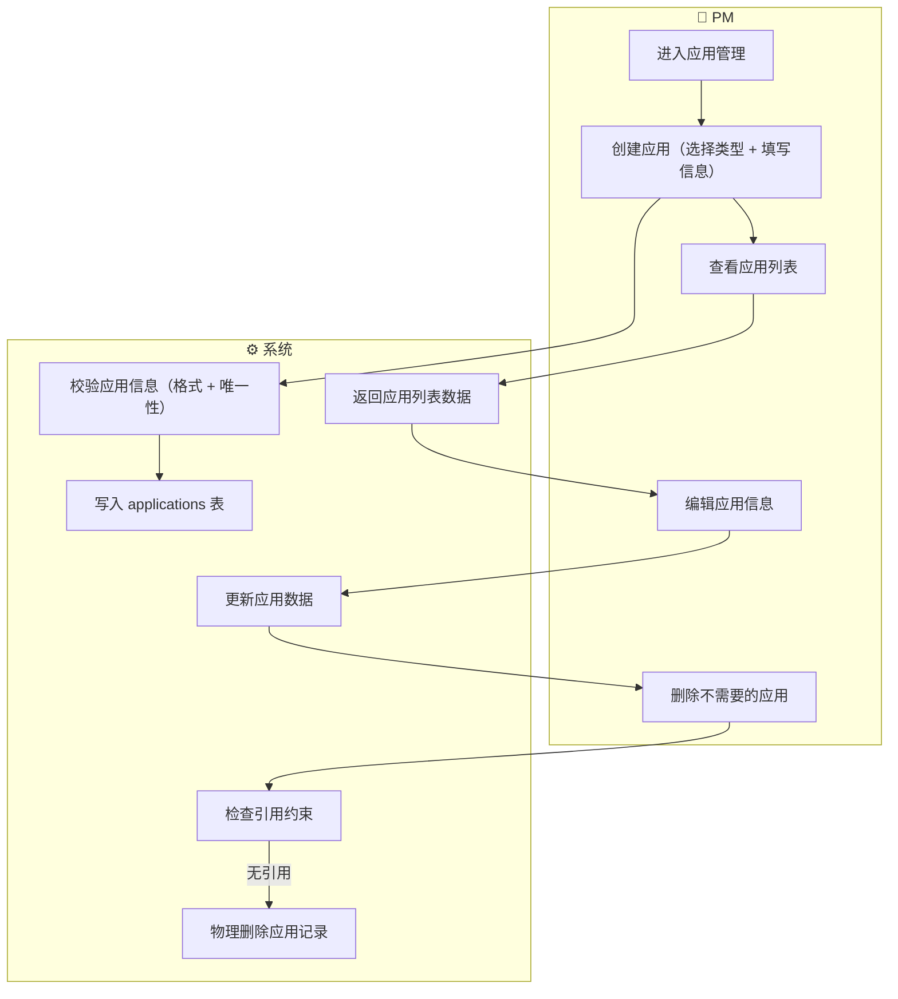
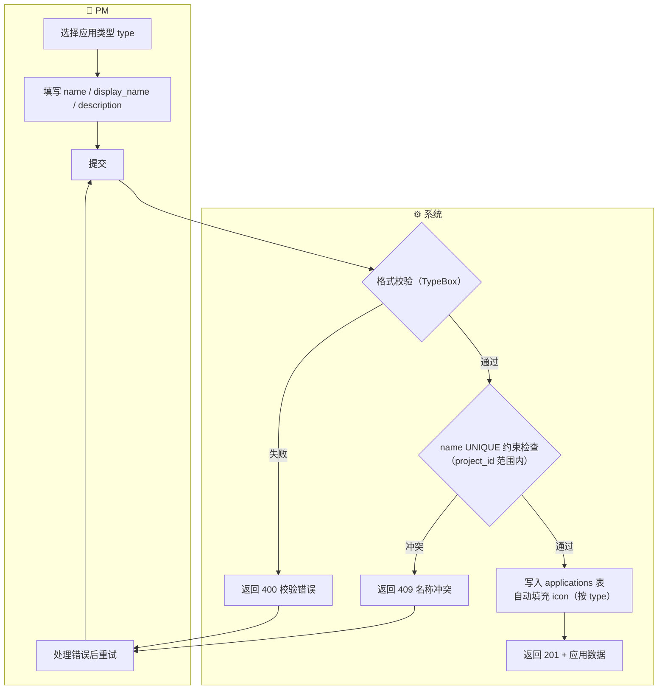
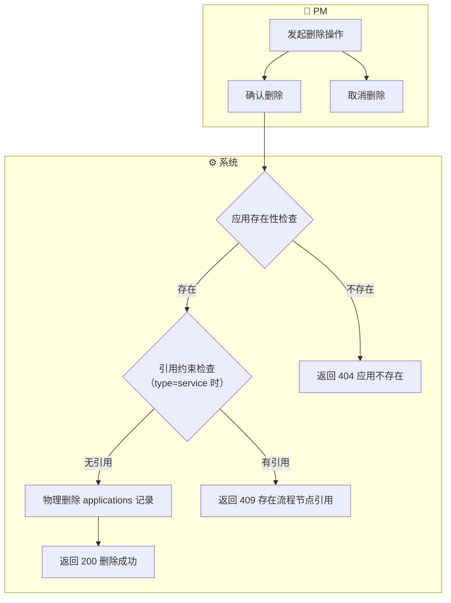

# 应用管理 产品需求规格书（PRD）

> **模块**：M1-应用管理（F-M1-11）
> **状态**：draft
> **版本**：v1.1
> **日期**：2026-06-01
> **作者**：AI/PM
> **关联文档**：
>   - 领域模型 → `docs/02-domain-model/domain-model.md#§3.1`（域二：应用与页面）
>   - 业务流程设计 → `docs/02-domain-model/business-process.md#§3`（流程节点的 service holder）
>   - 交互设计 → `docs/03-prd-ux/modules/application-management/application-management-interaction.md`
>   - 技术方案 → `docs/04-tech-design/phase1-design-tech.md`
>   - 数据库 Schema → `docs/05-data-design/phase1-database-schema.md#表10`
>   - PRD 编写规范 → `docs/03-prd-ux/prd-convention.md`

---

## 1. 概述

### 1.1 定位与目标

应用管理模块是 M1 项目管理的**补充模块**，负责在项目下管理 Application 对象——即被建模产品所涉及的平台应用实例。

**核心定位**：
- Application 是**系统（service）类型流程节点的载体**：M3 业务流程中 `process_nodes.holder_type='service'` 的节点需要引用 `applications(type='service')` 作为执行者
- Application 是**各平台应用的挂载点**：每个 Application 代表产品的一个平台部署单元（Web 端、小程序端、API 层、后台服务等），后续 Phase 将在 Application 下挂载 pages/endpoints/actions 等子资源
- Phase 1 仅实现 Application **第一层**：CRUD 管理应用对象本身，内部子资源（pages/endpoints/actions 等）为空，不在此阶段实现

**解决什么问题**：
- M3 业务流程需要"系统（service）"作为三种 holder 类型之一，Application 提供了 service holder 的引用目标
- PM 需要在项目下规划产品涉及哪些平台应用（如：管理后台 Web + 移动端小程序 + 核心服务 + 开放 API），为后续交互原型和接口设计提供组织框架

**核心价值**：
- 补全 M1 项目管理的组织维度：项目 = 领域模型 + 组织架构（角色/外部实体）+ 平台应用
- 为 M3 业务流程系统的 service holder 提供数据基础
- 为 Phase 2 交互原型（pages/components）和接口设计（endpoints）预留挂载点

### 1.2 用户角色

| 角色 | 描述 | 本模块权限 |
|------|------|:---------:|
| 产品经理（PM） | 规划产品涉及的平台应用，管理应用实例 | 读/写 |

> **Phase 1 约束**：本阶段不做认证授权，所有功能对当前用户完全开放。

### 1.3 前置依赖

| 依赖项 | 状态 | 说明 |
|--------|:----:|------|
| M1 项目管理（Project CRUD） | ✅ 完成 | Application 归属 Project，需 ProjectContext 可用 |
| applications 数据库表 | ✅ 已建表 | `docs/05-data-design/phase1-database-schema.md#表10` |

**无阻塞依赖**。

### 1.4 参考输入信息

| 参考输入 | 来源步骤 | 状态 | 说明 |
|---------|:-------:|:----:|------|
| 数据库 Schema（applications 表） | S4 数据设计 | ✅ 已存在 | 字段定义、约束、枚举值作为数据规格的对齐基准 |
| 领域模型 Application 定义 | S1 领域模型 | ✅ 已存在 | Application 的属性、7 种 type、子节点预留结构 |
| 业务流程设计（service holder） | S1 领域模型 | ✅ 已存在 | holder_type='service' + holder_id → applications.id |

---

## 2. 业务流程

> 本节定义业务动作的先后顺序和输入输出，不涉及具体的交互界面。

### 2.1 模块级主业务流程（Happy Path）

> 本流程描述 PM 在本模块中完成核心目标的典型路径（不含异常分支）：**创建应用 → 查看应用列表 → 编辑应用信息 → 删除应用**。



### 2.2 完整流程（含异常分支）

#### 2.2.1 创建应用 完整流程



#### 2.2.2 删除应用 完整流程



---

## 3. 功能范围总览

### 3.1 功能清单

| # | 功能点 | 优先级 | 描述 | 对应章节 |
|---|--------|:------:|------|:--------:|
| F-M1-11 | 应用管理 | **P0** | 项目下 Application 的完整 CRUD：列表查询（支持 type 筛选、name 搜索、排序分页）、创建应用（7 种类型）、查看详情、编辑基本信息、删除（含引用约束检查） | §4.1 |

**说明**：F-M1-11 为单一功能点，涵盖 Application 的全部 CRUD 操作。与项目管理的 5 个功能点拆分方式不同，Application 作为 M1 补充模块，其业务逻辑相对简单且操作集中，以一个功能点承载完整 CRUD。

### 3.2 Out of Scope（不在本模块范围内）

| 功能 | 原因 | 归属 |
|------|------|------|
| Application 内部子资源管理（pages/endpoints/actions 等） | Phase 1 仅实现第一层（Application 对象本身），内部为空 | Phase 2 |
| 平台特有配置（platformConfig） | Phase 1 的 config 字段默认为空 JSON，不提供配置项 | Phase 2 |
| Application 关联业务流程查看 | 属于 M3 业务流程模块的查询功能 | M3 |
| 应用归档 / 状态管理 | Application 无 status 字段，仅支持物理删除 | — |
| 应用克隆 / 导入 / 导出 | 属于高级操作 | Phase 3+ |

### 3.3 术语表

| 术语 | 定义 |
|------|------|
| **Application（应用）** | 被建模产品的一个平台应用实例。代表产品在某个平台上的部署单元，是后续页面/接口/行为的挂载点。一个项目可包含多个不同类型的 Application。 |
| **应用类型（type）** | Application 的平台分类，共 7 种：web（Web 应用）、wxapp（微信小程序）、android（Android 应用）、ios（iOS 应用）、pc（PC 桌面应用）、api（API 接口应用）、service（后台服务应用）。不同类型后续将挂载不同的子资源结构。 |
| **service 类型应用** | 作为 M3 业务流程中"系统"参与者的载体。process_nodes 的 holder_type='service' 时，holder_id 引用 applications(type='service').id。 |
| **挂载点** | Application 在 Phase 1 是一个空容器，后续 Phase 在其下挂载 pages（UI 类型应用）、endpoints（api 类型应用）、actions（service 类型应用）等子资源。 |

---

## 4. 功能点详细设计

### 4.1 [F-M1-11] 应用管理

> **编号**：F-M1-11
> **优先级**：P0
> **前置功能**：M1 项目管理（Project 已创建，ProjectContext 可用）
> **交互设计**：→ `application-management-interaction.md#§1`

#### 4.1.1 涉及的领域模型

| 实体 | 用途 | 关键字段 | 引用 |
|------|------|---------|------|
| Application | CRUD 的目标实体 | id, project_id, name, display_name, description, type, icon, sort_order, config, created_at, updated_at | `domain-model.md#§3.1` |
| Project | Application 的父容器 | id | `domain-model.md#§2.1` |
| ProcessNode | 引用 Application 的下游实体（删除约束检查用） | holder_type, holder_id | `business-process.md#§3` |

**实体关系图**：

```mermaid
erDiagram
    Project ||--o{ Application : "1:N 包含"
    Application ||--o| ProcessNode : "被引用(type=service时)"

    Project {
        string id PK
        string name UK
    }
    Application {
        string id PK
        string project_id FK
        string name UK_project
        string display_name
        string description
        string type
        string icon
        int sort_order
        jsonb config
    }
    ProcessNode {
        string id PK
        string holder_type
        string holder_id
    }
```

> 注：Application 与 ProcessNode 之间是**多态引用关系**，仅当 Application.type='service' 且 ProcessNode.holder_type='service' 时存在引用。无外键约束，由应用层检查。

#### 4.1.2 业务动作与输入输出

**主业务动作序列**：

| 步骤 | 业务动作 | 输入 | 输出 | 前置条件 | 异常处理 |
|------|---------|------|------|---------|---------|
| 1 | PM 查看应用列表 | project_id, 可选: type, search, page, pageSize, sort, order | {data: Application[], meta: {total, page, pageSize}} | 项目存在 | 项目不存在 → 404 |
| 2 | PM 创建应用 | project_id, type, name, display_name, description | Application 完整对象 | name 在项目内唯一 | 格式错 → 400, 名称冲突 → 409 |
| 3 | PM 查看应用详情 | application_id | Application 完整对象 | 应用存在 | 不存在 → 404 |
| 4 | PM 编辑应用信息 | application_id, name, display_name, description | 更新后 Application 对象 | 应用存在, name 唯一(排除自身) | 不存在 → 404, 名称冲突 → 409 |
| 5 | PM 删除应用 | application_id | 200 成功 | 应用存在, 无流程节点引用 | 不存在 → 404, 有引用 → 409 |

> **关于 type 字段**：type 在创建时选定，**不可修改**。原因：type 决定了 Application 的语义角色和后续子资源结构，修改 type 等同于重建一个完全不同的应用。

> **关于删除方式**：Application 采用**物理删除**（无 status 字段，无归档机制）。原因：Application 是结构简单的挂载点，不存在"归档后保留但不可编辑"的业务需求。

#### 4.1.3 业务规则

##### 4.1.3.1 列表查询（List）

| # | 规则 | 说明 |
|---|------|------|
| B-M1-50 | 默认按 sort_order 升序 + updatedAt 降序排列 | sort_order 支持手动排序优先，同序号按更新时间倒序 |
| B-M1-51 | 搜索仅匹配 name 字段，使用 ILIKE 模糊匹配 | 与项目列表搜索策略一致 |
| B-M1-52 | type 筛选支持单选和"全部" | 用户可选择特定 type 查看对应类型应用 |
| B-M1-53 | 列表接口不返回 config 字段 | 减少传输量；详情接口返回完整字段 |
| B-M1-53a | 列表支持卡片视图和表格视图两种展示模式 | 卡片视图突出视觉概览（图标+类型标签），表格视图突出信息密度（多列紧凑排列）；两种视图使用相同 API 端点，前端控制展示切换 |

##### 4.1.3.2 创建（Create）

| # | 规则 | 说明 |
|---|------|------|
| B-M1-54 | name 在项目范围内唯一 | UNIQUE(project_id, name) 约束；同一项目不允许同 name 的应用 |
| B-M1-55 | 同一项目允许同一 type 的多个应用 | 无 UNIQUE(project_id, type) 约束；如一个项目可有 2 个 web 应用 |
| B-M1-56 | type 创建后不可修改 | type 决定应用语义角色和子资源结构，修改 type 等同于重建 |
| B-M1-57 | icon 按 type 自动分配 | 前端根据 type 值映射对应图标（web=浏览器, wxapp=微信, android=机器人, ios=苹果, pc=显示器, api=接口, service=齿轮），后端 icon 字段由系统自动填充 |
| B-M1-58 | 默认值赋值 | sort_order=0, config='{}', icon=按type映射值, created_at=now(), updated_at=now() |

##### 4.1.3.3 编辑（Update）

| # | 规则 | 说明 |
|---|------|------|
| B-M1-59 | 可编辑字段：name, display_name, description | type 和 icon 不可编辑；sort_order 的调整在列表操作中处理 |
| B-M1-60 | name 修改时校验唯一性（排除自身） | WHERE name=? AND project_id=? AND id!=? |
| B-M1-61 | 不使用乐观锁 | Application 表无 version 字段，Phase 1 单用户模式下并发编辑风险极低；若后续需要乐观锁，可新增 version 列 |

##### 4.1.3.4 删除（Delete）

| # | 规则 | 说明 |
|---|------|------|
| B-M1-62 | 删除前引用约束检查 | 当 type='service' 时，检查 process_nodes 中是否存在 holder_type='service' AND holder_id=该应用id 的记录；存在则阻止删除 |
| B-M1-63 | 物理删除 | 直接 DELETE FROM applications WHERE id=?，不使用软删除（Application 无 status 字段） |
| B-M1-64 | 删除确认 | 删除前必须弹出确认弹窗，显示应用 display_name |
| B-M1-65 | 非 service 类型的删除 | type != 'service' 的应用（web/wxapp/android/ios/pc/api）当前不会被流程节点引用，直接允许删除；预留未来子资源级联检查点 |

**引用约束检查详情**：

| 检查项 | 条件 | 结果 |
|--------|------|------|
| Application.type='service' 且无引用 | process_nodes 中无 holder_type='service' AND holder_id=该id | 允许删除 |
| Application.type='service' 且有引用 | process_nodes 中存在引用记录 | 返回 409 + 提示"该应用正在被 N 个流程节点引用，请先修改相关流程节点" |
| Application.type != 'service' | — | 允许删除（当前无需引用检查） |

##### 4.1.3.5 校验规则汇总

| 字段 | 规则 | 错误提示 | 适用操作 |
|------|------|---------|---------|
| type | 必填, enum('web','wxapp','android','ios','pc','api','service') | 请选择应用类型 | Create |
| name | 必填, 1-50 字符, 正则 `^[a-z][a-z0-9-]*$` | 编程标识符格式: 1-50 位, 仅允许小写字母、数字和连字符, 以字母开头 | Create, Update |
| name | 项目内唯一（UNIQUE） | 该名称已被使用, 请更换 | Create, Update |
| display_name | 必填, 1-100 字符 | 请输入显示名称 | Create, Update |
| description | 可选, 最大 500 字符 | 描述不能超过 500 个字符 | Create, Update |

##### 4.1.3.6 异常场景汇总

| 场景 | 触发条件 | 系统行为 | 适用操作 |
|------|---------|---------|---------|
| 名称冲突 | name 与同项目已有应用重复 | 返回 409 CONFLICT + 字段级错误提示 | Create, Update |
| 校验失败 | TypeBox schema 校验不通过 | 返回 400 VALIDATION_FAILED + 具体字段错误 | Create, Update |
| 应用不存在 | 传入 id 无对应记录 | 返回 404 NOT_FOUND | Read, Update, Delete |
| 引用约束冲突 | type='service' 且被流程节点引用 | 返回 409 IN_USE + 引用数量提示 | Delete |
| 网络错误 | 请求超时或断网 | Error Boundary + 重试按钮 | 全部 |

#### 4.1.4 数据规格

**7 种应用类型定义**：

```typescript
type ApplicationType = 'web' | 'wxapp' | 'android' | 'ios' | 'pc' | 'api' | 'service';
// web:     Web 应用 — 后续挂载 pages/globalActions/timers/conventions
// wxapp:   微信小程序 — 后续挂载 pages/globalActions/timers
// android: Android 应用 — 后续挂载 pages/globalActions/timers
// ios:     iOS 应用 — 后续挂载 pages/globalActions/timers
// pc:      PC 桌面应用 — 后续挂载 pages/globalActions/timers/conventions
// api:     API 接口应用 — 后续挂载 endpoints/globalActions/timers（无 pages）
// service: 后台服务应用 — 后续挂载 actions/scheduleTasks/globalActions/timers（无 pages/endpoints）
```

**icon 按 type 映射表**：

| type | icon 值 | 图标含义 | 说明 |
|------|---------|---------|------|
| web | `'globe'` | 浏览器/地球 | Web 应用 |
| wxapp | `'smartphone'` | 手机 | 微信小程序 |
| android | `'smartphone'` | 手机 | Android 应用 |
| ios | `'smartphone'` | 手机 | iOS 应用 |
| pc | `'monitor'` | 显示器 | PC 桌面应用 |
| api | `'plug'` | 接口/插头 | API 接口应用 |
| service | `'cog'` | 齿轮 | 后台服务应用 |

> 注：wxapp/android/ios 使用相同 icon 值 `'smartphone'`，前端可通过 type 标签文字区分。后续 Phase 可扩展为不同图标。

**输入数据 — 创建应用（POST）**：

| 字段 | 类型 | 必填 | 默认值 | 校验规则 | 说明 |
|------|------|:----:|:------:|---------|------|
| type | string | ✅ | — | enum('web','wxapp','android','ios','pc','api','service') | 应用平台类型，创建后不可修改 |
| name | string | ✅ | — | minLength(1), maxLength(50), pattern(`^[a-z][a-z0-9-]*$`) | 编程标识符，项目内唯一 |
| display_name | string | ✅ | — | minLength(1), maxLength(100) | 显示名称 |
| description | string | - | null | maxLength(500) | 应用描述，可为空 |

**输入数据 — 编辑应用（PUT）**：

| 字段 | 类型 | 必填 | 默认值 | 校验规则 | 说明 |
|------|------|:----:|:------:|---------|------|
| name | string | ✅ | — | minLength(1), maxLength(50), pattern(`^[a-z][a-z0-9-]*$`) | 编程标识符，项目内唯一（排除自身） |
| display_name | string | ✅ | — | minLength(1), maxLength(100) | 显示名称 |
| description | string | - | null | maxLength(500) | 应用描述 |

> 注：type、icon、sort_order 不可通过 PUT 修改；sort_order 的调整由独立的排序接口处理。

**输入数据 — 列表查询（GET）**：

| 字段 | 类型 | 必填 | 默认值 | 校验规则 | 说明 |
|------|------|:----:|:------:|---------|------|
| type | string | - | undefined | enum('web','wxapp','android','ios','pc','api','service') | 按类型筛选; 不传=全部 |
| search | string | - | undefined | maxLength(50) | name 字段模糊搜索 |
| page | integer | - | 1 | minimum(1) | 当前页码 |
| pageSize | integer | - | 20 | enum(10, 20, 50, 100) | 每页条数 |
| sort | string | - | 'sortOrder' | enum('name', 'createdAt', 'updatedAt', 'sortOrder') | 排序字段 |
| order | string | - | 'asc' | enum('asc', 'desc') | 排序方向 |

**输出数据 — 列表响应**：

| 字段 | 类型 | 来源 | 说明 |
|------|------|------|------|
| data | Array\<ApplicationItem\> | DB 查询 | 当前页的应用列表 |
| meta.total | integer | COUNT 查询 | 符合条件的总记录数 |
| meta.page | integer | 请求参数回显 | 当前页码 |
| meta.pageSize | integer | 请求参数回显 | 每页条数 |

**ApplicationItem（列表项字段）**：

| 字段 | 类型 | 来源 | 说明 |
|------|------|------|------|
| id | string | applications.id | 应用 UUID |
| name | string | applications.name | 编程标识符 |
| display_name | string | applications.display_name | 显示名称 |
| description | string \| null | applications.description | 应用描述（表格视图使用） |
| type | string | applications.type | 应用平台类型 |
| icon | string | applications.icon | 图标标识（按 type 自动填充） |
| sort_order | integer | applications.sort_order | 排序序号 |
| updated_at | string | applications.updated_at | 最后更新时间 (ISO 8601) |

> 注：列表接口不返回 config 字段，减少传输量。卡片视图可选择性隐藏 description；表格视图展示全部 ApplicationItem 字段。

**输出数据 — 详情/创建/编辑响应**：

| 字段 | 类型 | 来源 | 说明 |
|------|------|------|------|
| id | string | applications.id | 应用 UUID |
| project_id | string | applications.project_id | 所属项目 ID |
| name | string | applications.name | 编程标识符 |
| display_name | string | applications.display_name | 显示名称 |
| description | string \| null | applications.description | 应用描述 |
| type | string | applications.type | 应用平台类型 |
| icon | string | applications.icon | 图标标识 |
| sort_order | integer | applications.sort_order | 排序序号 |
| config | object | applications.config | 扩展配置 JSON（Phase 1 为空 {}） |
| created_at | string | applications.created_at | 创建时间 (ISO 8601) |
| updated_at | string | applications.updated_at | 更新时间 (ISO 8601) |

#### 4.1.5 AI 编码提示

- **type 不可修改**：编辑接口（PUT）的 TypeBox schema 不应包含 type 字段，即使请求体携带 type 也应忽略而非报错（防御性编程）
- **引用约束检查是应用层逻辑**：process_nodes 的 holder_type + holder_id 是多态引用，无 DB 外键约束。删除 service 类型应用时必须在 Service 层显式查询 process_nodes 表做检查
- **icon 自动填充时机**：创建时由后端 Service 层根据 type 字段查找映射表自动写入 icon 字段，前端不传 icon
- **UNIQUE 约束处理**：DB 层 UNIQUE(project_id, name) 会抛出数据库错误，Service 层需 catch 并转换为 409 业务错误，而非直接暴露 500
- **Application 不使用乐观锁**：Application 表无 version 字段，Phase 1 单用户模式下无需乐观锁。直接 `UPDATE ... SET ... WHERE id=?` 即可，不加版本条件

---

## 5. 跨功能规则

> 本节记录影响多个操作的全局业务规则。

### 5.1 全局状态流转约束

Application 无 status 字段，无状态流转。创建即可用，删除即移除。

### 5.2 全局校验规则

| # | 规则 | 影响范围 | 说明 |
|---|------|---------|------|
| G-M1-11 | name 编程标识符格式 | Create, Update | 正则 `^[a-z][a-z0-9-]*$`，与 Project/Role/Company/Department 的 name 格式一致 |
| G-M1-12 | name 项目内唯一性 | Create, Update | UNIQUE(project_id, name)，修改时排除自身 |

### 5.3 全局业务约定

| 约定项 | 规则 | 说明 |
|--------|------|------|
| 列表分页 | 默认 pageSize=20，可选 10/50/100 | 与项目列表一致 |
| 数据排序 | 默认按 sort_order ASC + updatedAt DESC | sort_order 支持手动排序优先 |
| 唯一性约束 | 同一 project_id 下 name 唯一 | DB 层 UNIQUE 约束 |
| icon 管理 | 后端按 type 映射表自动填充，前端不传不改 | 前端仅根据 icon 字段值渲染对应图标 |

### 5.4 权限与访问控制

Phase 1 无认证授权，所有功能对当前用户完全开放。

---

## 6. 验收标准

### 6.1 功能验收（按操作）

| # | 验收项 | 对应功能点 | 验证方式 | 通过标准 |
|---|--------|:---------:|---------|---------|
| AC-M1-50 | 创建 7 种类型的应用各一个 | F-M1-11 | 自动化 | 每种 type 均返回 201，icon 按 type 自动填充，config 为 {} |
| AC-M1-51 | 创建同 type 的第二个应用 | F-M1-11 | 自动化 | 同一项目下创建第 2 个 type=web 的应用，返回 201 成功 |
| AC-M1-52 | 创建同名应用被拒绝 | F-M1-11 | 自动化 | 同一项目下创建 name 已存在的应用，返回 409 |
| AC-M1-53 | name 格式校验 | F-M1-11 | 自动化 | name 以数字开头、含大写字母、含特殊字符均返回 400 |
| AC-M1-54 | 列表按 type 筛选 | F-M1-11 | 自动化 | 传入 type=web，仅返回 web 类型应用 |
| AC-M1-55 | 列表 name 模糊搜索 | F-M1-11 | 自动化 | search='admin' 返回 name 含 admin 的应用 |
| AC-M1-56 | 查看应用详情 | F-M1-11 | 自动化 | 返回完整字段（含 description, config），与列表字段有差异 |
| AC-M1-57 | 编辑 name/display_name/description | F-M1-11 | 自动化 | PUT 后返回更新后数据，updated_at 变化 |
| AC-M1-58 | 编辑时 type 不可修改 | F-M1-11 | 自动化 | PUT 请求包含 type 字段时，type 不变（忽略而非报错） |
| AC-M1-59 | 删除无引用的 service 应用 | F-M1-11 | 自动化 | 返回 200，后续查询该 id 返回 404 |
| AC-M1-60 | 删除有引用的 service 应用被拒绝 | F-M1-11 | 自动化 | process_nodes 存在 holder_type='service' AND holder_id=该id 时，返回 409 |
| AC-M1-61 | 删除非 service 类型应用 | F-M1-11 | 自动化 | type=web 的应用可直接删除，无需引用检查 |

### 6.2 边界 & 异常场景验收

| # | 验收项 | 对应功能点 | 验证方式 | 通过标准 |
|---|--------|:---------:|---------|---------|
| AC-M1-62 | display_name 为空 | F-M1-11 | 自动化 | 返回 400，提示"请输入显示名称" |
| AC-M1-63 | name 超长（51 字符） | F-M1-11 | 自动化 | 返回 400 |
| AC-M1-64 | description 超长（501 字符） | F-M1-11 | 自动化 | 返回 400 |
| AC-M1-65 | 不存在的 application_id | F-M1-11 | 自动化 | GET/PUT/DELETE 均返回 404 |
| AC-M1-66 | 编辑时 name 改为同项目已有名称 | F-M1-11 | 自动化 | 返回 409，原应用数据不变 |
| AC-M1-67 | 空列表 | F-M1-11 | 自动化 | 项目下无应用时返回 data=[], total=0 |
| AC-M1-68 | 跨项目 name 不冲突 | F-M1-11 | 自动化 | 项目 A 有 name='api-gateway'，项目 B 创建 name='api-gateway' 返回 201 |
