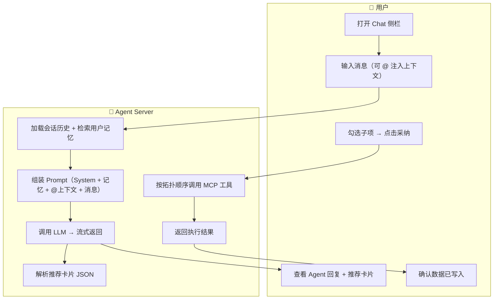
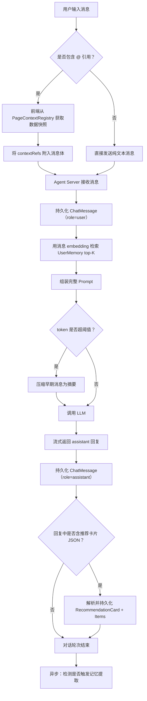
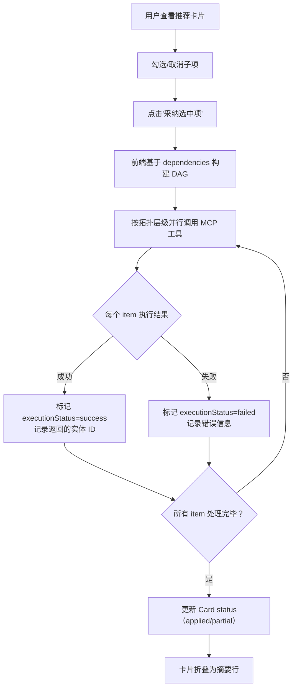
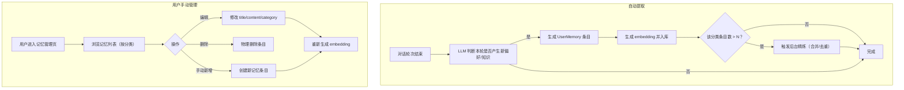

# 内置 Agent 协作 产品需求规格书（PRD）

> **模块**：M7-内置 Agent 协作（Tier 2）
> **状态**：draft
> **版本**：v1.0
> **日期**：2026-06-15
> **作者**：AI/PM
> **关联文档**：
>   - 领域模型 → `docs/02-domain-model/builtin-agent.md`
>   - S0 设计决策 → `docs/01-design-idea/ai-agent-integration.md#§10`
>   - 交互设计 → `docs/03-prd-ux/modules/builtin-agent/builtin-agent-interaction.md`（待编写）
>   - 技术方案 → `docs/04-tech-design/builtin-agent-design.md`（待编写）
>   - PRD 编写规范 → `docs/03-prd-ux/prd-convention.md`

---

## 1. 概述

### 1.1 定位与目标

内置 Agent 协作模块为系统提供 **Web UI 内嵌 AI 对话能力**（Tier 2），让用户无需配置外部 AI 即可在页面内获得设计辅助。

**核心定位**：
- 面向**小白用户**的开箱即用 AI 设计助手（与 Tier 1 外部 MCP Agent 长期共存、面向不同用户群）
- 系统自身作为 AI 客户端，复用 Tier 1 的 MCP 工具能力
- 全局侧栏 Chat 形态，跨所有页面常驻

**解决什么问题**：
- 非技术用户无法自行配置 Claude Code / Qoder 等外部 Agent
- 外部 Agent 缺乏页面上下文感知，用户需手动描述"我在看什么"
- 设计过程中的偏好和约定无法跨会话沉淀

**核心价值**：
- **UI 上下文感知**：通过 @ 注入机制，Agent 自动获取当前页面数据
- **System Prompt 统一维护**：保障所有用户获得一致的概念理解
- **用户记忆**：跨会话沉淀用户偏好，越用越懂你
- **渐进式确认**：推荐卡片机制，用户选择性采纳

### 1.2 用户角色

| 角色 | 描述 | 本模块权限 |
|------|------|:---------:|
| 产品经理（PM） | 使用内置 Agent 辅助领域建模、流程设计 | 读/写 |

> **私有化部署约束**：本系统为个人工作站私有化部署，单用户场景，无需多租户隔离。

### 1.3 前置依赖

| 依赖项 | 状态 | 说明 |
|--------|:----:|------|
| M1 项目管理（Project CRUD） | ✅ 完成 | Agent 操作的数据对象归属 Project |
| MCP Server（22 个 CRUD 工具） | ✅ 冒烟通过 | Agent 通过 MCP 工具写入数据 |
| User 实体（M6 团队权限） | ✅ 完成 | 记忆归属用户维度 |
| Agent Server 独立进程 | 🔲 待建 | S4 技术方案阶段实现 |
| 本地 Embedding 模型服务 | 🔲 待建 | 记忆向量化依赖 |
| pgvector 扩展 | 🔲 待装 | 向量检索依赖 |

### 1.4 参考输入信息

| 参考输入 | 来源步骤 | 状态 | 说明 |
|---------|:-------:|:----:|------|
| S0 核心决策（8 项 MVP 功能） | S0 设计讨论 | ✅ 已确认 | ai-agent-integration.md §10.4 |
| 领域模型（5 实体） | S1 领域模型 | ✅ 已完成 | builtin-agent.md |
| 推荐卡片 Schema Draft | S0 议题 F | ✅ 已确认 | 通用 schema + MCP 参数直通 |

---

## 2. 业务流程

> 本节定义业务动作的先后顺序和输入输出，不涉及具体的交互界面。

### 2.1 模块级主业务流程（Happy Path）

> 核心路径：**用户打开 Chat → 多轮对话 → Agent 输出推荐卡片 → 用户采纳 → 数据写入系统**。



### 2.2 完整流程（含异常分支）

#### 2.2.1 对话流程（含上下文注入）



#### 2.2.2 推荐卡片采纳流程



#### 2.2.3 记忆管理流程



---

## 3. 功能范围总览

### 3.1 功能清单

| 编号 | 功能点 | 优先级 | 说明 |
|------|--------|:------:|------|
| F-M7-01 | 会话管理 | P0 | 创建/归档/列表/切换模式 |
| F-M7-02 | 消息收发（流式） | P0 | 用户发送 → Agent 流式回复（SSE） |
| F-M7-03 | @ 上下文注入 | P0 | 页面注册 + @ 选择 + 快照随消息上报 |
| F-M7-04 | 推荐卡片输出与采纳 | P0 | LLM 输出卡片 → 用户勾选 → 拓扑执行 MCP |
| F-M7-05 | 能力模式切换 | P0 | 副驾 ↔ 执行者，影响 Agent 行为策略 |
| F-M7-06 | 用户记忆自动提取 | P0 | 对话后 LLM 判断并提取偏好/知识 |
| F-M7-07 | 用户记忆检索 | P0 | 每轮对话前 embedding top-K 检索 |
| F-M7-08 | 记忆管理 | P1 | 用户浏览/编辑/删除/手动新增记忆 |
| F-M7-09 | 会话上下文压缩 | P1 | token 超阈自动摘要早期消息 |
| F-M7-10 | 长记忆压缩精炼 | P1 | 同类条目 > N 时后台合并 |

### 3.2 Out of Scope（MVP 不含）

| 功能 | 延后原因 |
|------|---------|
| BYOK（用户自带 Key） | MVP 仅后端统一代理一种 LLM 接入 |
| Canvas 联动高亮预览 | 前端改造量大，MVP 用纯文本+卡片 |
| 多用户协作（共享会话） | 私有化单人场景无需 |
| Agent 自主规划多步骤任务 | MVP 为单轮请求-响应模式 |
| 语音输入/输出 | 非核心场景 |

### 3.3 术语表

| 术语 | 定义 |
|------|------|
| **副驾模式（Copilot）** | Agent 只输出推荐卡片，不主动执行写入；用户采纳后才调 MCP |
| **执行者模式（Executor）** | Agent 在回复中直接调用 MCP 工具写入数据，关键操作前二次确认 |
| **推荐卡片** | Agent 输出的结构化方案，含多个可独立采纳的子项 |
| **@ 注入** | 用户在 Chat 中通过 @ 符号选择当前页面数据作为上下文 |
| **记忆精炼** | 当同类记忆条目过多时，后台 LLM 合并/去重为更精炼的版本 |
| **拓扑执行** | 基于子项间依赖关系构建 DAG，按层级并行调用 MCP |

---

## 4. 功能点详细设计

### 4.1 F-M7-01 会话管理

#### 4.1.1 涉及的领域模型

- **ChatSession**（主实体）
- **User**（归属关系）

#### 4.1.2 业务动作与输入输出

| 动作 | 输入 | 输出 | 前置条件 |
|------|------|------|---------|
| 创建会话 | userId | ChatSession（status=active, mode=copilot） | 用户已登录 |
| 归档会话 | sessionId | ChatSession（status=archived） | 会话存在且 status=active |
| 列出会话 | userId, 分页参数 | ChatSession[] 按 lastMessageAt 降序 | — |
| 切换模式 | sessionId, mode | ChatSession（mode 更新） | 会话 status=active |
| 重命名 | sessionId, title | ChatSession（title 更新） | 会话存在 |

#### 4.1.3 业务规则

| # | 规则 | 说明 |
|---|------|------|
| R01 | 新建会话默认 mode=copilot | 用户可后续切换 |
| R02 | 新建会话 title 为空 | 首条消息后由 Agent 自动生成标题 |
| R03 | 归档不可逆 | archived 状态不可恢复为 active |
| R04 | 模式切换即时生效 | 不影响历史消息，仅影响后续 Agent 行为 |

#### 4.1.4 数据规格

| 字段 | 类型 | 约束 | 说明 |
|------|------|------|------|
| id | UUID | PK | 自动生成 |
| userId | UUID | FK → User, NOT NULL | 归属用户 |
| title | varchar(200) | 可空 | 会话标题 |
| mode | enum | NOT NULL, DEFAULT 'copilot' | copilot / executor |
| status | enum | NOT NULL, DEFAULT 'active' | active / archived |
| messageCount | int | NOT NULL, DEFAULT 0 | 冗余计数 |
| lastMessageAt | timestamp | 可空 | 最后消息时间 |

---

### 4.2 F-M7-02 消息收发（流式）

#### 4.2.1 涉及的领域模型

- **ChatMessage**（主实体）
- **ChatSession**（归属）
- **RecommendationCard**（assistant 消息可附带）

#### 4.2.2 业务动作与输入输出

| 动作 | 输入 | 输出 | 前置条件 |
|------|------|------|---------|
| 发送消息 | sessionId, content, contextRefs? | ChatMessage（role=user）+ Agent 流式回复 | 会话 active |
| 接收流式回复 | SSE 事件流 | ChatMessage（role=assistant）持久化 | — |
| 加载历史 | sessionId, 分页 | ChatMessage[] 按 createdAt 升序 | 会话存在 |

#### 4.2.3 业务规则

| # | 规则 | 说明 |
|---|------|------|
| R01 | 用户消息发送后立即持久化 | 不等 Agent 回复完成 |
| R02 | Agent 回复流式传输 | SSE 逐 token 推送，完成后持久化完整消息 |
| R03 | 流式中断处理 | 连接断开时，已接收部分仍持久化（标记不完整） |
| R04 | 首条消息触发标题生成 | Agent 在首次回复时顺带生成会话标题 |
| R05 | contextRefs 为快照 | 存储 @ 时刻的数据冻结，不随源数据变化 |
| R06 | 消息不可编辑/删除 | MVP 阶段消息为只读（保证上下文完整性） |

#### 4.2.4 数据规格

| 字段 | 类型 | 约束 | 说明 |
|------|------|------|------|
| id | UUID | PK | |
| sessionId | UUID | FK → ChatSession, NOT NULL | |
| role | enum | NOT NULL | user / assistant / system |
| content | text | NOT NULL | Markdown 正文 |
| contextRefs | jsonb | 可空 | @ 上下文快照数组 |
| tokenCount | int | NOT NULL, DEFAULT 0 | 用于压缩计算 |
| isCompressed | boolean | NOT NULL, DEFAULT false | |
| compressedContent | text | 可空 | 压缩后摘要 |

---

### 4.3 F-M7-03 @ 上下文注入

#### 4.3.1 涉及的领域模型

- **ChatMessage.contextRefs**（存储层）
- **PageContextRegistration**（纯前端运行时）

#### 4.3.2 业务动作与输入输出

| 动作 | 输入 | 输出 | 前置条件 |
|------|------|------|---------|
| 页面注册上下文项 | PageContextItem[] | 注册到前端 Registry | 页面 mount |
| 触发 @ 菜单 | 用户输入 @ 字符 | 当前页面已注册的区域列表 | Registry 非空 |
| 选择上下文项 | area + 具体元素 | 结构化数据快照 | getDetail() 可用 |
| 随消息上报 | contextRefs[] | 附入 ChatMessage | 用户发送消息 |

#### 4.3.3 业务规则

| # | 规则 | 说明 |
|---|------|------|
| R01 | @ 菜单分两级 | 第一级：区域（领域模型/业务流程/…）；第二级：具体元素 |
| R02 | 一条消息可 @ 多项 | contextRefs 为数组，无上限（但受 token 预算约束） |
| R03 | 快照冻结原则 | 存入 contextRefs 后，即使源数据被修改，消息中的快照不变 |
| R04 | 页面卸载自动注销 | 页面 unmount 时从 Registry 移除其注册项 |
| R05 | Agent 后端被动接收 | 后端不主动拉取页面数据，仅消费 contextRefs |

#### 4.3.4 数据规格

**contextRefs JSON 结构**：

```jsonc
[
  {
    "area": "领域模型",          // 区域名
    "label": "实体:Order",      // 显示标签
    "data": {                   // 结构化数据快照
      "id": "uuid-...",
      "name": "order",
      "displayName": "订单",
      "fields": [...]
    }
  }
]
```

---

### 4.4 F-M7-04 推荐卡片输出与采纳

#### 4.4.1 涉及的领域模型

- **RecommendationCard**（主实体）
- **RecommendationItem**（子项）
- **ChatMessage**（附着关系）

#### 4.4.2 业务动作与输入输出

| 动作 | 输入 | 输出 | 前置条件 |
|------|------|------|---------|
| Agent 输出卡片 | LLM 回复含 ```json card 块 | RecommendationCard + Items 持久化 | assistant 消息已保存 |
| 用户勾选子项 | itemId, selected | Item.selected 更新（前端态） | 卡片 status=pending |
| 采纳选中项 | cardId, selectedItemIds | 按拓扑执行 MCP → 更新状态 | 卡片 status=pending |
| 丢弃卡片 | cardId | Card.status=discarded | 卡片 status=pending |

#### 4.4.3 业务规则

| # | 规则 | 说明 |
|---|------|------|
| R01 | 一条消息最多一张卡片 | 1:0..1 关系 |
| R02 | 依赖联动 | 取消实体 → 自动取消依赖它的关系/字段子项 |
| R03 | 拓扑并行执行 | 同层无依赖项并行调 MCP，有依赖按层级推进 |
| R04 | 部分成功处理 | 某些 item 失败不阻塞其他无依赖 item |
| R05 | 执行结果记录 | 成功：记录返回的实体 ID；失败：记录错误信息 |
| R06 | 卡片终态不可逆 | applied / partial / discarded 后不可重新采纳 |
| R07 | 副驾模式下才输出卡片 | 执行者模式 Agent 直接执行，不走卡片确认 |
| R08 | 采纳后折叠 | 卡片在 Chat 中折叠为摘要行（可展开） |

#### 4.4.4 数据规格

**RecommendationCard**：

| 字段 | 类型 | 约束 | 说明 |
|------|------|------|------|
| id | UUID | PK | |
| messageId | UUID | FK → ChatMessage, UNIQUE | 附着消息 |
| title | varchar(200) | NOT NULL | |
| description | text | 可空 | Markdown 设计依据 |
| status | enum | NOT NULL, DEFAULT 'pending' | pending/partial/applied/discarded |
| appliedAt | timestamp | 可空 | |

**RecommendationItem**：

| 字段 | 类型 | 约束 | 说明 |
|------|------|------|------|
| id | UUID | PK | |
| cardId | UUID | FK → RecommendationCard | |
| kind | varchar(50) | NOT NULL | 语义类型 |
| label | varchar(300) | NOT NULL | 一行摘要 |
| preview | text | 可空 | Markdown 详情 |
| tool | varchar(100) | NOT NULL | MCP 工具名 |
| args | jsonb | NOT NULL | MCP 参数 |
| selected | boolean | NOT NULL, DEFAULT true | |
| dependencies | jsonb | 可空 | item id 数组 |
| executionStatus | enum | NOT NULL, DEFAULT 'pending' | pending/success/failed |
| executionResult | jsonb | 可空 | |
| executionError | text | 可空 | |
| sortOrder | int | NOT NULL, DEFAULT 0 | |

---

### 4.5 F-M7-05 能力模式切换

#### 4.5.1 涉及的领域模型

- **ChatSession.mode**（状态字段）

#### 4.5.2 业务动作与输入输出

| 动作 | 输入 | 输出 | 前置条件 |
|------|------|------|---------|
| 切换为执行者 | sessionId | mode=executor + system 消息通知 | 会话 active |
| 切换为副驾 | sessionId | mode=copilot + system 消息通知 | 会话 active |

#### 4.5.3 业务规则

| # | 规则 | 说明 |
|---|------|------|
| R01 | 默认 copilot | 新会话默认副驾模式 |
| R02 | 切换插入 system 消息 | 在 Chat 中显示"已切换为执行者模式"通知 |
| R03 | 模式影响 Agent 行为 | copilot：输出推荐卡片等用户采纳；executor：直接调 MCP 执行 |
| R04 | executor 模式仍有确认 | 高危操作（删除/批量修改）仍需用户二次确认 |
| R05 | 切换不影响历史 | 历史消息和卡片状态不因模式切换而改变 |

---

### 4.6 F-M7-06 用户记忆自动提取

#### 4.6.1 涉及的领域模型

- **UserMemory**（主实体）
- **ChatSession**（来源追溯）

#### 4.6.2 业务动作与输入输出

| 动作 | 输入 | 输出 | 前置条件 |
|------|------|------|---------|
| 判断是否提取 | 本轮对话内容 | 布尔判断 + 提取内容 | 对话轮次结束 |
| 生成记忆条目 | 提取内容 + category | UserMemory（source=auto_extract） | 判断为"有提取价值" |
| 生成 embedding | 记忆 content | embedding vector | 本地模型可用 |

#### 4.6.3 业务规则

| # | 规则 | 说明 |
|---|------|------|
| R01 | 异步不阻塞 | 记忆提取在对话回复完成后异步执行，不影响响应速度 |
| R02 | 提取判断标准 | 用户表达了偏好/约定/纠正/领域知识时提取 |
| R03 | 不提取临时性内容 | "帮我建个实体"等一次性指令不作为记忆 |
| R04 | 去重检查 | 新记忆与现有记忆语义相似度 > 0.9 时合并而非新建 |
| R05 | 分类必选 | 每条记忆必须归入 6 个预设分类之一 |
| R06 | 来源可追溯 | sourceSessionId 记录提取来源会话 |

#### 4.6.4 数据规格

见 §4.8 记忆管理数据规格（共用 UserMemory 表）。

---

### 4.7 F-M7-07 用户记忆检索

#### 4.7.1 涉及的领域模型

- **UserMemory**（检索源）
- **ChatMessage**（检索触发）

#### 4.7.2 业务动作与输入输出

| 动作 | 输入 | 输出 | 前置条件 |
|------|------|------|---------|
| 生成查询 embedding | 用户本轮消息 content | query vector | 本地模型可用 |
| 向量检索 top-K | query vector + userId | UserMemory[] 按相似度降序 | 用户有记忆数据 |
| 拼入 Prompt | 检索结果 | System Prompt 中追加记忆段落 | — |

#### 4.7.3 业务规则

| # | 规则 | 说明 |
|---|------|------|
| R01 | 每轮都检索 | 用户每发一条消息都触发一次检索 |
| R02 | 仅检索 isActive=true | 已停用/已精炼的旧版本不参与检索 |
| R03 | 仅检索当前用户 | userId 过滤，不跨用户 |
| R04 | top-K 默认 5 | 最多取 5 条最相关记忆（S4 阶段可调） |
| R05 | 相似度阈值 | 低于 0.5 的结果不纳入（避免噪声） |
| R06 | 检索失败降级 | embedding 服务不可用时跳过记忆注入，不阻塞对话 |

---

### 4.8 F-M7-08 记忆管理

#### 4.8.1 涉及的领域模型

- **UserMemory**（主实体）

#### 4.8.2 业务动作与输入输出

| 动作 | 输入 | 输出 | 前置条件 |
|------|------|------|---------|
| 列出记忆 | userId, category?, 分页 | UserMemory[] | — |
| 编辑记忆 | memoryId, title/content/category | UserMemory 更新 + 重新 embedding | 记忆存在 |
| 删除记忆 | memoryId | 物理删除 | 记忆存在 |
| 手动新增 | userId, category, title, content | UserMemory（source=user_manual） | — |
| 停用/启用 | memoryId, isActive | UserMemory.isActive 更新 | 记忆存在 |

#### 4.8.3 业务规则

| # | 规则 | 说明 |
|---|------|------|
| R01 | 编辑后重新 embedding | content 变更时必须重新生成向量 |
| R02 | 删除为物理删除 | 记忆为用户私有数据，无需软删除 |
| R03 | 分类筛选 | 列表支持按 category 过滤 |
| R04 | 停用不等于删除 | isActive=false 的记忆不参与检索但保留数据 |

#### 4.8.4 数据规格

**UserMemory 完整字段**：

| 字段 | 类型 | 约束 | 说明 |
|------|------|------|------|
| id | UUID | PK | |
| userId | UUID | FK → User, NOT NULL | |
| category | enum | NOT NULL | 6 种预设分类 |
| title | varchar(200) | NOT NULL | 一行摘要 |
| content | text | NOT NULL | 记忆正文 |
| embedding | vector(1024) | NOT NULL | 语义向量 |
| source | enum | NOT NULL | auto_extract / user_manual |
| sourceSessionId | UUID | 可空, FK → ChatSession | |
| isActive | boolean | NOT NULL, DEFAULT true | |
| createdAt | timestamp | NOT NULL | |
| updatedAt | timestamp | NOT NULL | |

---

### 4.9 F-M7-09 会话上下文压缩

#### 4.9.1 涉及的领域模型

- **ChatMessage**（isCompressed / compressedContent）

#### 4.9.2 业务动作与输入输出

| 动作 | 输入 | 输出 | 前置条件 |
|------|------|------|---------|
| 检测 token 总量 | sessionId 所有未压缩消息 | 当前 token 总量 | — |
| 触发压缩 | 超阈值的消息列表 | 早期消息标记 isCompressed=true | 总量 > 80% context window |
| 生成摘要 | 待压缩消息内容 | compressedContent | LLM 可用 |

#### 4.9.3 业务规则

| # | 规则 | 说明 |
|---|------|------|
| R01 | 阈值 = 80% context window | 超过时触发（具体值随 LLM 模型确定） |
| R02 | 压缩最早的 N 条 | 保留最近 K 条不压缩（K 由 S4 确定） |
| R03 | 压缩在当前 LLM 调用中顺带做 | 不额外发起 LLM 调用 |
| R04 | 压缩后原文不删除 | content 保留，isCompressed=true 时 Prompt 用 compressedContent |
| R05 | 用户无感知 | 前端不显示压缩状态，对话体验连续 |

---

### 4.10 F-M7-10 长记忆压缩精炼

#### 4.10.1 涉及的领域模型

- **UserMemory**（isActive 状态切换）

#### 4.10.2 业务动作与输入输出

| 动作 | 输入 | 输出 | 前置条件 |
|------|------|------|---------|
| 检测条目数 | userId + category | 该分类下 isActive=true 的条目数 | 新记忆写入后 |
| 触发精炼 | 超阈值的同分类条目 | 合并后的新条目 + 旧条目 isActive=false | 条目数 > N |
| 生成合并记忆 | 多条旧记忆内容 | 新 UserMemory（精炼版） | 后台 LLM 可用 |

#### 4.10.3 业务规则

| # | 规则 | 说明 |
|---|------|------|
| R01 | 按分类独立计数 | 每个 category 独立判断是否超阈 |
| R02 | 阈值 N 待定 | S4 阶段确定（候选 20~50） |
| R03 | 后台静默执行 | 不阻塞用户正在进行的对话 |
| R04 | 旧条目标记 isActive=false | 不物理删除，保留审计痕迹 |
| R05 | 新条目继承 source | source=auto_extract，sourceSessionId 为空（合并产物） |
| R06 | 精炼失败不影响主流程 | 后台任务失败仅记日志，不抛错给用户 |

---

## 5. 跨功能规则

### 5.1 全局状态流转约束

| 对象 | 约束 |
|------|------|
| ChatSession | active → archived 不可逆 |
| RecommendationCard | pending → applied/partial/discarded 不可逆 |
| UserMemory | isActive 可双向切换（停用/启用） |

### 5.2 全局校验规则

| # | 规则 | 适用功能 |
|---|------|---------|
| V01 | sessionId 必须对应 status=active 的会话 | F-M7-02/03/04/05 |
| V02 | MCP 工具名必须在白名单内 | F-M7-04 |
| V03 | category 必须为 6 个枚举值之一 | F-M7-06/08 |
| V04 | embedding 维度必须与模型配置一致 | F-M7-06/07/08 |

### 5.3 全局业务约定

| # | 约定 | 说明 |
|---|------|------|
| G01 | 所有时间戳为 UTC | 前端负责时区转换 |
| G02 | ID 均为 UUID v4 | 前后端统一 |
| G03 | Agent 不主动发起对话 | 只响应用户消息（无推送通知） |
| G04 | LLM 调用失败时返回友好错误 | 不暴露原始 API 错误给用户 |
| G05 | MCP 工具白名单 | Agent 只能调用已注册的 MCP 工具，不可任意 HTTP |

### 5.4 权限与访问控制

| 规则 | 说明 |
|------|------|
| 用户只能访问自己的会话和记忆 | userId 过滤 |
| 私有化单用户 | MVP 无需 RBAC，所有功能对当前用户开放 |

---

## 6. 验收标准

### 6.1 功能验收

| # | 验收项 | 通过条件 |
|---|--------|---------|
| AC01 | 创建会话 + 发送消息 + 收到流式回复 | 消息正确持久化，流式逐字显示 |
| AC02 | @ 注入上下文 | Agent 回复中体现了 @ 数据的内容 |
| AC03 | 推荐卡片输出 | 卡片正确解析、子项可勾选 |
| AC04 | 采纳推荐 → MCP 写入 | 数据实际写入系统（如实体出现在领域模型中） |
| AC05 | 模式切换 | 执行者模式下 Agent 直接执行写入 |
| AC06 | 记忆自动提取 | 表达偏好后记忆列表中出现新条目 |
| AC07 | 记忆检索影响回复 | Agent 回复体现了历史偏好 |
| AC08 | 记忆管理 CRUD | 编辑/删除/新增后检索结果相应变化 |
| AC09 | 会话上下文压缩 | 长对话不超 token 限制，回复连贯 |
| AC10 | 长记忆精炼 | 同分类超阈后自动合并 |

### 6.2 边界 & 异常场景验收

| # | 场景 | 预期行为 |
|---|------|---------|
| E01 | LLM API 超时/不可用 | 返回友好错误提示，消息不丢失 |
| E02 | Embedding 服务不可用 | 跳过记忆检索，对话正常进行（降级） |
| E03 | MCP 工具执行失败 | Item 标记 failed + 错误信息，不阻塞其他 item |
| E04 | SSE 连接中断 | 已接收部分持久化，用户可刷新恢复 |
| E05 | 推荐卡片 JSON 解析失败 | 作为纯文本展示，不 crash |
| E06 | 记忆精炼后台失败 | 仅记日志，不影响用户操作 |
| E07 | 空会话（无消息）归档 | 允许，无副作用 |
