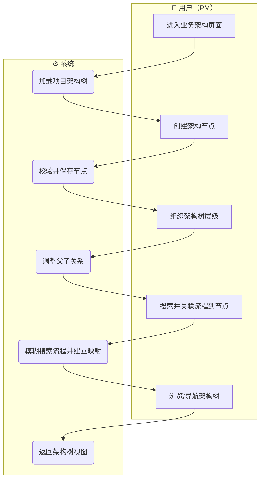
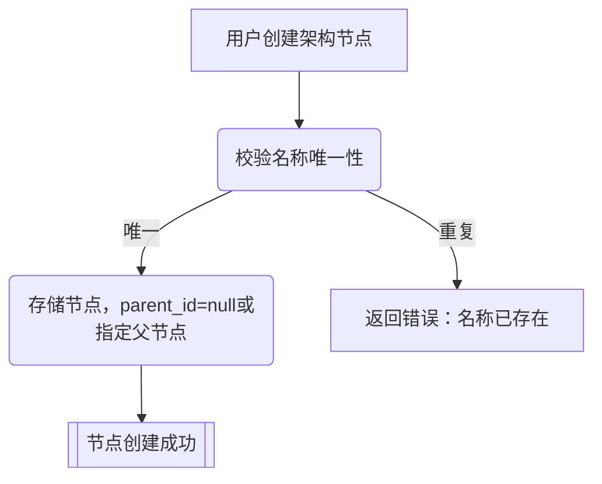
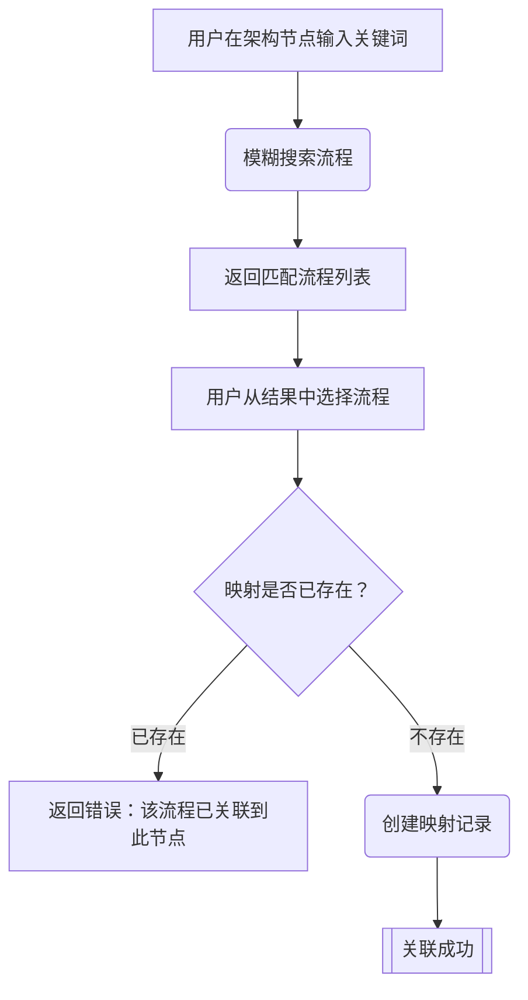
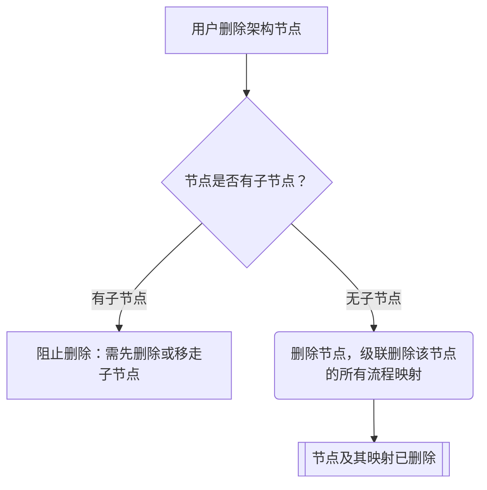
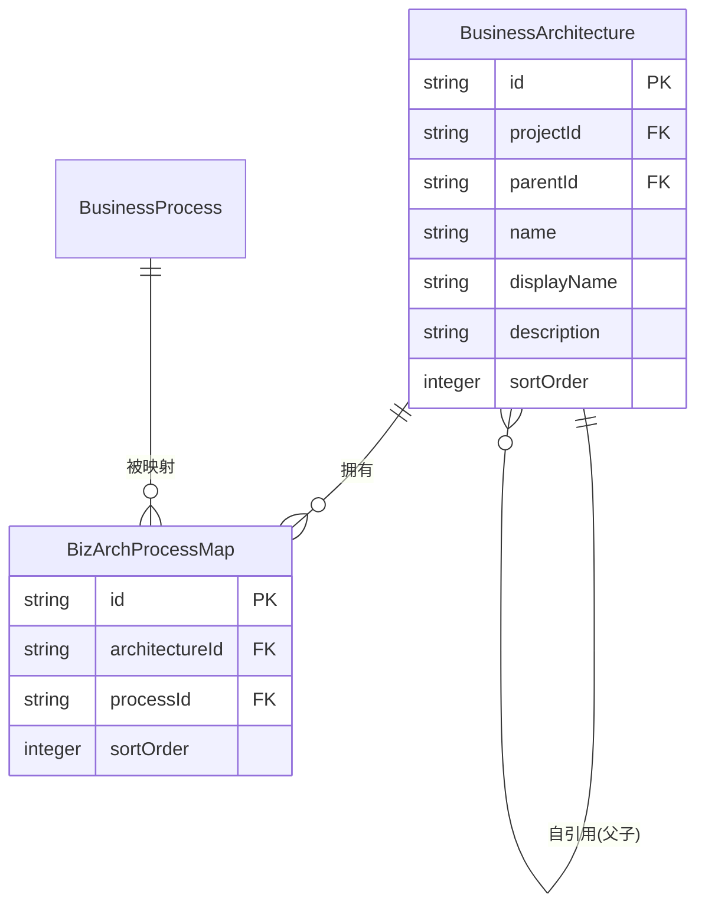

# 业务架构 产品需求规格书（PRD）

> **模块**：M4-业务架构
> **状态**：draft
> **版本**：v1.0
> **日期**：2026-06-12
> **作者**：AI/PM
> **关联文档**：
>   - 领域模型（ProcessArchitecture）→ `docs/02-domain-model/business-process.md#ProcessArchitecture`
>   - 交互设计 → `docs/03-prd-ux/modules/business-architecture/business-architecture-interaction.md`
>   - 技术方案 → `docs/04-tech-design/` (待 S4 补充)
>   - 数据库 Schema → `docs/05-data-design/phase1-database-schema.md#表17` + `#表18`

---

## 1. 概述

### 1.1 定位与目标

业务架构是业务流程三层体系的最顶层（Layer 3）。它提供一个**不限层数的树形分类导航体系**，让 PM 能够按照业务域→子域→模块→具体流程的逻辑层次，对项目内的业务流程进行组织和管理。

业务架构与底层流程拓扑**完全无关**，是一套纯手动维护的分类视图。同一个流程可以出现在架构树的多个位置（多对多映射），删除或移动架构节点不影响流程本身的任何数据。

**核心价值**：
- 让 PM 像整理文件夹一样整理流程，快速定位目标流程
- 提供从"业务域"到"具体流程"的自顶向下导航路径
- 支持同一流程归入多个业务分类（如"故障维修"同属"设备维护"和"异常处理"）

### 1.2 用户角色

| 角色 | 描述 | 本模块权限 |
|------|------|:---------:|
| PM | 产品经理，负责构建和维护业务架构树 | 读/写 |

### 1.3 前置依赖

| 依赖项 | 状态 | 说明 |
|--------|:----:|------|
| M1 项目管理（项目 CRUD） | ✅ | 架构节点归属 projectId，项目上下文已就绪 |
| M3 业务流程（流程 CRUD + 搜索接口） | ✅ 后端 | 流程列表/搜索接口已实现；映射关系依赖 business_processes 表 |
| DB 表：business_architectures (表17) | ✅ | 已建表，但 level 约束需修改（见 §5.2） |
| DB 表：biz_arch_process_map (表18) | ✅ | 已建表 |

---

## 2. 业务流程

> 本节定义业务动作的先后顺序和输入输出，不涉及具体的交互界面。

### 2.1 模块级主业务流程（Happy Path）

### 2.2 完整流程（含异常分支）

#### 2.2.1 创建架构节点完整流程

#### 2.2.2 关联流程到架构节点完整流程

#### 2.2.3 删除架构节点完整流程

---

## 3. 功能范围总览

### 3.1 功能清单

| # | 功能点 | 优先级 | 描述 | 对应章节 |
|---|--------|:------:|------|:--------:|
| F-M4-01 | 架构树展示与导航 | P0 | 展示项目的完整架构树，支持展开/收起层级 | §4.1 |
| F-M4-02 | 创建架构节点 | P0 | 在任意层级创建新的架构分类节点 | §4.2 |
| F-M4-03 | 编辑架构节点 | P0 | 修改节点的名称、显示名称、描述 | §4.3 |
| F-M4-04 | 删除架构节点 | P0 | 删除无子节点的架构节点（及其所有流程映射） | §4.4 |
| F-M4-05 | 关联流程到节点 | P0 | 通过模糊搜索选择流程并关联到指定架构节点 | §4.5 |
| F-M4-06 | 解除流程关联 | P0 | 从架构节点移除某个流程的关联关系 | §4.6 |
| F-M4-07 | 架构节点内流程排序 | P1 | 调整某架构节点下关联流程的显示顺序 | §4.7 |
| F-M4-08 | 流程模糊搜索接口 | P0 | 供关联操作使用的流程搜索接口（关键词匹配 name/displayName） | §4.8 |

### 3.2 Out of Scope

| 功能 | 原因 | 归属 |
|------|------|------|
| 架构节点拖拽排序（调整父子/兄弟关系） | Phase 1 MVP 先支持静态创建，拖拽是体验优化 | Phase 2 |
| 架构节点克隆/移动 | 复杂度高，当前通过删除+重建解决 | Phase 2 |
| AI 自动生成架构树 | 属于 AI 能力增强 | Phase 4/5 |
| 架构节点权限控制 | Phase 1 无认证 | Phase 3 |
| 架构树导出 | Phase 1 MVP 不涉及 | Phase 2+ |

### 3.3 术语表

| 术语 | 定义 |
|------|------|
| 架构节点（ArchNode） | 业务架构树中的一个分类节点，可以是纯文件夹（无关联流程）或概览节点（有关联流程） |
| 根节点 | parent_id 为 null 的顶层节点（L1 层级） |
| 叶子节点 | 没有子节点的节点，通常关联具体的流程 |
| 流程映射 | 架构节点与业务流程之间的多对多关联记录（biz_arch_process_map） |
| 流程搜索 | 在关联操作中，通过关键词模糊匹配返回流程候选列表的能力 |

---

## 4. 功能点详细设计

### 4.1 架构树展示与导航

> **编号**：F-M4-01
> **优先级**：P0
> **前置功能**：无
> **交互设计**：→ `business-architecture-interaction.md#§2`

#### 4.1.1 涉及的领域模型

| 实体 | 用途 | 关键字段 | 引用 |
|------|------|---------|------|
| BusinessArchitecture | 架构节点 | id, projectId, parentId, name, displayName, description, sortOrder | `business-process.md#ProcessArchitecture` |
| BusinessProcess | 被关联的流程 | id, name, displayName, status | M3 领域模型 |
| BizArchProcessMap | 架构节点↔流程映射 | architectureId, processId, sortOrder | `phase1-database-schema.md#表18` |

#### 4.1.2 业务动作与输入输出

| 步骤 | 业务动作 | 输入 | 输出 | 前置条件 | 异常处理 |
|------|---------|------|------|---------|---------|
| 1 | 用户进入业务架构页面 | projectId | — | 项目存在 | 项目不存在→404 |
| 2 | 系统加载架构树 | projectId | 扁平节点列表（含 parentId），前端组装树形 | — | 无数据→返回空数组 |
| 3 | 系统加载每个节点关联的流程 | architectureId[] | 各节点的流程列表（id/name/displayName/status） | — | — |

#### 4.1.3 业务规则

**业务约束**：

| # | 规则 | 说明 |
|---|------|------|
| B-M4-01 | 架构树数据归属于 projectId，跨项目隔离 | 加载时强制 projectId 过滤 |
| B-M4-02 | 树形组装由前端按 parentId 递归完成，后端只返回扁平列表 | 避免服务端递归查询 |
| B-M4-03 | 同一节点下的流程按 sort_order ASC 排列 | 默认展示顺序 |

#### 4.1.4 数据规格

**输出数据（架构树列表）**：

| 字段 | 类型 | 来源 | 说明 |
|------|------|------|------|
| id | string | DB | 节点唯一标识 |
| parentId | string \| null | DB | 父节点 ID，null 表示根节点 |
| name | string | DB | 标识名（唯一性约束范围：同 projectId） |
| displayName | string | DB | 显示名称 |
| description | string \| null | DB | 节点描述 |
| sortOrder | number | DB | 同层排序 |
| processes | ProcessRef[] | join | 该节点关联的流程列表 |
| createdAt | string (ISO) | DB | 创建时间 |
| updatedAt | string (ISO) | DB | 最后更新时间 |

**ProcessRef 结构**：

| 字段 | 类型 | 说明 |
|------|------|------|
| processId | string | 流程 ID |
| name | string | 流程标识名 |
| displayName | string | 流程显示名称 |
| status | string | 流程状态 |
| sortOrder | number | 在本节点内的排序 |

---

### 4.2 创建架构节点

> **编号**：F-M4-02
> **优先级**：P0
> **前置功能**：F-M4-01
> **交互设计**：→ `business-architecture-interaction.md#§3.1`

#### 4.2.1 涉及的领域模型

| 实体 | 用途 | 关键字段 | 引用 |
|------|------|---------|------|
| BusinessArchitecture | 新建节点 | projectId, parentId, name, displayName, description, sortOrder | `business-process.md#ProcessArchitecture` |

#### 4.2.2 业务动作与输入输出

| 步骤 | 业务动作 | 输入 | 输出 | 前置条件 | 异常处理 |
|------|---------|------|------|---------|---------|
| 1 | 用户提交创建节点请求 | name, displayName, description?, parentId? | — | — | — |
| 2 | 系统校验 name 唯一性 | projectId + name | — | — | 重复→返回 409 |
| 3 | 系统校验 parentId 有效性 | parentId | — | — | 父节点不存在→返回 404 |
| 4 | 系统创建节点 | 全部字段 | 新建的 BusinessArchitecture 完整对象 | — | — |

#### 4.2.3 业务规则

**校验规则**：

| 字段 | 规则 | 错误提示 |
|------|------|---------|
| name | 必填，长度 1-100，同一 projectId 内唯一，格式：小写字母/数字/连字符 | "标识名已被使用"/"格式不合法" |
| displayName | 必填，长度 1-100 | "显示名称不能为空" |
| description | 可选，最大 500 字符 | — |
| parentId | 可选，为 null 则创建根节点；非 null 时必须是同一 projectId 下的有效节点 | "父节点不存在" |

**业务约束**：

| # | 规则 | 说明 |
|---|------|------|
| B-M4-04 | 新建节点默认 sortOrder=0（后续排序由客户端维护） | 简化首版实现 |
| B-M4-05 | 不限制层级深度 | 领域模型决策：PM 按需决定，Phase 1 不加约束 |

#### 4.2.4 数据规格

**输入数据**：

| 字段 | 类型 | 必填 | 默认值 | 校验规则 | 说明 |
|------|------|:----:|:------:|---------|------|
| name | string | ✅ | — | 1-100字符，`^[a-z0-9-]+$` | 标识名，同 project 唯一 |
| displayName | string | ✅ | — | 1-100字符 | 显示名称 |
| description | string | - | null | max 500字符 | 节点描述 |
| parentId | string | - | null | 有效的 architectureId 或 null | null=根节点 |

**输出数据**：完整 BusinessArchitecture 对象（同 §4.1.4 输出，不含 processes 列表）

#### 4.2.5 AI 编码提示

- **name 唯一性范围**：是 `(projectId, name)` 联合唯一，不是全局唯一，SQL 唯一索引在表定义中已存在
- **parentId 跨项目校验**：创建时必须验证 parentId 对应的节点的 projectId 与当前 projectId 一致，防止跨项目挂载

---

### 4.3 编辑架构节点

> **编号**：F-M4-03
> **优先级**：P0
> **前置功能**：F-M4-01
> **交互设计**：→ `business-architecture-interaction.md#§3.2`

#### 4.3.1 涉及的领域模型

同 §4.2.1。

#### 4.3.2 业务动作与输入输出

| 步骤 | 业务动作 | 输入 | 输出 | 前置条件 | 异常处理 |
|------|---------|------|------|---------|---------|
| 1 | 用户提交编辑请求 | archId, 可编辑字段 | — | 节点存在 | 节点不存在→404 |
| 2 | 系统校验新 name 唯一性 | projectId + 新name（排除自身） | — | — | 重复→409 |
| 3 | 系统更新节点 | 变更字段 | 更新后的节点完整对象 | — | — |

#### 4.3.3 业务规则

| # | 规则 | 说明 |
|---|------|------|
| B-M4-06 | 可编辑字段：name、displayName、description | parentId（调整层级）在 Phase 1 不支持编辑 |
| B-M4-07 | name 修改时需排除自身做唯一性校验 | 防止与自身冲突报错 |

#### 4.3.4 数据规格

**输入数据（PATCH 语义，字段可选）**：

| 字段 | 类型 | 必填 | 校验规则 | 说明 |
|------|------|:----:|---------|------|
| name | string | - | 1-100字符，`^[a-z0-9-]+$`，同 project 唯一 | 修改标识名 |
| displayName | string | - | 1-100字符 | 修改显示名称 |
| description | string \| null | - | max 500字符 | 修改或清空描述 |

**输出数据**：更新后的 BusinessArchitecture 完整对象

---

### 4.4 删除架构节点

> **编号**：F-M4-04
> **优先级**：P0
> **前置功能**：F-M4-01
> **交互设计**：→ `business-architecture-interaction.md#§3.3`

#### 4.4.1 涉及的领域模型

| 实体 | 用途 | 关键字段 | 引用 |
|------|------|---------|------|
| BusinessArchitecture | 被删除的节点 | id, parentId | — |
| BizArchProcessMap | 级联删除的映射记录 | architectureId | FK CASCADE 自动处理 |

#### 4.4.2 业务动作与输入输出

| 步骤 | 业务动作 | 输入 | 输出 | 前置条件 | 异常处理 |
|------|---------|------|------|---------|---------|
| 1 | 用户请求删除节点 | archId | — | 节点存在 | 不存在→404 |
| 2 | 系统检查是否有子节点 | archId | — | — | 有子节点→409，提示"请先删除子节点" |
| 3 | 系统删除节点及其流程映射 | archId | 成功消息 | 无子节点 | — |

#### 4.4.3 业务规则

| # | 规则 | 说明 |
|---|------|------|
| B-M4-08 | 有子节点时禁止删除 | 防止孤儿子节点；DB 的 CASCADE 仅处理流程映射，不处理子节点 |
| B-M4-09 | 删除节点时，该节点的所有流程映射（biz_arch_process_map 记录）被级联删除 | DB 层 ON DELETE CASCADE 保证 |
| B-M4-10 | 删除节点**不影响**被关联流程本身 | 流程是独立实体，架构只是分类视图 |

#### 4.4.4 数据规格

**输入**：archId（路径参数）

**输出**：`{ message: "架构节点已删除", id: archId }`

---

### 4.5 关联流程到节点

> **编号**：F-M4-05
> **优先级**：P0
> **前置功能**：F-M4-01、F-M4-08
> **交互设计**：→ `business-architecture-interaction.md#§4`

#### 4.5.1 涉及的领域模型

| 实体 | 用途 | 关键字段 | 引用 |
|------|------|---------|------|
| BusinessArchitecture | 目标架构节点 | id | — |
| BusinessProcess | 被关联的流程 | id, name, displayName, status | M3 |
| BizArchProcessMap | 新建的映射记录 | architectureId, processId, sortOrder | `phase1-database-schema.md#表18` |

#### 4.5.2 业务动作与输入输出

| 步骤 | 业务动作 | 输入 | 输出 | 前置条件 | 异常处理 |
|------|---------|------|------|---------|---------|
| 1 | 用户在节点上搜索流程 | 关键词 | 流程候选列表（调用 F-M4-08） | — | — |
| 2 | 用户从候选列表选择流程 | processId | — | — | — |
| 3 | 系统校验映射是否已存在 | architectureId + processId | — | — | 已存在→409 |
| 4 | 系统校验流程归属同一项目 | processId + projectId | — | — | 跨项目→400 |
| 5 | 系统创建映射记录 | architectureId, processId, sortOrder=0 | 新建的映射记录 | — | — |

#### 4.5.3 业务规则

| # | 规则 | 说明 |
|---|------|------|
| B-M4-11 | 同一流程可以关联到同一项目内的多个架构节点 | 多对多，同一流程可出现在架构树多处 |
| B-M4-12 | 同一架构节点内，同一流程只能关联一次 | DB 有 UNIQUE(architectureId, processId) 约束 |
| B-M4-13 | 只能关联同一 projectId 下的流程 | 跨项目流程不可引用 |

#### 4.5.4 数据规格

**输入数据**：

| 字段 | 类型 | 必填 | 说明 |
|------|------|:----:|------|
| processId | string | ✅ | 要关联的流程 ID |

**输出数据**：

| 字段 | 类型 | 说明 |
|------|------|------|
| id | string | 映射记录 ID |
| architectureId | string | 架构节点 ID |
| processId | string | 流程 ID |
| sortOrder | number | 排序值，默认 0 |
| createdAt | string | 创建时间 |

---

### 4.6 解除流程关联

> **编号**：F-M4-06
> **优先级**：P0
> **前置功能**：F-M4-05
> **交互设计**：→ `business-architecture-interaction.md#§4`

#### 4.6.1 涉及的领域模型

| 实体 | 用途 | 关键字段 |
|------|------|---------|
| BizArchProcessMap | 被删除的映射记录 | architectureId, processId |

#### 4.6.2 业务动作与输入输出

| 步骤 | 业务动作 | 输入 | 输出 | 前置条件 | 异常处理 |
|------|---------|------|------|---------|---------|
| 1 | 用户请求解除关联 | archId, processId | — | 映射存在 | 不存在→404 |
| 2 | 系统删除映射记录 | architectureId + processId | 成功消息 | — | — |

#### 4.6.3 业务规则

| # | 规则 | 说明 |
|---|------|------|
| B-M4-14 | 解除关联只删除映射记录，不影响流程本身数据 | 流程仍在 M3 中完整保留 |

#### 4.6.4 数据规格

**输入**：archId（路径参数）+ processId（路径参数）

**输出**：`{ message: "流程关联已解除" }`

---

### 4.7 架构节点内流程排序

> **编号**：F-M4-07
> **优先级**：P1
> **前置功能**：F-M4-05
> **交互设计**：→ `business-architecture-interaction.md#§4`

#### 4.7.1 涉及的领域模型

| 实体 | 用途 | 关键字段 |
|------|------|---------|
| BizArchProcessMap | 更新 sortOrder | architectureId, processId, sortOrder |

#### 4.7.2 业务动作与输入输出

| 步骤 | 业务动作 | 输入 | 输出 | 前置条件 | 异常处理 |
|------|---------|------|------|---------|---------|
| 1 | 用户调整节点内流程的顺序 | archId, orderedProcessIds（有序数组） | — | — | — |
| 2 | 系统批量更新 sort_order | 按数组索引位置赋值 sortOrder | 成功消息 | 所有 processId 都在该节点下有映射 | 含无效 processId→400 |

#### 4.7.3 业务规则

| # | 规则 | 说明 |
|---|------|------|
| B-M4-15 | 排序请求中的 processIds 必须全部属于该架构节点的已有映射 | 不允许通过排序接口隐式新增映射 |
| B-M4-16 | 排序按提交数组的索引顺序，index 0 → sortOrder=0，index 1 → sortOrder=1，以此类推 | 简单索引赋值策略 |

#### 4.7.4 数据规格

**输入数据**：

| 字段 | 类型 | 必填 | 说明 |
|------|------|:----:|------|
| processIds | string[] | ✅ | 按期望顺序排列的流程 ID 数组 |

**输出数据**：`{ message: "排序已更新" }`

---

### 4.8 流程模糊搜索接口

> **编号**：F-M4-08
> **优先级**：P0
> **前置功能**：无
> **交互设计**：→ `business-architecture-interaction.md#§4.1`（关联操作中的搜索组件）

#### 4.8.1 涉及的领域模型

| 实体 | 用途 | 关键字段 | 引用 |
|------|------|---------|------|
| BusinessProcess | 被搜索的流程 | id, name, displayName, status, projectId | M3 |

#### 4.8.2 业务动作与输入输出

| 步骤 | 业务动作 | 输入 | 输出 | 前置条件 | 异常处理 |
|------|---------|------|------|---------|---------|
| 1 | 用户输入关键词 | projectId + q（关键词） | — | — | — |
| 2 | 系统模糊匹配 name 和 displayName | ILIKE `%q%` | 匹配的流程列表（最多 20 条） | — | q 为空→返回空数组 |

#### 4.8.3 业务规则

| # | 规则 | 说明 |
|---|------|------|
| B-M4-17 | 搜索范围限于当前 projectId 下的流程，跨项目隔离 | 强制 projectId 过滤 |
| B-M4-18 | 同时匹配 name 和 displayName（OR 关系） | 提高搜索命中率 |
| B-M4-19 | 默认最多返回 20 条结果，按 displayName ASC 排列 | 搜索建议场景不需要大量结果 |
| B-M4-20 | q 为空字符串或未传递时返回空数组 | 避免全量返回造成性能问题 |
| B-M4-21 | 不按流程 status 过滤，所有状态的流程都可被关联 | PM 可能需要关联 draft 状态的流程 |

#### 4.8.4 数据规格

**输入参数（Query String）**：

| 字段 | 类型 | 必填 | 默认值 | 说明 |
|------|------|:----:|:------:|------|
| q | string | ✅ | — | 搜索关键词，最少 1 字符 |

**输出数据**：

| 字段 | 类型 | 说明 |
|------|------|------|
| data | ProcessSearchItem[] | 匹配的流程列表 |

**ProcessSearchItem 结构**：

| 字段 | 类型 | 说明 |
|------|------|------|
| id | string | 流程 ID |
| name | string | 流程标识名 |
| displayName | string | 流程显示名称 |
| status | string | 流程状态（draft/active/deprecated） |

> **注意**：该接口挂在 `GET /api/v1/projects/:projectId/processes/search?q=xxx`，属于 M3 业务流程路由的扩展端点，由 M4 的开发需求驱动新增。

#### 4.8.5 AI 编码提示

- **路由冲突注意**：`GET /processes/search` 与 `GET /processes/:processId` 存在路径冲突风险。Fastify 路由注册时，`/search` 必须在 `/:processId` **之前**注册，否则 "search" 会被当作 processId 解析

---

## 5. 跨功能规则

### 5.1 全局状态流转约束

BusinessArchitecture 节点本身无状态机，节点是静态存在的，无 status/state 字段。

### 5.2 全局校验规则

| # | 规则 | 影响范围 | 说明 |
|---|------|---------|------|
| G-M4-01 | 所有操作必须携带 projectId，且节点/流程的 projectId 与路径中的 projectId 一致 | F-M4-01 ~ F-M4-07 | 项目级数据隔离 |
| G-M4-02 | name 字段格式约束：`^[a-z0-9-]+$`，长度 1-100 | F-M4-02、F-M4-03 | 与 M1~M3 模块命名规范一致 |

### 5.3 全局业务约定

| 约定项 | 规则 | 说明 |
|--------|------|------|
| 架构与流程解耦 | 删除/修改架构节点不影响流程本身的任何数据 | 架构是纯分类视图 |
| 流程多处引用 | 同一流程可出现在架构树多个位置 | 多对多设计决策 |
| 无分页 | 架构树列表不分页，一次性返回 projectId 下所有节点 | 架构树节点数量有限，全量加载性能可接受 |

### 5.4 权限与访问控制

Phase 1 无认证，所有功能对当前用户完全开放。

---

## 6. 验收标准

### 6.1 功能验收（按功能点）

| # | 验收项 | 对应功能点 | 验证方式 | 通过标准 |
|---|--------|:---------:|---------|---------|
| AC-M4-01 | 查询项目架构树返回该项目下所有节点（含 parentId），不含其他项目节点 | F-M4-01 | 自动化 | 响应 200，data 数组长度等于该项目实际节点数 |
| AC-M4-02 | 创建根节点（parentId=null）成功，节点在架构树中作为顶层节点出现 | F-M4-02 | 自动化 | 响应 201，返回节点 parentId=null |
| AC-M4-03 | 创建子节点指定有效 parentId，节点挂载在正确父节点下 | F-M4-02 | 自动化 | 响应 201，返回节点 parentId 与请求一致 |
| AC-M4-04 | 创建节点时 name 与同项目已有节点重复，返回 409 | F-M4-02 | 自动化 | 响应 409，错误码 NAME_CONFLICT |
| AC-M4-05 | 编辑节点 displayName，更新成功且 name 不变 | F-M4-03 | 自动化 | 响应 200，displayName 已变更，name 不变 |
| AC-M4-06 | 删除无子节点的节点成功，其所有流程映射同时被删除 | F-M4-04 | 自动化 | 响应 200；再查该节点→404；原映射记录不存在 |
| AC-M4-07 | 删除有子节点的节点，返回 409 | F-M4-04 | 自动化 | 响应 409，提示有子节点 |
| AC-M4-08 | 关联流程到节点成功，节点的流程列表中出现该流程 | F-M4-05 | 自动化 | 响应 201；查节点→processes 中包含该流程 |
| AC-M4-09 | 同一流程关联到同一节点两次，第二次返回 409 | F-M4-05 | 自动化 | 响应 409，错误码 DUPLICATE_MAPPING |
| AC-M4-10 | 同一流程关联到两个不同节点，均成功 | F-M4-05 | 自动化 | 两次均响应 201 |
| AC-M4-11 | 解除流程关联，节点的流程列表中不再包含该流程，流程本身数据不变 | F-M4-06 | 自动化 | 响应 200；查节点→processes 中无该流程；查流程→流程仍存在 |
| AC-M4-12 | 流程搜索 q="order"，返回 name 或 displayName 中包含 "order" 的流程列表 | F-M4-08 | 自动化 | 响应 200，结果中每条 name 或 displayName 包含 "order"（忽略大小写） |
| AC-M4-13 | 流程搜索 q 为空字符串，返回空数组 | F-M4-08 | 自动化 | 响应 200，data=[] |
| AC-M4-14 | 流程搜索结果最多 20 条 | F-M4-08 | 自动化 | 数据库中超过 20 条匹配时，响应 data.length ≤ 20 |
| AC-M4-15 | 调整节点内流程顺序，再查节点流程列表，顺序与提交一致 | F-M4-07 | 自动化 | 响应 200；查节点→processes 按新顺序返回 |

### 6.2 边界 & 异常场景验收

| # | 验收项 | 对应功能点 | 验证方式 | 通过标准 |
|---|--------|:---------:|---------|---------|
| AC-M4-16 | 创建节点指定不存在的 parentId，返回 404 | F-M4-02 | 自动化 | 响应 404，错误码 NOT_FOUND |
| AC-M4-17 | 创建节点指定其他项目的节点作为 parentId，返回 404 | F-M4-02 | 自动化 | 响应 404（跨项目节点对当前项目不可见） |
| AC-M4-18 | 关联其他项目的流程到当前项目架构节点，返回 400/404 | F-M4-05 | 自动化 | 响应 400 或 404，不允许跨项目引用 |
| AC-M4-19 | 排序请求中包含不属于该节点的 processId，返回 400 | F-M4-07 | 自动化 | 响应 400，提示无效 processId |
| AC-M4-20 | 删除流程（M3）后，该流程在架构节点的映射自动消失 | F-M4-06 | 自动化 | 删除流程后查节点→processes 中无该流程 |

---

## 7. 版本历史

| 版本 | 日期 | 变更要点 |
|------|------|---------|
| v1.0 | 2026-06-12 | 初版，覆盖 F-M4-01~08 全部功能点；确认层级不限制（移除 L1-L4 枚举约束）；新增流程模糊搜索接口（F-M4-08）设计 |
