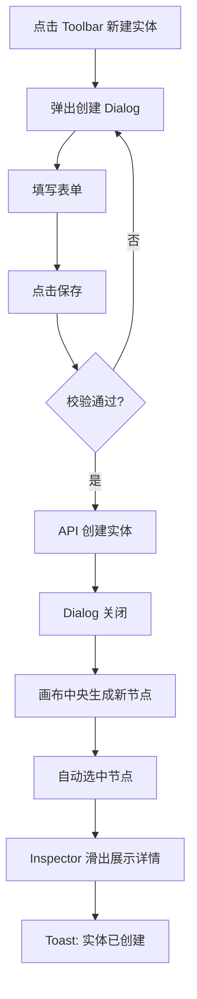
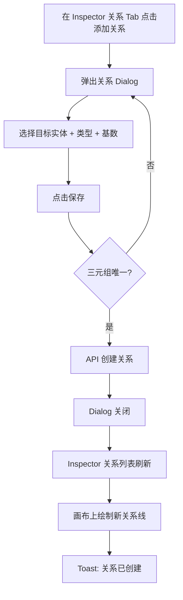
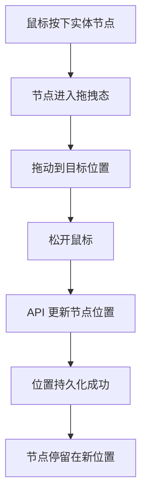
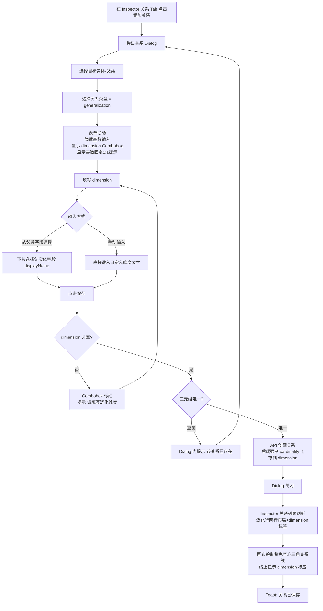
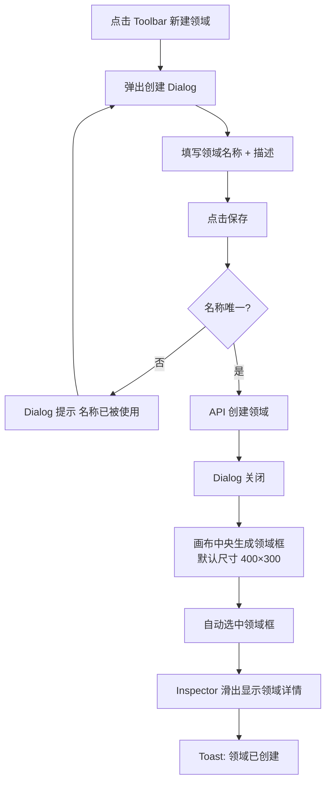
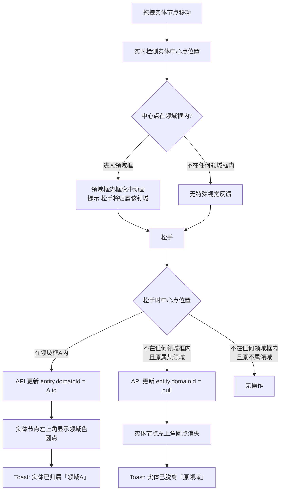
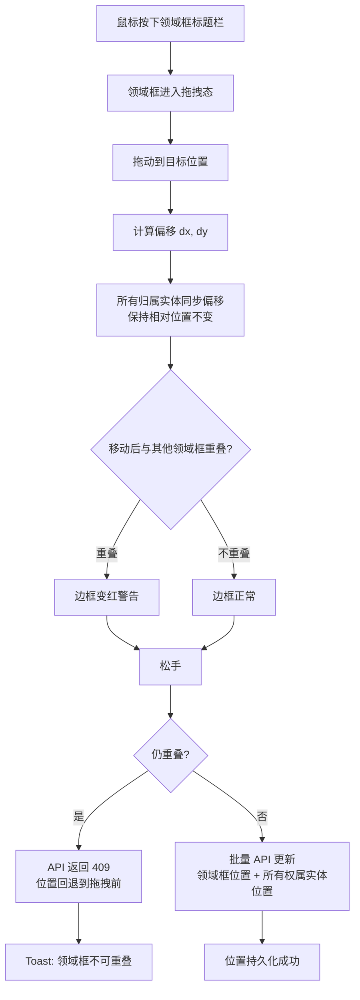

# 领域模型管理 交互设计文档

> **模块**：M2-领域模型管理
> **状态**：draft
> **版本**：v1.4
> **日期**：2026-06-04
> **作者**：AI/PM
> **关联文档**：
>   - PRD → `domain-model-prd.md`
>   - 设计语言 → `docs/04-tech-design/design-language.md`
>   - 技术方案 → `docs/04-tech-design/phase1-design-tech.md#领域模型`

---

## 1. 设计原则与全局约定

### 1.1 设计原则

| # | 原则 | 说明 |
|---|------|------|
| P1 | **可视化优先** | ER 图是核心工作区，所有操作围绕画布展开，列表视图作为辅助 |
| P2 | **上下文保持** | 编辑实体时不离开画布，Inspector 滑出而非 Modal 阻断 |
| P3 | **即时反馈** | 拖拽排序、节点位置调整实时生效，无需手动保存布局 |
| P4 | **渐进披露** | 字段约束配置根据类型动态展示，不一次性暴露全部表单 |

### 1.2 全局交互约定

| 场景 | 交互方式 | 说明 |
|------|---------|------|
| 新建实体 | Dialog（Toolbar 入口）/ Inspector 新建模式（空状态入口） | 见 §3.7 |
| 编辑实体 | Inspector 右滑面板 | 点击画布节点或列表行 |
| 删除实体 | Dialog 二次确认 | 危险操作，需确认 |
| 新建/编辑字段 | Dialog | 表单较复杂，Dialog 更合适 |
| 新建/编辑关系 | Dialog | 在 Inspector 的关系 Tab 中触发 |
| 新建领域 | Dialog（Toolbar 入口） | 见 §3.8 |
| 编辑领域 | Inspector 右滑面板 | 点击领域框或 Inspector 入口 |
| 删除领域 | Dialog 二次确认 | 解除所有实体归属，需确认 |
| 实体归属/脱离领域 | Canvas 拖入/拖出 | 松手即生效，无需额外确认 |
| 保存策略 | 即时保存（Auto-save） | 表单字段失焦或 Dialog 确认时提交 |
| 撤销/重做 | Phase 1 不做 | 通过刷新页面恢复，Phase 2+ 考虑 |
| Toast 反馈 | 右上角，3s 自动消失 | 成功/失败均提示 |

### 1.3 响应式策略

Phase 1 主要适配桌面端（`lg` 以上）。ER 图画布在较小屏幕上允许水平滚动，Inspector 在 `md` 以下变为全屏覆盖。

---

## 2. 页面布局总览

### 2.1 路由与菜单

| 路由 | 菜单项 | 说明 |
|------|--------|------|
| `/p/:projectId/domain-model` | 领域模型 | Sidebar 唯一菜单，图标 `Database`（lucide-react）|

### 2.2 整体布局结构

```
┌─────────────────────────────────────────────────────────────────────┐
│  Header (48px)                                                      │
├─────────┬─────────────────────────────────────────────┬─────────────┤
│         │  Toolbar (48px)                             │             │
│         │  ┌───────────────────────────────────────┐  │             │
│         │  │ [ER图|实体列表] [搜索] [+新建实体] [⊞领域] ⚙ │  │             │
│         │  └───────────────────────────────────────┘  │             │
│ Sidebar │                                             │ Inspector   │
│ 220px   │  Canvas Area (ER 图 / 实体列表)              │ 360px       │
│         │                                             │ (可折叠)     │
│         │  ┌─────────────────────────────┐            │             │
│         │  │ ╔═══════ 订单域 ═════════╗   │            │ 未选中时     │
│         │  │ ║  [实体A] ─────▶ [实体B] ║   │            │ 完全收起     │
│         │  │ ║  ┌────────┐  ┌────────┐║   │            │ (width: 0)  │
│         │  │ ║  │ name   │  │ name   │║   │            │             │
│         │  │ ╚════════════════════════╝   │            │ 选中后滑出   │
│         │  │         [Minimap]            │            │ 宽度 360px  │
│         │  └─────────────────────────────┘            │             │
│         │                                             │             │
└─────────┴─────────────────────────────────────────────┴─────────────┘
```

### 2.3 布局尺寸

| 元素 | 尺寸 | 说明 |
|------|------|------|
| Toolbar 高度 | 48px | 与 Header 同高，紧贴 Header 下方 |
| Toolbar 内边距 | `px-4`（16px） | 左右内边距 |
| Canvas 区域 | `calc(100vh - 48px - 48px)` | 减去 Header + Toolbar |
| Inspector 宽度 | 360px | 展开状态 |
| Inspector 收起 | 0px | 无实体选中时完全收起 |
| Inspector 滑出动画 | 250ms ease-out | 与 Sidebar 展开动画一致 |
| Minimap 尺寸 | 160px × 100px | 右下角，距边缘 16px |

---

## 3. 模块交互设计

### 3.1 顶部工具栏（Toolbar）

#### 3.1.1 元素清单

| 元素 | 类型 | 位置 | 说明 |
|------|------|------|------|
| 视图切换 | Segmented Control | 左侧 | 两个选项："ER 图" / "实体列表"，默认 "ER 图" |
| 搜索框 | Input + Icon | 中间偏左 | 占位符"搜索实体..."，支持 name / display_name 模糊匹配 |
| 搜索清除 | IconButton | 搜索框内右侧 | 有输入内容时显示 `X` 图标，点击清空 |
| 新建实体 | Primary Button | 右侧 | 文字"新建实体" + `Plus` 图标，点击弹出创建 Dialog |
| 新建领域 | Secondary Button | 新建实体右侧 | 文字"新建领域" + `BoxSelect` 图标（lucide-react），点击弹出领域创建 Dialog |
| 画布设置 | IconButton | 新建领域右侧 | `Settings2` 图标（lucide-react），点击向左滑出配置侧边栏 |

#### 3.1.2 视图切换行为

| 从 → 到 | 行为 | 状态保持 |
|---------|------|---------|
| ER 图 → 实体列表 | Canvas 隐藏，列表视图显示；选中实体的 Inspector 保持打开 | 保留当前选中实体 |
| 实体列表 → ER 图 | 列表隐藏，Canvas 显示；列表中的选中实体在画布中高亮 | 保留当前选中实体 |

#### 3.1.3 搜索行为

- **触发时机**：输入后 300ms debounce 自动搜索
- **匹配范围**：实体的 `name` 和 `display_name`（ilike 模糊匹配）
- **ER 图模式下的搜索**：
  - 匹配到的实体节点高亮显示（边框加粗 + 阴影增强）
  - 未匹配的实体节点透明度降至 40%
  - 关系线不受搜索影响，保持原样
- **列表模式下的搜索**：表格实时过滤，只展示匹配行
- **无结果**：显示 Empty State "未找到匹配的实体"
- **清除搜索**：点击 X 或删除全部输入，恢复全部展示

#### 3.1.4 缩放控制行为

| 操作 | 行为 | 范围限制 |
|------|------|---------|
| 点击 `-` | 缩放比例减少 10% | 最小 25% |
| 点击 `+` | 缩放比例增加 10% | 最大 200% |
| 鼠标滚轮 | 以鼠标指针位置为中心缩放 | 同上 |
| 点击"适配画布" | 自动计算 zoom + pan，使所有节点刚好填满视口并居中 | — |
| 双击缩放按钮 | 重置为 100% | — |

#### 3.1.5 画布设置侧边栏（F-M2-05）

点击工具栏"设置"图标按钮，从右侧滑出配置侧边栏（Sheet），覆盖在 Inspector 之上（z-index 更高）。

**侧边栏布局**：

```
┌─────────────────────────────┐
│  画布设置            [✕ 关闭] │  ← 标题行，高度 48px
├─────────────────────────────┤
│                             │
│  显示设置                    │  ← 分组标题（text-xs text-muted-foreground）
│  ┌───────────────────────┐  │
│  │ 展示关系名称        [○] │  │  ← Switch 开关行
│  │ 在关系线中部显示名称  │  │     desc: text-xs text-muted-foreground
│  └───────────────────────┘  │
│                             │
└─────────────────────────────┘
```

**组件规格**：

| 属性 | 值 |
|------|-----|
| 侧边栏宽度 | 280px |
| 动画 | 从右侧滑入，duration 250ms ease-out |
| 触发方式 | 点击 Toolbar 的 `Settings2` 图标按钮 |
| 关闭方式 | 点击 ✕ 按钮 / 点击遮罩层（`Sheet` 组件默认行为）|
| 存储位置 | `localStorage`，key = `canvas-settings-{projectId}` |
| 存储格式 | `{ showRelationLabel: boolean }` |

**"展示关系名称"开关行为**：

| 状态 | 关系线表现 |
|------|-----------|
| 关闭（默认） | 关系线上无常驻标签；Hover 时显示 Tooltip（原有行为） |
| 开启 | 关系线中部显示常驻标签（display_name 优先，无则显示 kind 中文映射）；Hover Tooltip 仍保留 |

---

### 3.2 ER 图可视化画布

#### 3.2.1 画布容器

- 背景色：`--background`（#f5f5f5 亮色 / #141414 暗色）
- 网格线：浅色模式下显示极淡的点状网格（`rgba(0,0,0,0.03)`），暗色模式 `rgba(255,255,255,0.03)`
- 画布可无限平移（pan），无边界限制

#### 3.2.2 实体节点（Entity Node）

##### 节点外观

```
┌──────────────────────────────────┐  ← 标题栏（按 category 染色）
│  📦 订单 (Order)       [core]    │  ← 图标 + display_name + name（灰色）+ category tag
├──────────────────────────────────┤
│  id           string     *       │  ← 字段列表行
│  orderNo      string     *       │    name + field_type + is_required 标记
│  totalAmount  number     *       │
│  status       enum       *       │
│  createdAt    datetime           │
│  ...                             │  ← 超出 6 行时显示 "+3 个字段" 折叠提示
└──────────────────────────────────┘
```

**尺寸与样式**：

| 属性 | 值 | 说明 |
|------|-----|------|
| 节点宽度 | 240px | 固定宽度 |
| 标题栏高度 | 36px | 包含图标、名称、category tag |
| 字段行高 | 28px | 每行一个字段 |
| 最大展示字段数 | 6 行 | 超出显示 "+N 个字段"，点击展开或去 Inspector |
| 节点圆角 | `rounded-card`（8px） | — |
| 节点阴影 | `shadow-card` | 默认态 |
| 节点阴影（选中） | `shadow-hover` | 选中态增强 |
| 标题栏背景 | 按 category 映射 | 见下方颜色表 |
| 节点背景 | `bg-card` | — |
| 字段区背景 | 同节点背景 | — |
| 边框 | 1px solid `border-strong` | 默认态 |
| 边框（选中） | 2px solid `primary` | 选中态 |

**Category 颜色映射**：

| category 值 | 标题栏背景 | 标题栏文字 |
|-------------|-----------|-----------|
| `core` | `#1677ff` | `#ffffff` |
| `supporting` | `#8c8c8c` | `#ffffff` |
| `event` | `#fa8c16` | `#ffffff` |
| 未设置 / 其他 | `#08979c`（主色） | `#ffffff` |

> 注：category 为用户自定义字符串，上述为常见值预设映射。未匹配的值使用默认主色。

**字段行展示规则**：

| 字段 | 展示方式 | 样式 |
|------|---------|------|
| name | 左对齐，等宽字体 | `text-xs text-text-secondary font-mono` |
| display_name | 不展示在节点内（ Inspector 中展示）| — |
| field_type | 右对齐，类型缩写 | `text-xs text-text-tertiary` |
| is_required | `*` 标记在类型旁 | `text-xs text-destructive` |

**类型缩写映射**：

| field_type | 缩写 |
|-----------|------|
| string | str |
| number | num |
| boolean | bool |
| datetime | dt |
| text | text |
| enum | enum |
| email | @ |
| url | url |
| phone | tel |

##### 节点交互

| 交互 | 行为 |
|------|------|
| **Hover** | 节点阴影增强（`shadow-hover`），鼠标变为 `grab` |
| **单击** | 节点边框变为 2px primary 色，右侧滑出 Inspector（实体详情模式） |
| **拖拽** | 鼠标变为 `grabbing`，拖动节点到画布任意位置，松开时保存新位置到数据库 |
| **双击** | 同单击（无特殊行为，避免与双击缩放冲突） |
| **右键** | Phase 1 不做上下文菜单 |

##### 节点选中状态管理

- 同一时间**最多只有一个节点处于选中态**
- 点击画布空白处：取消选中，Inspector 收起
- 从列表视图切换回 ER 图：如果列表中有选中实体，对应节点自动选中并 Inspector 打开

#### 3.2.3 关系线（Edge）

##### 线的外观

| 属性 | association | dependency | aggregation | composition | generalization |
|------|-------------|-----------|-------------|-------------|----------------|
| 线型 | 实线 | 实线 | 虚线（5 3） | 实线 | 实线 |
| 线色 | `#4096ff`（蓝） | `#8c8c8c`（灰） | `#1677ff`（蓝） | `#08979c`（青） | `#722ed1`（紫） |
| 线宽 | 1.5px | 1.5px | 1.5px | 1.5px | 1.5px |
| 末端标记 | 普通箭头 ▶ | 普通箭头 ▶ | 空心菱形 ◇ | 实心菱形 ◆ | 空心三角 △ |
| 标签位置 | 线中部 | 线中部 | 线中部 | 线中部 | 线中部 |
| 基数标注 | 显示 | 显示 | 显示 | 显示 | **不显示**（固定 1:1）|

**末端标记实现方式**：
- `association` / `dependency`：使用 SVG `<marker>` + `orient="auto"` 自动对齐贝塞尔切线方向
- `aggregation`：使用自定义内联 SVG `<defs>` 定义空心菱形（`<polygon>` 填充白色/描边色）
- `composition`：使用自定义内联 SVG `<defs>` 定义实心菱形（`<polygon>` 填充线条色）
- `generalization`：使用自定义内联 SVG `<defs>` 定义空心等腰三角形（`<polygon>` 填充白色/描边紫色）

##### 线上的标签

**基数标注**（常驻显示，不受配置控制）：
- `source_cardinality` 标注在靠近源实体的线段位置（约 22% 处）
- `target_cardinality` 标注在靠近目标实体的线段位置（约 22% 处）
- **generalization 不展示基数标注**（固定 1:1，无需展示）
- 样式：`text-[10px] text-muted-foreground bg-background/80 px-1 rounded`
- 符合 UML 标准：基数标注在靠近约束实体的一端

**generalization 常驻标签**（始终显示，不受 showLabel 开关影响）：
- 单标签格式：`{display_name}(维度：{dimension})`（display_name 优先，否则"泛化"）
- 若 `dimension` 为空，仅显示 `display_name` 或"泛化"
- 样式：紫色主题 `text-[10px] text-purple-600 bg-purple-50 px-1.5 py-0.5 rounded border border-purple-300`
- 示例：`泛化(维度：支付方式)` / `继承(维度：角色类型)`

**非 generalization 常驻标签**（由 F-M2-05 配置控制）：
- 开启"展示关系名称"时，在线中部显示常驻标签
- 内容：`display_name`（如有）优先，否则显示 `relation_kind` 中文映射
- 样式：`text-[10px] bg-background/80 text-foreground px-1.5 py-0.5 rounded border border-border`
- 默认关闭，关闭时不渲染标签元素

**Hover Tooltip**（始终可用，不受配置影响）：
- 中文映射：`association`→"关联"，`dependency`→"依赖"，`aggregation`→"聚合"，`composition`→"组合"，`generalization`→"泛化"
- Tooltip 背景：`bg-card`，边框：1px solid `border`，字号：`text-[11px]`
- Tooltip 位于线段中点，显示：关系名称 + 基数（sourceCardinality : targetCardinality）+ 描述

##### 线交互

| 交互 | 行为 |
|------|------|
| **Hover** | 线宽增至 2.5px，颜色变为主色 `#08979c`。Tooltip 浮出显示：关系类型 + 基数 + 显示名称 + 描述（前 50 字） |
| **单击** | 线高亮（线宽 2.5px + 主色），Inspector 切换为"关系详情模式"——仅显示"关系"选项卡，内容为当前选中的一条关系详情（含编辑/删除按钮） |
| 点击空白处 | 取消线选中 + 实体选中，Inspector 收起 |

**单击关系线后的 Inspector 关系详情模式**：

当用户点击关系线时，Inspector 从右侧滑出，进入"关系详情模式"。此模式与选中实体时的 Inspector 不同——仅显示"关系"选项卡，不显示"基本信息"和"字段"选项卡，内容仅为当前点中的那条关系。

```
┌────────────────────────────────────┐
│  Inspector Header (48px)           │
│  ┌──────────────────────────────┐  │
│  │  关系详情          [X 关闭]   │  │  ← 标题为"关系详情"
│  └──────────────────────────────┘  │
├────────────────────────────────────┤
│  关系选项卡（唯一Tab，不可切换）    │
│  ┌──────────────────────────────┐  │
│  │  依赖: 订单 ──▶ 用户         │  │  ← 关系方向 + 类型 Badge
│  │  基数: [0,1]                 │  │  ← cardinality
│  │  名称: 下单用户              │  │  ← display_name（如有）
│  │  描述: 订单关联到下单用户     │  │  ← description（如有）
│  │                    [✎] [🗑] │  │  ← 编辑/删除按钮
│  └──────────────────────────────┘  │
│                                    │
│  ⚠ 无"添加关系"按钮               │  ← 关系详情模式下不显示添加入口
│                                    │
└────────────────────────────────────┘
```

**关系详情卡片内容**：

| 字段 | 展示方式 | 样式 | 条件 |
|------|---------|------|------|
| 关系方向 | 源实体名 → 目标实体名 | `text-xs font-medium text-foreground` | 始终显示 |
| 关系类型 | Badge（统一 outline 变体） | `variant="outline" text-[10px] px-1.5 py-0`；generalization 加 `border-purple-300 text-purple-600` | 始终显示 |
| 基数 | `sourceCardinality : targetCardinality` 文字 | `text-[11px] text-muted-foreground` | 非 generalization 显示 |
| 泛化维度 | `{dimension}` 标签 | `text-[10px] text-purple-600 bg-purple-50 border border-purple-300 rounded px-1.5` | 仅 generalization 且 dimension 非空时显示 |
| 显示名称 | `display_name`（如有） | `text-[11px] text-muted-foreground` | 非空时显示 |
| 描述 | `description`（如有） | `text-xs text-muted-foreground` | 非空时显示 |
| 编辑按钮 | `Pencil` 图标 | 点击 → 打开 RelationDialog（编辑模式） | 始终显示 |
| 删除按钮 | `Trash2` 图标 | 点击 → 打开 DeleteRelationDialog | 始终显示 |

**互斥规则**：
- 点击关系线 → 取消实体选中，Inspector 切换为关系详情模式
- 点击实体节点 → 取消关系选中，Inspector 切换为实体详情模式
- 点击画布空白 → 同时取消实体选中 + 关系选中，Inspector 收起

**Tooltip 内容格式**：
```
┌─────────────────────────────┐
│  依赖: 订单 ──▶ 用户         │
│  基数: 1 : *                │
│  说明: 订单关联到下单用户     │  ← description，弱样式（同基数）
└─────────────────────────────┘
```

**generalization Tooltip 格式**：
```
┌─────────────────────────────┐
│  泛化: 左通道站 △── 换电站   │
│  维度: 物理结构              │  ← dimension，紫色样式
│  说明: 按物理通道方向分类     │  ← description（如有）
└─────────────────────────────┘
```

说明行仅在 `description` 非空时显示。

#### 3.2.4 领域节点（Domain Node）

##### 节点外观

领域节点在 Canvas 上渲染为带标题栏的半透明矩形框，作为实体的视觉分组容器。

```
╔══════════════════════════════════════╗  ← 标题栏（领域色）
║  ⊞ 订单域                  [3 个实体] ║  ← 图标 + 领域名称 + 实体计数 Badge
╠══════════════════════════════════════╣
║                                      ║
║    ┌────────┐      ┌────────┐       ║  ← 框内实体节点（绝对坐标，视觉上在框内）
║    │ 订单   │─────▶│ 用户   │       ║
║    │ id     │      │ id     │       ║
║    └────────┘      └────────┘       ║
║                                      ║
╚══════════════════════════════════════╝  ← 可拖拽边角/边缘调整尺寸
```

**尺寸与样式**：

| 属性 | 值 | 说明 |
|------|-----|------|
| 标题栏高度 | 36px | 包含图标、名称、操作按钮 |
| 节点圆角 | `rounded-card`（8px） | — |
| 标题栏背景 | `#e6f4ff`（浅蓝） | 领域节点默认色 |
| 标题栏文字 | `#0958d9`（深蓝） | `text-sm font-medium` |
| 框体背景 | `rgba(230, 244, 255, 0.3)` | 半透明，不遮挡实体节点 |
| 框体边框 | 1.5px dashed `#91caff` | 虚线边框，区分实体实线边框 |
| 边框（选中） | 2px solid `#1677ff` | 选中态 |
| 框体阴影 | `shadow-sm` | 默认态 |
| 框体阴影（选中） | `shadow-hover` | 选中态增强 |
| 选中态 | 标题栏背景加深 + 边框变实线蓝色 | 与实体节点选中态视觉对齐 |
| z-index | 低于 EntityNode | 实体节点始终在领域框之上 |
| 最小尺寸 | 240px × 160px | 保证标题栏可读 |
| 默认尺寸 | 400px × 300px | 新建时的默认尺寸 |

**标题栏元素**：

| 元素 | 样式 | 说明 |
|------|------|------|
| 图标 | `BoxSelect`（lucide-react），14px，`#0958d9` | 领域标识图标 |
| 领域名称 | `text-sm font-medium text-[#0958d9]` | 领域的 name |
| 实体计数 Badge | `text-[10px] bg-white/60 px-1.5 rounded` | 如 "3 个实体"，有实体时显示 |

> **设计决策（2026-06-04）**：标题栏编辑/删除按钮已移除。领域的编辑（名称、描述）和删除操作统一通过**单击领域框 → Inspector 右滑面板**操作，与实体的交互模式一致，降低学习成本。

**尺寸调整把手**：

| 位置 | 光标 | 行为 |
|------|------|------|
| 右边缘 | `ew-resize` | 水平拖拽调整宽度 |
| 下边缘 | `ns-resize` | 垂直拖拽调整高度 |
| 右下角 | `nwse-resize` | 同时调整宽高 |
| 其他边缘/角 | 对应 resize 光标 | 对应方向调整 |

拖拽把手为 8px 宽的透明热区，hover 时变为 `border-strong` 色细线提示。

##### 节点交互

| 交互 | 行为 |
|------|------|
| **Hover** | 标题栏显示编辑/删除按钮；边框颜色加深；阴影增强 |
| **单击标题栏** | 领域框选中（边框变 2px 实线蓝色），Inspector 滑出显示领域详情 |
| **拖拽标题栏** | 移动领域框位置；内部所有归属实体同步偏移（保持相对位置），松手后批量更新位置 |
| **拖拽边缘/角** | 调整领域框尺寸；实时检测是否与其他领域框重叠，重叠时边框变红警告 |
| **单击框内空白处** | 不触发领域选中（事件穿透）；点击到实体则选中实体 |
| **双击** | 同单击（无特殊行为） |
| **右键** | Phase 1 不做上下文菜单 |

##### 领域框选中与实体选中关系

- 点击领域框标题栏 → 选中领域，Inspector 显示领域详情模式
- 点击框内实体节点 → 选中实体，取消领域选中，Inspector 显示实体详情模式
- 点击关系线 → 取消领域选中，Inspector 显示关系详情模式
- 点击画布空白 → 同时取消领域/实体/关系选中，Inspector 收起

##### 实体拖入/拖出领域框

**拖入流程**（松手即归属）：

1. 用户拖拽实体节点移动
2. 拖拽过程中实时检测实体中心点是否处于某个领域框矩形范围内
3. 如果进入领域框范围 → 领域框边框高亮（蓝色脉冲动画），提示"松手将归属该领域"
4. 松手时：
   - 实体中心点在领域框内 → 调用 API 更新 `entity.domainId = domain.id`，Toast "实体已归属「{领域名称}」"
   - 实体中心点不在任何领域框内 → 如果实体原属某领域，调用 API 更新 `entity.domainId = null`，Toast "实体已脱离「{原领域名称}」"
   - 实体中心点不在任何领域框内且原不属任何领域 → 无操作

**视觉反馈**：

| 状态 | 领域框表现 | 实体表现 |
|------|-----------|---------|
| 拖拽实体进入领域框 | 边框蓝色脉冲动画 + 标题栏高亮 | — |
| 拖拽实体离开领域框（原属该领域） | 边框恢复默认 | — |
| 实体已归属领域 | — | 节点左上角显示领域色小圆点（8px） |
| 实体不属任何领域 | — | 无领域标记 |

**互斥规则**：
- 一个实体同时只能在一个领域框范围内松手 → 归属最后松手时的领域
- 领域框不可重叠 → 不存在"同时处于两个领域框内"的情况

##### 领域框移动联动

拖动领域框时，所有归属该领域的实体节点同步偏移：

1. 领域框拖拽开始 → 记录起始位置 (startX, startY)
2. 拖拽过程中 → 计算 dx = currentX - startX, dy = currentY - startY
3. 所有 `domainId === 该领域.id` 的实体节点位置同步 +dx, +dy
4. 松手 → 批量调用实体位置更新 API + 领域框位置更新 API
5. 非该领域的实体节点不受影响

**关键实现要点**：
- 联动移动过程中，实体的绝对坐标在变化，但与领域框的相对位置不变
- 拖拽过程中纯前端状态更新，松手时才提交 API
- 如果领域框移动后导致与其他领域框重叠 → 拖拽时实时检测，边框变红警告；松手时如果仍重叠则 API 返回 409，位置回退

#### 3.2.5 画布导航

| 操作 | 行为 |
|------|------|
| 鼠标拖拽空白处 | 平移画布（pan） |
| 鼠标滚轮 | 以指针位置为中心缩放 |
| 点击 Minimap | 跳转到对应区域 |
| 点击"适配画布" | 自动调整 zoom + pan 使所有节点可见并居中 |

#### 3.2.6 小地图（Minimap）

- 位置：画布右下角，距右边缘 16px，距下边缘 16px
- 尺寸：160px × 100px
- 节点映射：实体节点在 Minimap 中以缩略矩形展示，使用与画布相同的 category 颜色
- 领域框映射：领域框在 Minimap 中以虚线矩形展示，使用领域色（浅蓝）
- 关系线：Minimap 中不展示关系线，只展示节点位置
- 视口框：半透明矩形框表示当前可见区域，可拖拽调整位置
- 圆角：`rounded-card`
- 背景：`bg-card`，边框 1px solid `border`

#### 3.2.7 空状态

当项目内无任何实体时，画布中央显示：

```
┌──────────────────────────────────────┐
│                                      │
│            [Database 图标 64px]       │
│               color: text-disabled    │
│                                      │
│          暂无领域实体                 │
│      color: text-secondary 14px      │
│                                      │
│    创建实体来定义你的业务数据模型      │
│      color: text-tertiary 13px       │
│                                      │
│      [+ 创建第一个实体]               │
│       Primary Button                 │
│                                      │
└──────────────────────────────────────┘
```

点击"创建第一个实体"：右侧滑出 Inspector（新建模式），展示实体创建表单。

---

### 3.3 实体列表视图

#### 3.3.1 切换入口

Toolbar 的 Segmented Control 点击"实体列表"后，Canvas 区域切换为列表视图。

#### 3.3.2 列表表格

| 列名 | 字段 | 宽度 | 说明 |
|------|------|------|------|
| 名称 | `name` | 120px | 等宽字体，可点击选中 |
| 显示名称 | `display_name` | auto | 左对齐 |
| 分类 | `category` | 80px | Tag 样式展示 |
| 字段数 | fields.length | 80px | 数字，居中 |
| 关系数 | relations.length | 80px | 数字，居中 |
| 操作 | — | 120px | 编辑 / 删除 图标按钮 |

**行交互**：
- 单击行：选中该实体，高亮当前行（`bg-primary-bg`），右侧滑出 Inspector
- 双击行：同单击
- Hover 行：`bg-fill`

**操作列**：
- 编辑图标（`Pencil`，text-primary）：点击打开 Inspector（同单击行）
- 删除图标（`Trash2`，text-destructive）：点击弹出删除确认 Dialog

#### 3.3.3 分页与搜索

- 分页器固定在表格下方
- 搜索与 Toolbar 的搜索框共享状态和值（在两个视图间切换时搜索词保持不变）
- 列表模式下的搜索即时过滤表格内容

---

### 3.4 实体详情 Inspector

#### 3.4.1 面板结构

Inspector 从右侧滑出，宽度 360px，高度 100%（从 Toolbar 下方到底部）。

```
┌────────────────────────────────────┐
│  Inspector Header (48px)           │
│  ┌──────────────────────────────┐  │
│  │  📦 订单          [X 关闭]   │  │
│  └──────────────────────────────┘  │
├────────────────────────────────────┤
│  Tab 栏                             │
│  [基本信息] [字段(8)] [关系(3)]     │
├────────────────────────────────────┤
│                                    │
│  Tab 内容区（滚动区域）              │
│                                    │
└────────────────────────────────────┘
```

**Header**：
- 左侧：实体类型图标 + display_name（16px semibold）
- 右侧：`X` 关闭按钮（IconButton），点击后 Inspector 收起，画布中节点取消选中

**Tab 栏**：
- 三个 Tab："基本信息" / "字段(N)" / "关系(M)"，N/M 为当前数量
- 默认激活"基本信息"Tab
- Tab 切换不触发网络请求（数据已在实体详情查询中返回）

#### 3.4.2 基本信息 Tab

展示实体的可编辑字段：

| 字段 | 组件 | 说明 |
|------|------|------|
| 名称（name） | Input（只读） | 编程标识符，创建后不可修改 |
| 显示名称 | Input | 必填，1-128 字符 |
| 描述 | Textarea | 可选，0-512 字符，3 行高度 |
| 分类 | Input | 可选，0-64 字符 |
| 排序权重 | NumberInput | ≥0，整数 |

**操作按钮**：
- 底部固定"保存"（Primary）+ "取消"按钮
- 修改任意字段后自动启用保存按钮（表单有校验通过才启用）
- 取消时如果有未保存修改，弹出确认 Dialog

#### 3.4.3 字段 Tab

##### 字段列表

```
┌────────────────────────────────────┐
│  [+ 添加字段]  （Primary Button）   │
├────────────────────────────────────┤
│  ≡  id          string      *  ✏️ 🗑│  ← 拖拽把手 ≡
│  ────────────────────────────────  │
│  ≡  orderNo     string      *  ✏️ 🗑│
│  ────────────────────────────────  │
│  ≡  totalAmount number         ✏️ 🗑│
│  ────────────────────────────────  │
│  ≡  status      enum        *  ✏️ 🗑│
└────────────────────────────────────┘
```

**字段行结构**：
- 左侧：拖拽把手 `GripVertical`（`text-text-tertiary`，12px）
- 中间：字段 name（等宽字体）+ field_type（Tag 样式）+ is_required 标记
- 右侧：编辑图标 `Pencil` + 删除图标 `Trash2`

**拖拽排序行为**：
- 按住拖拽把手拖动整行，行位置实时交换
- 松开鼠标后，自动调用 batch reorder API 保存新顺序
- 排序过程中显示半透明占位符指示目标位置
- 排序成功后 Toast 提示"字段顺序已更新"

**编辑字段**：点击编辑图标 → 弹出字段编辑 Dialog
**删除字段**：点击删除图标 → 弹出删除确认 Dialog

##### 空状态

无字段时显示："暂无字段，点击上方按钮添加"

#### 3.4.4 关系 Tab

##### 关系列表

```
┌────────────────────────────────────┐
│  [+ 添加关系]  （Primary Button）   │
├────────────────────────────────────┤
│  依赖: 订单 ──▶ 用户   [0,1]  ✏️ 🗑│
│  ────────────────────────────────  │
│  聚合: 订单 ──▶ 商品      *  ✏️ 🗑│
│  ────────────────────────────────  │
│  组合: 订单 ──▶ 物流      1  ✏️ 🗑│
│  ────────────────────────────────  │
│  泛化: 左通道站 △─▷ 换电站          │
│        [物理结构]          ✏️ 🗑│  ← 第二行显示 dimension，无基数
└────────────────────────────────────┘
```

**关系行结构（通用）**：
- 左侧：关系类型中文 + 源实体名 + 箭头符号 + 目标实体名
- 中间：sourceCardinality : targetCardinality
- 右侧：编辑图标 + 删除图标

**泛化关系行结构（特殊）**：

泛化关系行采用**两行布局**，以突显 dimension 信息：

```
行1: [泛化类型 Badge]  子类名 △─▷ 父类名                   ✏️ 🗑
行2:                   [dimension 标签]
```

| 元素 | 样式 | 说明 |
|------|------|------|
| 关系类型 Badge | `variant="outline"` 紫色边框，文字"泛化" | 替代普通文字标签 |
| 箭头符号 | `△─▷`（空心三角）| 区别于其他关系的实心箭头 |
| dimension 标签 | `[物理结构]`，`text-xs text-purple-600 bg-purple-50 px-1.5 rounded` | 第二行左对齐，与第一行 source 实体名对齐 |
| 基数 | **不显示** | generalization 基数固定 1:1，无需展示 |

> **为何使用两行布局**：dimension 是泛化关系的核心语义信息，与其他关系的"基数"处于同等地位。两行布局在视觉上给予 dimension 足够的展示空间，且与其他关系行形成清晰的视觉区分。

**编辑关系**：点击编辑图标 → 弹出关系编辑 Dialog
**删除关系**：点击删除图标 → 弹出删除确认 Dialog

##### 添加关系

点击"添加关系"→ 弹出关系创建 Dialog（见 §3.6）

##### 空状态

无关系时显示："暂无关系，点击上方按钮添加"

---

### 3.5 字段管理交互

#### 3.5.1 字段创建 / 编辑 Dialog

字段的创建和编辑使用同一个 Dialog 组件，创建时部分字段为空，编辑时回填。

**Dialog 尺寸**：宽度 480px（`md` 尺寸）

**表单字段**：

| 字段 | 组件 | 必填 | 说明 |
|------|------|:----:|------|
| 名称 | Input | ✅ | 编程标识符，实体内唯一 |
| 显示名称 | Input | ✅ | 1-128 字符 |
| 描述 | Textarea | — | 0-512 字符 |
| 字段类型 | Select | ✅ | 下拉选择 9 种类型 |
| 是否必填 | Switch | — | 默认关闭 |
| 默认值 | 动态组件 | — | 根据字段类型变化 |
| 约束配置 | 动态表单 | — | 根据字段类型变化，见下方 |

#### 3.5.2 类型切换时的动态表单

当"字段类型"改变时，下方"约束配置"区域实时切换为对应类型的配置表单。

**string 类型约束**：
- minLength：NumberInput（≥0）
- maxLength：NumberInput（≥0）
- pattern：Input（正则表达式字符串）

**number 类型约束**：
- min：NumberInput
- max：NumberInput
- integer：Switch（是否仅整数）
- precision：NumberInput（小数精度，1-10）

**boolean 类型约束**：
- 无额外约束，显示"无可用约束配置"

**datetime 类型约束**：
- format：Select（可选：YYYY-MM-DD / YYYY-MM-DD HH:mm:ss / ISO8601）

**text 类型约束**：
- minLength：NumberInput
- maxLength：NumberInput

**enum 类型约束**：
- options：动态表格，每行一个选项
  - value：Input（枚举值，编程标识符）
  - label：Input（展示标签）
  - 每行右侧：删除按钮
  - 底部："+ 添加选项"按钮

**email 类型约束**：
- 无额外约束

**url 类型约束**：
- protocols：MultiSelect（可选：http / https / ftp）

**phone 类型约束**：
- region：Select（国家/地区码，如 CN / US / JP）

#### 3.5.3 默认值与字段类型的联动

| 字段类型 | 默认值组件 |
|----------|-----------|
| string | Input |
| number | NumberInput |
| boolean | Switch |
| datetime | DateTimePicker（Phase 1 如无前端组件可用 Input 替代）|
| text | Textarea |
| enum | Select（从 options 中选择）|
| email | Input（type="email"）|
| url | Input（type="url"）|
| phone | Input（type="tel"）|

**联动规则**：当 is_required=true 时，默认值字段标签旁显示"建议设置默认值"。

#### 3.5.4 表单校验与提交

- 实时校验：字段失焦时校验该字段
- 提交校验：点击保存时全量校验
- 错误展示：字段下方红色提示文字，`text-sm text-destructive`
- 保存成功：Dialog 关闭，Toast "字段已保存"，Inspector 中字段列表刷新
- 名称重复：后端返回 409，Dialog 内展示错误"该字段名称已被使用"

---

### 3.6 关系管理交互

#### 3.6.1 关系创建 / 编辑 Dialog

**Dialog 尺寸**：宽度 480px

**表单字段**：

| 字段 | 组件 | 必填 | 条件 | 说明 |
|------|------|:----:|------|------|
| 源实体 | Display | — | 始终显示 | 当前实体，只读展示 |
| 目标实体 | Select | ✅ | 始终显示 | 下拉选择项目内其他实体（含自身，支持自引用）|
| 关系类型 | Select | ✅ | 始终显示 | 5 种类型，带图标和说明 |
| 泛化维度 | Combobox | ✅ | 仅 generalization | 支持从父实体字段 displayName 中选择，或手动输入自定义文本 |
| 源端基数 | Input + 预设快选 | — | 非 generalization | 标签格式 `源端基数 — {源实体显示名}`；generalization 时隐藏并自动设为 1 |
| 目标端基数 | Input + 预设快选 | — | 非 generalization | 标签格式 `目标端基数 — {目标实体显示名}`；generalization 时隐藏并自动设为 1 |
| 显示名称 | Input | — | 始终显示 | 0-128 字符，如"包含"、"属于" |
| 描述 | Textarea | — | 始终显示 | 0-512 字符 |

**关系类型选择器**：

Select 下拉中每个选项包含：
- 图标：association→实线箭头，dependency→灰色箭头，aggregation→空心菱形，composition→实心菱形，generalization→空心三角
- 中文名称 + 英文名称
- 一行说明文字（caption 样式）

```
┌──────────────────────────────────┐
│  → 关联 (association)             │
│    A 持久引用 B，无从属关系         │
│  ▶ 依赖 (dependency)              │
│    A 临时使用 B，无持久引用         │
│  ◇ 聚合 (aggregation)             │
│    A 包含 B，B 可独立存在          │
│  ◆ 组合 (composition)             │
│    A 包含 B，B 随 A 消亡           │
│  △ 泛化 (generalization)          │
│    A 是 B 的子类型（is-a）         │
└──────────────────────────────────┘
```

**选择 generalization 后的表单变化**：

```
选择 generalization 前:                选择 generalization 后:
┌───────────────────────────────┐      ┌───────────────────────────────┐
│  目标实体  [换电站      ▼]    │      │  目标实体  [换电站      ▼]    │
│  关系类型  [泛化       ▼]    │      │  关系类型  [泛化       ▼]    │
│  源端基数  [1    ] 1 * [0,1] │      │  泛化维度  [物理结构  ▼] ✎  │ ← 新增，必填
│  目标端基数[*    ] 1 * [1,*] │      │  ┌ 提示: 基数固定为 1:1 ────┐ │ ← 基数隐藏，提示代替
│  显示名称  [____________]    │      │  └──────────────────────────┘ │
│  描述      [____________]    │      │  显示名称  [____________]    │
└───────────────────────────────┘      │  描述      [____________]    │
                                       └───────────────────────────────┘
```

**泛化维度（dimension）Combobox 行为**：
- 组件类型：Combobox（既可下拉选择，也可手动输入）
- 下拉列表来源：目标实体（parent 实体）的所有字段的 `display_name`，如 `["通道方向", "充换电能力", "站型规格", ...]`
- 用户选择后自动填入 Input；也可忽略下拉，直接键入任意文本
- placeholder：`选择或输入泛化维度...`
- 校验：非空，1-128 字符
- 当目标实体改变时，下拉列表自动更新为新目标实体的字段列表

**基数选择器**：

源端基数和目标端基数的 Label 均附带对应实体显示名（如"源端基数 — 产品"、"目标端基数 — 订单"），让用户明确基数约束的主体。

输入方式为 **Input + 预设快选**：
- Input 支持手动输入任意符合格式的基数值
- Input 下方显示一行预设快选按钮（chip 样式）：`1`、`*`、`[0,1]`、`[1,*]`，点击直接填入 Input
- 若当前值匹配某个预设，该预设按钮高亮

**格式校验**（前端 + 后端双重校验）：

合法格式：`*` | 正整数（如 `1`、`3`） | `[n,m]`（n ≤ m，m 可为 `*`）| `[n,]`（至少 n 个）

| 输入 | 合法？ | 说明 |
|------|:------:|------|
| `*` | ✅ | 零或多个 |
| `1` | ✅ | 恰好一个 |
| `3` | ✅ | 恰好三个 |
| `[0,1]` | ✅ | 零或一个 |
| `[1,*]` | ✅ | 一个或多个 |
| `[2,5]` | ✅ | 2 到 5 个 |
| `[3,]` | ✅ | 至少 3 个 |
| `abc` | ❌ | 非法字符 |
| `[5,3]` | ❌ | n > m |
| `0` | ✅ | 零个 |

前端校验时机：Input blur 时 + 提交前。校验失败时 Input 边框变红，下方显示"基数格式无效"提示文字。后端校验作为兜底，返回 400。

#### 3.6.2 表单校验

**通用校验**：
- 目标实体不能与源实体相同项目外（Select 已过滤，但后端仍需校验）
- 同一项目内 (source, target, kind) 三元组唯一：后端返回 409，Dialog 内展示"该关系已存在"

**generalization 特殊校验**：

| 场景 | 前端行为 | 错误提示位置 |
|------|---------|------------|
| dimension 为空时点击保存 | 阻止提交，dimension Combobox 边框变红 | Combobox 下方显示"请填写泛化维度" |
| dimension 超过 128 字符 | 实时截断或 blur 时提示 | Combobox 下方显示"维度名称不超过 128 字符" |
| 后端返回 422（dimension 缺失） | Dialog 内顶部 Banner 展示错误 | "泛化维度不能为空" |

**dimension 字段的条件显隐**：

```
relation_kind 改变时：
  if kind === 'generalization':
    显示 dimension Combobox（必填）
    隐藏源端基数 + 目标端基数
    显示"基数固定为 1:1"提示文本
  else:
    隐藏 dimension Combobox
    显示源端基数 + 目标端基数
    清空 dimension 字段值（静默）
```

切换回非 generalization 类型时，dimension 值**静默清空**，不提示用户。

#### 3.6.3 提交行为

- 保存成功：Dialog 关闭，Toast "关系已保存"
- ER 图模式下：如果目标实体已在画布中，自动绘制新的关系线（generalization 使用紫色空心三角线）
- 列表模式下：无视觉变化（关系不在列表视图中展示）

---

### 3.7 新建实体交互

#### 3.7.1 入口

| 入口 | 触发方式 | 容器 |
|------|---------|------|
| Toolbar "新建实体"按钮 | 点击 | Dialog |
| 画布空状态"创建第一个实体" | 点击 | Inspector 新建模式 |

#### 3.7.2 新建实体 Dialog

**Dialog 尺寸**：宽度 480px

**表单字段**：

| 字段 | 组件 | 必填 | 说明 |
|------|------|:----:|------|
| 名称 | Input | ✅ | 编程标识符，项目内唯一 |
| 显示名称 | Input | ✅ | 1-128 字符 |
| 描述 | Textarea | — | 0-512 字符 |
| 分类 | Input | — | 0-64 字符，可留空 |

**提交后行为**：
- 成功：Dialog 关闭，Toast "实体已创建"
- ER 图模式：新实体自动出现在画布中央（position: 视口中心坐标），并自动选中、Inspector 打开
- 列表模式：新实体出现在列表顶部，自动选中

#### 3.7.3 Inspector 新建模式

空状态下点击"创建第一个实体"，Inspector 从右侧滑出，展示与 Dialog 相同的表单。

**与 Dialog 的区别**：
- 容器是 Inspector 而非 Dialog
- 提交成功后 Inspector 不关闭，而是自动切换为"实体详情模式"（展示刚创建的实体）
- 画布空状态消失，新实体节点出现在画布中央

---

### 3.8 领域管理交互

#### 3.8.1 入口

| 入口 | 触发方式 | 容器 |
|------|---------|------|
| Toolbar "新建领域"按钮 | 点击 | Dialog |
| 画布领域框 | 单击框体 | Inspector（基本信息 Tab 提供编辑/删除） |

> **设计决策（v1.4）**：领域框标题栏不设编辑/删除快捷按钮。单击领域框即可打开 Inspector，在 Inspector 的基本信息 Tab 中完成名称/描述编辑及删除操作，与实体节点的交互模式保持一致。

#### 3.8.2 新建领域 Dialog

**Dialog 尺寸**：宽度 480px

**表单字段**：

| 字段 | 组件 | 必填 | 说明 |
|------|------|:----:|------|
| 领域名称 | Input | ✅ | 项目内唯一，1-128 字符 |
| 描述 | Textarea | — | 0-512 字符，3 行高度 |

**提交后行为**：
- 成功：Dialog 关闭，Toast "领域已创建"
- ER 图模式：新领域框自动出现在画布中央（position: 视口中心坐标，默认尺寸 400×300），并自动选中、Inspector 打开
- 列表模式：无视觉变化（领域不在列表视图中展示）

#### 3.8.3 领域详情 Inspector

点击领域框标题栏后，Inspector 从右侧滑出，进入"领域详情模式"。

```
┌────────────────────────────────────┐
│  Inspector Header (48px)           │
│  ┌──────────────────────────────┐  │
│  │  ⊞ 订单域          [X 关闭]   │  │  ← 图标 + 领域名称
│  └──────────────────────────────┘  │
├────────────────────────────────────┤
│  Tab 栏                             │
│  [基本信息] [实体(3)]               │  ← 两个 Tab
├────────────────────────────────────┤
│                                    │
│  Tab 内容区（滚动区域）              │
│                                    │
└────────────────────────────────────┘
```

**基本信息 Tab**：

| 字段 | 组件 | 说明 |
|------|------|------|
| 领域名称 | Input | 必填，项目内唯一 |
| 描述 | Textarea | 可选，3 行高度 |
| 画布位置 | 只读展示 | "X: 100, Y: 200, 宽: 400, 高: 300" |

**实体 Tab**：

展示归属此领域的实体列表（只读）：

```
┌────────────────────────────────────┐
│  归属实体 (3)                       │
├────────────────────────────────────┤
│  📦 订单                  [core]   │  ← 点击跳转选中该实体
│  ────────────────────────────────  │
│  📦 订单明细              [core]   │
│  ────────────────────────────────  │
│  📦 退款                  [event]  │
└────────────────────────────────────┘
```

- 每行显示实体图标 + display_name + category tag
- 点击某行 → 切换为选中该实体，Inspector 切换为实体详情模式
- 底部显示"在画布中拖入实体以添加归属"提示文字（text-xs text-muted-foreground）

**操作按钮**：
- 底部固定"保存"（Primary）+ "取消"按钮
- 修改任意字段后自动启用保存按钮

#### 3.8.4 删除领域 Dialog

| 属性 | 值 |
|------|-----|
| Dialog 标题 | 删除领域 |
| 内容 | "删除领域「{name}」后，归属该领域的 {N} 个实体将解除归属关系，实体不会被删除。此操作不可撤销。" |
| 按钮 | 取消 / 删除（Danger） |

删除成功后：
- 领域框从画布消失
- 原归属实体的左上角领域色圆点消失
- Toast "领域已删除"
- Inspector 收起

#### 3.8.5 实体节点领域归属标记

归属领域的实体节点左上角显示领域色小圆点：

```
┌─●──────────────────────────────────┐  ← ● 为领域色圆点（8px）
│  📦 订单 (Order)       [core]       │
├──────────────────────────────────┤
│  id           string     *         │
│  orderNo      string     *         │
└──────────────────────────────────┘
```

| 属性 | 值 |
|------|-----|
| 圆点尺寸 | 8px × 8px |
| 圆点位置 | 节点左上角，距左边缘 4px，距上边缘 4px |
| 圆点颜色 | 与领域框标题栏色一致（`#0958d9`） |
| 不属领域 | 不显示圆点 |

---

## 4. AI-系统交互规格

### 4.1 语义层数据绑定

领域模型编辑器中，所有 UI 元素需绑定语义层标识，确保 AI 可消费：

| UI 元素 | 语义标识 | 数据绑定 |
|---------|---------|---------|
| 实体节点 | `semantic-type="entity"` `data-entity-id` | 实体完整 JSON |
| 字段行 | `semantic-type="field"` `data-field-id` | 字段完整 JSON |
| 关系线 | `semantic-type="relation"` `data-relation-id` | 关系完整 JSON |
| 领域框 | `semantic-type="domain"` `data-domain-id` | 领域完整 JSON + 归属实体 ID 列表 |
| 画布容器 | `semantic-type="er-canvas"` | 当前可见的 nodes + edges + domains |

### 4.2 面向 AI 的交互输出格式

当 AI Agent 需要消费当前领域模型状态时，前端提供以下结构化输出：

```typescript
interface AISemanticOutput {
  // 当前视图模式
  viewMode: 'graph' | 'list';

  // 当前选中的对象
  selection?: {
    type: 'entity' | 'relation' | 'domain';
    id: string;
  };

  // 项目级全量领域模型（当 AI 请求全量时）
  domainModel?: {
    domains: DomainBoundary[];     // 领域边界列表
    entities: Entity[];
    relations: Relation[];
  };

  // 实体级局部模型（当某个实体被选中时）
  selectedEntity?: Entity & {
    domainId?: string;             // 归属的领域 ID
    fields: Field[];
    inboundRelations: Relation[];  // 作为 target 的关系
    outboundRelations: Relation[]; // 作为 source 的关系
  };

  // 领域级模型（当某个领域被选中时）
  selectedDomain?: DomainBoundary & {
    entities: Entity[];            // 归属此领域的实体列表
  };

  // ER 图可视化状态（仅 graph 模式）
  graphState?: {
    viewport: { x: number; y: number; zoom: number };
    visibleNodeIds: string[];
    visibleDomainIds: string[];
  };
}
```

### 4.3 AI 可执行的操作接口

AI Agent 通过结构化指令可执行以下操作：

| 操作 | 指令格式 | 前端行为 |
|------|---------|---------|
| 创建实体 | `{ action: 'createEntity', data: {...} }` | 调用 API，成功后刷新画布/列表 |
| 更新实体 | `{ action: 'updateEntity', entityId, data: {...} }` | 调用 API，Inspector 中刷新 |
| 删除实体 | `{ action: 'deleteEntity', entityId }` | 弹出确认 Dialog，用户确认后执行 |
| 创建字段 | `{ action: 'createField', entityId, data: {...} }` | 打开字段 Dialog 并预填，或自动提交 |
| 创建关系 | `{ action: 'createRelation', data: {...} }` | 打开关系 Dialog 并预填，或自动提交 |
| 创建领域 | `{ action: 'createDomain', data: {...} }` | 调用 API，成功后画布中央生成领域框 |
| 更新领域 | `{ action: 'updateDomain', domainId, data: {...} }` | 调用 API，Inspector 中刷新 |
| 删除领域 | `{ action: 'deleteDomain', domainId }` | 弹出确认 Dialog，用户确认后执行 |
| 实体归属领域 | `{ action: 'assignEntityToDomain', entityId, domainId }` | 调用 API 更新 entity.domainId |
| 实体脱离领域 | `{ action: 'unassignEntityFromDomain', entityId }` | 调用 API 置 null entity.domainId |
| 选中实体 | `{ action: 'selectEntity', entityId }` | 画布中定位到该实体并选中，Inspector 打开 |
| 选中领域 | `{ action: 'selectDomain', domainId }` | 画布中定位到该领域框并选中，Inspector 打开 |
| 切换视图 | `{ action: 'switchView', mode: 'graph' | 'list' }` | 切换 Toolbar 视图 |

---

## 5. 交互状态与异常处理

### 5.1 加载状态

| 场景 | 加载方式 | 说明 |
|------|---------|------|
| 页面初始化 | 全屏 Skeleton | Sidebar + Toolbar 骨架屏，Canvas 区域显示旋转 Loading |
| 实体详情查询 | Inspector 内 Spin | Inspector 滑出后内容区显示 Loading Spinner |
| 保存操作 | Button Loading | 保存按钮变为 Loading 态，禁用表单 |
| ER 图数据查询 | Canvas 内 Spin | 画布中央显示 Loading，保留已有节点 |

### 5.2 空状态

| 场景 | 展示内容 | 操作入口 |
|------|---------|---------|
| 画布无实体 | 中央大 Empty State | "创建第一个实体" → Inspector 新建模式 |
| 实体无字段 | Inspector 字段 Tab 内小 Empty State | "+ 添加字段"按钮 |
| 实体无关系 | Inspector 关系 Tab 内小 Empty State | "+ 添加关系"按钮 |
| 领域无实体 | Inspector 实体 Tab 内小 Empty State | "在画布中拖入实体以添加归属" |
| 搜索无结果 | Canvas/列表内 Empty State | 清除搜索 |

### 5.3 错误处理

| 场景 | 展示方式 | 恢复操作 |
|------|---------|---------|
| API 请求失败 | Toast Error + 控制台日志 | 用户重试或刷新页面 |
| 表单校验失败 | 字段下方红色提示 | 修正后重新提交 |
| 并发冲突（409） | Dialog/Toast 内展示具体错误 | 修改名称或关系后重试 |
| 网络断开 | 顶部 Banner 提示"网络异常" | 恢复后自动重试 |

### 5.4 确认 Dialog

| 操作 | Dialog 标题 | 内容 | 按钮 |
|------|------------|------|------|
| 删除实体 | 删除实体 | "删除实体将同时删除其所有字段和关系，此操作不可撤销。" | 取消 / 删除（Danger） |
| 删除字段 | 删除字段 | "确定删除字段 [name] 吗？" | 取消 / 删除（Danger） |
| 删除关系 | 删除关系 | "确定删除该关系吗？" | 取消 / 删除（Danger） |
| 删除领域 | 删除领域 | "删除领域「{name}」后，归属该领域的 {N} 个实体将解除归属关系，实体不会被删除。此操作不可撤销。" | 取消 / 删除（Danger） |
| 未保存离开 | 未保存的修改 | "有未保存的修改，确定要放弃吗？" | 取消 / 放弃 |

---

## 6. 组件清单

| 组件名 | 来源 | 用途 | 定制点 |
|--------|------|------|--------|
| SegmentedControl | shadcn / 自定义 | Toolbar 视图切换 | — |
| Input | shadcn | 搜索框、表单输入 | 高度 32px，rounded-input |
| Dialog | shadcn | 新建/编辑/删除确认 | rounded-dialog，shadow-dialog |
| Select | shadcn | 类型选择、实体选择 | — |
| Combobox | shadcn (Command + Popover) | dimension 泛化维度输入 | 同时支持下拉选择和自由输入 |
| Switch | shadcn | 是否必填、是否整数 | — |
| Textarea | shadcn | 描述输入 | 3 行默认高度 |
| Button | shadcn | 各类按钮 | 按 design-language.md 规范 |
| Table | shadcn | 实体列表 | 按 design-language.md 表格规范 |
| Tag / Badge | shadcn | category、field_type、relation_kind | 按状态色规范；generalization 使用紫色 |
| EmptyState | 自定义 | 各类空状态 | 图标 64px + 标题 + 描述 |
| Inspector | 自定义 | 右滑详情面板 | 宽度 360px，滑出动画 |
| EntityNode | ReactFlow + 自定义 | ER 图实体节点 | 字段列表、category 染色、领域归属圆点 |
| DomainNode | ReactFlow + 自定义 | ER 图领域框节点 | 半透明矩形框、标题栏、尺寸调整把手、拖拽联动 |
| RelationEdge | ReactFlow + 自定义 | ER 图关系线 | 不同 marker + 标签；generalization 空心三角 + dimension 标签 |
| Minimap | ReactFlow 自带 | 画布小地图 | 节点颜色映射 |
| FieldConstraintsForm | 自定义 | 动态约束配置 | 9 种类型的条件渲染 |
| EnumOptionsEditor | 自定义 | 枚举选项编辑 | 动态增删行 |
| DraggableFieldList | dnd-kit + 自定义 | 字段拖拽排序 | 拖拽把手 + 占位符 |

---

## 7. 关键交互流程图

### 7.1 创建实体完整流程（ER 图模式）



### 7.2 创建关系完整流程



### 7.3 拖拽实体节点流程



### 7.4 创建泛化关系流程（含 dimension 填写）

> 泛化关系创建与普通关系的核心区别：选择 generalization 后，表单动态切换为"维度输入模式"（隐藏基数，显示 dimension Combobox）。



**与普通关系创建流程的差异对比**：

| 步骤 | 普通关系 | generalization |
|------|---------|---------------|
| 选类型后 | 表单不变，基数输入可用 | 基数隐藏，dimension Combobox 出现 |
| 必填项 | 源端/目标端基数 | dimension（1-128 字符）|
| 后端强制逻辑 | 无 | cardinality 强制覆盖为 `"1"` |
| 关系列表展示 | 单行（类型 + 方向 + 基数）| 双行（类型 + 方向 / dimension 标签）|
| ER 图线型 | 各自颜色 + 对应箭头/菱形 | 紫色 + 空心三角 + dimension 标签 |

### 7.5 创建领域流程



### 7.6 实体拖入/拖出领域框流程



### 7.7 拖动领域框联动流程



---

## 8. 版本历史

| 版本 | 日期 | 变更要点 |
|------|------|---------|
| v1.0 | 2026-05-27 | 初版：8 个交互模块完整设计，涵盖布局、ER 图画布、Inspector、字段/关系管理、AI 交互规格 |
| v1.1 | 2026-06-02 | 新增泛化关系（generalization）交互规格：RelationEdge 空心三角箭头（紫色）、维度标签常驻显示、Inspector 关系详情模式新增维度行（无基数）、RelationDialog 新增 dimension Combobox 和 generalization 选型时的条件渲染（隐藏基数输入/显示维度输入）；Inspector 关系 Tab 泛化行采用双行布局展示 dimension；§3.6.2 补充 generalization 校验规则和字段条件显隐逻辑；§6 组件清单新增 Combobox；§7.4 新增创建泛化关系完整流程图 |
| v1.2 | 2026-06-03 | Bug 修复（3 项）：① §3.2 Canvas 泛化关系标签修正为"常驻关系名称 + 维度标签（可选）"双层布局，非泛化关系恢复常驻名称标签；② §3.5 关系详情面板 RelationDetailPanel 补充 generalization 的 KIND_LABEL 条目（紫色 Badge）和 dimension 标签展示（替代基数显示）；③ 后端 service 层修复 createRelation/updateRelation 对 dimension 字段的持久化逻辑（已在 v1.1 实现但未完整联调） |
| v1.3 | 2026-06-04 | 新增领域（DomainBoundary）交互规格：① §1.2 全局交互约定新增领域相关行；② §2.2 整体布局图更新，新增领域框视觉元素和 Toolbar"新建领域"按钮；③ §3.1 Toolbar 元素清单新增"新建领域"Secondary Button；④ §3.2.4 新增领域节点（DomainNode）完整交互规格：外观样式、标题栏元素、尺寸调整把手、节点交互（拖拽/选中/单击）、实体拖入/拖出领域框流程、领域框移动联动、视觉反馈；⑤ §3.8 新增领域管理交互：创建 Dialog、领域详情 Inspector（基本信息 Tab + 实体 Tab）、删除领域 Dialog、实体归属圆点标记；⑥ §4.1 语义绑定新增领域框；§4.2 AI 输出格式新增 domains/selectedDomain/visibleDomainIds；§4.3 AI 操作接口新增创建/更新/删除领域 + 实体归属/脱离领域；⑦ §5.2 空状态新增"领域无实体"；§5.4 确认 Dialog 新增"删除领域"；⑧ §6 组件清单新增 DomainNode；⑨ §7.5~7.7 新增 3 个流程图（创建领域/实体拖入拖出/领域框拖拽联动） |
| v1.4 | 2026-06-04 | 交互简化（设计决策）：移除领域框标题栏的编辑（Pencil）和删除（Trash2）快捷按钮。单击领域框直接打开 Inspector 面板，在基本信息 Tab 中完成名称/描述编辑及删除操作，与实体节点交互模式保持一致，避免双入口冗余。更新：§3.8.1 入口表（移除两行标题栏按钮入口，改为"单击领域框→Inspector"）；§3.2.4 标题栏元素表（已在 v1.3 末更新）；DomainNode.tsx 移除按钮代码及 hovered/showActions 状态。 |
