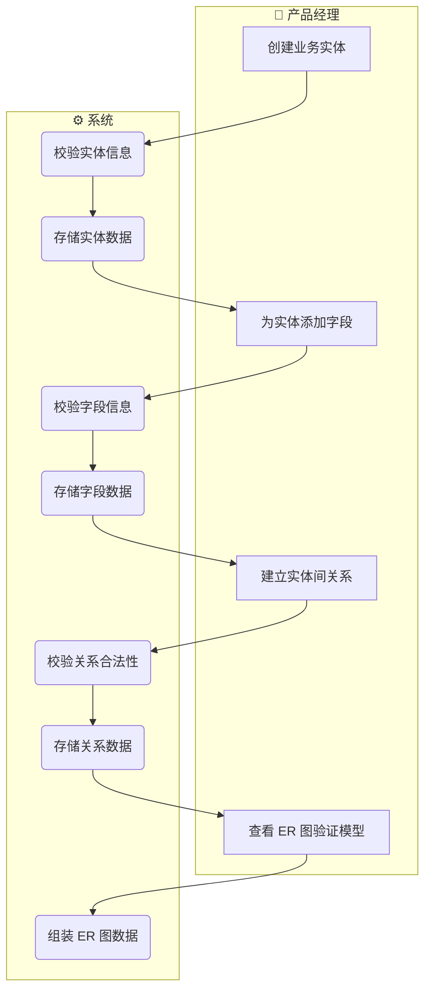
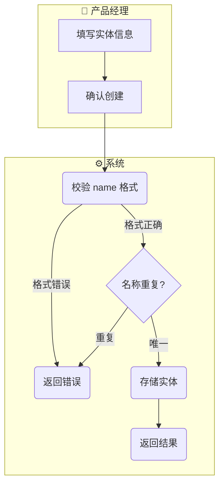
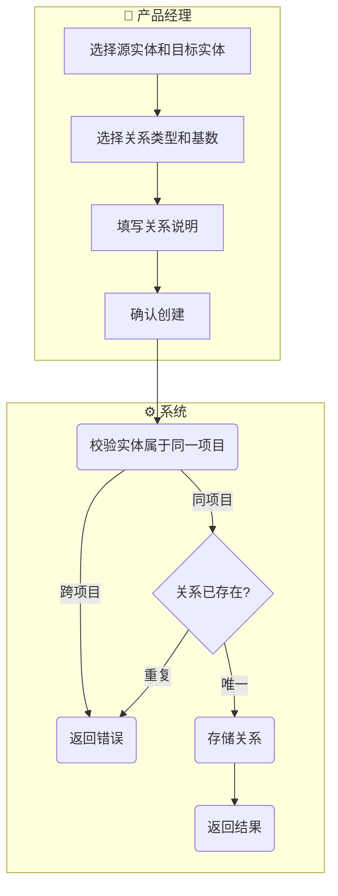

# 领域模型管理 产品需求规格书（PRD）

> **模块**：M2-领域模型管理
> **状态**：draft
> **版本**：v1.1
> **日期**：2026-06-02
> **作者**：AI/PM
> **关联文档**：
>   - 领域模型 → `docs/02-domain-model/domain-model.md#§5`
>   - 交互设计 → `docs/03-prd-ux/modules/domain-model/domain-model-interaction.md`
>   - 技术方案 → `docs/04-tech-design/phase1-design-tech.md#领域模型`
>   - 数据库 Schema → `docs/05-data-design/phase1-database-schema.md#表2~表4`

---

## 1. 概述

### 1.1 定位与目标

本模块（M2）是「数据模型中心」的核心子系统，解决「**在项目中定义业务领域模型**」的问题。

产品经理在 M1 完成项目创建和组织架构定义后，进入 M2 定义被建模产品的核心业务数据对象：
- **实体（Entity）** — 业务对象（如 "订单"、"用户"、"商品"）
- **字段（Field）** — 实体的属性（如 "订单号"、"创建时间"）
- **关系（Relation）** — 实体间的关联（如 "订单包含商品"）

这些定义是后续 M3 业务流程设计（流程节点绑定实体/字段）和 M4 业务架构设计的**数据基础**。

> **核心设计决策**（2026-05-27 PM 确认）：
> - DomainModelDef 层级**扁平化**：`Project → Entity → Field`，跳过中间层
> - 字段类型**分期实现**：Phase 1 仅支持 8 种基础类型
> - 关系**单向存储**，不合成双向，每个方向独立表达
> - ER 图数据输出**通用格式**，前端自行映射到 ReactFlow

### 1.2 用户角色

| 角色 | 描述 | 本模块权限 |
|------|------|:---------:|
| 产品经理（PM） | 定义和维护业务领域模型 | 读/写 |

### 1.3 前置依赖

| 依赖项 | 状态 | 说明 |
|--------|:----:|------|
| M1 项目管理 | ✅ | 项目已创建，ProjectContext 可用 |

---

## 2. 业务流程

> 本节定义业务动作的先后顺序和输入输出，不涉及具体的交互界面。

### 2.1 模块级主业务流程（Happy Path）

> 本流程描述用户在本模块中完成核心目标的典型路径（不含异常分支）。



### 2.2 完整流程（含异常分支）

#### 2.2.1 创建实体



#### 2.2.2 建立实体关系



---

## 3. 功能范围总览

### 3.1 功能清单

| # | 功能点 | 优先级 | 描述 | 对应章节 |
|---|--------|:------:|------|:--------:|
| F-M2-01 | 实体管理 | P0 | 实体的列表、创建、查看详情、编辑、删除 | §4.1 |
| F-M2-02 | 字段管理 | P0 | 字段的列表、创建、查看详情、编辑、删除、批量排序 | §4.2 |
| F-M2-03 | 关系管理 | P0 | 关系的列表、创建、编辑、删除 | §4.3 |
| F-M2-04 | ER 图数据查询 | P0 | 实体级局部 ER 图 + 项目级全量 ER 图 | §4.4 |
| F-M2-05 | 画布显示配置 | P1 | 工具栏配置入口（滑出侧边栏），包含"默认展示关系名称"等画布显示开关；纯前端配置，无后端接口 | §4.5 |

### 3.2 Out of Scope（不在本模块范围内）

| 功能 | 原因 | 归属 |
|------|------|------|
| DomainModelDef 中间层级 | PM 确认扁平化方案：Project 直接挂 Entity | Phase 1 不做 |
| 复杂字段类型（formula / computed / reference / file / image / json / array / color / rating / icon / duration / status / currency / percentage / coordinate / rich_text） | Phase 1 聚焦基础类型，复杂类型涉及额外引擎 | Phase 2+ |
| 双向关系自动创建 | PM 确认单向存储，每个方向独立标记说明 | 不做 |
| ER 图可视化渲染 | 属于前端 ReactFlow 映射，由 S3/S6 处理 | S3/S6 |
| 从数据库反向导入实体 | 需要额外扫描和映射能力 | Phase 2+ |
| 领域模型版本管理 | 需要 diff / merge / 历史回溯能力 | Phase 3+ |

### 3.3 术语表

| 术语 | 定义 |
|------|------|
| **实体（Entity）** | 业务对象的抽象定义，如 "订单"、"用户"，对应数据库表或业务对象 |
| **字段（Field）** | 实体的属性定义，如 "订单号"、"创建时间"，对应数据库列或对象属性 |
| **关系（Relation）** | 两个实体之间的语义关联，有方向性，从 Source 指向 Target |
| **关系类型（relation_kind）** | 关联(association) / 依赖(dependency) / 聚合(aggregation) / 组合(composition) / 泛化(generalization) |
| **泛化维度（dimension）** | 仅 generalization 关系使用，必填，描述"从哪个角度/标准进行分类"，如"物理结构"、"充换电能力" |
| **基数（Cardinality）** | 关系两端的数量约束，分别用 source_cardinality 和 target_cardinality 独立描述，采用数学区间表示法，如 `*`（多个）、`1`（恰好一个）、`[0,1]`（零或一） |
| **ER 图** | Entity-Relationship 图，可视化展示实体、字段和关系的图形 |

---

## 4. 功能点详细设计

### 4.1 实体管理（F-M2-01）

> **编号**：F-M2-01
> **优先级**：P0
> **前置功能**：F-M1-02（创建项目）
> **交互设计**：→ `domain-model-interaction.md#§4.1`

#### 4.1.1 涉及的领域模型

| 实体 | 用途 | 关键字段 | 引用 |
|------|------|---------|------|
| domain_entities | 实体定义的主表 | id, project_id, name, display_name, description, category, sort_order | `phase1-database-schema.md#表2` |

#### 4.1.2 业务动作与输入输出

**主业务动作序列**：

| 步骤 | 业务动作 | 输入 | 输出 | 前置条件 | 异常处理 |
|------|---------|------|------|---------|---------|
| 1 | 列出实体列表 | project_id, 可选：搜索关键词、分页参数 | 实体列表（含分页元数据） | 项目存在 | — |
| 2 | 创建实体 | name, display_name, description?, category?, sort_order? | 新实体对象 | 项目存在 | 名称重复 → 409；格式非法 → 400 |
| 3 | 查看实体详情 | entity_id | 实体详情 + 字段列表 + 关系列表 | 实体存在 | 实体不存在 → 404 |
| 4 | 编辑实体 | entity_id, display_name?, description?, category?, sort_order? | 更新后的实体 | 实体存在 | 实体不存在 → 404 |
| 5 | 删除实体 | entity_id | 删除成功确认 | 实体存在 | 实体不存在 → 404；级联删除字段和关系 |

**快捷操作**：

| 操作 | 触发方式 | 行为 | 确认机制 |
|------|---------|------|:--------:|
| 删除实体 | 用户选择删除 | 级联删除该实体下的所有字段和关联关系 | 需确认 |
| 选中关系 | ER 图中点击关系线 | Inspector 切换为关系详情模式，仅显示"关系"选项卡及当前选中关系 | — |

#### 4.1.3 业务规则

**校验规则**：

| 字段 | 规则 | 错误提示 |
|------|------|---------|
| name | 编程标识符格式：字母/数字/下划线，不能以数字开头，长度 1-64 | "名称格式无效，仅支持字母、数字、下划线，且不能以数字开头" |
| name | 同一项目内唯一 | "该名称已被使用，请更换" |
| display_name | 非空，长度 1-128 | "显示名称不能为空" |
| description | 可选，长度 0-512 | — |
| category | 可选，长度 0-64 | — |

**业务约束**：

| # | 规则 | 说明 |
|---|------|------|
| B-M2-01 | 删除实体时级联删除其所有字段 | entity_fields 有 ON DELETE CASCADE |
| B-M2-02 | 删除实体时清理其作为 source/target 的所有关系 | entity_relations 有 ON DELETE CASCADE |
| B-M2-03 | 实体详情查询需返回关联的字段列表和关系列表 | 减少前端多次请求 |

**异常场景**：

| 场景 | 触发条件 | 系统行为 |
|------|---------|---------|
| 名称重复 | 同一项目内已有同名实体 | 返回 409，提示名称已被使用 |
| 实体不存在 | entity_id 无效或已删除 | 返回 404 |
| 跨项目访问 | entity_id 属于其他项目 | 返回 404（不暴露存在性） |

#### 4.1.4 数据规格

**输入数据（创建/编辑）**：

| 字段 | 类型 | 必填 | 默认值 | 校验规则 | 说明 |
|------|------|:----:|:------:|---------|------|
| name | string | ✅ | — | 编程标识符，项目内唯一，1-64 字符 | 编程名称，用于代码生成 |
| display_name | string | ✅ | — | 非空，1-128 字符 | 展示名称 |
| description | string | — | null | 0-512 字符 | 实体描述 |
| category | string | — | null | 0-64 字符 | 分类标签（如 core / supporting / event）|
| sort_order | integer | — | 0 | ≥0 | 排序权重 |

**输出数据（实体详情）**：

| 字段 | 类型 | 来源 | 说明 |
|------|------|------|------|
| id | string | DB | UUID |
| project_id | string | DB | 所属项目 |
| name | string | DB | 编程名称 |
| display_name | string | DB | 展示名称 |
| description | string | DB | 描述 |
| category | string | DB | 分类 |
| sort_order | integer | DB | 排序权重 |
| fields | Field[] | 关联查询 | 该实体的字段列表（按 sort_order 排序）|
| relations | Relation[] | 关联查询 | 该实体作为 source 或 target 的关系列表 |
| created_at | datetime | DB | 创建时间 |
| updated_at | datetime | DB | 更新时间 |

#### 4.1.5 AI 编码提示

- **[实体详情 JOIN 查询]**：查看实体详情时需一次性 JOIN 字段和关系，注意 N+1 问题，建议使用 Drizzle 的 `with` 关联查询
- **[级联删除顺序]**：删除实体时，由于外键已配置 `ON DELETE CASCADE`，只需删除实体本身即可，但需要在 Service 层先校验实体存在性和归属权
- **[搜索实现]**：实体列表搜索同时匹配 `name` 和 `display_name`，使用 `ilike` 模糊匹配

---

### 4.2 字段管理（F-M2-02）

> **编号**：F-M2-02
> **优先级**：P0
> **前置功能**：F-M2-01（实体管理）
> **交互设计**：→ `domain-model-interaction.md#§4.2`

#### 4.2.1 涉及的领域模型

| 实体 | 用途 | 关键字段 | 引用 |
|------|------|---------|------|
| entity_fields | 字段定义的主表 | id, entity_id, name, display_name, description, field_type, is_required, default_value, constraints, sort_order | `phase1-database-schema.md#表3` |

#### 4.2.2 业务动作与输入输出

**主业务动作序列**：

| 步骤 | 业务动作 | 输入 | 输出 | 前置条件 | 异常处理 |
|------|---------|------|------|---------|---------|
| 1 | 列出字段列表 | entity_id | 字段列表（按 sort_order 排序） | 实体存在 | 实体不存在 → 404 |
| 2 | 创建字段 | entity_id + 字段信息 | 新字段对象 | 实体存在 | 名称重复 → 409；类型不支持 → 400 |
| 3 | 查看字段详情 | field_id | 字段详情 | 字段存在 | 字段不存在 → 404 |
| 4 | 编辑字段 | field_id + 更新信息 | 更新后的字段 | 字段存在 | 字段不存在 → 404 |
| 5 | 删除字段 | field_id | 删除成功确认 | 字段存在 | 字段不存在 → 404 |
| 6 | 批量调整字段排序 | entity_id + [{field_id, sort_order}] | 更新后的字段列表 | 实体存在 | 字段不属于该实体 → 400 |

#### 4.2.3 业务规则

**校验规则**：

| 字段 | 规则 | 错误提示 |
|------|------|---------|
| name | 编程标识符格式，同一实体范围内唯一，1-64 字符 | "名称格式无效或已被使用" |
| display_name | 非空，1-128 字符 | "显示名称不能为空" |
| field_type | 必须是 Phase 1 支持的类型之一 | "不支持的字段类型" |
| is_required | boolean | — |
| default_value | JSONB，类型需与 field_type 兼容 | "默认值类型与字段类型不匹配" |
| constraints | JSONB，结构根据 field_type 动态校验 | "约束配置格式错误" |

**Phase 1 支持的字段类型**：

```typescript
type FieldType =
  | 'string'      // 短文本
  | 'number'      // 数值
  | 'boolean'     // 布尔值
  | 'datetime'    // 日期时间
  | 'text'        // 长文本
  | 'enum'        // 枚举值
  | 'email'       // 邮箱地址
  | 'url'         // URL 地址
  | 'phone';      // 电话号码
```

**各类型 constraints 结构**：

| field_type | constraints 结构 | 说明 |
|-----------|-----------------|------|
| string | `{ minLength?: number, maxLength?: number, pattern?: string }` | 长度限制、正则匹配 |
| number | `{ min?: number, max?: number, integer?: boolean, precision?: number }` | 范围、整数、精度 |
| boolean | `{}` | 无额外约束 |
| datetime | `{ format?: string }` | 日期格式 |
| text | `{ minLength?: number, maxLength?: number }` | 长度限制 |
| enum | `{ options: { value: string, label: string }[] }` | 枚举选项列表 |
| email | `{}` | 格式由系统校验 |
| url | `{ protocols?: string[] }` | 允许的协议前缀 |
| phone | `{ region?: string }` | 地区码 |

**业务约束**：

| # | 规则 | 说明 |
|---|------|------|
| B-M2-04 | is_required=true 时，default_value 不能为 null | 必填字段必须有默认值或创建时强制赋值 |
| B-M2-05 | 字段排序调整需事务保证 | 批量 reorder 时所有 sort_order 原子更新 |
| B-M2-06 | 字段的 entity_id 不可变更 | 字段不能跨实体移动，需先删除再重建 |

**异常场景**：

| 场景 | 触发条件 | 系统行为 |
|------|---------|---------|
| 名称重复 | 同一实体内已有同名字段 | 返回 409 |
| 类型不支持 | field_type 不在 Phase 1 支持列表中 | 返回 400 |
| 约束格式错误 | constraints JSON 结构与 field_type 不匹配 | 返回 400 |
| 字段不属于实体 | reorder 时传入的 field_id 不属于该实体 | 返回 400 |

#### 4.2.4 数据规格

**输入数据（创建/编辑）**：

| 字段 | 类型 | 必填 | 默认值 | 校验规则 | 说明 |
|------|------|:----:|:------:|---------|------|
| name | string | ✅ | — | 编程标识符，实体内唯一，1-64 字符 | 编程名称 |
| display_name | string | ✅ | — | 非空，1-128 字符 | 展示名称 |
| description | string | — | null | 0-512 字符 | 字段描述 |
| field_type | enum | ✅ | — | 见 Phase 1 支持列表 | 字段类型 |
| is_required | boolean | — | false | — | 是否必填 |
| default_value | json | — | null | 类型需与 field_type 兼容 | 默认值 |
| constraints | json | — | `{}` | 结构需与 field_type 匹配 | 类型约束 |
| sort_order | integer | — | 0 | ≥0 | 排序权重 |

**批量排序输入**：

| 字段 | 类型 | 必填 | 说明 |
|------|------|:----:|------|
| orders | array | ✅ | `[{ field_id: string, sort_order: integer }]` |

#### 4.2.5 AI 编码提示

- **[constraints 动态校验]**：constraints 的 JSON 结构需根据 field_type 做运行时校验，建议为每种类型定义独立的 TypeBox schema，在 service 层做分支校验
- **[reorder 事务]**：批量调整排序时，所有 sort_order 更新必须在同一事务中完成，避免并发下的排序错乱
- **[default_value 类型兼容]**：default_value 存储为 JSONB，读取时需根据 field_type 做类型转换，写入时需校验类型兼容性

---

### 4.3 关系管理（F-M2-03）

> **编号**：F-M2-03
> **优先级**：P0
> **前置功能**：F-M2-01（实体管理，至少有两个实体）
> **交互设计**：→ `domain-model-interaction.md#§4.3`

#### 4.3.1 涉及的领域模型

| 实体 | 用途 | 关键字段 | 引用 |
|------|------|---------|------|
| entity_relations | 关系定义的主表 | id, project_id, source_entity_id, target_entity_id, relation_kind, source_cardinality, target_cardinality, display_name, description | `phase1-database-schema.md#表4` |
| domain_entities | 校验 source/target 实体存在性 | id, project_id | `phase1-database-schema.md#表2` |

#### 4.3.2 业务动作与输入输出

**主业务动作序列**：

| 步骤 | 业务动作 | 输入 | 输出 | 前置条件 | 异常处理 |
|------|---------|------|------|---------|---------|
| 1 | 列出关系列表 | project_id | 关系列表 | 项目存在 | — |
| 2 | 创建关系 | project_id + source_entity_id + target_entity_id + relation_kind + source_cardinality + target_cardinality + display_name? + description? + dimension?（generalization 必填） | 新关系对象 | 两实体存在且属于同一项目 | 关系已存在 → 409；跨项目 → 400；generalization 缺少 dimension → 422 |
| 3 | 编辑关系 | relation_id + 可更新字段 | 更新后的关系 | 关系存在 | 关系不存在 → 404 |
| 4 | 删除关系 | relation_id | 删除成功确认 | 关系存在 | 关系不存在 → 404 |
| 5 | 选中关系（ER 图入口） | relation_id（由 ER 图关系线点击触发） | 关系详情（Inspector 关系模式） | 关系存在 | — |

#### 4.3.3 业务规则

**校验规则**：

| 字段 | 规则 | 错误提示 |
|------|------|---------|
| source_entity_id | 必须存在且属于当前项目 | "源实体不存在或不属于该项目" |
| target_entity_id | 必须存在且属于当前项目 | "目标实体不存在或不属于该项目" |
| relation_kind | 必须是 association / dependency / aggregation / composition / generalization 之一 | "无效的关系类型" |
| source_cardinality | 数学区间表示法，格式见下方；generalization 固定为 `"1"`，后端强制覆盖，前端不展示 | "源基数格式无效" |
| target_cardinality | 数学区间表示法，格式见下方；generalization 固定为 `"1"`，后端强制覆盖，前端不展示 | "目标基数格式无效" |
| dimension | 仅 generalization 时必填（0-128 字符）；其他类型传入则忽略 | "泛化维度不能为空" |
| (source, target, kind) | 同一项目内三元组唯一 | "该关系已存在" |

**cardinality 格式规范（source_cardinality / target_cardinality 通用）**：

```typescript
// 支持的格式（数学区间表示法）
type Cardinality =
  | '*'          // 零或多个
  | '1'          // 恰好一个
  | '0'          // 零个
  | '[0,1]'      // 零或一个
  | '[1,*]'      // 一个或多个
  | '[n,m]'      // n 到 m 个（n,m 为正整数，n ≤ m）
  | '[n,]'       // 至少 n 个
  | 'n';         // 恰好 n 个（n 为正整数）
```

**关系类型语义**：

| relation_kind | 语义 | UML 对应 | 方向约定 | 基数 |
|--------------|------|---------|---------|------|
| association | 普通关联：A 持久引用 B，无从属关系 | 实线箭头 `——>` | source → target | 自定义 |
| dependency | 依赖：A 临时使用 B，无持久引用 | 依赖箭头 `-->` | source → target | 自定义 |
| aggregation | 聚合（弱拥有）：A 包含 B，B 可独立于 A 存在 | 空心菱形 ◇-- | source（整体）→ target（部分）| 自定义 |
| composition | 组合（强拥有）：A 包含 B，B 随 A 消亡而消亡 | 实心菱形 ◆-- | source（整体）→ target（部分）| 自定义 |
| generalization | 泛化（is-a）：A 是 B 的子类型，继承 B 的属性和行为 | 空心三角箭头 △-- | source（子类）→ target（父类）| 固定 1:1（后端强制）|

> **泛化维度说明**：同一父类可沿不同维度泛化，产生相互独立的子类群。`dimension` 字段标明"从哪个角度进行分类"，是区分多组泛化关系的关键。
>
> 例：`换电站` 可沿 "物理结构" 维度泛化为 `左通道站`/`右通道站`；也可沿 "充换电能力" 维度泛化为 `换电站`/`充换一体站`。
> 两组泛化关系共用同一父类，但 `dimension` 不同，各自成立，互不影响。

**业务约束**：

| # | 规则 | 说明 |
|---|------|------|
| B-M2-07 | 允许自引用关系（source == target） | 实体可以依赖/聚合/组合/关联自身 |
| B-M2-08 | 同一项目内，(source_entity_id, target_entity_id, relation_kind) 三元组必须唯一 | 避免重复定义同一方向上的同类型关系 |
| B-M2-09 | 关系的 project_id 必须与 source/target 实体所属项目一致 | 跨项目关系禁止 |
| B-M2-F03-01 | ER 图中点击关系线与点击实体节点互斥 | 点击关系线时取消实体选中，点击实体时取消关系选中 |
| B-M2-F03-02 | generalization 关系的 dimension 字段必填（1-128 字符），其他类型传入则忽略 | 维度是区分同一父类多组泛化关系的关键信息 |
| B-M2-F03-03 | generalization 关系的 source_cardinality 和 target_cardinality 由后端强制设置为 `"1"`，忽略前端传入的值 | 泛化关系在 UML 中基数固定为 1:1 |

**异常场景**：

| 场景 | 触发条件 | 系统行为 |
|------|---------|---------|
| 关系已存在 | 同一项目内已有相同三元组 | 返回 409 |
| 实体跨项目 | source 或 target 不属于当前项目 | 返回 400 |
| 基数格式错误 | source_cardinality 或 target_cardinality 不符合规范 | 返回 400 |
| 泛化维度缺失 | relation_kind = generalization 但未提供 dimension | 返回 422，错误提示"泛化维度不能为空" |

#### 4.3.4 数据规格

**输入数据（创建/编辑）**：

| 字段 | 类型 | 必填 | 默认值 | 校验规则 | 说明 |
|------|------|:----:|:------:|---------|------|
| source_entity_id | string | ✅ | — | 实体存在且属于当前项目 | 源实体 |
| target_entity_id | string | ✅ | — | 实体存在且属于当前项目 | 目标实体 |
| relation_kind | enum | ✅ | — | association / dependency / aggregation / composition / generalization | 关系类型 |
| source_cardinality | string | — | `'1'` | 数学区间表示法；generalization 时后端强制覆盖为 `'1'` | 源端基数 |
| target_cardinality | string | — | `'*'` | 数学区间表示法；generalization 时后端强制覆盖为 `'1'` | 目标端基数 |
| dimension | string | 条件必填 | null | generalization 时必填，1-128 字符；其他类型传入则忽略 | 泛化维度（仅 generalization）|
| display_name | string | — | null | 0-128 字符 | 关系显示名称（如 "包含"）|
| description | string | — | null | 0-512 字符 | 关系描述 |

**输出数据**：

| 字段 | 类型 | 来源 | 说明 |
|------|------|------|------|
| id | string | DB | UUID |
| project_id | string | DB | 所属项目 |
| source_entity_id | string | DB | 源实体 ID |
| target_entity_id | string | DB | 目标实体 ID |
| source_entity | Entity | 关联查询 | 源实体完整信息（可选展开）|
| target_entity | Entity | 关联查询 | 目标实体完整信息（可选展开）|
| relation_kind | string | DB | 关系类型 |
| source_cardinality | string | DB | 源端基数 |
| target_cardinality | string | DB | 目标基数 |
| dimension | string | DB | 泛化维度（generalization 时有值，其他类型为 null）|
| display_name | string | DB | 显示名称 |
| description | string | DB | 描述 |
| created_at | datetime | DB | 创建时间 |
| updated_at | datetime | DB | 更新时间 |

#### 4.3.5 AI 编码提示

- **[三元组唯一性校验]**：创建关系前需 SELECT 检查 (project_id, source_entity_id, target_entity_id, relation_kind) 是否已存在，存在则返回 409，避免依赖数据库唯一约束导致 500
- **[自引用关系]**：source_entity_id == target_entity_id 是合法的，无需特殊拦截，但前端展示时可能需要特殊处理避免自环箭头重叠
- **[实体归属校验]**：创建关系时必须验证 source_entity_id 和 target_entity_id 都存在于 domain_entities 且 project_id 匹配当前项目
- **[generalization 特殊逻辑]**：Service 层需对 generalization 做以下额外处理：(1) 校验 dimension 非空；(2) 强制将 source_cardinality 和 target_cardinality 覆盖为 `"1"`，无视前端传入值；(3) 非 generalization 类型传入 dimension 则静默忽略（不存储）
- **[dimension 输入方式]**：前端 RelationDialog 中，当 relation_kind = generalization 时，dimension 字段应出现；提供两种输入方式：下拉选择父实体（target 实体）的字段 displayName，或手动输入自定义文本

---

### 4.4 ER 图数据查询（F-M2-04）

> **编号**：F-M2-04
> **优先级**：P0
> **前置功能**：F-M2-01（实体管理），F-M2-03（关系管理）
> **交互设计**：→ `domain-model-interaction.md#§4.4`

#### 4.4.1 涉及的领域模型

| 实体 | 用途 | 关键字段 | 引用 |
|------|------|---------|------|
| domain_entities | 图中的节点 | id, name, display_name, category | `phase1-database-schema.md#表2` |
| entity_fields | 节点内的字段信息 | id, entity_id, name, display_name, field_type, is_required | `phase1-database-schema.md#表3` |
| entity_relations | 图中的边 | id, source_entity_id, target_entity_id, relation_kind, source_cardinality, target_cardinality, display_name | `phase1-database-schema.md#表4` |

#### 4.4.2 业务动作与输入输出

**主业务动作序列**：

| 步骤 | 业务动作 | 输入 | 输出 | 前置条件 | 异常处理 |
|------|---------|------|------|---------|---------|
| 1 | 查询实体级 ER 图 | project_id, entity_id | 局部 ER 图数据 | 实体存在 | 实体不存在 → 404 |
| 2 | 查询项目级全量 ER 图 | project_id | 全量 ER 图数据 | 项目存在 | — |

#### 4.4.3 业务规则

**业务约束**：

| # | 规则 | 说明 |
|---|------|------|
| B-M2-10 | 实体级 ER 图包含：中心实体 + 所有直接关联的实体（作为 source 或 target）+ 中心实体与这些实体之间的关系 | 只取一层深度 |
| B-M2-11 | 项目级 ER 图包含：项目内所有实体 + 所有关系 | 全量数据 |
| B-M2-12 | ER 图数据输出为通用格式，不与 ReactFlow 格式耦合 | 前端自行映射 |

**异常场景**：

| 场景 | 触发条件 | 系统行为 |
|------|---------|---------|
| 实体不存在 | entity_id 无效 | 返回 404 |
| 实体跨项目 | entity_id 属于其他项目 | 返回 404 |

#### 4.4.4 数据规格

**输出数据（通用 ER 图格式）**：

```typescript
interface ERGraphData {
  entities: ERNode[];       // 实体节点列表（原 nodes，已重命名以与 ReactFlow 解耦）
  relations: EREdge[];      // 关系边列表（原 edges，已重命名以与 ReactFlow 解耦）
}

interface ERNode {
  id: string;              // 实体 ID
  type: 'entity';          // 节点类型（预留扩展）
  position?: {             // 节点在画布上的位置（用户手动拖拽后持久化）
    x: number;
    y: number;
  };
  data: {
    name: string;          // 编程名称
    displayName: string;   // 展示名称
    category?: string;     // 分类标签
    fields: ERNodeField[]; // 字段列表
  };
}

interface ERNodeField {
  id: string;
  name: string;
  displayName: string;
  fieldType: string;
  isRequired: boolean;
}

interface EREdge {
  id: string;              // 关系 ID
  source: string;          // 源实体 ID
  target: string;          // 目标实体 ID
  type: 'relation';        // 边类型（预留扩展）
  data: {
    relationKind: string;           // association / dependency / aggregation / composition / generalization
    sourceCardinality: string;       // 源端基数
    targetCardinality: string;      // 目标基数
    dimension?: string;             // 泛化维度（仅 generalization 时有值）
    displayName?: string;           // 显示名称
    description?: string;           // 描述
  };
}
```

**实体级 ER 图特殊规则**：
- `entities` 必须包含中心实体（作为第一个节点）
- `entities` 包含所有与中心实体有直接关系的实体（无论方向）
- `relations` 仅包含 `entities` 中实体之间的关系

#### 4.4.5 AI 编码提示

- **[通用格式解耦]**：ER 图数据输出必须使用通用结构（如上），禁止直接输出 ReactFlow 的 `{ id, position, type, data }` 格式，保持后端与前端渲染库解耦
- **[实体级图深度]**：当前仅支持一层深度（直接关联实体），后续如需多层可扩展 `depth` 参数
- **[性能注意]**：项目级全量 ER 图在实体/关系数量大时可能数据量大，建议后续加缓存或分页，但 Phase 1 先不做优化

### 4.5 画布显示配置（F-M2-05）

> **编号**：F-M2-05
> **优先级**：P1
> **前置功能**：F-M2-04（ER 图可视化）
> **交互设计**：→ `domain-model-interaction.md#§3.1.5`
> **说明**：纯前端配置，不涉及后端接口，配置状态存储在浏览器 `localStorage`（按项目 ID 隔离）。

#### 4.5.1 业务场景

用户在使用 ER 图画布时，希望能控制画布的显示细节：
- 实体关系数量多时，关系线上的名称标签会造成视觉干扰；
- 用户可按需开启/关闭关系名称常驻标签。

#### 4.5.2 配置项清单（Phase 1）

| 配置项 | 默认值 | 说明 |
|--------|:------:|------|
| 默认展示关系名称 | 关闭（false） | 开启时在关系线中部常驻显示 display_name 或 kind 中文映射 |

#### 4.5.3 业务规则

| # | 规则 | 说明 |
|---|------|------|
| B-M2-F05-01 | 配置项存储于 `localStorage`，key 为 `canvas-settings-{projectId}` | 配置按项目隔离，不同项目独立 |
| B-M2-F05-02 | 关闭"展示关系名称"时，Hover Tooltip 仍正常展示 | Hover 逻辑与常驻标签独立 |
| B-M2-F05-03 | 开启"展示关系名称"时，有 display_name 优先展示 display_name，否则展示 kind 中文映射 | 与 Hover Tooltip 中的标签逻辑一致 |

#### 4.5.4 AI 编码提示

- **[无 API]**：F-M2-05 完全在前端处理，不需要任何后端接口变更
- **[localStorage key 格式]**：`canvas-settings-${projectId}`，值为 JSON 对象，方便后续扩展更多配置项
- **[默认值]**：首次访问（key 不存在）时所有配置项取默认值，不需要初始化写入

---

## 5. 跨功能规则

### 5.1 全局状态流转约束

本模块所有实体（domain_entities, entity_fields, entity_relations）**无状态机**，均为无状态数据对象，不涉及状态流转。

### 5.2 全局校验规则

| # | 规则 | 影响范围 | 说明 |
|---|------|---------|------|
| G-M2-01 | name 字段在各自范围内唯一 | F-M2-01, F-M2-02 | 实体在项目内唯一，字段在实体内唯一 |
| G-M2-02 | name 必须符合编程标识符格式 | F-M2-01, F-M2-02 | 字母/数字/下划线，不能以数字开头 |
| G-M2-03 | 所有操作必须校验 project_id/entity_id 的存在性和归属权 | 全部功能点 | 跨项目访问返回 404（不暴露存在性）|
| G-M2-04 | 字段类型必须是 Phase 1 支持列表中的值 | F-M2-02 | 见 §4.2.3 类型列表 |
| G-M2-05 | 关系三元组 (source, target, kind) 在项目内唯一 | F-M2-03 | 避免重复关系定义 |

### 5.3 全局业务约定

| 约定项 | 规则 | 说明 |
|--------|------|------|
| 列表分页 | 默认 pageSize=20，可选 10/50/100 | 数据规格约定 |
| 列表排序 | 默认按 sort_order 升序，其次 created_at 倒序 | 数据规格约定 |
| 搜索匹配 | 实体列表搜索同时匹配 name 和 display_name，使用前缀/包含匹配 | 业务约定 |
| 删除策略 | 采用级联硬删除（非软删除） | 领域模型数据量小，保持数据一致性 |
| 时间戳 | created_at / updated_at 由数据库自动生成，不可由用户修改 | 数据一致性约定 |
| ID 生成 | 所有主键使用数据库 UUID 生成（gen_random_uuid()） | 技术约定 |

### 5.4 权限与访问控制

Phase 1 无权限控制，所有功能对当前用户完全开放。

---

## 6. 验收标准

### 6.1 功能验收

| # | 验收项 | 对应功能点 | 验证方式 | 通过标准 |
|---|--------|:---------:|---------|---------|
| AC-M2-01 | 实体列表支持分页和搜索 | F-M2-01 | 自动化 | 传入 page/size 返回正确分页；传入 keyword 返回匹配 name/display_name 的结果 |
| AC-M2-02 | 创建实体成功 | F-M2-01 | 自动化 | 传入合法参数返回 201 和新实体；数据库存在记录 |
| AC-M2-03 | 创建实体名称重复时返回 409 | F-M2-01 | 自动化 | 同一项目内重复名称返回 409，不创建记录 |
| AC-M2-04 | 查看实体详情包含字段和关系 | F-M2-01 | 自动化 | 返回实体对象 + fields 数组 + relations 数组 |
| AC-M2-05 | 编辑实体更新指定字段 | F-M2-01 | 自动化 | PUT 后数据库字段更新，其他字段不变 |
| AC-M2-06 | 删除实体级联删除字段和关系 | F-M2-01 | 自动化 | 删除后该实体的 fields 和 relations 记录不存在 |
| AC-M2-07 | 字段列表按 sort_order 排序 | F-M2-02 | 自动化 | 返回的 fields 按 sort_order 升序排列 |
| AC-M2-08 | 创建字段支持 8 种基础类型 | F-M2-02 | 自动化 | 每种类型均可成功创建，constraints 结构正确存储 |
| AC-M2-09 | 创建字段名称重复返回 409 | F-M2-02 | 自动化 | 同一实体内重复名称返回 409 |
| AC-M2-10 | 不支持字段类型返回 400 | F-M2-02 | 自动化 | 传入 Phase 1 不支持的类型（如 formula）返回 400 |
| AC-M2-11 | 批量调整字段排序原子更新 | F-M2-02 | 自动化 | reorder 后所有字段 sort_order 正确更新 |
| AC-M2-12 | 创建关系成功（5 种类型各一条） | F-M2-03 | 自动化 | 传入合法参数（5 种 kind 各一条）均返回 201 和新关系 |
| AC-M2-13 | 关系三元组重复返回 409 | F-M2-03 | 自动化 | 同一项目内相同 (source, target, kind) 返回 409 |
| AC-M2-14 | 跨项目实体建立关系返回 400 | F-M2-03 | 自动化 | source 和 target 不属于同一项目时返回 400 |
| AC-M2-15 | 自引用关系允许创建 | F-M2-03 | 自动化 | source == target 时成功创建 |
| AC-M2-15a | 泛化关系创建成功，基数自动设为 1:1 | F-M2-03 | 自动化 | 创建 generalization 关系时，无论前端传入何种基数，返回数据中 source_cardinality = target_cardinality = "1" |
| AC-M2-15b | 泛化关系缺少 dimension 返回 422 | F-M2-03 | 自动化 | relation_kind=generalization 时不传 dimension，返回 422 |
| AC-M2-15c | 泛化关系 dimension 正确存储和返回 | F-M2-03 | 自动化 | 传入 dimension="物理结构"，返回数据中 dimension="物理结构" |
| AC-M2-16 | 实体级 ER 图返回正确结构 | F-M2-04 | 自动化 | 返回 { entities, relations }，entities 包含中心实体和直接关联实体 |
| AC-M2-17 | 项目级 ER 图返回全量数据 | F-M2-04 | 自动化 | 返回项目内所有实体和所有关系 |
| AC-M2-18 | ER 图格式为通用格式 | F-M2-04 | 自动化 | 输出不包含 ReactFlow 特有字段（如 position, type 为自定义节点类型而非 ReactFlow 组件名）|
| AC-M2-24-UI | 配置面板入口可见且可交互 | F-M2-05 | 人工 | 工具栏右侧存在"设置"图标按钮，点击滑出配置侧边栏 |
| AC-M2-25-UI | 关系名称常驻标签开关生效且持久化 | F-M2-05 | 人工 | 开启后关系线中部显示名称标签；关闭后标签消失；刷新页面后设置保持 |
| AC-M2-26-UI | ER 图关系线可点击选中 | F-M2-03 | 人工 | 点击关系线后，该线高亮（线宽/颜色变化），Inspector 滑出并仅显示"关系"选项卡 |
| AC-M2-27-UI | 关系线选中后 Inspector 仅显示该关系详情 | F-M2-03 | 人工 | Inspector 中只显示点击的那条关系，包含源/目标实体名称、关系类型、基数、编辑/删除按钮 |
| AC-M2-28-UI | 关系线选中与实体选中互斥 | F-M2-03 | 人工 | 点击关系线时取消实体选中；点击实体时取消关系选中；点击画布空白两者均取消 |

### 6.2 边界 & 异常场景验收

| # | 验收项 | 对应功能点 | 验证方式 | 通过标准 |
|---|--------|:---------:|---------|---------|
| AC-M2-19 | 访问不存在的实体返回 404 | F-M2-01 | 自动化 | 随机 UUID 返回 404 |
| AC-M2-20 | 访问其他项目的实体返回 404 | F-M2-01 | 自动化 | 实体存在但属于其他项目时返回 404 |
| AC-M2-21 | 字段 constraints 格式错误返回 400 | F-M2-02 | 自动化 | 如 string 类型传入 `{ minLength: "abc" }` 返回 400 |
| AC-M2-22 | 关系基数格式错误返回 400 | F-M2-03 | 自动化 | 传入非法 cardinality（如 "abc"）返回 400 |
| AC-M2-23 | 空项目 ER 图返回空 entities/relations | F-M2-04 | 自动化 | 无实体/关系时返回 `{ entities: [], relations: [] }` |
| AC-M2-24 | 实体详情中关系列表包含双向关系 | F-M2-01 | 自动化 | 实体作为 source 和 target 的关系均出现在 relations 中 |
