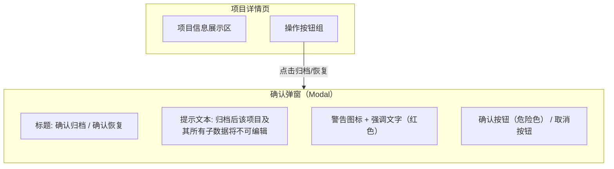
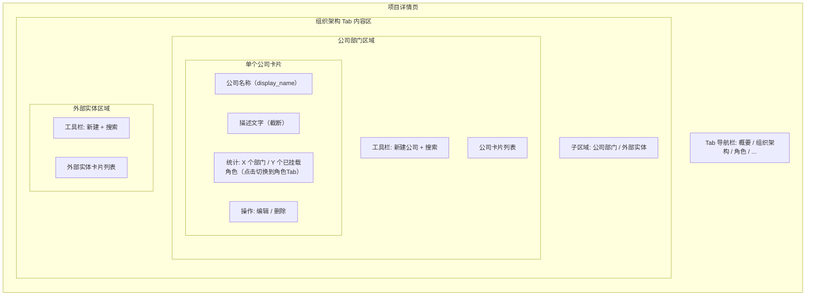
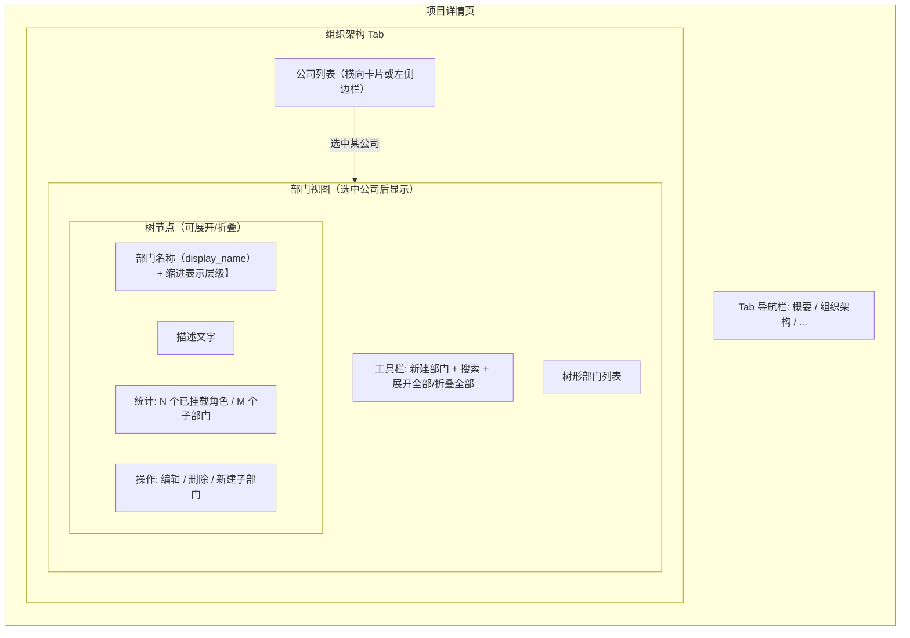
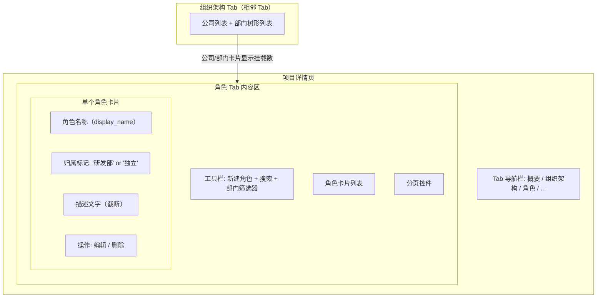
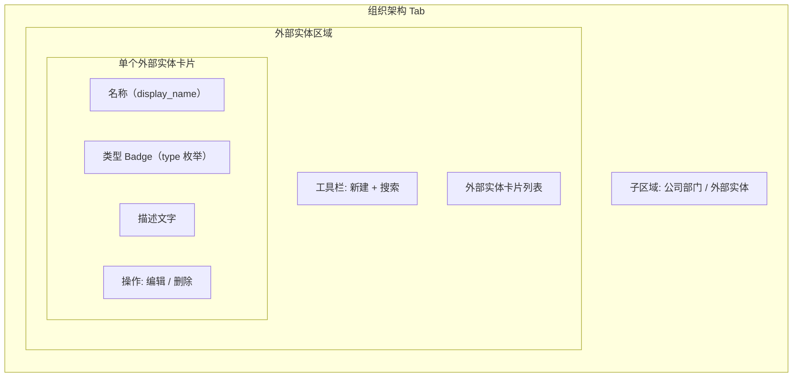
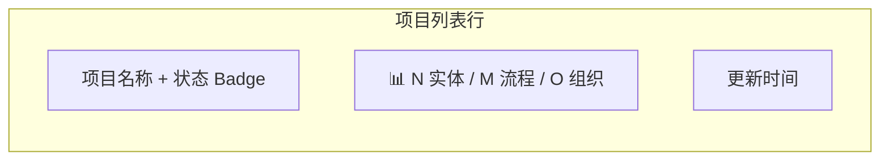

# 项目管理模块 PRD（续）

> 本文件为 `project-management-prd.md` 的续篇，包含 F-M1-05 ~ F-M1-10、§5 跨功能规则、§6 验收标准。
> 前序文件：`project-management-prd.md`（含 §1~§4.4）

---

### 4.5 F-M1-05 归档 / 恢复项目

**优先级**: P0 | **前置依赖**: F-M1-03（查看项目详情）

#### 4.5.1 涉及领域模型

| 实体 | 表名 | 说明 |
|------|------|------|
| Project | `projects` | 单实体操作, 仅更新 `status` 字段 |

**归档行为对子数据的影响（已确认的设计决策）：**

| 子数据类型 | 归档操作影响 | 查询时的过滤方式 |
|-----------|------------|---------------|
| 领域实体 (`domain_entities`) | **不修改** | `JOIN projects ON ... WHERE projects.status = 'active'` |
| 业务流程 (`business_processes`) | **不修改** | 同上 |
| 公司 (`companies`) | **不修改** | 同上 |
| 部门 (`departments`) | **不修改** | 同上 |
| 角色 (`roles`) | **不修改** | 同上 |
| 外部实体 (`external_entities`) | **不修改** | 同上 |

> **设计决策依据**: 归档是标记操作（`status='archived'`）, 不级联修改子数据. 所有列表查询通过 JOIN `projects.status` 自动过滤归档项目的子数据.

#### 4.5.2 页面设计

归档/恢复操作在**项目详情页的操作按钮区域**触发, 以**确认弹窗**形式交互。



**页面元素清单：**

| # | 元素 | 类型 | 交互说明 |
|---|------|------|---------|
| 1 | 「归档项目」按钮 | 危险按钮（红色） | 仅活跃项目显示, 点击弹出归档确认弹窗 |
| 2 | 「恢复项目」按钮 | 主按钮 | 仅归档项目显示, 点击弹出恢复确认弹窗 |
| 3 | 弹窗标题 | 文本 | 动态显示"确认归档"或"确认恢复" |
| 4 | 弹窗提示正文 | 文本 | 说明归档/恢复的后果 |
| 5 | 警告强调区 | 文本（红色） | 归档时强调"不可编辑"; 恢复时强调"将重新可编辑" |
| 6 | 「确认」按钮 | 危险按钮/主按钮 | 执行归档/恢复操作, 弹窗关闭 |
| 7 | 「取消」按钮 | 次按钮 | 关闭弹窗, 不执行任何操作 |
| 8 | 弹窗遮罩层 | 半透明背景 | 点击遮罩 = 取消（等同于点击取消按钮） |

#### 4.5.3 交互行为

**归档主流程（6 步）：**

| 步骤 | 操作 | 系统/页面响应 | 数据变化 |
|------|------|-------------|---------|
| 1 | 用户在活跃项目详情页点击「归档项目」按钮 | 弹出归档确认弹窗, 显示警告文案 | 无 |
| 2 | 用户阅读警告内容, 点击「确认」按钮 | 弹窗关闭, 按钮变为 loading 态, 禁用其他操作 | 无 |
| 3 | 前端调用 `PATCH /api/v1/projects/:id/status` Body: `{ status: 'archived' }` | 发起 HTTP 请求 | 无 |
| 4 | 后端执行 `UPDATE projects SET status='archived', updated_at=NOW() WHERE id=? AND version=?` （乐观锁） | 更新成功, version+1 | `projects.status` → `'archived'` |
| 5 | 后端返回 `{ data: { status: 'archived', version: N+1 } }` | 详情页刷新: 顶部显示灰色「已归档」Badge, 「归档」按钮替换为「恢复」按钮, 所有编辑入口隐藏 | 无 |
| 6 | （异常分支 A）乐观锁冲突 | 返回 409 VERSION_CONFLICT | Toast 提示"数据已被修改, 请刷新重试", 保持原状态 |

**恢复主流程（6 步）：**

| 步骤 | 操作 | 系统/页面响应 | 数据变化 |
|------|------|-------------|---------|
| 1 | 用户在归档项目详情页点击「恢复项目」按钮 | 弹出恢复确认弹窗 | 无 |
| 2 | 用户点击「确认」 | 弹窗关闭, 按钮 loading | 无 |
| 3 | 前端调用 `PATCH /api/v1/projects/:id/status` Body: `{ status: 'active' }` | 发起请求 | 无 |
| 4 | 后端执行 `UPDATE projects SET status='active', updated_at=NOW() WHERE id=? AND version=?` | 更新成功 | `projects.status` → `'active'` |
| 5 | 后端返回成功响应 | 详情页刷新: 移除「已归档」Badge, 「恢复」按钮替换为「归档」按钮, 编辑入口恢复显示 | 无 |
| 6 | （异常分支）同归档的异常分支 A | — | — |

**快捷操作：**
- `Esc` 键: 关闭弹窗（等同于取消）
- 点击弹窗外遮罩层: 关闭弹窗（等同于取消）

#### 4.5.4 业务规则

##### 4.5.4.3 更新（Update — 状态变更）

**状态转换矩阵：**

| 当前状态 | 目标状态 | 允许？ | 说明 |
|---------|---------|:------:|------|
| `active` | `archived` | ✅ | 归档操作 |
| `archived` | `active` | ✅ | 恢复操作 |
| `active` | `active` | ❌ | 无意义, 返回 400 |
| `archived` | `archived` | ❌ | 无意义, 返回 400 |

**业务规则清单：**

| 规则编号 | 规则内容 | 违规后果 |
|---------|---------|---------|
| B-M1-23 | 状态变更必须携带当前 `version` 值用于乐观锁校验, 缺失返回 400 | 前端必须从详情数据中携带 version |
| B-M1-24 | 不允许相同状态重复设置（active→active 或 archived→archived）, 返回 400 | 前端应控制按钮显隐避免此场景 |
| B-M1-25 | 归档/恢复仅修改 `projects.status`, **不级联修改任何子表数据**, 返回成功即完成 | 这是核心设计决策, 参见 4.5.1 |

##### 4.5.4.6 校验汇总

| 维度 | 规则 | 触发时机 |
|------|------|---------|
| 乐观锁 | B-M1-23: version 必须匹配 | 后端 UPDATE 前 |
| 状态合法性 | B-M1-24: 不允许同状态重复设置 | 后端接收时 |
| 级联约束 | B-M1-25: 标记操作, 不动子数据 | 后端 UPDATE 时（仅改 status 字段） |

##### 4.5.4.7 异常场景汇总

| 场景 | HTTP 状态码 | 错误码 | 前端处理 |
|------|-----------|--------|---------|
| version 缺失或不合法 | 400 | `INVALID_VERSION` | 刷新页面获取最新数据 |
| 相同状态重复设置 | 400 | `INVALID_STATUS_TRANSITION` | 不应出现（前端按钮控制）, 兜底 Toast 提示 |
| 乐观锁冲突 | 409 | `VERSION_CONFLICT` | Toast 提示, 刷新页面 |

#### 4.5.5 数据规格

**输入数据（PATCH /api/v1/projects/:id/status Request Body）：**

| 字段 | 类型 | 必填 | 可选值 | 说明 |
|------|------|:----:|--------|------|
| status | string | ✅ | `archived` / `active` | 目标状态 |
| version | integer | ✅ | — | 当前版本号（乐观锁） |

**输出数据（Response Body）：**

| 字段 | 类型 | 来源 | 说明 |
|------|------|------|------|
| id | string | projects.id | 项目 UUID |
| status | string | projects.status | 更新后的状态（archived / active） |
| version | integer | projects.version | 递增后的版本号 |
| updated_at | string | projects.updated_at | 状态变更时间 (ISO 8601) |

#### 4.5.6 AI 编码提示

- **标记操作的本质**: 归档/恢复的 SQL 只改一个字段 `status`, 不要写 `UPDATE *` 全量更新. 这既是性能优化（减少 WAL 写入）, 也是语义清晰性的体现.
- **子数据不需要任何处理**: 不要在归档逻辑中添加对 `domain_entities`、`companies` 等子表的 UPDATE 或 DELETE. 如果未来需要"归档时同时归档子数据", 那是新需求, 不是当前实现范围.
- **确认弹窗模式**: 使用 shadcn/ui 的 `AlertDialog` 组件（而非普通 Dialog）, 因为归档是破坏性操作, AlertDialog 有更强的视觉警示（红色确认按钮 + 图标）.
- **列表页联动**: 归档/恢复成功后, 项目列表页如果处于打开状态, 应该通过某种机制（query client 失效 / event bus / 轮询刷新）更新列表数据, 使归档项目从活跃列表消失（或从归档标签页出现）. 否则用户会看到过期数据.

---

### 4.6 F-M1-06 公司管理

**优先级**: P0 | **前置依赖**: F-M1-02（创建项目 — 公司隶属于某个项目）

#### 4.6.1 涉及领域模型

| 实体 | 表名 | 关系 | 说明 |
|------|------|------|------|
| Company | `companies` | 属于 Project（N:1） | 业务参与方组织, 如"国家电网"、"特斯拉" |
| Project | `projects` | 被 Company 引用（1:N） | 公司所属的项目容器 |

**ER 关系：**

```
Project (1) ──< (N) Company
   │                │
   │ id (PK)         │ project_id (FK)
   │                 │ id (PK)
   │                 │ name (唯一性范围: 同一 project 内)
   │                 │ display_name
   │                 │ description
```

#### 4.6.2 页面设计

公司管理采用**项目详情页内嵌 Tab 页**的形式, 与项目详情共享同一路由层级。



**页面元素清单：**

| # | 元素 | 类型 | 交互说明 |
|---|------|------|---------|
| 1 | 「组织架构」Tab | Tab 项（与"概要""角色"平级） | 切换到组织架构视图, 内含「公司部门」和「外部实体」两个子区域; URL 可能含 `#org` 或子路由 |
| 2 | 「新建公司」按钮 | 主按钮 | 打开新建公司对话框 |
| 3 | 搜索框 | 输入框 | 按 `display_name` 或 `name` 模糊搜索, 实时过滤 |
| 4 | 公司卡片 | 卡片组件 | 展示公司名称/描述/统计, 点击进入公司详情或展开编辑 |
| 5 | 公司名称 | 文本 | `display_name`, 可点击 |
| 6 | 公司描述 | 文本（截断） | `description`, 超过 2 行省略号 |
| 7 | 统计信息 | 徽章文本 | "N 个部门 / M 个已挂载角色", 点击角色数可**切换到「角色」Tab**并筛选 |
| 8 | 「编辑」按钮 | 图标按钮 | 打开编辑公司对话框（行内或弹窗） |
| 9 | 「删除」按钮 | 危险图标按钮 | 弹出删除确认弹窗 |
| 10 | 分页控件 | 分页器 | 默认每页 20 条, 支持切换 10/20/50 |
| 11 | 空状态 | 占位提示 | "暂无公司, 点击新建开始添加" |

#### 4.6.3 交互行为

**查看公司列表主流程（4 步）：**

| 步骤 | 操作 | 系统/页面响应 | 数据变化 |
|------|------|-------------|---------|
| 1 | 用户进入项目详情页, 点击「组织架构」Tab | Tab 切换, 内容区加载公司列表 | 无 |
| 2 | 前端并行调用 `GET /api/v1/projects/:id/companies?page=1&pageSize=20` | 加载公司列表数据 | 无 |
| 3 | 页面渲染公司卡片列表, 每张卡片显示名称/描述/部门数/角色数 | 用户浏览列表 | 无 |
| 4 | （异常分支）项目无公司数据 | 返回空列表 `{ data: [], meta: { total: 0 } }` | 显示空状态占位提示 |

**新建公司主流程（6 步）：**

| 步骤 | 操作 | 系统/页面响应 | 数据变化 |
|------|------|-------------|---------|
| 1 | 用户点击「新建公司」按钮 | 弹出新建公司对话框, 包含 name / display_name / description 输入字段 | 无 |
| 2 | 用户填写表单, 前端实时校验格式和必填项 | 输入框下方实时显示校验反馈 | 无 |
| 3 | 用户点击「提交」按钮, 前端完整校验通过 | 按钮 loading, 调用 `POST /api/v1/projects/:id/companies` | 无 |
| 4 | 后端校验 name 唯一性（同一 project_id 范围内）, 创建记录 | 返回 `{ data: newCompany }` | `companies` 表新增 1 行 |
| 5 | 前端收到成功响应, 关闭对话框, 列表顶部插入新卡片（乐观更新或重新请求列表） | 用户可见新公司出现在列表中 | 无 |
| 6 | （异常分支 A）name 在同一项目内已存在 | 返回 409 NAME_CONFLICT | 输入框下方红字提示"该公司标识符在此项目中已存在" |
| 7 | （异常分支 B）项目已归档 | 返回 400 PROJECT_ARCHIVED | Toast 提示"归档项目不允许操作", 对话框关闭 |

**编辑公司主流程（5 步）：**

| 步骤 | 操作 | 系统/页面响应 | 数据变化 |
|------|------|-------------|---------|
| 1 | 用户点击公司卡片的「编辑」按钮 | 弹出编辑对话框, 预填充当前值 | 无 |
| 2 | 用户修改字段, 点击「保存」 | 调用 `PUT /api/v1/companies/:companyId` | 无 |
| 3 | 后端校验 + 更新（乐观锁）, 返回成功 | 对话框关闭, 卡片数据刷新 | `companies` 记录更新 |
| 4 | （异常分支 A）name 冲突（排除自身） | 409 NAME_CONFLICT | 输入框红字提示 |
| 5 | （异常分支 B）所属项目已归档 | 400 PROJECT_ARCHIVED | Toast 提示 |

**删除公司主流程（4 步）：**

| 步骤 | 操作 | 系统/页面响应 | 数据变化 |
|------|------|-------------|---------|
| 1 | 用户点击「删除」按钮 | 弹出删除确认弹窗, 提示"删除后关联的部门将被删除, 关联的角色将变为独立角色" | 无 |
| 2 | 用户点击「确认删除」 | 调用 `DELETE /api/v1/companies/:companyId` | 无 |
| 3 | 后端执行：级联删除 departments（触发关联 roles 的 department_id SET NULL）, 再删 company 本身 | 返回 204 No Content | `companies` -1 行, 关联 `departments` N 行, 关联 `roles` M 行的 department_id 被清空（role 本身保留） |
| 4 | （异常分支）公司下存在引用该公司的领域实体或业务流程 | 返回 409 ENTITY_IN_USE | 弹窗提示"该公司被 N 个领域实体引用, 无法删除", 展示引用清单 |

**快捷操作：**
- 搜索框输入后 300ms 防抖发起搜索请求
- `Enter` 键在搜索框中触发表单提交（等同于点击搜索/过滤）
- 删除确认弹窗不支持快捷键确认（防止误操作）

#### 4.6.4 业务规则

##### 4.6.4.1 查询（Query）

| 规则编号 | 规则内容 | 说明 |
|---------|---------|------|
| B-M1-26 | 公司列表按 `created_at DESC` 排序（最新创建在前） | 默认排序规则 |
| B-M1-27 | 搜索支持 `name` 和 `display_name` 双字段模糊匹配（ILIKE） | 使用 OR 条件连接两个字段 |
| B-M1-28 | 归档项目的公司列表仍然可以查看（只读）, 但隐藏新建/编辑/删除按钮 | 通过 project.status 判断 |

##### 4.6.4.2 创建（Create）

| 规则编号 | 规则内容 | 违规后果 |
|---------|---------|---------|
| B-M1-29 | `name` 格式: `/^[a-zA-Z0-9_-]+$/`, 2~50 字符 | 400 INVALID_FORMAT |
| B-M1-30 | `name` 在**同一 project_id 范围内**唯一（非全局唯一） | 409 NAME_CONFLICT |
| B-M1-31 | `display_name` 必填, 1~100 字符 | 400 REQUIRED |
| B-M1-32 | `description` 可选, 0~2000 字符 | — |
| B-M1-33 | 所属项目必须是 `status='active'` | 400 PROJECT_ARCHIVED |

##### 4.6.4.3 更新（Update）

| 规则编号 | 规则内容 | 违规后果 |
|---------|---------|---------|
| B-M1-34 | `name` 格式和长度同创建规则（B-M1-29/30）, 唯一性校验排除自身 ID | 400 / 409 |
| B-M1-35 | `display_name` 同创建规则（B-M1-31） | 400 |
| B-M1-36 | 所属项目必须为活跃状态 | 400 PROJECT_ARCHIVED |
| B-M1-37 | 乐观锁: Request Body 携带 currentVersion, SQL 带 `WHERE version = :version` | 409 VERSION_CONFLICT |

##### 4.6.4.4 删除（Delete）

| 规则编号 | 规则内容 | 违规后果 |
|---------|---------|---------|
| B-M1-38 | 删除公司前检查是否存在引用该 company_id 的 `domain_entity` 或 `business_process` | 存在则返回 409 ENTITY_IN_USE, 附引用清单 |
| B-M1-39 | 删除公司时**级联删除**其下属的所有 `departments`（部门）, 并**软解绑**关联的 `roles`（department_id SET NULL） | 先 CASCADE 删 departments（触发 roles.department_id SET NULL）→ 最后删 company |
| B-M1-40 | 归档项目不允许删除公司 | 400 PROJECT_ARCHIVED |

##### 4.6.4.6 校验汇总

| 维度 | 规则 | 触发时机 |
|------|------|---------|
| 格式校验 | B-M1-29: name 正则 | 创建/更新时 |
| 唯一性校验 | B-M1-30/34: project_id 范围内唯一 | 创建/更新前 |
| 必填校验 | B-M1-31: display_name 必填 | 创建/更新时 |
| 长度校验 | B-M1-29/31/32: 各字段长度限制 | 创建/更新时 |
| 状态校验 | B-M1-33/36/40: 项目必须活跃 | 创建/更新/删除时 |
| 引用完整性 | B-M1-38: 被领域实体/流程引用时禁止删除 | 删除前 |
| 乐观锁 | B-M1-37: version 匹配 | 更新时 |

##### 4.6.4.7 异常场景汇总

| 场景 | HTTP 状态码 | 错误码 | 前端处理 |
|------|-----------|--------|---------|
| name 格式非法 | 400 | `INVALID_NAME_FORMAT` | 输入框红字提示 |
| name 已存在（同项目） | 409 | `NAME_CONFLICT` | 输入框红字提示 |
| display_name 为空 | 400 | `DISPLAY_NAME_REQUIRED` | 输入框红字提示 |
| 项目已归档 | 400 | `PROJECT_ARCHIVED` | Toast 提示, 隐藏操作按钮 |
| 公司被引用无法删除 | 409 | `ENTITY_IN_USE` | 弹窗展示引用清单 |
| 乐观锁冲突 | 409 | `VERSION_CONFLICT` | Toast 提示, 刷新 |

#### 4.6.5 数据规格

**输入数据（POST /api/v1/projects/:id/companies Request Body）：**

| 字段 | 类型 | 必填 | 默认值 | 说明 |
|------|------|:----:|:------:|------|
| name | string | ✅ | — | 编程标识符, 正则 `/^[a-zA-Z0-9_-]+$/`, 2~50 字符 |
| display_name | string | ✅ | — | 显示名称, 1~100 字符 |
| description | string | ❌ | null | 描述, 0~2000 字符 |

**输入数据（PUT /api/v1/companies/:id Request Body）：**

| 字段 | 类型 | 必填 | 默认值 | 说明 |
|------|------|:----:|:------:|------|
| name | string | ✅ | — | 同创建 |
| display_name | string | ✅ | — | 同创建 |
| description | string | ❌ | null | 同创建 |
| version | integer | ✅ | — | 当前版本号（乐观锁） |

**输出数据（Company Response Body）：**

| 字段 | 类型 | 来源 | 说明 |
|------|------|------|------|
| id | string | companies.id | 公司 UUID |
| project_id | string | companies.project_id | 所属项目 ID |
| name | string | companies.name | 编程标识符 |
| display_name | string | companies.display_name | 显示名称 |
| description | string \| null | companies.description | 描述 |
| department_count | integer | COUNT(departments WHERE company_id) | 关联部门数（虚拟字段） |
| role_count | integer | COUNT(roles WHERE department_id IN 该公司下所有 departments.id) | 挂载到该公司下属部门的角色数（虚拟字段） |
| status | string | companies.status | active / archived |
| version | integer | companies.version | 版本号 |
| created_at | string | companies.created_at | 创建时间 |
| updated_at | string | companies.updated_at | 更新时间 |

**输出数据（列表 Response）：**

| 字段 | 类型 | 说明 |
|------|------|------|
| data | Company[] | 公司列表数组 |
| meta.total | integer | 总数（用于分页） |
| meta.page | integer | 当前页码 |
| meta.pageSize | integer | 每页条数 |

#### 4.6.6 AI 编码提示

- **name 的唯一性范围是 project_id 级别, 不是全局级别**: 公司的 `name` 只需在同一项目内唯一, 不同项目可以有同名公司. SQL 为 `WHERE name = ? AND project_id = ? AND id != ?`.
- **级联删除顺序**: 删除公司时, 外键链路为: `companies ON DELETE CASCADE → departments ON DELETE SET NULL → roles.department_id`. 即删公司自动删部门, 删部门自动清空挂载角色的 department_id（角色本身保留为独立角色）. 不需要手动写多步 DELETE.
- **统计字段的性能**: `department_count` 和 `role_count` 是虚拟字段, 每次列表查询都需要 COUNT 子查询. Phase 1 数据量小没问题, 但如果未来公司数量增长, 考虑用物化视图或缓存层优化.
- **归档项目的只读态**: 归档项目的组织架构 Tab 应该渲染完整内容（列表可见）, 但工具栏的新建按钮隐藏, 每张卡片的编辑/删除按钮也隐藏. 用一个 `isReadOnly` prop 从顶层传入控制.

---

### 4.7 F-M1-07 部门管理

**优先级**: P0 | **前置依赖**: F-M1-06（公司管理 — 部门隶属于公司）

#### 4.7.1 涉及领域模型

| 实体 | 表名 | 关系 | 说明 |
|------|------|------|------|
| Department | `departments` | 属于 Company（N:1）, 支持自引用多级（parent_id）, 间接属于 Project | 公司下的组织单元, 如"研发部"、"市场部", 支持"研发部→前端组→React 小组" |
| Company | `companies` | 被 Department 引用（1:N） | 部门所属的公司 |
| Project | `projects` | 通过 Company 间接关联 | 顶级容器 |

> **领域模型对照**: 领域模型文档（`docs/02-domain-model/domain-model.md` §2.4）已定义 Department 完整实体, 含 parentId 自引用多级嵌套、companyId FK、可选挂载 Role 等字段. 它是 M1 项目管理模块的**组织架构建模对象**, 用于描述被建模产品的业务参与方结构, 非系统组织. 与 Role 类似, 2C 项目可能不需要 Department.

**ER 关系：**

```
Project (1) ──< (N) Company (1) ──< (N) Department
   │                │                     │
   │ id              │ id (PK)             │ id (PK)
   │                 │ project_id (FK)     │ project_id (FK)
   │                 │                     │ company_id (FK → companies.id)
   │                 │ name（唯一性范围: 同一 company_id 内）│ parent_id (FK → departments.id, nullable, 自引用)
   │                 │ display_name        │   ← 支持多级部门
   │                 │ description         │ display_name
   │                 │                     │ description
```

> **多级部门**: DB Schema 已定义 `parent_id TEXT REFERENCES departments(id) ON DELETE SET NULL` + 索引 + 注释"支持多级部门". UI 应使用树形或缩进列表展示层级关系, 而非纯扁平卡片列表.

#### 4.7.2 页面设计

部门管理的入口在公司卡片内部或公司详情视图中。采用**两级导航**：项目详情 → 组织架构 Tab → 选择公司 → 部门树形列表。

> **多级部门**: DB Schema 已定义 `parent_id` 自引用字段, 支持部门嵌套层级. UI 使用**树形组件**展示层级关系, 而非扁平卡片列表.



**页面元素清单：**

| # | 元素 | 类型 | 交互说明 |
|---|------|------|---------|
| 1 | 公司选择器 | 卡片列表 / 下拉选择 | 选择要管理部门的公司, 选中高亮 |
| 2 | 「新建部门」按钮 | 主按钮 | 打开新建部门对话框（可选父部门） |
| 3 | 搜索框 | 输入框 | 按 `display_name` 或 `name` 模糊搜索部门 |
| 4 | 展开/折叠全部 | 按钮 | 一键展开或折叠所有树节点 |
| 5 | 部门树节点 | 树形组件 | 可展开/折叠, 缩进表示层级深度 |
| 6 | 部门名称 | 文本 | `display_name`, 根据层级缩进 |
| 7 | 部门描述 | 文本（截断） | `description` |
| 8 | 角色统计 | 徽章文本 | "N 个已挂载角色"（点击**切换到「角色」Tab**并筛选） |
| 9 | 子部门数 | 徽章文本 | "M 个子部门" |
| 10 | 「编辑」按钮 | 图标按钮 | 打开编辑对话框 |
| 11 | 「新建子部门」按钮 | 图标按钮 | 在当前部门下新建子部门, parent_id 预填充 |
| 12 | 「删除」按钮 | 危险图标按钮 | 弹出删除确认（有子部门时警告更强烈） |
| 13 | 空状态 | 占位提示 | "该公司暂无部门, 点击新建开始添加" |

#### 4.7.3 交互行为

**查看部门列表主流程（3 步）：**

| 步骤 | 操作 | 系统/页面响应 | 数据变化 |
|------|------|-------------|---------|
| 1 | 用户进入组织架构 Tab, 点击某个公司卡片 | 公司高亮, 右侧/下方加载该公司的部门**树形**列表 | 无 |
| 2 | 前端调用 `GET /api/v1/companies/:companyId/departments?tree=true` | 加载部门树形数据（含层级关系） | 无 |
| 3 | 页面渲染树形部门列表, 根据 parent_id 构建缩进/展开关系 | 用户浏览, 可展开/折叠节点 | 无 |

**新建部门主流程（6 步）：**

| 步骤 | 操作 | 系统/页面响应 | 数据变化 |
|------|------|-------------|---------|
| 1 | 用户选中某公司后点击「新建部门」（或点击某部门的「新建子部门」） | 弹出新建对话框, company_id 预填充且不可修改; 若从子部门入口进入则 parent_id 预填充 | 无 |
| 2 | 用户填写 name / display_name / description, 选择父部门（可选下拉, 含"无（顶级部门）"选项）, 点击「提交」 | 前端校验 → `POST /api/v1/companies/:companyId/departments` | 无 |
| 3 | 后端校验 name 唯一性（同一 company_id 范围）, 创建记录 | 返回新部门数据 | `departments` +1 行 |
| 4 | 前端关闭对话框, 树形列表新增节点 | 用户可见 | 无 |
| 5 | （异常分支 A）name 同公司内已存在 | 409 NAME_CONFLICT | 红字提示 |
| 6 | （异常分支 B）所属公司所在项目已归档 | 400 PROJECT_ARCHIVED | Toast 提示 |

> **parent_id 字段**: 新建对话框中"父部门"为可选字段. 不选 = 顶级部门（parent_id=null）; 选择某部门 = 其子部门.

**编辑部门主流程（4 步）：**

| 步骤 | 操作 | 系统/页面响应 | 数据变化 |
|------|------|-------------|---------|
| 1 | 用户点击部门节点的「编辑」 | 弹出编辑对话框, 预填充当前值（含 parent_id） | 无 |
| 2 | 用户修改后点「保存**（可更改 parent_id, 但不能选自身或后代节点为父, 防止循环引用）** | 调用 `PUT /api/v1/departments/:deptId`（携带 version） | 无 |
| 3 | 后端更新成功（含循环检测） | 对话框关闭, 树形刷新 | `departments` 记录更新 |
| 4 | （异常分支）同新建的异常分支 | — | — |

**删除部门主流程（4 步）：**

| 步骤 | 操作 | 系统/页面响应 | 数据变化 |
|------|------|-------------|---------|
| 1 | 用户点击「删除」 | 弹出确认弹窗; **若该部门有子部门或关联角色, 显示增强警告**: "该部门下有 N 个子部门和 M 个关联角色（将变为独立角色）. 删除后子部门将一并删除, 角色将失去挂载目标." | 无 |
| 2 | 用户确认 | 调用 `DELETE /api/v1/departments/:deptId` | 无 |
| 3 | 后端执行: CASCADE 删子部门（递归）→ SET NULL 解绑关联 roles → 删该部门本身 | 返回 204 | `departments` -1-N（含子部门）, 关联 roles 的 department_id 被清空 |
| 4 | （异常分支）部门被领域实体/流程引用 | 409 ENTITY_IN_USE | 展示引用清单 |

#### 4.7.4 业务规则

##### 4.7.4.1 查询（Query）

| 规则编号 | 规则内容 | 说明 |
|---------|---------|------|
| B-M1-41 | 部门列表按 `created_at DESC` 排序 | 默认排序 |
| B-M1-42 | 搜索支持 `name` 和 `display_name` ILIKE 模糊匹配 | 双字段 OR 条件 |
| B-M1-43 | 归档项目下的部门只读, 隐藏写操作按钮 | 通过 project.status 级联判断 |

##### 4.7.4.2 创建（Create）

| 规则编号 | 规则内容 | 违规后果 |
|---------|---------|---------|
| B-M1-44 | `name` 格式: `/^[a-zA-Z0-9_-]+$/`, 2~50 字符 | 400 INVALID_FORMAT |
| B-M1-45 | `name` 在**同一 company_id 范围内**唯一 | 409 NAME_CONFLICT |
| B-M1-46 | `display_name` 必填, 1~100 字符 | 400 REQUIRED |
| B-M1-47 | `description` 可选, 0~2000 字符 | — |
| B-M1-48 | 所属公司所在项目必须活跃 | 400 PROJECT_ARCHIVED |
| B-M1-48b | `parent_id` 可选, 若提供必须引用**同公司下已存在的** department id; 不允许引用自身（新建时不可能但防御性校验） | 400 INVALID_PARENT |

##### 4.7.4.3 更新（Update）

| 规则编号 | 规则内容 | 违规后果 |
|---------|---------|---------|
| B-M1-49 | `name` 格式/长度/唯一性（同 company_id 范围, 排除自身） | 400 / 409 |
| B-M1-50 | `display_name` 必填 1~100 | 400 |
| B-M1-51 | 项目必须活跃 | 400 PROJECT_ARCHIVED |
| B-M1-52 | 乐观锁 version 校验 | 409 VERSION_CONFLICT |
| B-M1-52b | `parent_id` 变更时禁止循环引用（不能选自身或自身后代节点为父） | 400 CIRCULAR_REFERENCE |

##### 4.7.4.4 删除（Delete）

| 规则编号 | 规则内容 | 违规后果 |
|---------|---------|---------|
| B-M1-53 | 删除前检查是否被 `domain_entity` / `business_process` 引用 | 409 ENTITY_IN_USE |
| B-M1-54 | 删除部门时**软解绑**关联的 `roles`（department_id SET NULL）, **级联删除**子部门（ON DELETE CASCADE） | roles 变为独立角色, 子部门递归删除 |
| B-M1-55 | 归档项目不允许删除 | 400 PROJECT_ARCHIVED |

> **B-M1-54 变更说明**: 原设计为"级联删除 roles", 变更为"SET NULL 解绑". 原因：Role 已改为可独立存在（见 `role-independence-design.md`）, 删除组织不应销毁角色本身. 子部门仍使用 CASCADE 删除（部门间的父子是强拥有关系）.

##### 4.7.4.6 校验汇总

| 维度 | 规则 | 触发时机 |
|------|------|---------|
| 格式校验 | B-M1-44: name 正则 | 创建/更新 |
| 唯一性校验 | B-M1-45/49: company_id 范围内唯一 | 创建/更新前 |
| 必填校验 | B-M1-46/50: display_name 必填 | 创建/更新 |
| 状态校验 | B-M1-48/51/55: 项目活跃 | 创建/更新/删除 |
| 层级校验 | B-M1-48b/52b: parent_id 合法性 + 无循环引用 | 创建/更新时 |
| 引用完整性 | B-M1-53: 被引用时禁止删除 | 删除前 |
| 乐观锁 | B-M1-52: version 匹配 | 更新时 |

##### 4.7.4.7 异常场景汇总

| 场景 | HTTP 状态码 | 错误码 | 前端处理 |
|------|-----------|--------|---------|
| name 格式非法 | 400 | `INVALID_NAME_FORMAT` | 输入框红字 |
| name 已存在（同公司） | 409 | `NAME_CONFLICT` | 输入框红字 |
| display_name 为空 | 400 | `DISPLAY_NAME_REQUIRED` | 输入框红字 |
| parent_id 无效（不存在/跨公司） | 400 | `INVALID_PARENT` | 下拉选择器红字提示 |
| parent_id 循环引用 | 400 | `CIRCULAR_REFERENCE` | Toast 提示, 不允许保存 |
| 项目已归档 | 400 | `PROJECT_ARCHIVED` | Toast |
| 部门被引用无法删除 | 409 | `ENTITY_IN_USE` | 弹窗展示引用清单 |
| 乐观锁冲突 | 409 | `VERSION_CONFLICT` | Toast + 刷新 |

#### 4.7.5 数据规格

**输入数据（POST /api/v1/companies/:id/departments Request Body）：**

| 字段 | 类型 | 必填 | 默认值 | 说明 |
|------|------|:----:|:------:|------|
| name | string | ✅ | — | 编程标识符, 正则 `/^[a-zA-Z0-9_-]+$/`, 2~50 |
| display_name | string | ✅ | — | 显示名称, 1~100 字符 |
| description | string | ❌ | null | 描述, 0~2000 字符 |
| parent_id | string | ❌ | null | 父部门 ID; 为 null 或不传 = 顶级部门 |

**输入数据（PUT /api/v1/departments/:id Request Body）：**

| 字段 | 类型 | 必填 | 说明 |
|------|------|:----:|------|
| name | string | ✅ | 同创建 |
| display_name | string | ✅ | 同创建 |
| description | string | ❌ | 同创建 |
| parent_id | string | ❌ | 可更改父部门（需通过循环引用检测） |
| version | integer | ✅ | 乐观锁版本号 |

**输出数据（Department Response Body）：**

| 字段 | 类型 | 来源 | 说明 |
|------|------|------|------|
| id | string | departments.id | 部门 UUID |
| project_id | string | departments.project_id | 所属项目 ID |
| company_id | string | departments.company_id | 所属公司 ID |
| parent_id | string \| null | departments.parent_id | 父部门 ID（null = 顶级部门） |
| parent_name | string \| null | 父部门 display_name | 父部门显示名（虚拟字段） |
| name | string | departments.name | 编程标识符 |
| display_name | string | departments.display_name | 显示名称 |
| description | string \| null | departments.description | 描述 |
| role_count | integer | COUNT(roles WHERE department_id) | 已挂载角色数（虚拟字段） |
| children_count | integer | COUNT(departments WHERE parent_id) | 子部门数（虚拟字段） |
| level | integer | 递归计算层级深度 | 根级别=1, 每层+1（虚拟字段, 用于 UI 缩进） |
| status | string | departments.status | active / archived |
| version | integer | departments.version | 版本号 |
| created_at | string | departments.created_at | 创建时间 |
| updated_at | string | departments.updated_at | 更新时间 |

> **列表查询返回树形结构**: GET 接口应支持 `?tree=true` 参数, 返回时将 flat 数据构建为嵌套的树形 JSON（children 数组）, 前端直接用于树形组件渲染. 不带此参数时返回 flat 列表 + parent_id 字段, 前端自行构建树.

#### 4.7.6 AI 编码提示

- **部门与公司的父子关系在 URL 中体现**: 部门的 CRUD API 路径嵌套在公司之下（`/companies/:companyId/departments`）, 前端在选择公司之前不暴露部门操作入口.
- **name 唯一性范围是 company_id**: 部门的 `name` 只在同一公司内唯一. SQL: `WHERE name = ? AND company_id = ? AND id != ?`.
- **多级部门是已确定的功能**: DB Schema 已定义 `parent_id` 自引用 + 索引 + ON DELETE SET NULL. **不是"未来可能"**, 是当前就需要支持的. UI 必须使用树形组件（如 shadcn/ui 的 Collapsible + 递归渲染, 或 react-arborist 等库）.
- **循环引用检测**: 更新部门的 parent_id 时, 后端必须检测是否形成环（A→B→C→A）. 算法: 从目标 parent_id 开始 DFS, 若能回到当前 department.id 则存在环路, 返回 400 CIRCULAR_REFERENCE.
- **软解绑 roles**: 删除部门时, 外键配置为 `ON DELETE SET NULL`（roles.department_id → departments.id）, 角色**不会**被删除, 只是失去挂载目标变为独立角色. 这是与旧设计的核心差异.
- **树形数据的两种模式**: 列表 API 支持 `?tree=true` 返回嵌套 JSON 和 `?tree=false`（默认）返回 flat 列表. Phase 1 建议前端用 tree=true 减少客户端构建树的复杂度.

---

### 4.8 F-M1-08 角色管理

**优先级**: P0 | **前置依赖**: F-M1-02（创建项目 — 角色直接隶属于项目）

> **设计决策依据**: 见 `docs/01-design-idea/role-independence-design.md`
> **核心变更**: Role 从「部门的叶子节点」变为「Project 级别的参与者」，department_id 改为可选挂载（nullable）。
> 原因：2C 项目（如社交 App、电商 C 端）没有公司/部门概念，但业务流程中仍需角色定义。

#### 4.8.1 涉及领域模型

| 实体 | 表名 | 关系 | 说明 |
|------|------|------|------|
| Role | `roles` | 直接属于 Project（N:1），**可选**挂载到 Department | 业务流程参与者，如"产品经理"、"注册用户"、"VIP 客户" |
| Department | `departments` | 可被 Role 引用（0:N） | 可选的组织归属点 |
| Company | `companies` | 通过 Department 间接关联 | 间接父实体（仅对已挂载的角色有意义） |
| Project | `projects` | 直接父实体（所有角色的顶级容器） | — |

> **领域模型对照**: 在 `docs/02-domain-model/domain-model.md` **§2.6** 中，Role 定义为直接关联 N:1 → Project（`roles[]` 在 Project 根级），`departmentId` 为可选字段。本 PRD 的 DB 层 `department_id` 是**可选的组织挂载点**，不是强制归属。详见 `role-independence-design.md`。

**ER 关系：**

```
Project (1) ──< (N) Role [全部角色]
                  │
                  ├── department_id IS NULL ──→ 独立角色（2C 场景等）
                  │
                  └── department_id IS NOT NULL ──→ 组织角色（挂载到部门）

roles 表关键字段:
├── id (PK)
├── project_id (FK → projects.id)
├── department_id (FK → departments.id, nullable)  ← 可选挂载
├── name（唯一性范围: 同一 project_id 内全局唯一）
├── display_name
└── description
```

#### 4.8.2 页面设计

角色管理作为**项目详情页的独立 Tab**，与「概要」「组织架构」等 Tab 平级并列。

> **设计决策依据**: Role 是业务流程的核心参与者（`process_nodes.holder` 引用 Role）, 属于 project 级别的核心对象, 不应嵌套在组织架构下. 组织架构（公司/部门）仅是对角色的可选修饰/分组手段 — 2C 项目可能完全没有组织架构但仍有丰富的角色定义.



**页面元素清单：**

| # | 元素 | 类型 | 交互说明 |
|---|------|------|---------|
| 1 | 「角色」Tab | Tab 项（与"概要""组织架构"平级） | 切换到角色视图, 加载该项目全部角色 |
| 2 | 「新建角色」按钮 | 主按钮 | 打开新建角色对话框 |
| 3 | 搜索框 | 输入框 | 按 `name` / `display_name` ILIKE 模糊搜索 |
| 4 | 部门筛选器 | 下拉选择 | 按 department_id 筛选, 选项含"全部"/"独立"(null)/各部门名称 |
| 5 | 角色卡片 | 卡片组件 | 名称 + 归属标记 + 描述 + 操作按钮 |
| 6 | 归属标记 | Badge 标签 | 显示所属部门名或"独立"标签, 不同样式区分 |
| 7 | 角色名称 | 文本 | `display_name` |
| 8 | 角色描述 | 文本（截断） | `description` |
| 9 | 「编辑」按钮 | 图标按钮 | 打开编辑对话框 |
| 10 | 「删除」按钮 | 危险图标按钮 | 弹出删除确认 |
| 11 | 分页控件 | 分页器 | 默认每页 20 条, 支持 10/20/50 |
| 12 | 空状态 | 占位提示 | "暂无角色, 点击新建开始添加" |

> **与组织架构的联动**: 在相邻的「组织架构」Tab 中, 公司卡片显示"Y 个已挂载角色", 部门卡片显示"N 个已挂载角色". 点击该数字可**切换到「角色」Tab**并自动应用对应部门筛选.

#### 4.8.3 交互行为

**查看角色列表主流程（2 步）：**

| 步骤 | 操作 | 系统/页面响应 | 数据变化 |
|------|------|-------------|---------|
| 1 | 用户进入项目详情页, 点击「角色」Tab（与"概要""组织架构"平级） | Tab 切换, 加载该项目全部角色 | 无 |
| 2 | 前端调用 `GET /api/v1/projects/:projectId/roles?page=1&pageSize=20` | 加载角色数据（含归属信息） | 无 |
| 3 | 渲染角色卡片列表, 每张卡片显示名称/归属标记(部门名或"独立")/描述 | 用户浏览 | 无 |

**筛选角色流程：**

| 步骤 | 操作 | 系统/页面响应 | 数据变化 |
|------|------|-------------|---------|
| 1 | 用户在部门筛选器中选择某部门或"独立" | URL 追加 `?departmentId=xxx` 或 `?departmentId=__none__` | 无 |
| 2 | 前端调用 API 携带筛选参数 | 返回筛选后的角色列表 | 无 |
| 3 | 从公司/部门卡片点击挂载数字跳转时 | 自动设置对应筛选值并加载 | 无 |

**新建角色主流程（6 步）：**

| 步骤 | 操作 | 系统/页面响应 | 数据变化 |
|------|------|-------------|---------|
| 1 | 用户点击「新建角色」按钮 | 弹出新建对话框, 含 name / display_name / description / **部门（可选）** 字段 | 无 |
| 2 | 用户填写表单, "部门"字段为下拉选择（含"不挂载（独立角色）"选项）, 可留空 | 实时校验格式和必填项 | 无 |
| 3 | 用户点「提交」, 前端完整校验通过 | 按钮 loading, 调用 `POST /api/v1/projects/:projectId/roles` | 无 |
| 4 | 后端校验 name 唯一性（同一 project_id 范围）, 创建记录 | 返回 `{ data: newRole }` | `roles` +1 行 |
| 5 | 前端关闭对话框, 列表顶部插入新卡片 | 用户可见新角色 | 无 |
| 6 | （异常分支 A）name 在同一项目内已存在 | 409 NAME_CONFLICT | 输入框红字提示 |
| 7 | （异常分支 B）项目已归档 | 400 PROJECT_ARCHIVED | Toast 提示 |

> **API 路径变更**: 角色创建从 `/departments/:deptId/roles` 改为 `/projects/:projectId/roles`, 因为角色不再强制属于部门。

**编辑角色主流程（5 步）：**

| 步骤 | 操作 | 系统/页面响应 | 数据变化 |
|------|------|-------------|---------|
| 1 | 用户点击角色卡片的「编辑」按钮 | 弹出编辑对话框, 预填充当前值（含当前 department_id 或空） | 无 |
| 2 | 用户修改字段（可更改 department_id, 包括清空变为独立角色）, 点「保存」 | 调用 `PUT /api/v1/roles/:roleId`（携带 version） | 无 |
| 3 | 后端校验 + 更新（乐观锁）, 返回成功 | 对话框关闭, 卡片刷新（归属标记可能变化） | `roles` 记录更新 |
| 4 | （异常分支 A）name 冲突（排除自身） | 409 NAME_CONFLICT | 输入框红字提示 |
| 5 | （异常分支 B）项目已归档 | 400 PROJECT_ARCHIVED | Toast 提示 |

**删除角色主流程（3 步）：**

| 步骤 | 操作 | 系统/页面响应 | 数据变化 |
|------|------|-------------|---------|
| 1 | 点击「删除」 | 确认弹窗: "确定删除该角色？" | 无 |
| 2 | 确认 | `DELETE /api/v1/roles/:roleId` | 无 |
| 3 | 后端直接删除（角色无子实体, 无级联; department_id 是外键指向 role, 不影响其他表） | 返回 204 | `roles` -1 行 |
| 4 | （异常分支）角色被领域实体/流程引用 | 409 ENTITY_IN_USE | 展示引用清单 |

#### 4.8.4 业务规则

##### 4.8.4.1 查询（Query）

| 规则编号 | 规则内容 | 说明 |
|---------|---------|------|
| B-M1-56 | 角色列表按 `created_at DESC` 排序 | 默认排序 |
| B-M1-57 | 搜索支持 `name` / `display_name` ILIKE | 双字段模糊匹配 |
| B-M1-58 | 支持按 `department_id` 筛选（含 null 值筛选"独立角色"） | 额外筛选维度 |
| B-M1-58b | 归档项目下角色只读, 隐藏写操作按钮 | 通过 project.status 判断 |

##### 4.8.4.2 创建（Create）

| 规则编号 | 规则内容 | 违规后果 |
|---------|---------|---------|
| B-M1-59 | `name` 格式: `/^[a-zA-Z0-9_-]+$/`, 2~50 字符 | 400 INVALID_FORMAT |
| B-M1-60 | `name` 在**同一 project_id 范围内全局唯一**（不区分是否挂载部门） | 409 NAME_CONFLICT |
| B-M1-61 | `display_name` 必填, 1~100 字符 | 400 REQUIRED |
| B-M1-62 | `description` 可选, 0~2000 字符 | — |
| B-M1-63 | `department_id` 可选, 若提供必须引用**本项目内存在的、活跃项目下的** department id | 400 INVALID_DEPARTMENT |
| B-M1-63b | 所属项目必须为 `status='active'` | 400 PROJECT_ARCHIVED |

> **唯一性变更说明**: 原 design 为"同 dept_id 内唯一", 变更为"同 project_id 内全局唯一". 原因：独立角色(department_id=null)和挂载角色共享同一个命名空间, 避免同名混淆.

##### 4.8.4.3 更新（Update）

| 规则编号 | 规则内容 | 违规后果 |
|---------|---------|---------|
| B-M1-64 | `name` 格式/唯一性（同 project_id, 排除自身） | 400 / 409 |
| B-M1-65 | `display_name` 必填 1~100 | 400 |
| B-M1-66 | 项目必须活跃 | 400 PROJECT_ARCHIVED |
| B-M1-67 | 乐观锁 version 校验 | 409 VERSION_CONFLICT |
| B-M1-67b | `department_id` 变更规则同创建（B-M1-63）, 允许从有值改为 null（取消挂载）或从 null 改为有值（新增挂载） | 400 INVALID_DEPARTMENT |

##### 4.8.4.4 删除（Delete）

| 规则编号 | 规则内容 | 违规后果 |
|---------|---------|---------|
| B-M1-68 | 删除前检查被 `domain_entity` / `business_process` 引用 | 409 ENTITY_IN_USE |
| B-M1-69 | 角色无子实体, 直接 DELETE, 无级联 | — |
| B-M1-70 | 归档项目不允许删除 | 400 PROJECT_ARCHIVED |

> **注意**: 删除角色不影响任何 Company 或 Department（与旧设计不同）. role.department_id 是外键指向 departments, 删除 role 时只是删除外键来源端.

##### 4.8.4.6 校验汇总

| 维度 | 规则 | 触发时机 |
|------|------|---------|
| 格式校验 | B-M1-59: name 正则 | 创建/更新 |
| 唯一性校验 | B-M1-60/64: project_id 范围内全局唯一 | 创建/更新前 |
| 必填校验 | B-M1-61/65: display_name 必填 | 创建/更新 |
| 挂载校验 | B-M1-63/67b: department_id 合法性（可选但需有效） | 创建/更新 |
| 状态校验 | B-M1-63b/66/70: 项目活跃 | 创建/更新/删除 |
| 引用完整性 | B-M1-68: 被引用时禁止删除 | 删除前 |
| 乐观锁 | B-M1-67: version 匹配 | 更新时 |

##### 4.8.4.7 异常场景汇总

| 场景 | HTTP 状态码 | 错误码 | 前端处理 |
|------|-----------|--------|---------|
| name 格式非法 | 400 | `INVALID_NAME_FORMAT` | 输入框红字 |
| name 已存在（同项目） | 409 | `NAME_CONFLICT` | 输入框红字 |
| display_name 为空 | 400 | `DISPLAY_NAME_REQUIRED` | 输入框红字 |
| department_id 无效 | 400 | `INVALID_DEPARTMENT` | 下拉选择器红字提示 |
| 项目已归档 | 400 | `PROJECT_ARCHIVED` | Toast |
| 角色被引用无法删除 | 409 | `ENTITY_IN_USE` | 弹窗展示引用清单 |
| 乐观锁冲突 | 409 | `VERSION_CONFLICT` | Toast + 刷新 |

#### 4.8.5 数据规格

**输入数据（POST /api/v1/projects/:projectId/roles Request Body）：**

| 字段 | 类型 | 必填 | 默认值 | 说明 |
|------|------|:----:|:------:|------|
| name | string | ✅ | — | 编程标识符, 正则 `/^[a-zA-Z0-9_-]+$/`, 2~50 字符 |
| display_name | string | ✅ | — | 显示名称, 1~100 字符 |
| description | string | ❌ | null | 描述, 0~2000 字符 |
| department_id | string | ❌ | null | 可选挂载目标部门 ID, 为 null 或不传 = 独立角色 |

**输入数据（PUT /api/v1/roles/:id Request Body）：**

| 字段 | 类型 | 必填 | 说明 |
|------|------|:----:|------|
| name | string | ✅ | 同创建 |
| display_name | string | ✅ | 同创建 |
| description | string | ❌ | 同创建 |
| department_id | string | ❌ | 可选挂载, 允许修改（可从有值改为 null 或反向） |
| version | integer | ✅ | 乐观锁版本号 |

**输出数据（Role Response Body）：**

| 字段 | 类型 | 来源 | 说明 |
|------|------|------|------|
| id | string | roles.id | 角色 UUID |
| project_id | string | roles.project_id | 所属项目 ID |
| department_id | string \| null | roles.department_id | 所属部门 ID（null = 独立角色） |
| department_name | string \| null | departments.display_name | 所属部门显示名（虚拟字段, null 时为空串） |
| name | string | roles.name | 编程标识符 |
| display_name | string | roles.display_name | 显示名称 |
| description | string \| null | roles.description | 描述 |
| category | string \| null | roles.category | 角色分类标签 |
| contact_info | object | roles.contact_info | 联系方式 JSON |
| status | string | roles.status | active / archived |
| version | integer | roles.version | 版本号 |
| created_at | string | roles.created_at | 创建时间 |
| updated_at | string | roles.updated_at | 更新时间 |

**输出数据（列表 Response）：**

| 字段 | 类型 | 说明 |
|------|------|------|
| data | Role[] | 角色列表数组 |
| meta.total | integer | 总数（用于分页） |
| meta.page | integer | 当前页码 |
| meta.pageSize | integer | 每页条数 |

**列表查询参数（GET /api/v1/projects/:projectId/roles）：**

| 参数 | 类型 | 必填 | 说明 |
|------|------|:----:|------|
| page | integer | ❌ | 页码, 默认 1 |
| pageSize | integer | ❌ | 每页条数, 默认 20 |
| search | string | ❌ | 搜索关键词（name/display_name ILIKE） |
| departmentId | string \| `__none__` | ❌ | 部门筛选; 不传=全部, `__none__`=独立角色, 传 id=某部门 |

#### 4.8.6 AI 编码提示

- **独立 Tab 入口**: 角色是项目详情页的一级 Tab（与"概要""组织架构"平级）, 不是组织架构的子 Tab. 因为 Role 是业务流程的核心参与者（process_nodes.holder）, 组织架构只是对角色的可选修饰.
- **API 路径**: 角色的 CRUD API 直接挂在 projects 下 (`/projects/:projectId/roles`). 不嵌套在 departments 下, 因为角色不再强制属于某个部门.
- **department_id 可空处理**: 后端创建/更新 role 时, department_id 为可选字段. 前端新建对话框中"部门"下拉应有"不挂载（独立角色）"选项, 对应传 null 或不传该字段.
- **唯一性范围是 project_id**: 角色的 `name` 在同一 project 内全局唯一, SQL 为 `WHERE name = ? AND project_id = ? AND id != ?`. 不管是否挂载到部门, 都不能同名.
- **归属标记的 UI 表现**: 列表中每个角色卡片应显示归属 Badge — 有 department_id 的显示部门名（如"研发部"）, 无的显示"独立"标签（不同颜色区分）. 这让用户一眼区分两类角色.
- **编辑时可更改挂载**: 编辑角色对话框中允许用户修改 department_id, 包括清空（变为独立角色）或重新选择部门. 这是一个 UPDATE 操作, 不是重建.
- **归档状态判断简化**: 判断项目是否归档只需查一级: role.project_id → projects.status.不再需要通过 department → company 三级 JOIN（除非 role 挂载了部门, 但归档判断仍以 project.status 为准）.
- **部门筛选器的实现**: 列表页的部门筛选项需要动态加载——调用 `GET /api/v1/projects/:projectId/departments?flat=true` 获取该项目下**所有公司**的部门 flat 列表（跨公司的）, 加上"全部"和"独立"两个固定选项. 因为角色是 project 级别的, 筛选器需要展示该项目所有部门的完整列表, 不限于某个公司.
- **与组织架构的联动**: 组织架构 Tab 中的公司/部门卡片显示已挂载角色数, 点击数字可切换到「角色」Tab 并自动应用对应部门筛选. 两个 Tab 相邻放置方便用户快速跳转.

---

### 4.9 F-M1-09 外部实体管理

**优先级**: P1 | **前置依赖**: F-M1-02（创建项目 — 外部实体直接隶属于项目）

#### 4.9.1 涉及领域模型

| 实体 | 表名 | 关系 | 说明 |
|------|------|------|------|
| ExternalEntity | `external_entities` | 直接属于 Project（N:1） | 项目外的业务参与方, 如"政府监管机构"、"最终用户" |
| Project | `projects` | 被 ExternalEntity 引用（1:N） | 顶级容器 |

**ER 关系：**

```
Project (1) ──< (N) ExternalEntity
   │                │
   │ id (PK)         │ id (PK)
   │                 │ project_id (FK)
   │                 │ name（唯一性: 同一 project_id 内）
   │                 │ display_name
   │                 │ type（分类枚举）
   │                 │ description
```

> **外部实体 vs 公司/部门的区别**: 公司和部门是**建模对象内部的**组织架构（属于被建模产品的业务参与方）, 外部实体是**与被建模产品交互的外部系统或角色**. 例如建模"换电站管理系统"时, "国家电网"是公司（内部组织）, "政府监管部门"是外部实体.

#### 4.9.2 页面设计

外部实体管理与公司管理类似, 作为组织架构 Tab 下的一个**子区域**或**独立子 Tab**。



**页面元素清单：**

| # | 元素 | 类型 | 交互说明 |
|---|------|------|---------|
| 1 | 「外部实体」子 Tab | Tab 项 | 切换到外部实体视图 |
| 2 | 「新建外部实体」按钮 | 主按钮 | 打开新建对话框 |
| 3 | 搜索框 | 输入框 | 按名称模糊搜索 |
| 4 | 外部实体卡片 | 卡片组件 | 名称 + 类型 Badge + 描述 |
| 5 | 类型 Badge | 标签组件 | 显示 `type` 枚举值的中文映射 |
| 6 | 「编辑」按钮 | 图标按钮 | 编辑对话框 |
| 7 | 「删除」按钮 | 危险图标按钮 | 删除确认 |
| 8 | 空状态 | 占位 | "暂无外部实体" |

#### 4.9.3 交互行为

**CRUD 主流程与公司管理基本一致**, 差异点：

| 差异维度 | 公司管理 | 外部实体管理 |
|---------|---------|------------|
| 父实体 | Company（需先选公司） | Project（直接隶属, 无需选择父实体） |
| 额外字段 | 无 | `type`（实体类型枚举） |
| 级联删除 | 删公司→级联删部门+角色 | 删外部实体→直接删（无子实体） |
| 唯一性范围 | 同一 project_id 内（通过 company 隐含） | 同一 project_id 内（直接） |

**新建外部实体主流程（4 步）：**

| 步骤 | 操作 | 系统/页面响应 | 数据变化 |
|------|------|-------------|---------|
| 1 | 用户点击「新建外部实体」 | 弹出对话框, 含 name / display_name / type / description | 无 |
| 2 | 用户填写表单, `type` 为下拉选择（枚举值）, 点「提交」 | 校验 → `POST /api/v1/projects/:id/external-entities` | 无 |
| 3 | 后端创建记录 | 返回新实体 | `external_entities` +1 |
| 4 | （异常分支）name 同项目内已存在 | 409 NAME_CONFLICT | 红字提示 |

#### 4.9.4 业务规则

##### 4.9.4.1 查询（Query）

| 规则编号 | 规则内容 | 说明 |
|---------|---------|------|
| B-M1-71 | 列表按 `created_at DESC` 排序 | 默认排序 |
| B-M1-72 | 搜索支持 name / display_name ILIKE | 双字段模糊匹配 |
| B-M1-73 | 支持按 `type` 筛选（下拉筛选器） | 额外筛选维度 |

##### 4.9.4.2 创建（Create）

| 规则编号 | 规则内容 | 违规后果 |
|---------|---------|---------|
| B-M1-74 | `name` 格式: `/^[a-zA-Z0-9_-]+$/`, 2~50 字符 | 400 INVALID_FORMAT |
| B-M1-75 | `name` 在同一 project_id 内唯一 | 409 NAME_CONFLICT |
| B-M1-76 | `display_name` 必填, 1~100 字符 | 400 REQUIRED |
| B-M1-77 | `type` 必填, 值必须在允许的枚举列表内 | 400 INVALID_ENUM |
| B-M1-78 | `description` 可选, 0~2000 | — |
| B-M1-79 | 项目必须活跃 | 400 PROJECT_ARCHIVED |

##### 4.9.4.3 更新（Update）

| 规则编号 | 规则内容 | 违规后果 |
|---------|---------|---------|
| B-M1-80 | name 格式/唯一性（同 project_id, 排除自身） | 400 / 409 |
| B-M1-81 | display_name 必填 1~100 | 400 |
| B-M1-82 | type 必须是合法枚举值 | 400 INVALID_ENUM |
| B-M1-83 | 项目必须活跃 | 400 PROJECT_ARCHIVED |
| B-M1-84 | 乐观锁 version 校验 | 409 VERSION_CONFLICT |

##### 4.9.4.4 删除（Delete）

| 规则编号 | 规则内容 | 违规后果 |
|---------|---------|---------|
| B-M1-85 | 删除前检查被 domain_entity / business_process 引用 | 409 ENTITY_IN_USE |
| B-M1-86 | 外部实体无子实体, 直接 DELETE | — |
| B-M1-87 | 归档项目不允许删除 | 400 PROJECT_ARCHIVED |

##### 4.9.4.6 校验汇总

| 维度 | 规则 | 触发时机 |
|------|------|---------|
| 格式校验 | B-M1-74: name 正则 | 创建/更新 |
| 唯一性校验 | B-M1-75/80: project_id 茇围内唯一 | 创建/更新前 |
| 必填校验 | B-M1-76/81: display_name 必填 | 创建/更新 |
| 枚举校验 | B-M1-77/82: type 必须是合法枚举值 | 创建/更新 |
| 状态校验 | B-M1-79/83/87: 项目活跃 | 创建/更新/删除 |
| 引用完整性 | B-M1-85: 被引用时禁止删除 | 删除前 |
| 乐观锁 | B-M1-84: version 匹配 | 更新时 |

##### 4.9.4.7 异常场景汇总

| 场景 | HTTP 状态码 | 错误码 | 前端处理 |
|------|-----------|--------|---------|
| name 格式非法 | 400 | `INVALID_NAME_FORMAT` | 输入框红字 |
| name 已存在（同项目） | 409 | `NAME_CONFLICT` | 输入框红字 |
| display_name 为空 | 400 | `DISPLAY_NAME_REQUIRED` | 输入框红字 |
| type 枚举值非法 | 400 | `INVALID_ENUM` | 下拉选择器红字提示（其他模块无此错误码） |
| 项目已归档 | 400 | `PROJECT_ARCHIVED` | Toast |
| 外部实体被引用无法删除 | 409 | `ENTITY_IN_USE` | 弹窗展示引用清单 |
| 乐观锁冲突 | 409 | `VERSION_CONFLICT` | Toast + 刷新 |

> **与其他模块的差异**: 外部实体比公司/部门/角色多一个 `type` 枚举字段, 因此多出 `INVALID_ENUM` 错误码和对应异常场景. 其余错误码体系一致.

#### 4.9.5 数据规格

**输入数据（POST Request Body）：**

| 字段 | 类型 | 必填 | 默认值 | 说明 |
|------|------|:----:|:------:|------|
| name | string | ✅ | — | 编程标识符, 正则 `/^[a-zA-Z0-9_-]+$/`, 2~50 |
| display_name | string | ✅ | — | 显示名称, 1~100 字符 |
| type | string | ✅ | — | 实体类型枚举, 允许值见下表 |
| description | string | ❌ | null | 描述, 0~2000 字符 |

**`type` 枚举值定义：**

| 枚举值 | 显示名称 | 说明 |
|--------|---------|------|
| `system` | 系统 | 外部系统, 如"支付网关"、"第三方 API" |
| `organization` | 组织机构 | 外部组织, 如"政府监管部门"、"行业协会" |
| `person` | 个人角色 | 外部个人, 如"最终用户"、"供应商联系人" |
| `interface` | 接口 | 外部接口规范, 如"REST API"、"消息队列" |

> **注意**: `type` 枚举值的具体集合应在 `docs/02-domain-model/domain-model.md` 中有明确定义. 此处列出的是初始建议值, 最终以领域模型为准.

**输出数据（ExternalEntity Response Body）：**

| 字段 | 类型 | 来源 |说明 |
|------|------|------|------|
| id | string | external_entities.id | UUID |
| project_id | string | external_entities.project_id | 所属项目 |
| name | string | external_entities.name | 编程标识符 |
| display_name | string | external_entities.display_name | 显示名称 |
| type | string | external_entities.type | 实体类型枚举 |
| description | string \| null | external_entities.description | 描述 |
| status | string | external_entities.status | active / archived |
| version | integer | external_entities.version | 版本号 |
| created_at | string | external_entities.created_at | 创建时间 |
| updated_at | string | external_entities.updated_at | 更新时间 |

#### 4.9.6 AI 编码提示

- **type 枚举的前后端同步**: `type` 字段的允许值是枚举, 前端下拉选项和后端校验名单必须保持一致. 建议在后端定义一个常量/enum, 前端通过 API 获取或硬编码同一份值. Phase 1 可以硬编码, 但加注释标注"需与后端 enum 保持同步".
- **外部实体与公司并列**: 在组织架构 Tab 下, 外部实体和公司部门是两个独立的子区域, 它们之间没有关系. 不要把外部实体放在公司下面.
- **角色已独立**: 角色不再是组织架构的子 Tab, 而是与组织架构平级的一级 Tab. 外部实体、公司、角色三者在 UI 上的层级关系: 角色(一级 Tab) / 组织架构(一级 Tab, 含公司+外部实体).
- **无父实体选择器**: 与公司/部门不同, 外部实体直接隶属于项目, 新建时不需要选择父实体（project_id 来自 URL 路径）. 对话框比公司/部门的简单一些.

---

### 4.10 F-M1-10 项目摘要统计

**优先级**: P1 | **前置依赖**: F-M1-01（项目列表 — 统计信息可在列表页展示）, F-M1-03（项目详情 — 摘要 API 已在设计）

> **说明**: 本功能点的详细设计与 F-M1-03（4.3.5 数据规格）中的 Summary API 高度重叠. 此处主要补充**列表页统计展示**和**统计数据的缓存/更新策略**.

#### 4.10.1 涉及领域模型

无新增实体. 统计数据来自对已有表的聚合查询（COUNT）:

| 统计项 | 数据源 | 聚合方式 |
|--------|--------|---------|
| 领域实体总数 | `domain_entities WHERE project_id` | COUNT |
| 业务流程总数 | `business_processes WHERE project_id` | COUNT |
| 公司总数 | `companies WHERE project_id` | COUNT |
| 部门总数 | `departments WHERE project_id` | COUNT |
| 角色总数 | `roles WHERE project_id` | COUNT |
| 外部实体总数 | `external_entities WHERE project_id` | COUNT |

#### 4.10.2 页面设计

统计数据在**两个位置**展示：

**位置 1 — 项目列表页（行内摘要）：**

每个项目卡片/表格行右侧展示关键数字徽章:



**位置 2 — 项目详情页概要区（已在 F-M1-03 中设计）:**

模块摘要卡片网格（2x2 或 3x2 布局）, 每张卡片显示一类对象的计数 + 入口链接.

#### 4.10.3 交互行为

| 步骤 | 操作 | 系统/页面响应 | 数据变化 |
|------|------|-------------|---------|
| 1 | 用户打开项目列表页 | 列表 API 返回时**内嵌** summary 统计数据（避免 N+1 查询） | 无 |
| 2 | 用户浏览列表, 每行看到摘要数字 | 数字来自列表响应的内嵌字段 | 无 |
| 3 | 用户进入项目详情页 | 并行请求详情 + 摘要（F-M1-03 4.3.3 已定义） | 无 |
| 4 | （异常分支）某类对象数为 0 | 对应徽章/卡片显示 "0", 不隐藏 | 无 |

#### 4.10.4 业务规则

##### 4.10.4.1 查询（Query）

| 规则编号 | 规则内容 | 说明 |
|---------|---------|------|
| B-M1-88 | 列表接口返回时应**内嵌** summary 统计字段, 避免前端额外请求 | 后端在列表查询时用 LEFT JOIN + COUNT 实现 |
| B-M1-89 | 统计数据为近似值即可（不要求事务一致性快照）, 允许毫秒级延迟 | 不需要 SERIALIZABLE 隔离级别 |
| B-M1-90 | 归档项目的统计数据仍然正常计算和展示 | 统计不受 status 过滤 |

##### 4.10.4.6 校验汇总

本功能点为只读统计, 无用户输入校验.

##### 4.10.4.7 异常场景汇总

| 场景 | HTTP 状态码 | 错误码 | 前端处理 |
|------|-----------|--------|---------|
| 统计查询超时 | 504 | `TIMEOUT` | 显示"--"占位, 不阻塞列表渲染 |
| 项目不存在 | 404 | `NOT_FOUND` | 404 页面（列表接口不应返回不存在项目的统计） |

#### 4.10.5 数据规格

**列表内嵌统计字段（GET /api/v1/projects Response 中每个 item 额外携带）：**

| 字段 | 类型 | 说明 |
|------|------|------|
| summary.domainEntityCount | integer | 领域实体数 |
| summary.processCount | integer | 业务流程数 |
| summary.companyCount | integer | 公司数 |
| summary.departmentCount | integer | 部门数 |
| summary.roleCount | integer | 角色数 |
| summary.externalEntityCount | integer | 外部实体数 |

> **与 F-M1-03 4.3.5 的关系**: 详情页的 Summary API（`GET /api/v1/projects/:id/summary`）返回完整统计数据; 列表 API 的内嵌 summary 字段返回相同的结构但可能精度略低（允许缓存）. 两处数据结构保持一致.

#### 4.10.6 AI 编码提示

- **避免 N+1 查询**: 项目列表如果有 20 个项目, 不要对每个项目单独请求 summary. 要么在列表 SQL 中用子查询一次性算出, 要么在列表响应后用一个 IN 查询批量获取. 推荐前者（SQL 层面的 LEFT JOIN + COUNT）.
- **统计数据不需要实时精确**: 列表页的摘要数字是给 PM 快速浏览用的, 不需要事务级别的精确. 如果聚合查询影响列表性能, 可以接受 1~2 分钟的缓存（但要在 UI 上提示"数据可能有延迟"）.
- **0 值不隐藏**: 即使某类对象数为 0, 也要显示 "0 领域实体" 而不是完全隐藏该项. 隐藏会让用户困惑"是不是还没加载完".

---

## 5. 跨功能规则

### 5.1 全局状态流转约束

项目管理模块涉及的核心状态机只有一个: **Project.status**.

#### 5.1.1 Project 状态机

```
         ┌──────────────┐
         │              │
         ▼              │
   ┌──────────┐   归档   │   恢复
   │  active  │─────────│──────────┐
   └──────────┘          │          │
         ▲               │          │
         └───────────────┘          │
              恢复                   │
                                    ▼
                              ┌───────────┐
                              │ archived  │
                              └───────────┘
```

**状态枚举值一致性校验（⚠️ 必须与领域模型 + 数据库 schema 完全一致）：**

| 枚举值 | 显示名称 | 说明 | 领域模型定义位置 | DB Schema 定义位置 |
|--------|---------|------|-----------------|-------------------|
| `active` | 活跃 | 正常可编辑状态 | `docs/02-domain-model/domain-model.md` Project 实体 | `docs/05-data-design/phase1-database-schema.md` projects 表 |
| `archived` | 已归档 | 只读状态, 子数据通过 JOIN 过滤 | 同上 | 同上 |

**允许的状态转换：**

| 当前状态 | 目标状态 | 触发操作 | 转换规则编号 |
|---------|---------|---------|------------|
| `active` | `archived` | 用户点击「归档项目」 | G-M1-01 |
| `archived` | `active` | 用户点击「恢复项目」 | G-M1-02 |

**禁止的转换（隐式规则）：**

| 转换 | 原因 |
|------|------|
| `active` → `active` | 无意义操作 |
| `archived` → `archived` | 无意义操作 |
| 直接创建为 `archived` | 项目创建时默认 `active`, 归档需用户主动操作 |

#### 5.1.2 子实体的状态派生

Company / Department / Role / ExternalEntity 自身也有 `status` 字段, 但它们的**有效状态由 Project.status 派生**:

| 子实体自身 status | Project.status | 有效状态 | 行为 |
|------------------|---------------|---------|------|
|任意值| `active` | 自身 status 生效 | 正常读写 |
| `active` | `archived` | **强制只读** | 隐藏所有写操作入口 |
| `archived` | `archived` | **强制只读** | 隐藏所有写操作入口 |

> **规则 G-M1-03**: 子实体的可编辑性不由自身 `status` 决定, 而由**所属项目的 `status`** 决定. 后端所有写操作 API（POST/PUT/DELETE）必须检查 `projects.status = 'active'`.

### 5.2 全局校验规则

| 规则编号 | 规则内容 | 适用范围 |
|---------|---------|---------|
| G-M1-04 | **name 字段全局格式约定**: 所有实体（Project/Company/Department/Role/ExternalEntity）的 `name` 字段统一遵循正则 `/^[a-zA-Z0-9_-]+$/`, 长度 2~50 | 全模块所有实体的创建和更新 |
| G-M1-05 | **name 唯一性范围的统一模式**: 每种实体的 `name` 在其**直接父实体的范围内**唯一（Project 全局唯一, Company/ExternalEntity 按 project_id, Department 按 company_id, **Role 按 project_id（全局唯一, 因 department_id 为可选挂载）**） | 全模块所有实体的创建和更新 |
| G-M1-06 | **display_name 全局约定**: 所有实体的 `display_name` 必填, 长度 1~100, 支持中英文字符 | 全模块所有实体 |
| G-M1-07 | **乐观锁全局约定**: 所有更新操作（PUT）必须携带 `version` 字段, 后端 SQL 必须 `WHERE version = :currentVersion`, 冲突返回 409 `VERSION_CONFLICT` | 全模块所有 PUT 操作 |
| G-M1-08 | **归档项目全局只读**: 归档项目的所有子实体 API（POST/PUT/DELETE）统一返回 400 `PROJECT_ARCHIVED`, 由中间件或统一拦截器处理 | 全模块所有写操作 API |
| G-M1-09 | **删除引用完整性**: 删除任何实体前, 必须检查 `domain_entities` 和 `business_processes` 表中是否存在引用该实体 `id` 的记录, 存在则返回 409 `ENTITY_IN_USE` | 全模块所有 DELETE 操作 |
| G-M1-10 | **统一错误码体系**: 所有 API 使用统一的错误码命名空间（`INVALID_*`, `*_CONFLICT`, `*_REQUIRED`, `PROJECT_ARCHIVED`, `VERSION_CONFLICT`, `ENTITY_IN_USE`, `NOT_FOUND`, `TIMEOUT`） | 全模块所有 API |

### 5.3 全局交互约定

| 约定编号 | 约定内容 | 适用场景 |
|---------|---------|---------|
| UI-M1-01 | **确认弹窗模式**: 所有破坏性操作（归档/删除）必须使用 `AlertDialog`（非普通 Dialog）, 确认按钮使用危险色（红色）, 取消按钮使用次要样式 | 归档、恢复、删除 |
| UI-M1-02 | **Loading 态**: 所有异步操作的触发按钮在请求期间必须显示 loading 指示器（spinner 或禁用态）, 防止重复提交 | 所有 POST/PUT/DELETE/PATCH |
| UI-M1-03 | **乐观更新策略**: 列表操作（新建/删除）成功后, 优先使用乐观更新（本地立即更新 UI）, 然后后台 revalidate. 失败时回滚并提示. 避免操作后"白屏等刷新" | 列表页新建/删除 |
| UI-M1-04 | **空状态引导**: 所有列表空状态必须包含「新建」入口按钮和友好的提示文案, 不能只显示空白 | 公司列表/部门列表/角色列表/外部实体列表/项目列表 |
| UI-M1-05 | **防抖搜索**: 所有搜索框输入后 300ms 防抖再发起请求, 避免每次按键都触发 API 调用 | 所有搜索框 |
| UI-M1-06 | **Esc 取消**: 所有模态对话框（Dialog/AlertDialog）支持 Esc 键关闭, 等同于点击「取消」 | 所有对话框 |
| UI-M1-07 | **归档视觉区分**: 归档项目和归档项目下的子实体在列表/详情页必须有明确的视觉标识（灰色 Badge / 降低透明度 / 隐藏操作按钮）, 让用户一眼识别 | 项目列表/详情/所有子实体列表 |

### 5.4 权限与访问控制

> **Phase 1 范围**: MVP 阶段不实现完整的权限系统. 此处定义的是**最小可行权限模型**, 用于隔离不同角色的操作边界.

#### 5.4.1 用户角色定义

| 角色 | 代码 | 说明 |
|------|------|------|
| 项目经理（PM） | `pm` | 项目的全权管理者, 可执行所有读写操作 |
| 研发人员 | `developer` | 只读访问者, 可查看所有数据和页面, 不能执行任何写操作 |
| 测试工程师 | `tester` | 只读访问者, 同 developer |

> **注意**: 此处的「角色」是**系统使用角色**（用于 RBAC 权限控制）, 与 F-M1-08 管理的**业务建模角色**（如"产品经理"、"后端开发"）是不同的概念. 建模角色是 PM 在原型中定义的业务参与者, 系统角色是本系统的访问控制机制.

#### 5.4.2 权限矩阵

| 操作 | PM (`pm`) | Developer (`developer`) | Tester (`tester`) |
|------|:---------:|:---------------------:|:-----------------:|
| 查看项目列表 | ✅ | ✅ | ✅ |
| 查看项目详情 | ✅ | ✅ | ✅ |
| 创建项目 | ✅ | ❌ | ❌ |
| 编辑项目 | ✅ | ❌ | ❌ |
| 归档/恢复项目 | ✅ | ❌ | ❌ |
| 查看/搜索公司 | ✅ | ✅ | ✅ |
| 新建/编辑/删除公司 | ✅ | ❌ | ❌ |
| 查看/搜索部门 | ✅ | ✅ | ✅ |
| 新建/编辑/删除部门 | ✅ | ❌ | ❌ |
| 查看/搜索角色 | ✅ | ✅ | ✅ |
| 新建/编辑/删除角色 | ✅ | ❌ | ❌ |
| 查看/搜索外部实体 | ✅ | ✅ | ✅ |
| 新建/编辑/删除外部实体 | ✅ | ❌ | ❌ |
| 查看统计摘要 | ✅ | ✅ | ✅ |

#### 5.4.3 权限实现要点

| 要点 | 说明 |
|------|------|
| **后端权限校验** | 每个 API 端点在业务逻辑前检查用户角色, 非 PM 角色的写操作请求直接返回 403 `FORBIDDEN` |
| **前端权限控制** | 根据 user.role 条件渲染/隐藏写操作按钮（新建/编辑/删除/归档）. 这是 UX 优化, 安全保障靠后端 |
| **权限模型扩展点** | 当前仅有 3 种硬编码角色. Phase 3+ 可能引入动态角色配置, 但 Phase 1 保持简单 |
| **API 响应中的权限提示** | 只读用户访问写操作 API 时, 返回 403 + 错误信息"您没有执行此操作的权限". 前端据此 Toast 提示 |

---

## 6. 验收标准

### 6.1 功能验收

| 编号 | 验收标准（Given-When-Then 格式） | 对应功能点 |
|------|----------------------------------|-----------|
| AC-M1-01 | **Given** 用户已登录且角色为 PM, **When** 访问项目列表页, **Then** 展示所有活跃项目（按更新时间倒序）, 每行显示名称/描述/状态/更新时间/摘要统计 | F-M1-01 |
| AC-M1-02 | **Given** 项目列表页, **When** 输入搜索关键词, **Then** 300ms 防抖后列表过滤为匹配项目, URL 同步 search 参数 | F-M1-01 |
| AC-M1-03 | **Given** 项目列表页, **When** 点击「新建项目」按钮, **Then** 弹出创建对话框, 含 name/display_name/description 三个字段 | F-M1-02 |
| AC-M1-04 | **Given** 创建项目对话框, **When** name 输入含中文或特殊字符, **Then** 实时显示格式错误提示, 「提交」按钮禁用 | F-M1-02, B-M1-07 |
| AC-M1-05 | **Given** 创建项目对话框, **When** 输入已存在的 name, **When** 点击「提交」, **Then** 显示 409 冲突提示, 对话框不关闭 | F-M1-02, B-M1-08 |
| AC-M1-06 | **Given** 创建项目对话框, **When** 填写合法数据并提交, **Then** 项目创建成功, 对话框关闭, 列表顶部出现新项目（乐观更新） | F-M1-02 |
| AC-M1-07 | **Given** 项目列表, **When** 点击某项目名称, **Then** 进入项目详情页, 展示完整信息和模块摘要卡片 | F-M1-03 |
| AC-M1-08 | **Given** 项目详情页, **When** 页面加载, **Then** 详情和摘要 API 并行请求（Promise.all）, 总耗时 = max(两者) | F-M1-03, 4.3.6 |
| AC-M1-09 | **Given** 项目详情页, **When** 点击 name/display_name/description 字段, **Then** 字段切换为编辑态, 出现保存/取消按钮 | F-M1-04 |
| AC-M1-10 | **Given** 项目详情页编辑态, **When** 修改 name 为已存在值并保存, **Then** 显示 409 冲突提示, 编辑态不关闭 | F-M1-04, B-M1-20 |
| AC-M1-11 | **Given** 项目详情页编辑态, **When** 点击「取消」或按 Esc, **Then** 字段还原到进入编辑时的原始值（快照还原） | F-M1-04, 4.4.6 |
| AC-M1-12 | **Given** 活跃项目详情页, **When** 点击「归档项目」按钮, **Then** 弹出 AlertDialog 确认框, 含红色确认按钮和警告文案 | F-M1-05 |
| AC-M1-13 | **Given** 归档确认弹窗, **When** 点击「确认」, **Then** 项目状态变为 archived, 页面显示「已归档」Badge, 所有编辑入口隐藏 | F-M1-05 |
| AC-M1-14 | **Given** 归档项目详情页, **When** 点击「恢复项目」按钮, **Then** 弹出确认框, 确认后项目恢复为活跃态, 编辑入口恢复 | F-M1-05 |
| AC-M1-15 | **Given** 归档项目, **When** 尝试通过 API 直接编辑, **Then** 返回 400 PROJECT_ARCHIVED | F-M1-05, B-M1-22, G-M1-08 |
| AC-M1-16 | **Given** 项目详情页 → 组织架构 Tab, **When** Tab 加载完成, **Then** 展示公司列表（含名称/描述/部门数/已挂载角色数统计）, 顶部有新建按钮和搜索框 | F-M1-06 |
| AC-M1-17 | **Given** 组织架构 Tab, **When** 点击「新建公司」, **Then** 弹出对话框, 提交后在列表中出现新公司 | F-M1-06 |
| AC-M1-18 | **Given** 公司列表, **When** 选中某公司, **Then** 加载该公司的部门**树形列表**（支持展开/折叠多级层级）, 面板切换到部门视图 | F-M1-07 |
| AC-M1-19 | **Given** 组织架构 Tab → 「角色」子 Tab, **When** 加载完成, **Then** 展示该项目全部角色列表（含归属标记: 部门名或"独立"）, 有新建/搜索/部门筛选/编辑/删除能力 | F-M1-08 |
| AC-M1-19b | **Given** 角色列表, **When** 点击「新建角色」, **Then** 弹出对话框含 name/display_name/description/部门（可选下拉, 含"不挂载"选项）, 不选部门提交后创建独立角色 | F-M1-08, B-M1-63 |
| AC-M1-19c | **Given** 角色列表, **When** 使用部门筛选器选择某部门或"独立", **Then** 列表过滤为匹配角色; 从公司/部门卡片点击挂载数字可自动跳转并应用对应筛选 | F-M1-08, B-M1-58 |
| AC-M1-20 | **Given** 删除公司并确认, **When** 后端执行完毕, **Then** 公司及其下属部门被删除, 原挂载到该公司部门下的角色变为独立角色（department_id=null）, 角色本身保留 | F-M1-06, B-M1-39 |
| AC-M1-20b | **Given** 删除部门并确认（该部门有子部门和已挂载角色）, **When** 后端执行完毕, **Then** 该部门及子部门被递归删除, 原挂载角色变为独立角色, 删除确认弹窗事先展示了增强警告信息 | F-M1-07, B-M1-54 |
| AC-M1-21 | **Given** 被领域实体引用的公司, **When** 尝试删除, **Then** 返回 409 ENTITY_IN_USE, 弹窗展示引用清单 | F-M1-06, B-M1-38 |
| AC-M1-22 | **Given** 组织架构 Tab → 外部实体子 Tab, **When** 加载完成, **Then** 展示外部实体列表（含类型 Badge）, 有新建/搜索/编辑/删除能力 | F-M1-09 |
| AC-M1-23 | **Given** 项目列表页, **When** 每行项目数据, **Then** 内嵌 summary 统计字段（实体数/流程数/组织数）, 无需额外请求 | F-M1-10, B-M1-88 |
| AC-M1-24 | **Given** Developer 或 Tester 角色用户, **When** 访问任意页面, **Then** 所有写操作按钮（新建/编辑/删除/归档）均不可见, 列表/详情正常展示 | §5.4 |

### 6.2 异常验收

| 编号 | 验收标准（Given-When-Then 格式） | 对应规则 |
|------|----------------------------------|---------|
| AC-M1-E01 | **Given** 用户访问不存在的项目 ID, **When** 详情页加载, **Then** 展示友好 404 页面（非通用 Error Boundary） | F-M1-03, 4.3.6 |
| AC-M1-E02 | **Given** 两个浏览器窗口同时打开同一项目详情, **When** 窗口 A 保存编辑, 窗口 B 再保存, **Then** 窗口 B 收到 409 VERSION_CONFLICT, 提示刷新 | F-M1-04, B-M1-22 → G-M1-07 |
| AC-M1-E03 | **Given** 项目下有 N 个公司和 M 个部门, **When** 归档该项目, **Then** 公司和部门记录本身不变, 但列表查询时通过 JOIN projects.status 自动过滤 | F-M1-05, B-M1-25, G-M1-03 |
| AC-M1-E04 | **Given** 网络中断, **When** 用户提交任意表单, **Then** 按钮停止 loading, 显示网络错误 Toast, 数据不丢失（编辑态保留） | UI-M1-02 |
| AC-M1-E05 | **Given** 搜索框快速连续输入 5 个字符, **When** 观察 API 调用, **Then** 仅在停止输入 300ms 后发起 1 次请求（非 5 次） | UI-M1-05 |
| AC-M1-E06 | **Given** PM 用户, **When** 通过 API 调试工具（如 Postman）发送 DELETE 请求到被引用的实体, **Then** 返回 409 ENTITY_IN_USE + 引用清单 JSON | G-M1-09 |

### 6.3 UI/UX 验收

| 编号 | 验收标准 | 对应约定 |
|------|---------|---------|
| AC-M1-U01 | 所有破坏性操作（归档/删除）的确认弹窗均为 AlertDialog 样式（红色确认按钮 + 警告图标）, 非普通 Dialog | UI-M1-01 |
| AC-M1-U02 | 所有异步操作期间, 触发按钮显示 spinner + 禁用点击, 操作完成后恢复正常 | UI-M1-02 |
| AC-M1-U03 | 所有列表的空状态包含「新建」入口按钮 + 友好提示文案（"暂无 XX, 点击新建开始添加"）, 非空白页 | UI-M1-04 |
| AC-M1-U04 | 所有对话框支持 Esc 键关闭, 效果等同于点击「取消」 | UI-M1-06 |
| AC-M1-U05 | 归档项目在列表页有灰色「已归档」Badge, 在详情页顶部有灰色 Badge + 降低透明度, 所有编辑/归档按钮隐藏 | UI-M1-07 |
| AC-M1-U06 | 项目详情页 Tab 导航栏包含"概要""组织架构""角色"等一级 Tab（角色与组织架构平级）, 角色 Tab 为独立列表（含部门筛选器+归属 Badge）; 组织架构 Tab 内含公司部门子区（树形部门 + 外部实体子 Tab）, 公司/部门卡片显示已挂载角色数可点击跳转到角色 Tab 并自动筛选 | F-M1-06, F-M1-07, F-M1-08, 4.7.2, 4.8.2 |
| AC-M1-U07 | 公司/部门/角色/外部实体的新建对话框中, name 输入框有 placeholder 示例（如 `state-grid`）, display_name 有 placeholder（如 `国家电网`） | 全局 UX 一致性 |
| AC-M1-U08 | 项目列表每行的摘要统计数字使用 Badge/Micro-charts 样式展示（非纯文本）, 0 值显示为灰色 "0" 而非隐藏 | F-M1-10, 4.10.6 |
