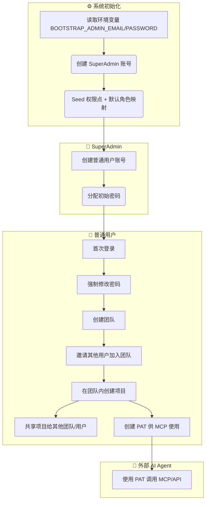
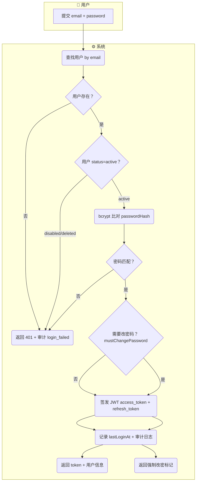
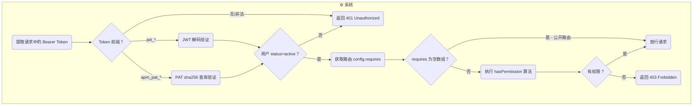

# 团队/用户/权限管理 产品需求规格书（PRD）

> **模块**：M6-团队权限管理
> **状态**：draft
> **版本**：v1.0
> **日期**：2026-07-15
> **作者**：PM + AI 协作
> **关联文档**：
>   - S0 方向决策 → `docs/01-design-idea/team-permission-design.md`
>   - 领域模型 → `docs/02-domain-model/team-permission-model.md`
>   - 交互设计 → `team-permission-interaction.md`（S3 产出，待创建）
>   - PRD 编写规范 → `docs/03-prd-ux/prd-convention.md`

---

## 1. 概述

### 1.1 定位与目标

M6 团队权限管理模块是 **ai-prototype-manager 系统的平台设施层模块**，为系统从单用户工具转变为多团队协作平台提供身份认证、团队隔离、项目共享和权限控制能力。

**核心定位**：
- 为系统所有资源操作提供**身份标识**（谁在操作）
- 为项目资源提供**归属容器**（属于哪个团队）
- 为跨团队协作提供**共享机制**（项目级显式授权）
- 为功能操作提供**访问控制**（三层角色 × 权限点映射）

**解决什么问题**：
- 多团队共享同一部署实例时，需要数据隔离和访问控制
- MCP Server 对外暴露时，需要身份认证防止未授权访问
- 不同角色的团队成员需要差异化的操作权限

**核心价值**：
- 支持公司级多团队并行使用，互不干扰
- 通过 PAT 为 MCP Server 提供安全的身份认证
- 灵活的项目共享机制支撑跨团队协作

### 1.2 用户角色

| 角色 | 描述 | 本模块权限 |
|------|------|:---------:|
| **SuperAdmin（超级管理员）** | 系统初始化时通过 Bootstrap 创建的首个账号。管理全局用户/团队/权限 | 全部 |
| **普通用户（User）** | 被 SuperAdmin 创建的账号。可创建/加入团队、管理自己的 Token | 受角色约束 |
| **团队 Owner** | 团队创建者（或被转让者）。管理团队信息/成员/解散 | 团队级全部 |
| **团队 Admin** | 被 Owner 提升的管理角色。邀请/移除成员、管理项目 | 团队级大部分 |
| **团队 Member** | 普通成员。在团队内创建/编辑项目 | 团队级基础 |
| **项目 Editor** | 通过共享获得编辑权的外部人员 | 项目级读写 |
| **项目 Viewer** | 通过共享获得只读权的外部人员 | 项目级只读 |

### 1.3 前置依赖

| 依赖项 | 状态 | 说明 |
|--------|:----:|------|
| S0 方向决策（D1-D6 + R1-R3） | ✅ 完成 | `docs/01-design-idea/team-permission-design.md` |
| S1 领域模型（8 实体 + Project 变更） | ✅ 完成 | `docs/02-domain-model/team-permission-model.md` |
| 现有 Project API（M1 已实现） | ✅ 完成 | 需增强：加 team_id/created_by/visibility + 权限校验 |
| PRD 编写规范 v2.0 | ✅ 完成 | `docs/03-prd-ux/prd-convention.md` |

---

## 2. 业务流程

> 本节定义业务动作的先后顺序和输入输出，不涉及具体的交互界面。

### 2.1 模块级主业务流程（Happy Path）

> 从系统部署到日常使用的完整 Happy Path：**部署初始化 → 创建用户 → 创建团队 → 管理项目 → 跨团队协作**

### 2.2 认证流程（含异常分支）

### 2.3 项目访问权限判定流程

---

## 3. 功能范围总览

### 3.1 功能清单

| # | 功能点 | 优先级 | 描述 | 对应章节 |
|---|--------|:------:|------|:--------:|
| F-M6-01 | 用户登录 | P0 | email + password 登录获取 JWT | §4.1 |
| F-M6-02 | 用户登出 | P0 | 使当前 session 失效 | §4.2 |
| F-M6-03 | 修改密码 | P0 | 用户自行修改密码，所有 PAT 自动作废 | §4.3 |
| F-M6-04 | 重置密码（CLI） | P1 | SuperAdmin 通过 CLI 重置用户密码 | §4.4 |
| F-M6-05 | 首次登录强制改密 | P0 | 代建账号首次登录必须修改初始密码 | §4.5 |
| F-M6-06 | 创建用户账号 | P0 | SuperAdmin 在后台创建用户并分配初始密码 | §4.6 |
| F-M6-07 | 禁用/启用用户 | P1 | SuperAdmin 管理用户状态 | §4.7 |
| F-M6-08 | 创建团队 | P0 | 任何登录用户可创建团队，自动成为 Owner | §4.8 |
| F-M6-09 | 管理团队信息 | P1 | Owner/Admin 修改团队名称/描述/头像 | §4.9 |
| F-M6-10 | 解散团队 | P2 | Owner 解散无项目的团队 | §4.10 |
| F-M6-11 | 邀请成员加入团队 | P0 | Owner/Admin 添加用户到团队，直接生效 | §4.11 |
| F-M6-12 | 移除团队成员 | P0 | Owner/Admin 将成员移出团队 | §4.12 |
| F-M6-13 | 变更团队成员角色 | P1 | Owner 调整成员的 teamRole | §4.13 |
| F-M6-14 | 退出团队 | P1 | 成员主动退出（Owner 不可退出） | §4.14 |
| F-M6-15 | 共享项目 | P0 | 项目 Owner/Admin 将项目共享给外部团队/用户 | §4.15 |
| F-M6-16 | 撤销项目共享 | P0 | 取消已有的共享授权 | §4.16 |
| F-M6-17 | 变更项目共享角色 | P1 | 调整共享对象的角色（editor↔viewer） | §4.17 |
| F-M6-18 | 创建 Access Token | P0 | 用户生成 PAT 供 MCP/API 调用 | §4.18 |
| F-M6-19 | 撤销 Access Token | P0 | 手动作废 PAT | §4.19 |
| F-M6-20 | 查看 Token 列表 | P1 | 查看自己的所有 PAT 及状态 | §4.20 |
| F-M6-21 | 角色-权限映射配置 | P1 | SuperAdmin 在 Web 后台调整角色权限 | §4.21 |
| F-M6-22 | 查看审计日志 | P1 | SuperAdmin 查看安全事件日志 | §4.22 |

### 3.2 Out of Scope（不在本模块范围内）

| 功能 | 原因 | 归属 |
|------|------|------|
| 项目跨团队迁移（转让） | 复杂度高，MVP 后评估 | Phase 2+ |
| 开放注册 / 邀请码注册 | 公司内部使用场景无需 | Phase 3 |
| SSO / OIDC 登录 | D2 决策分阶段，先做本地账号 | Phase 2 |
| 字段级权限（L4） | D3 决策只做 L1~L3 | Phase 3 |
| 团队树形层级管理 | D5 决策 MVP 单层 | Phase 2 |
| 权限点 Scope 限定 for PAT | R1-P2 决策 MVP 不做 | Phase 2 |
| 批量用户导入 | 低频需求 | Phase 2 |

### 3.3 术语表

| 术语 | 定义 |
|------|------|
| **PlatformRole** | 平台级角色（super_admin / user），决定全局管理权限 |
| **TeamRole** | 团队内角色（owner / admin / member），决定团队资源操作权限 |
| **ProjectRole** | 项目共享角色（editor / viewer），决定被共享项目的操作权限 |
| **PAT** | Personal Access Token，用于 MCP/API 的长期 Bearer Token |
| **权限点** | `resource.action` 格式的功能操作标识，如 `project.create` |
| **Bootstrap** | 系统首次启动时通过环境变量创建 SuperAdmin 的过程 |
| **mustChangePassword** | 标记用户是否需要在下次登录时强制修改密码 |

---

## 4. 功能点详细设计

### 4.1 用户登录

> **编号**：F-M6-01
> **优先级**：P0
> **前置功能**：无（系统启动即可用）

#### 4.1.1 涉及的领域模型

| 实体 | 用途 | 关键字段 |
|------|------|---------|
| User | 校验身份 | email, passwordHash, status, platformRole, mustChangePassword, lastLoginAt |
| AuditLog | 记录事件 | eventType=auth.login_success/auth.login_failed |

#### 4.1.2 业务动作与输入输出

| 步骤 | 业务动作 | 输入 | 输出 | 前置条件 | 异常处理 |
|------|---------|------|------|---------|---------|
| 1 | 用户提交登录凭证 | email, password | — | 无 | — |
| 2 | 系统查找用户 | email | User 记录 | — | 不存在→401 |
| 3 | 系统校验用户状态 | User.status | — | status=active | disabled/deleted→401 |
| 4 | 系统校验密码 | password, passwordHash | 匹配结果 | — | 不匹配→401 + 审计 |
| 5 | 系统签发 Token | userId, platformRole | access_token(JWT 15min) + refresh_token(7d) | — | — |
| 6 | 系统更新登录信息 | userId | lastLoginAt 更新 | — | — |
| 7 | 系统记录审计日志 | userId, IP, UA | AuditLog | — | — |
| 8 | 系统返回结果 | — | token + user info + mustChangePassword 标记 | — | — |

#### 4.1.3 业务规则

**校验规则**：

| 字段 | 规则 | 错误提示 |
|------|------|---------|
| email | 非空，合法 email 格式 | "请输入有效的邮箱地址" |
| password | 非空 | "请输入密码" |

**业务约束**：

| # | 规则 | 说明 |
|---|------|------|
| B-M6-01 | 连续 5 次登录失败锁定账号 15 分钟 | 防暴力破解，按 IP+email 组合计数 |
| B-M6-02 | 登录不区分"用户不存在"和"密码错误" | 统一返回"邮箱或密码错误"，防枚举 |
| B-M6-03 | JWT payload 包含 userId + platformRole + iat + exp | 前端据此判断权限，无需额外请求 |

#### 4.1.4 数据规格

**输入数据**：

| 字段 | 类型 | 必填 | 校验规则 |
|------|------|:----:|---------|
| email | string | ✅ | 合法 email，不区分大小写（统一 toLowerCase） |
| password | string | ✅ | 非空 |

**输出数据**：

| 字段 | 类型 | 说明 |
|------|------|------|
| accessToken | string | JWT，前缀 `jwt_`，有效期 15min |
| refreshToken | string | JWT，有效期 7d，用于续签 |
| user.id | string | 用户 UUID |
| user.email | string | 邮箱 |
| user.displayName | string | 显示名称 |
| user.platformRole | enum | super_admin / user |
| user.mustChangePassword | boolean | 是否需要强制改密 |

#### 4.1.5 AI 编码提示

- **密码比对必须用 bcrypt.compare()**：不可将 hash 存明文或用 === 比较
- **统一错误信息**：无论哪步失败都返回相同 401 body，防止信息泄露
- **审计日志异步写入**：不阻塞登录响应，但必须确保最终一致

---

### 4.2 用户登出

> **编号**：F-M6-02
> **优先级**：P0
> **前置功能**：F-M6-01

#### 4.2.2 业务动作与输入输出

| 步骤 | 业务动作 | 输入 | 输出 |
|------|---------|------|------|
| 1 | 用户请求登出 | access_token | — |
| 2 | 系统将 token 加入黑名单（Redis/内存） | token jti | — |
| 3 | 系统清除 refresh_token | — | — |
| 4 | 返回 204 | — | 无内容 |

#### 4.2.3 业务规则

| # | 规则 | 说明 |
|---|------|------|
| B-M6-04 | JWT 黑名单存活时间 = token 剩余有效期 | 过期后自然失效无需保留 |
| B-M6-05 | 登出后 refresh_token 不可再续签 | 必须重新登录 |

---

### 4.3 修改密码

> **编号**：F-M6-03
> **优先级**：P0
> **前置功能**：F-M6-01

#### 4.3.2 业务动作与输入输出

| 步骤 | 业务动作 | 输入 | 输出 | 异常处理 |
|------|---------|------|------|---------|
| 1 | 用户提交旧密码+新密码 | oldPassword, newPassword | — | — |
| 2 | 系统校验旧密码 | oldPassword vs passwordHash | — | 不匹配→400 |
| 3 | 系统校验新密码强度 | newPassword | — | 不满足→400 |
| 4 | 系统更新 passwordHash | bcrypt(newPassword) | — | — |
| 5 | 系统清除 mustChangePassword 标记 | — | mustChangePassword=false | — |
| 6 | 系统作废所有 PAT | userId | AccessToken.status→revoked | — |
| 7 | 系统使当前 JWT 外的所有 session 失效 | — | — | — |
| 8 | 记录审计日志 | auth.password_changed | AuditLog | — |

#### 4.3.3 业务规则

**校验规则**：

| 字段 | 规则 | 错误提示 |
|------|------|---------|
| oldPassword | 与当前 hash 匹配 | "当前密码错误" |
| newPassword | ≥12位 + 大写 + 小写 + 数字 + 符号 | "密码需≥12位，含大小写字母、数字和符号" |
| newPassword | 不等于 oldPassword | "新密码不能与旧密码相同" |

---

### 4.4 重置密码（CLI）

> **编号**：F-M6-04
> **优先级**：P1
> **前置功能**：F-M6-06

#### 4.4.2 业务动作与输入输出

| 步骤 | 业务动作 | 输入 | 输出 |
|------|---------|------|------|
| 1 | SuperAdmin 执行 CLI 命令 | `pnpm --filter api reset-admin-password <email> <newPassword>` | — |
| 2 | 系统校验用户存在 | email | — |
| 3 | 系统校验新密码强度 | newPassword | — |
| 4 | 系统更新 passwordHash + 设置 mustChangePassword=true | — | 用户下次登录强制改密 |
| 5 | 系统作废该用户所有 PAT | — | — |

#### 4.4.3 业务规则

| # | 规则 | 说明 |
|---|------|------|
| B-M6-04b | CLI 仅在服务器本地执行，不暴露为 API | 安全约束 |
| B-M6-04c | 执行后控制台输出成功/失败，不输出密码 | 防止日志泄露 |

---

### 4.5 首次登录强制改密

> **编号**：F-M6-05
> **优先级**：P0
> **前置功能**：F-M6-06（代建账号时设置 mustChangePassword=true）

#### 4.5.2 业务动作与输入输出

| 步骤 | 业务动作 | 输入 | 输出 |
|------|---------|------|------|
| 1 | 登录成功后系统检测 mustChangePassword | — | 标记=true |
| 2 | 系统限制：仅允许调用改密接口，其他 API 返回 403 | — | — |
| 3 | 用户提交新密码 | newPassword（无需 oldPassword） | — |
| 4 | 系统更新密码 + 清除 mustChangePassword | — | 正常使用系统 |

#### 4.5.3 业务规则

| # | 规则 | 说明 |
|---|------|------|
| B-M6-06 | mustChangePassword=true 时只能访问 change-password 和 logout | 全局 preHandler 拦截 |
| B-M6-07 | 首次改密不需要验证旧密码 | 因为旧密码是 SuperAdmin 设的，用户可能不知道 |

---

### 4.6 创建用户账号

> **编号**：F-M6-06
> **优先级**：P0
> **前置功能**：无
> **权限要求**：platform.manage（SuperAdmin）

#### 4.6.2 业务动作与输入输出

| 步骤 | 业务动作 | 输入 | 输出 | 异常处理 |
|------|---------|------|------|---------|
| 1 | SuperAdmin 提交用户信息 | email, displayName, initialPassword | — | — |
| 2 | 系统校验 email 唯一性 | email | — | 重复→409 |
| 3 | 系统校验密码强度 | initialPassword | — | 不足→400 |
| 4 | 系统创建 User | — | User(status=active, mustChangePassword=true, platformRole=user) | — |
| 5 | 记录审计日志 | — | AuditLog | — |

#### 4.6.4 数据规格

**输入数据**：

| 字段 | 类型 | 必填 | 校验规则 |
|------|------|:----:|---------|
| email | string | ✅ | 合法 email，全局唯一（不区分大小写） |
| displayName | string | ✅ | 1~50 字符 |
| initialPassword | string | ✅ | ≥12位 + 大写 + 小写 + 数字 + 符号 |

---

### 4.7 禁用/启用用户

> **编号**：F-M6-07
> **优先级**：P1
> **前置功能**：F-M6-06
> **权限要求**：platform.manage（SuperAdmin）

#### 4.7.2 业务动作与输入输出

| 步骤 | 业务动作 | 输入 | 输出 | 异常处理 |
|------|---------|------|------|---------|
| 1 | SuperAdmin 切换用户状态 | userId, targetStatus(active/disabled) | — | — |
| 2 | 系统校验：不能禁用自己 | currentUser ≠ targetUser | — | 自己→400 |
| 3 | 系统校验：不能禁用另一个 SuperAdmin | target.platformRole | — | 是 SuperAdmin→403 |
| 4 | 系统更新 User.status | — | status 变更 | — |
| 5 | 若禁用：使该用户所有 session 失效 | — | JWT 黑名单 | — |
| 6 | 记录审计日志 | admin.user_disabled 或 admin.user_enabled | — | — |

#### 4.7.3 业务规则

| # | 规则 | 说明 |
|---|------|------|
| B-M6-07b | 禁用不删除数据，启用后恢复原状 | PAT 状态随用户状态恢复 |
| B-M6-07c | disabled 用户的 PAT 在 verify 时检查用户状态拒绝 | 无需单独 revoke PAT |

---

### 4.8 创建团队

> **编号**：F-M6-08
> **优先级**：P0
> **前置功能**：F-M6-01
> **权限要求**：team.create（任何 active 用户）

#### 4.8.2 业务动作与输入输出

| 步骤 | 业务动作 | 输入 | 输出 | 异常处理 |
|------|---------|------|------|---------|
| 1 | 用户提交团队信息 | name, displayName, description? | — | — |
| 2 | 系统校验 name 唯一性 | name | — | 重复→409 |
| 3 | 系统创建 Team | — | Team(status=active) | — |
| 4 | 系统创建 TeamMember | userId=当前用户, teamRole=owner | — | — |
| 5 | 记录审计日志 | team.created | AuditLog | — |

#### 4.8.4 数据规格

**输入数据**：

| 字段 | 类型 | 必填 | 校验规则 |
|------|------|:----:|---------|
| name | string | ✅ | 2~30 字符，仅 `[a-z0-9-]`，全局唯一 |
| displayName | string | ✅ | 1~50 字符 |
| description | string | - | 0~200 字符 |

---

### 4.9 管理团队信息

> **编号**：F-M6-09
> **优先级**：P1
> **权限要求**：team.manage（Owner/Admin）

#### 4.9.2 业务动作与输入输出

| 步骤 | 业务动作 | 输入 | 输出 |
|------|---------|------|------|
| 1 | Owner/Admin 提交修改 | displayName?, description?, avatar? | — |
| 2 | 系统校验字段（displayName 1~50字符，description 0~200） | — | — |
| 3 | 系统更新 Team 记录 | — | 更新后的 Team |

> name（团队唯一标识）不可修改，避免破坏引用。

---

### 4.10 解散团队

> **编号**：F-M6-10
> **优先级**：P2
> **权限要求**：team.manage（仅 Owner）

#### 4.10.2 业务动作与输入输出

| 步骤 | 业务动作 | 输入 | 输出 | 异常处理 |
|------|---------|------|------|---------|
| 1 | Owner 请求解散团队 | teamId | — | — |
| 2 | 系统校验无活跃项目 | — | — | 有项目→400 |
| 3 | 系统更新 Team.status=dissolved | — | — | — |
| 4 | 系统删除所有 TeamMember 记录 | — | — | — |
| 5 | 记录审计日志 | team.dissolved | — | — |

---

### 4.11 邀请成员加入团队

> **编号**：F-M6-11
> **优先级**：P0
> **前置功能**：F-M6-08
> **权限要求**：team.invite（Owner/Admin）

#### 4.11.2 业务动作与输入输出

| 步骤 | 业务动作 | 输入 | 输出 | 异常处理 |
|------|---------|------|------|---------|
| 1 | Owner/Admin 选择用户并指定角色 | userId, teamRole | — | — |
| 2 | 系统校验目标用户存在且 active | userId | — | 不存在/非 active→400 |
| 3 | 系统校验未重复加入 | userId + teamId | — | 已是成员→409 |
| 4 | 系统校验角色权限：只能邀请比自己低的角色 | 邀请人 teamRole vs 被邀请 teamRole | — | 越权→403 |
| 5 | 系统创建 TeamMember | — | TeamMember(直接生效) | — |
| 6 | 记录审计日志 | team.member_invited | AuditLog | — |

#### 4.11.3 业务规则

| # | 规则 | 说明 |
|---|------|------|
| B-M6-08 | Owner 可邀请任何角色（owner/admin/member） | Owner 是最高权力 |
| B-M6-09 | Admin 只能邀请 member | 不可平级或提升 |
| B-M6-10 | 邀请直接生效，无需被邀请人确认 | 公司内部信任模型 |

---

### 4.12 移除团队成员

> **编号**：F-M6-12
> **优先级**：P0
> **前置功能**：F-M6-11
> **权限要求**：team.remove（Owner/Admin）

#### 4.12.2 业务动作与输入输出

| 步骤 | 业务动作 | 输入 | 输出 | 异常处理 |
|------|---------|------|------|---------|
| 1 | Owner/Admin 选择要移除的成员 | memberId | — | — |
| 2 | 系统校验：不能移除自己 | 当前用户 ≠ 目标 | — | 自己→400 |
| 3 | 系统校验：只能移除比自己低的角色 | 操作人 role vs 目标 role | — | 越权→403 |
| 4 | 系统校验：Owner 不可被移除 | 目标 teamRole | — | 是 Owner→403 |
| 5 | 系统删除 TeamMember 记录 | — | — | — |
| 6 | 系统清理该用户在该团队项目的隐式权限 | — | 列表不再展示 | — |
| 7 | 记录审计日志 | team.member_removed | AuditLog | — |

---

### 4.13 变更团队成员角色

> **编号**：F-M6-13
> **优先级**：P1
> **权限要求**：team.manage（仅 Owner）

#### 4.13.2 业务动作与输入输出

| 步骤 | 业务动作 | 输入 | 输出 | 异常处理 |
|------|---------|------|------|---------|
| 1 | Owner 选择成员并指定新角色 | memberId, newTeamRole | — | — |
| 2 | 系统校验：不能修改自己 | currentUser ≠ target | — | 自己→400 |
| 3 | 系统校验：不能把别人升为 owner | newTeamRole ≠ owner | — | →400（转让用专用接口） |
| 4 | 系统更新 TeamMember.teamRole | — | 更新后的 TeamMember | — |
| 5 | 记录审计日志 | admin.role_changed | — | — |

#### 4.13.3 业务规则

| # | 规则 | 说明 |
|---|------|------|
| B-M6-13b | Owner 转让用专用接口 transferOwnership | 提升新 Owner + 降级旧 Owner 为 admin，原子操作 |

---

### 4.14 退出团队

> **编号**：F-M6-14
> **优先级**：P1
> **前置功能**：F-M6-11

#### 4.14.2 业务动作与输入输出

| 步骤 | 业务动作 | 输入 | 输出 | 异常处理 |
|------|---------|------|------|---------|
| 1 | 成员请求退出团队 | teamId | — | — |
| 2 | 系统校验：Owner 不可退出 | currentUser.teamRole | — | Owner→400 "请先转让" |
| 3 | 系统删除 TeamMember 记录 | — | — | — |
| 4 | 系统清理该用户在该团队项目的隐式权限 | — | — | — |

---

### 4.15 共享项目

> **编号**：F-M6-15
> **优先级**：P0
> **前置功能**：F-M6-08, M1 项目创建
> **权限要求**：project.share（项目归属团队的 Owner/Admin）

#### 4.15.2 业务动作与输入输出

| 步骤 | 业务动作 | 输入 | 输出 | 异常处理 |
|------|---------|------|------|---------|
| 1 | 操作人选择项目 + 授权目标 | projectId, granteeType, granteeId, projectRole | — | — |
| 2 | 系统校验操作人对该项目有 project.share 权限 | — | — | 无权→403 |
| 3 | 系统校验不能共享给项目归属团队 | granteeType=team, granteeId ≠ project.teamId | — | 冗余→400 |
| 4 | 系统校验不能共享给自己 | granteeType=user, granteeId ≠ currentUserId | — | 自己→400 |
| 5 | 系统校验不重复 | (projectId, granteeType, granteeId) 唯一 | — | 重复→409 |
| 6 | 系统创建 ProjectShare | — | ProjectShare | — |
| 7 | 若项目 visibility=private，更新为 shared | — | — | — |
| 8 | 记录审计日志 | project.shared | AuditLog | — |

#### 4.15.4 数据规格

**输入数据**：

| 字段 | 类型 | 必填 | 校验规则 |
|------|------|:----:|---------|
| projectId | string | ✅ | 有效 UUID，项目存在且 active |
| granteeType | enum | ✅ | "team" \| "user" |
| granteeId | string | ✅ | 对应 Team.id 或 User.id，必须存在 |
| projectRole | enum | ✅ | "editor" \| "viewer" |

---

### 4.16 撤销项目共享

> **编号**：F-M6-16
> **优先级**：P0
> **权限要求**：project.share（项目归属团队 Owner/Admin）

#### 4.16.2 业务动作与输入输出

| 步骤 | 业务动作 | 输入 | 输出 |
|------|---------|------|------|
| 1 | 操作人选择要撤销的共享记录 | shareId | — |
| 2 | 系统删除 ProjectShare 记录 | — | — |
| 3 | 若无其他共享记录，更新 project.visibility=private | — | — |
| 4 | 记录审计日志 | project.share_revoked | — |

---

### 4.17 变更项目共享角色

> **编号**：F-M6-17
> **优先级**：P1
> **权限要求**：project.share（项目归属团队 Owner/Admin）

#### 4.17.2 业务动作与输入输出

| 步骤 | 业务动作 | 输入 | 输出 |
|------|---------|------|------|
| 1 | 操作人修改共享角色 | shareId, newProjectRole(editor/viewer) | — |
| 2 | 系统更新 ProjectShare.projectRole | — | 更新后的 ProjectShare |

---

### 4.18 创建 Access Token

> **编号**：F-M6-18
> **优先级**：P0
> **前置功能**：F-M6-01
> **权限要求**：token.manage（任何 active 用户）

#### 4.18.2 业务动作与输入输出

| 步骤 | 业务动作 | 输入 | 输出 | 异常处理 |
|------|---------|------|------|---------|
| 1 | 用户提交 Token 名称 + 可选过期时间 | name, expiresAt? | — | — |
| 2 | 系统生成明文 token | — | plainToken = `apm_pat_` + 32字节base62 | — |
| 3 | 系统计算 hash 并存储 | sha256(plainToken) | AccessToken(status=active) | — |
| 4 | 系统返回明文 token（仅此一次） | — | plainToken | — |
| 5 | 记录审计日志 | auth.token_created | AuditLog | — |

#### 4.18.3 业务规则

| # | 规则 | 说明 |
|---|------|------|
| B-M6-11 | 明文 token 只在创建响应中返回一次 | 后续不可恢复，丢失需重新创建 |
| B-M6-12 | 每用户最多 10 个活跃 PAT | 防止滥用 |
| B-M6-13 | PAT 继承创建者的全部权限 | MVP 不做 scope 限定 |

#### 4.18.4 数据规格

**输入数据**：

| 字段 | 类型 | 必填 | 校验规则 |
|------|------|:----:|---------|
| name | string | ✅ | 1~50 字符，用户自定义（如"我的 Claude Code"） |
| expiresAt | datetime | - | 未来时间，null 表示永不过期 |

**输出数据（仅创建时返回）**：

| 字段 | 类型 | 说明 |
|------|------|------|
| id | string | Token UUID |
| plainToken | string | 完整明文，格式 `apm_pat_xxxxxxxx...`（⚠️ 仅此一次） |
| name | string | 用户命名 |
| tokenPrefix | string | 前 16 位用于后续识别 |
| expiresAt | datetime? | 过期时间 |
| createdAt | datetime | 创建时间 |

---

### 4.19 撤销 Access Token

> **编号**：F-M6-19
> **优先级**：P0
> **权限要求**：token.manage（任何 active 用户，只能撤销自己的）

#### 4.19.2 业务动作与输入输出

| 步骤 | 业务动作 | 输入 | 输出 |
|------|---------|------|------|
| 1 | 用户选择要撤销的 Token | tokenId | — |
| 2 | 系统校验 Token 属于当前用户 | token.userId = currentUser.id | — |
| 3 | 系统更新 AccessToken.status=revoked | — | — |
| 4 | 记录审计日志 | auth.token_revoked | — |

---

### 4.20 查看 Token 列表

> **编号**：F-M6-20
> **优先级**：P1
> **权限要求**：token.manage

#### 4.20.2 业务动作与输入输出

| 步骤 | 业务动作 | 输入 | 输出 |
|------|---------|------|------|
| 1 | 用户查看自己的 Token 列表 | — | 分页 Token 列表 |

#### 4.20.4 数据规格

**输出数据（列表项）**：

| 字段 | 类型 | 说明 |
|------|------|------|
| id | string | Token UUID |
| name | string | 用户命名 |
| tokenPrefix | string | 前 16 位（用于识别） |
| status | enum | active / revoked / expired |
| expiresAt | datetime? | 过期时间 |
| lastUsedAt | datetime? | 最后使用时间 |
| createdAt | datetime | 创建时间 |

> ❗ 列表不返回 tokenHash，明文不可恢复。

---

### 4.21 角色-权限映射配置

> **编号**：F-M6-21
> **优先级**：P1
> **前置功能**：F-M6-01
> **权限要求**：platform.manage（SuperAdmin）

#### 4.21.2 业务动作与输入输出

| 步骤 | 业务动作 | 输入 | 输出 |
|------|---------|------|------|
| 1 | SuperAdmin 查看当前角色-权限矩阵 | — | 所有 roleType×roleValue 的权限点列表 |
| 2 | SuperAdmin 勾选/取消某角色的权限点 | roleType, roleValue, permissionKey, enabled | — |
| 3 | 系统更新 RolePermission 记录 | — | INSERT 或 DELETE | |
| 4 | 变更即时生效（下次 API 请求使用新映射） | — | — |

#### 4.21.3 业务规则

| # | 规则 | 说明 |
|---|------|------|
| B-M6-14 | super_admin 的权限不可通过此界面修改 | SuperAdmin 永远拥有全部权限（代码直通） |
| B-M6-15 | 修改立即生效，无需重启服务 | RolePermission 查询不做缓存，或每次查 DB |

---

### 4.22 查看审计日志

> **编号**：F-M6-22
> **优先级**：P1
> **前置功能**：F-M6-01
> **权限要求**：platform.manage（SuperAdmin）

#### 4.22.2 业务动作与输入输出

| 步骤 | 业务动作 | 输入 | 输出 |
|------|---------|------|------|
| 1 | SuperAdmin 查看审计日志列表 | 筛选条件（时间范围/eventType/userId） | 分页日志列表 |
| 2 | SuperAdmin 查看单条日志详情 | logId | 日志全部字段（含 details JSON） |

#### 4.22.4 数据规格

**筛选条件**：

| 字段 | 类型 | 必填 | 说明 |
|------|------|:----:|------|
| startDate | datetime | - | 起始时间（默认 7 天前） |
| endDate | datetime | - | 结束时间（默认当前） |
| eventType | string | - | 筛选事件类型 |
| userId | string | - | 筛选操作人 |
| page | number | - | 分页页码，默认 1 |
| pageSize | number | - | 每页条数，默认 50，最大 200 |

---

## 5. 跨功能规则

### 5.1 全局状态流转约束

| 实体 | 允许的状态转换 | 禁止的转换 |
|------|--------------|-----------|
| User | active→disabled→active, active→deleted, disabled→deleted | deleted→任何状态 |
| Team | active→dissolved | dissolved→任何状态 |
| AccessToken | active→revoked, active→expired | revoked/expired→任何状态 |

### 5.2 全局校验规则

| # | 规则 | 适用范围 |
|---|------|---------|
| G-01 | 密码强度：≥12位 + 大小写字母 + 数字 + 符号 | 所有密码输入场景 |
| G-02 | email 不区分大小写，存储时统一 toLowerCase | 所有 email 字段 |
| G-03 | 角色权力阶梯 owner > admin > member，只能管理比自己低的 | 邀请/移除/变更角色 |
| G-04 | 所有破坏性操作（禁用用户/解散团队/撤销共享）需确认 | 前端确认（S3 定义），后端幂等 |

### 5.3 全局业务约定

| # | 约定 | 说明 |
|---|------|------|
| GA-01 | 默认拒绝：未声明 `config.requires` 的路由返回 403 | 安全兜底 |
| GA-02 | SuperAdmin 直通：platformRole=super_admin 跳过所有权限检查 | 代码级保障 |
| GA-03 | 操作审计：所有安全相关操作写入 AuditLog | INSERT-ONLY，不可删改 |
| GA-04 | Token 双轨：Web 用 JWT(15min+refresh)，MCP 用 PAT(长期) | Bearer 前缀区分 |
| GA-05 | 项目列表过滤：非 SuperAdmin 只能看到归属团队项目 + 被共享项目 | applyProjectScope 算法 |

### 5.4 权限与访问控制

**三层角色决定访问权限**：

| 层级 | 角色 | 权限范围 | 赋予方式 |
|------|------|---------|---------|
| 平台层 | super_admin / user | 全局管理功能 | Bootstrap / 代码设定 |
| 团队层 | owner / admin / member | 团队内资源管理 | 创建团队 / 被邀请时指定 |
| 项目层 | editor / viewer | 被共享项目的操作 | 共享时指定 |

**权限判定优先级**（同一项目对同一用户）：
1. SuperAdmin → 全通
2. 项目归属团队成员 → 按 teamRole 映射
3. 被共享（user 级）→ 按 projectRole 映射
4. 被共享（team 级）→ 按 projectRole 映射
5. 以上均无匹配 → 403

---

## 6. 验收标准

### 6.1 功能验收

| # | 验收项 | 通过条件 |
|---|--------|---------|
| AC-01 | Bootstrap 初始化 | 环境变量正确时首次启动自动创建 SuperAdmin + seed 权限 |
| AC-02 | 登录/登出 | 正确凭证→获取 JWT；错误凭证→统一 401；登出后 token 失效 |
| AC-03 | 首登改密 | 代建账号首次登录后只能改密码，改完后正常使用 |
| AC-04 | 团队 CRUD | 创建团队→自动成 Owner；邀请/移除成员→直接生效；角色变更→遵循阶梯约束 |
| AC-05 | 项目共享 | 共享后被授权方可在项目列表看到；撤销后立即不可见 |
| AC-06 | PAT 管理 | 创建→返回明文仅一次；使用 PAT 可正常调 API；撤销后 PAT 失效 |
| AC-07 | 权限校验 | 无权限→403；有权限→放行；未声明 requires 的路由→403 |
| AC-08 | 审计日志 | 登录/改密/创建团队/共享项目等事件正确记录，SuperAdmin 可查看 |
| AC-09 | 角色权限配置 | SuperAdmin 可在 Web 调整映射，变更即时生效 |

### 6.2 边界 & 异常场景验收

| # | 场景 | 预期行为 |
|---|------|---------|
| EX-01 | 连续 5 次错误登录 | 锁定 15 分钟，返回"账号已锁定，请稍后重试" |
| EX-02 | 禁用的用户尝试登录 | 返回 401（不泄露具体原因） |
| EX-03 | 用户改密码后用旧 PAT 调 API | 返回 401（PAT 已 revoke） |
| EX-04 | Owner 尝试退出自己的团队 | 返回 400"Owner 不可退出，请先转让" |
| EX-05 | 共享给已是归属团队的用户 | 返回 400"该用户已是团队成员，无需共享" |
| EX-06 | 解散有项目的团队 | 返回 400"团队下仍有项目，请先迁移或删除" |
| EX-07 | mustChangePassword=true 时调其他 API | 返回 403"请先修改密码" |
| EX-08 | 超过 10 个活跃 PAT 时再创建 | 返回 400"活跃 Token 数已达上限" |
