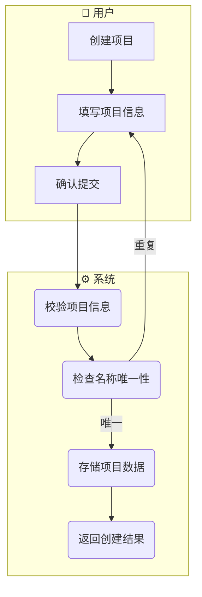
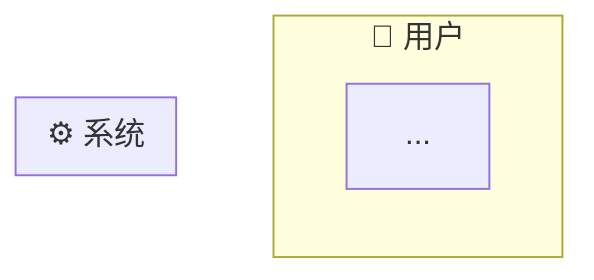
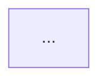
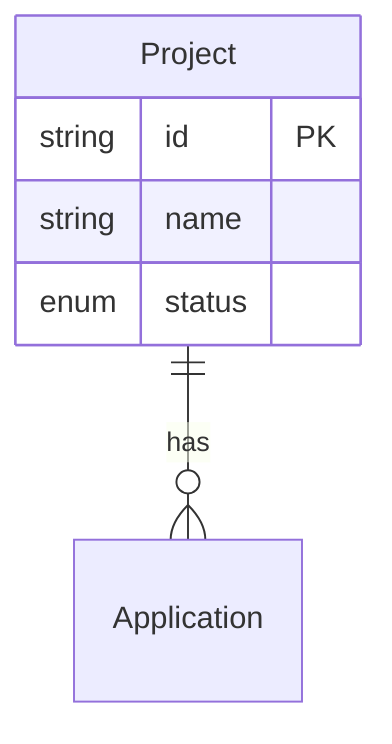
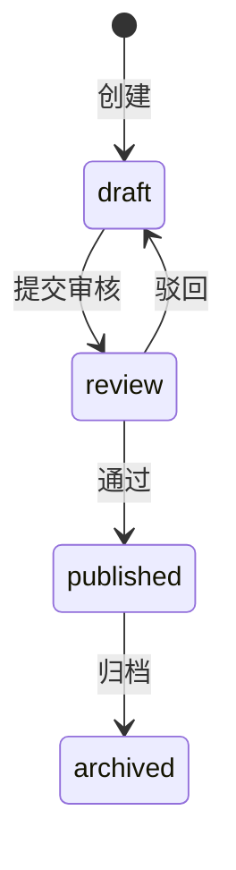

# PRD 编写规范

> **文档编号**：docs/03-prd-ux/prd-convention.md
> **状态**：v2.0 approved
> **日期**：2026-05-25
> **定位**：本项目中所有模块 PRD 的编写模板与格式规范
> **适用范围**：S2（产品 PRD 设计 — 纯业务层）的产出物格式规范
> **文件存放位置**：见 AGENTS.md「项目目录规范」中 `03-prd-ux/` 的子目录说明

---

## 0. 核心原则

1. **纯业务层定位**：PRD 只定义业务层的「做什么」—— 领域模型、业务流程（动作先后顺序与输入输出，不涉及交互界面细节）、业务规则、数据规格。不涉及「怎么做」（技术方案归 S4）和「怎么交互」（交互设计归 S3）
2. **双目标**：PRD 既要是人可读的产品文档，也要是 AI 可消费的结构化规格
3. **业务级粒度**：每个功能点定义业务动作、业务规则和数据规格——AI 可据此理解业务意图，具体的页面布局和交互行为由 S3 交互设计文档定义
4. **AI 编码提示为辅**：仅记录实现陷阱，不重复技术方案已覆盖的内容
5. **以功能点为原子单元**：每个功能点自包含所有业务维度（领域模型→业务动作→业务规则→数据规格→AI 提示）

> **S2/S3 分离原则**（2026-05-25 决策）：
> - **S2（PRD）= 纯业务层**：领域模型、业务流程（只描述动作先后顺序和输入输出）、业务规则、数据规格
> - **S3（交互设计）= 交互层**：人-系统交互（页面布局、UI 元素、操作流程）+ AI-系统交互（语义层设计、数据绑定）
> - 页面布局、UI 元素清单、交互行为、弹窗确认方式等交互层面内容 → 写在 `[模块名]-interaction.md`（S3 产出物）
> - PRD 中不再包含「页面设计」和「交互行为」子章节，这些内容已移至 S3

---

## 1. 文档结构总览

```
# [模块名] 产品需求规格书（PRD）
> 元信息头

## 1. 概述
│  1.1 定位与目标
│  1.2 用户角色
│  1.3 前置依赖
│
## 2. 业务流程 ★ 骨架
│  2.1 模块级主业务流程（Happy Path）
│  2.2 完整流程（含异常分支）
│
## 3. 功能范围总览
│  3.1 功能清单
│  3.2 Out of Scope
│  3.3 术语表（按需）
│
## 4. 功能点详细设计 ★ 血肉（核心）
│  4.X [功能点名]
│  │  4.X.1 涉及的领域模型
│  │  4.X.2 业务动作与输入输出
│  │  4.X.3 业务规则
│  │  4.X.4 数据规格
│  │  4.X.5 AI 编码提示
│
## 5. 跨功能规则
│  5.1 全局状态流转约束
│  5.2 全局校验规则
│  5.3 全局业务约定
│  5.4 权限与访问控制
│
## 6. 验收标准
   6.1 功能验收
   6.2 边界 & 异常场景验收
```

**共 6 章**。§2 业务流程为骨架（定义业务动作的先后顺序和输入输出），§4 功能点设计为血肉（每个功能的业务规格）。

> **与 v1.0 的结构差异**：
> - §4.X.2 从「页面设计」→「业务动作与输入输出」—— 页面布局、UI 元素清单移至 S3 交互设计文档
> - §4.X.3 从「交互行为」→「业务规则」（原 §4.X.4 重编号）—— 交互行为移至 S3 交互设计文档
> - §2.3「页面交互流程」移至 S3 —— PRD 业务流程只描述业务动作先后顺序
> - §5.3 从「全局交互约定」→「全局业务约定」—— 交互约定移至 S3
> - §6.3「UI/UX 验收」移至 S3/S6 —— PRD 验收只关注业务功能和数据正确性

---

## 2. 各章节详细规范

### 2.1 §1 概述

```markdown
# [模块名] 产品需求规格书（PRD）

> **模块**：[模块标识，如 M1-项目管理]
> **状态**：draft | review | approved
> **版本**：v1.0
> **日期**：YYYY-MM-DD
> **作者**：[PM/AI]
> **关联文档**：
>   - 领域模型 → `docs/02-domain-model/domain-model.md#章节`
>   - 交互设计 → `docs/03-prd-ux/modules/[模块名]/[模块名]-interaction.md`
>   - 技术方案 → `docs/04-tech-design/phase1-design-tech.md#章节`
>   - 数据库 Schema → `docs/05-data-design/phase1-database-schema.md#表名`

---

## 1. 概述

### 1.1 定位与目标

[一段话描述本模块在系统中的位置、解决什么问题、核心价值]

### 1.2 用户角色

| 角色 | 描述 | 本模块权限 |
|------|------|:---------:|
| [角色名] | [描述] | 读/写/无 |

### 1.3 前置依赖

| 依赖项 | 状态 | 说明 |
|--------|:----:|------|
| [依赖] | ✅/⏳/❌ | [说明是否阻塞] |
```

---

### 2.2 §2 业务流程

业务流程是 PRD 的骨架，定义**业务动作的先后顺序和输入输出**。注意：PRD 业务流程只描述业务层面发生了什么，不涉及在哪个页面/窗口操作。

#### 2.2.1 流程图格式规范

**统一使用 Mermaid `flowchart TD`**，通过不同节点形状区分操作类型。

**节点形状约定**（业务流程专用）：

| 含义 | Mermaid 语法 | 示例 |
|------|-------------|------|
| **业务动作** | `[文本]` （矩形） | `[创建项目]` |
| **系统处理** | `([文本])` （圆角矩形） | `(校验并存储项目数据)` |
| **判断/条件** | `{文本}` （菱形） | `{项目名称唯一？}` |
| **数据/状态** | `[[文本]]` （类 Stadium 形） | `[[项目 status=active]]` |
| **API 调用** | `>文本]` （非对称形） | `>POST /api/projects]` |
| **开始/结束** | `([*])` | — |

**泳道约定**（业务流程专用）：

- 泳道代表**业务执行者**，使用业务角色而非具体页面
- 常用泳道前缀：
  - `👤 用户` — 人的业务动作（如"创建项目"、"归档项目"）
  - `🤖 AI` — AI Agent 的业务动作（如"生成原型"、"提取语义"）
  - `⚙️ 系统` — 系统自动处理（如"校验"、"存储"、"触发事件"）

> **注意**：PRD 业务流程不使用页面级泳道（如 `📄 项目列表页`），页面级交互流程在 S3 交互设计文档中定义。

**流程图示例**：



#### 2.2.2 流程粒度与位置

| 流程类型 | 粒度 | 泳道示例 | 出现位置 | 必填 |
|---------|------|---------|---------|:----:|
| **主业务流程（Happy Path）** | 模块级 | 用户 / AI / 系统 | §2.1 | ✅ |
| **完整流程（含异常分支）** | 功能点级 | 用户 / AI / 系统 | §2.2 或 §4.X.2 引用 | ⚠️ 有复杂分支时 |

> **页面交互流程**（单页面内的交互细节）已移至 S3 交互设计文档，不在 PRD 中定义。

#### 2.2.3 §2 章节模板

```markdown
## 2. 业务流程

> 本节定义业务动作的先后顺序和输入输出，不涉及具体的交互界面。

### 2.1 模块级主业务流程（Happy Path）

> 本流程描述用户在本模块中完成核心目标的典型路径（不含异常分支）。



### 2.2 完整流程（含异常分支）

> 按功能点展开，包含判断分支、异常处理、回退路径。
> 若某功能点的完整流程较简单（≤3 步），可在 §4.X.2 业务动作表中覆盖，无需在此重复绘制。

#### 2.2.X [功能点名] 完整流程


```

---

### 2.3 §3 功能范围总览

```markdown
## 3. 功能范围总览

### 3.1 功能清单

| # | 功能点 | 优先级 | 描述 | 对应章节 |
|---|--------|:------:|------|:--------:|
| F-Mx-NN | [功能名] | P0/P1/P2 | [一句话] | §4.X |

**功能点编号规则**：
- 格式：`F-[模块标识]-[序号]`，如 `F-M1-01`、`F-M2-03`
- 全局唯一，方便跨文档引用
- 序号从 01 开始递增

**优先级定义**：
- **P0**：MVP 必须有，阻塞发布
- **P1**：首批迭代，发布后尽快补齐
- **P2**：后续优化，有时间再做

### 3.2 Out of Scope（不在本模块范围内）

| 功能 | 原因 | 归属 |
|------|------|------|
| [功能] | [为什么不做] | [哪个 Phase/模块] |

### 3.3 术语表

> 仅当模块有领域特有术语时才写。通用术语不重复定义。

| 术语 | 定义 |
|------|------|
| [术语] | [定义] |
```

---

### 2.4 §4 功能点详细设计（核心）

这是 PRD 的主体，每个功能点是一个**自包含的业务规格单元**。5 个子节为固定结构，但每节内容"有无"由实际需求决定——没有状态流转就不写状态机，没有枚举就不写枚举定义。

```markdown
## 4. 功能点详细设计

### 4.X [功能点名]

> **编号**：F-Mx-NN
> **优先级**：P0/P1/P2
> **前置功能**：（无 / F-Mx-MM）
> **交互设计**：→ `[模块名]-interaction.md#§X`（页面布局、UI 元素、交互行为在 S3 定义）

#### 4.X.1 涉及的领域模型

| 实体 | 用途 | 关键字段 | 引用 |
|------|------|---------|------|
| [Entity] | [在本功能中的角色] | [本功能用到的字段列表] | `domain-model.md#§X.X` |

**实体关系图（涉及多实体时必须提供）**：



#### 4.X.2 业务动作与输入输出

> 本节定义功能点涉及的业务动作序列、每个动作的输入和输出。
> 交互层面的细节（在哪个页面操作、点击哪个按钮、弹窗如何弹出）→ S3 交互设计文档。

**主业务动作序列**：

| 步骤 | 业务动作 | 输入 | 输出 | 前置条件 | 异常处理 |
|------|---------|------|------|---------|---------|
| 1 | [人/AI/系统做了什么] | [输入数据] | [输出数据/状态变化] | [条件] | [异常→系统行为] |
| 2 | ... | ... | ... | ... | ... |

**状态机（有状态流转时必须提供）**：

> **⚠️ 一致性校验（必须执行）**：
> 状态机中的状态清单必须与 `docs/02-domain-model/domain-model.md` 中对应实体的 status/state 枚举值**完全一致**。
> - 状态机多出状态 → 检查是否遗漏了枚举值定义
> - 状态机缺少状态 → 检查是否遗漏了状态转换路径
> - 命名不一致 → 以 domain-model 为准，统一修正



**状态枚举对照表**：

| 状态机状态 | domain-model 枚举值 | 一致？ |
|:----------:|:------------------:|:------:|
| draft | draft | ✅ |
| review | review | ✅ |
| ... | ... | ✅/❌ |

**快捷操作 / 批量操作**（如有）：

| 操作 | 触发方式 | 行为 | 确认机制 |
|------|---------|------|:--------:|
| [操作名] | [业务触发条件] | [做什么] | 需确认/直接执行 |

#### 4.X.3 业务规则

**校验规则**：

| 字段 | 规则 | 错误提示 |
|------|------|---------|
| [字段] | [约束条件] | [提示文案] |

**业务约束**：

| # | 规则 | 说明 |
|---|------|------|
| B-Mx-[序号] | [规则描述] | [影响范围] |

**异常场景**：

| 场景 | 触发条件 | 系统行为 |
|------|---------|---------|
| [异常名] | [条件] | [怎么处理] |

#### 4.X.4 数据规格

**输入数据**：

| 字段 | 类型 | 必填 | 默认值 | 校验规则 | 说明 |
|------|------|:----:|:------:|---------|------|
| [field] | string/int/enum/date/boolean/json/... | ✅/- | [值] | [规则] | [说明] |

**输出数据 / 响应格式**：

| 字段 | 类型 | 来源 | 说明 |
|------|------|------|------|
| [field] | type | DB字段/计算 | [说明] |

**枚举值定义**（如有枚举字段）：

```typescript
type [EnumName] = 'value1' | 'value2' | 'value3';
// value1: [中文含义]
// value2: [中文含义]
// value3: [中文含义]
```

#### 4.X.5 AI 编码提示

> 本节仅记录「AI 实现此功能时容易出错或需要注意的点」，不重复技术方案已覆盖的内容。

- **[注意点1]**：[具体说明 + 原因]
- **[注意点2]**：[具体说明 + 原因]
```

---

### 2.5 §5 跨功能规则

```markdown
## 5. 跨功能规则

> 本节记录影响**多个功能点**的全局**业务规则**，避免在每个功能点中重复定义。
> 如果某个规则只影响一个功能点，应写在 §4.X.3 中。
> 交互层面的全局约定（如弹窗确认方式、Toast 提示模式、加载态展示）→ S3 交互设计文档。

### 5.1 全局状态流转约束

（当多个功能点共享同一实体的状态机时，在此汇总完整状态机，各功能点的状态机子节引用此处）

### 5.2 全局校验规则

| # | 规则 | 影响范围 | 说明 |
|---|------|---------|------|
| G-Mx-[序号] | [规则描述] | 涉及的功能点列表 | [说明] |

### 5.3 全局业务约定

> 仅记录业务层面的全局约定。交互约定（弹窗确认、Toast、加载态等）移至 S3 交互设计文档。

| 约定项 | 规则 | 说明 |
|--------|------|------|
| 列表分页 | 默认 pageSize=20，可选 10/50/100 | 数据规格约定 |
| 数据排序 | 默认按更新时间倒序 | 数据规格约定 |
| 唯一性约束 | 同一实体内 name 字段全局唯一 | 业务规则约定 |

### 5.4 权限与访问控制

（Phase 1 无认证时写"本阶段无权限控制，所有功能对当前用户完全开放"，后续 Phase 补充）
```

---

### 2.6 §6 验收标准

```markdown
## 6. 验收标准

> 每条标准对应一个**可测试的验收条件**，用于 S5 测试用例设计和 S7 代码验证。
> UI/UX 层面的验收（视觉效果、交互体验）在 S6 代码实现后通过 browser-agent 截图自检 + PM 确认完成，不在 PRD 中定义。

### 6.1 功能验收（按功能点）

| # | 验收项 | 对应功能点 | 验证方式 | 通过标准 |
|---|--------|:---------:|---------|---------|
| AC-Mx-[NN] | [可测试的描述] | F-Mx-NN | 手动 / 自动化 | [什么算通过] |

### 6.2 边界 & 异常场景验收

| # | 验收项 | 对应功能点 | 验证方式 | 通过标准 |
|---|--------|:---------:|---------|---------|
| AC-Mx-[NN] | [异常场景描述] | F-Mx-NN | 手动 / 自动化 | [预期行为] |

**验收标准编写要求**：
- 每条必须是**可执行的测试步骤**，禁止模糊表述如"功能正常"
- 给定相同输入，任何执行者应得到相同的通过/不通过结论
- 编号 `AC-`（Acceptance Criteria），与 `F-`（功能点）、`B-`（业务规则）、`G-`（全局规则）形成统一编号体系
```

---

## 3. 编号体系汇总

| 前缀 | 含义 | 格式 | 示例 |
|------|------|------|------|
| `F-` | 功能点 | `F-Mx-NN` | `F-M1-03` |
| `B-` | 业务规则（功能点内） | `B-Mx-NN` | `B-M1-05` |
| `G-` | 全局规则（跨功能点） | `G-Mx-NN` | `G-M1-02` |
| `AC-` | 验收标准 | `AC-Mx-NN` | `AC-M1-12` |

其中 `Mx` 为模块标识（M1/M2/...），`NN` 为两位序号（01/02/...）。

---

## 4. 编写检查清单

完成 PRD 后，逐项检查：

### 4.1 结构完整性

- [ ] §1 概述三小节齐全
- [ ] §2 业务流程至少包含主流程（Happy Path）
- [ ] §3 功能清单覆盖所有功能点，编号连续无跳跃
- [ ] §4 每个功能点至少包含 .1 领域模型 + .2 业务动作 + .3 业务规则 + .4 数据规格
- [ ] §5 全局规则无冗余（不与 §4 重复）
- [ ] §6 每个功能点至少有一条对应验收标准

### 4.2 一致性校验

- [ ] **状态机一致性**：每个状态机的状态集合 = domain-model 对应枚举值集合（§4.X.2 强制要求）
- [ ] **字段一致性**：§4.X.4 数据规格的字段 ⊆ §4.X.1 领域模型的字段
- [ ] **功能点完整性**：§3 功能清单中的每一项都在 §4 有对应的详细设计
- [ ] **验收覆盖率**：§6 验收标准覆盖 §3 所有 P0 功能点和关键 P1
- [ ] **业务流程一致性**：§2 业务流程中的动作与 §4.X.2 各功能点的业务动作一致

### 4.3 质量门禁

- [ ] 无 TBD、TODO、待补充等占位符
- [ ] 无歧义表述（"适当"、"合理"、"可能"等词需替换为明确描述）
- [ ] Mermaid 图表语法正确（可在编辑器中预览渲染）
- [ ] 所有引用的关联文档路径和章节锚点有效
- [ ] 无交互界面层面内容（页面布局、UI 元素、交互行为应移至 S3 交互设计文档）

### 4.4 PRD 文案一致性和明确性 **（必须遵守）**

> **v2.0 更新**：原 v1.1「UI 文案与原型一致性」规则已随原型归档（2026-05-25）而废除。本节重新定义为 PRD 内部文案一致性规则。

**规则**：

- [ ] **PRD 内部术语一致性**：同一概念在全文档中使用统一术语，禁止同一概念在不同章节使用不同名称
  - 正确：§2 和 §4 都称"项目标识符"
  - 错误：§2 称"编程标识符"、§4 称"name 字段"（同一概念用不同名称）
- [ ] **PRD 术语与领域模型对齐**：PRD 中使用的实体名、字段名、枚举值与 `docs/02-domain-model/domain-model.md` 保持一致
- [ ] **用户可见文案的定义归属**：
  - PRD 定义**业务语义**（如字段含义、错误提示的业务逻辑）
  - S3 交互设计文档定义**用户看到的文字**（如 label 文案、placeholder、按钮文字）
  - 如果 PRD 需要提及用户可见文案，写法为：`label: "[业务含义]"（具体文案见交互设计文档）`
- [ ] **数据规格优先于描述性文案**：涉及字段值、枚举、格式的内容，优先用 §4.X.4 数据规格的表格表达，而非自然语言描述

---

## 5. 版本历史

| 版本 | 日期 | 变更要点 |
|------|------|---------|
| v2.0 | 2026-05-25 | **重大重构 — PRD 纯业务层定位**：① §0 核心原则重写（纯业务层定位、S2/S3分离原则说明）；② §4.X.2 从「页面设计」→「业务动作与输入输出」，§4.X.3 从「交互行为」→「业务规则」（原§4.X.4重编号），页面/交互内容移至S3；③ §2 业务流程去除页面级泳道和§2.3页面交互流程，只保留业务级泳道；④ §5.3 从「全局交互约定」→「全局业务约定」，交互约定移至S3；⑤ §6.3 UI/UX验收移至S3/S6；⑥ §4.4 从「UI文案与原型一致性」→「PRD文案一致性和明确性」（原型归档后重写）；⑦ 元信息头关联文档新增「交互设计」；⑧ §4.X 功能点模板新增「交互设计」引用行 |
| v1.1 | 2026-05-01 | 新增 §4.4 UI文案与原型一致性规则 |
| v1.0 | 2026-05-01 | 初版 |