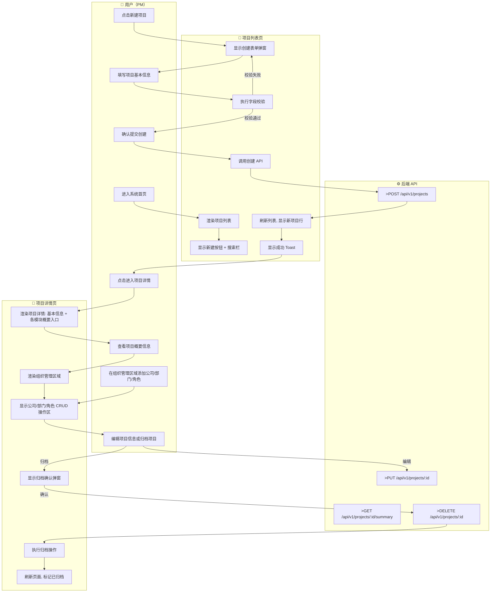
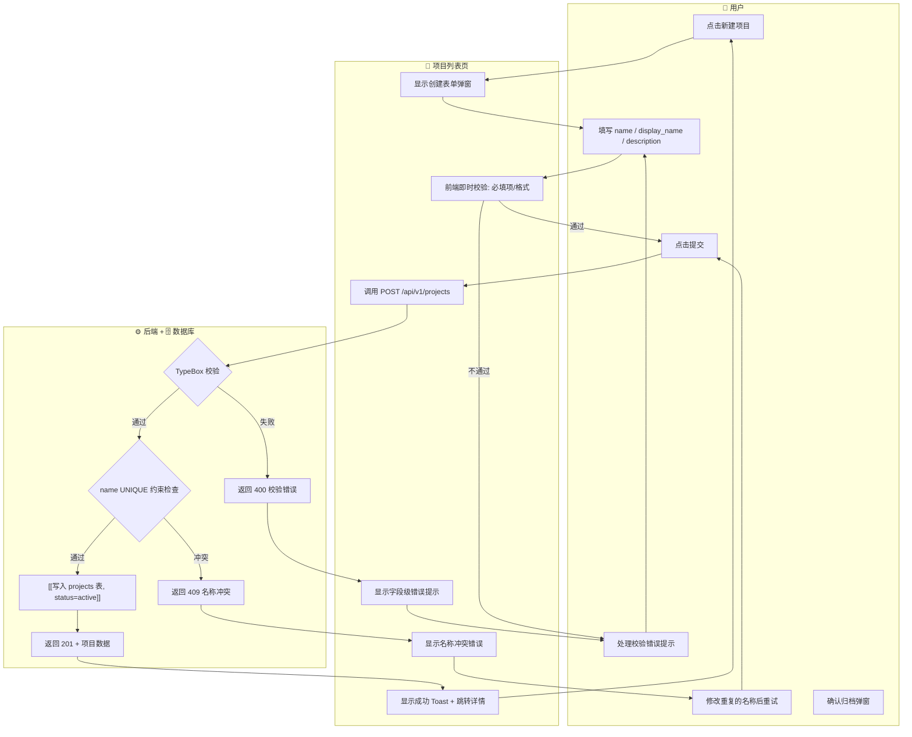
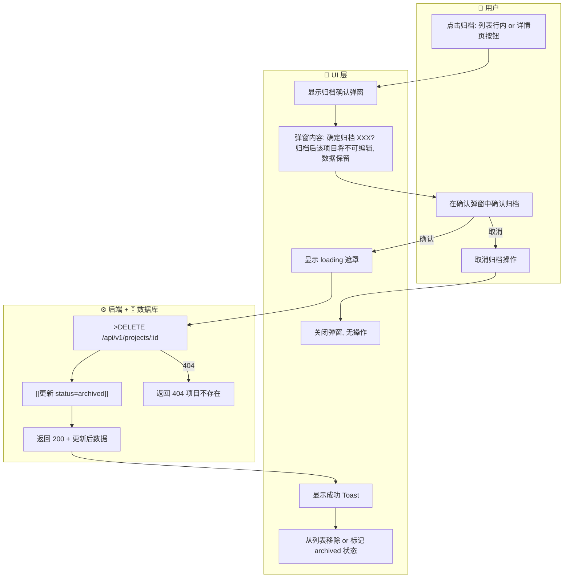
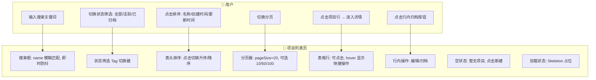
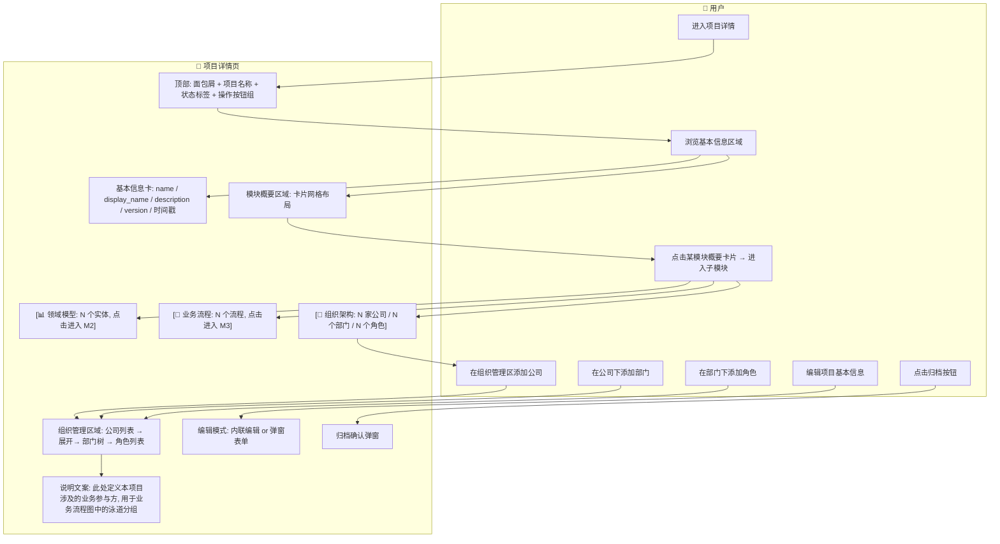
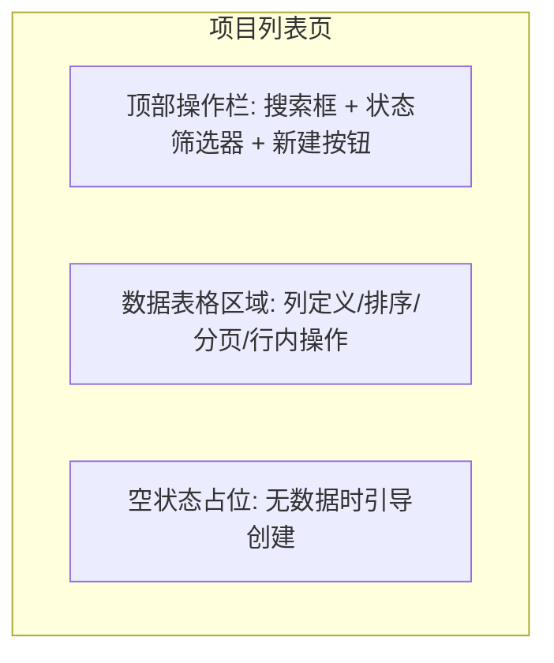
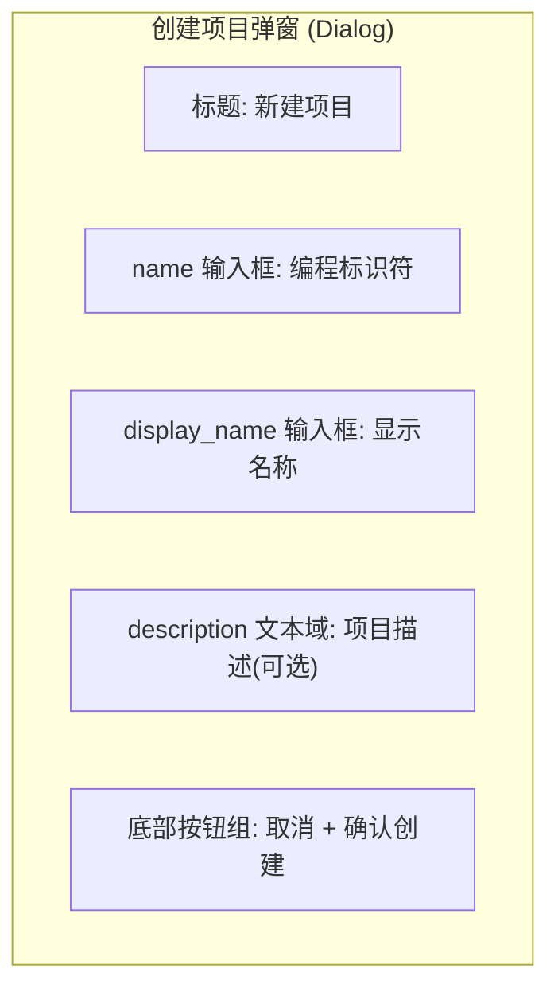
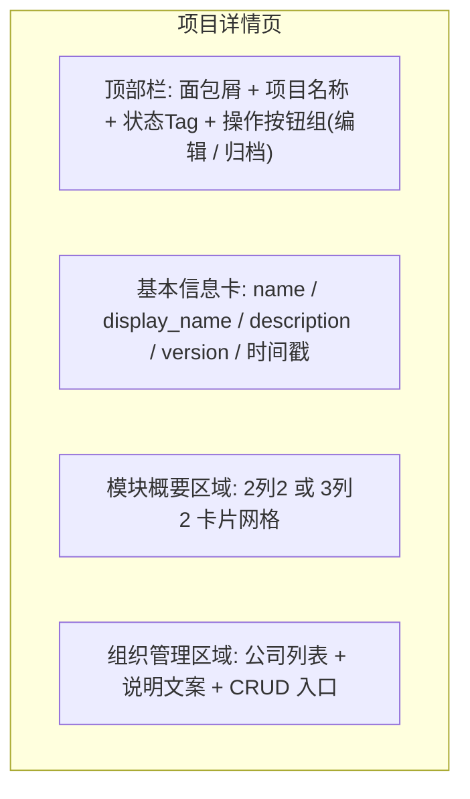
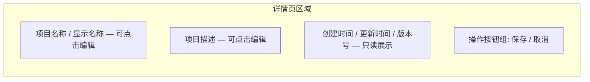

# 项目管理模块 产品需求规格书（PRD）

> **模块**：M1-项目管理
> **状态**：draft
> **版本**：v0.1
> **日期**：2026-05-02
> **作者**：PM + AI 协作
> **关联文档**：
>   - 领域模型 → `docs/02-domain-model/domain-model.md`（域一：项目管理）
>   - 技术方案 → `docs/04-tech-design/phase1-design-tech.md`（§5 项目管理 API）
>   - 数据库 Schema → `docs/05-data-design/phase1-database-schema.md`（projects / companies / departments 表）
>   - PRD 编写规范 → `docs/03-prd/prd-convention.md`

---

## 1. 概述

### 1.1 定位与目标

M1 项目管理模块是 **ai-prototype-manager 系统的基础容器模块**，负责产品定义的创建、组织与生命周期管理。

**核心定位**：
- Project 是系统中所有产品定义产物的**顶级容器**（Single Source of Truth）
- 一个 Project 代表一个完整的软件产品定义，承载其下的领域模型、业务流程、应用页面等全部子资源
- 组织架构（公司 → 部门 → 角色）是**项目建模的一部分**——描述"这个产品涉及哪些业务参与方"，在创建项目后进入详情页补充

**解决什么问题**：
- PM 需要一个结构化的地方来管理多个并行的产品定义项目
- 每个项目需要独立的命名空间来隔离领域模型、业务流程等资源
- 项目需要有清晰的生命周期状态管理（活跃 / 归档）

**核心价值**：
- 为后续 M2（领域模型管理）、M3（业务流程管理）等模块提供**容器和入口**
- 通过组织架构建立项目的归属关系，为后续多租户/团队协作预留基础

### 1.2 用户角色

| 角色 | 描述 | 本模块权限 |
|------|------|:---------:|
| **产品经理（PM）** | 负责产品定义的创建、编辑、归档；是项目的主要操作者 | 读写 |
| **研发** | 查看项目信息，了解产品定义的全貌；参考下游编码工作 | 只读 |
| **测试工程师** | 查看项目信息，了解产品功能范围以指导测试设计 | 只读 |

> **Phase 1 约束**：本阶段不做认证授权（PH1-5 决策），所有功能对当前用户完全开放。角色定义在此记录，权限控制留 Phase 3 实现。

### 1.3 前置依赖

> **说明**：按 SDLC 正常流程，Step 2（PRD）的前置依赖仅包括 Step 0~1 的产出物。下表为真正的阻塞依赖。

| 依赖项 | 状态 | 说明 |
|--------|:----:|------|
| 领域模型设计（Project 实体 + 组织架构实体） | ✅ 完成 | `docs/02-domain-model/domain-model.md` 域一 |
| 前端骨架（React + Vite + shadcn/ui + Layout） | ✅ 完成 | 已可运行的基础 UI 框架 |
| PRD 编写规范 v1.0 | ✅ 完成 | `docs/03-prd/prd-convention.md` |

**无阻塞依赖**，所有前置条件均已满足。

### 1.4 参考输入信息

> **说明**：以下产出物按正常流程应在 PRD 之后才产生（分别属于 Step 3 技术方案和 Step 5 数据设计）。本项目因前期超前推进，这些文档已存在，作为**额外参考输入**供本 PRD 编写时对齐，确保后续设计与已有产出一致。
>
> **重要约束**：本 PRD 以产品视角定义「做什么」，不重复技术方案已覆盖的「怎么做」。参考输入用于校验一致性，而非替代独立的产品思考。

| 参考输入 | 来源步骤 | 状态 | 说明 |
|---------|:-------:|:----:|------|
| 数据库 Schema（19 张表含 projects/companies/departments） | Step 5（数据设计） | ✅ 已存在 | 字段定义、约束、枚举值作为数据规格的对齐基准 |
| 技术方案（6 个项目管理 API 端点 + 统一响应格式） | Step 3（技术方案） | ✅ 已存在 | API 设计作为功能点拆分的参考，但不约束 PRD 的功能范围定义 |

---

## 2. 业务流程

### 2.1 模块级主业务流程（Happy Path）

> 本流程描述 PM 在本模块中完成核心目标的典型路径（不含异常分支）：**创建项目 → 配置组织架构 → 管理项目 → 归档项目**。

### 2.2 完整流程（含异常分支）

> 按功能点展开，包含判断分支、异常处理、回退路径。

#### 2.2.1 创建项目 完整流程

#### 2.2.2 归档项目 完整流程

### 2.3 页面交互流程

#### 2.3.1 项目列表页交互流程

#### 2.3.2 项目详情页交互流程

---

## 3. 功能范围总览

### 3.1 功能清单

| # | 功能点 | 优先级 | 描述 | 对应章节 |
|---|--------|:------:|------|:--------:|
| F-M1-01 | 项目列表 | **P0** | 项目列表展示，支持 name 模糊搜索、status 筛选（全部/活跃/已归档）、字段排序（名称/创建时间/更新时间）、分页（默认20条/页） | §4.1 |
| F-M1-02 | 创建项目 | **P0** | 新建项目：填写 name（编程标识符，全局唯一）、display_name（显示名称）、description（可选描述）；前端即时校验 + 后端 TypeBox 校验 + name UNIQUE 冲突检测 | §4.2 |
| F-M1-03 | 查看项目详情 | **P0** | 项目详情页：顶部信息栏（面包屑+名称+状态Tag+操作按钮）+ 基本信息卡 + 模块概要区域（领域模型/业务流程/组织架构等卡片网格，每卡显示统计数+进入入口） | §4.3 |
| F-M1-04 | 编辑项目基本信息 | **P0** | 在详情页编辑项目的 name、display_name、description；修改 name 时需校验全局唯一性 | §4.4 |
| F-M1-05 | 归档项目 | **P0** | 软删除项目：将 status 从 active 改为 archived；支持列表行内操作和详情页按钮两种触发方式；必须经过确认弹窗（"确定归档 XXX? 归档后该项目将不可编辑, 数据保留"）；归档后项目在默认列表视图中隐藏（可通过状态筛选查看已归档项） | §4.5 |
| F-M1-06 | 公司管理 | **P0** | 在项目详情页的组织管理区域进行公司 CRUD：创建/编辑/删除（软删除）公司；字段含 name、display_name、description、company_type、contact_info | §4.6 |
| F-M1-07 | 部门管理 | **P0** | 在公司下管理部门：创建/编辑/删除部门；支持多级部门（parent_id 自引用树形结构）；部门必须归属于某家公司 | §4.7 |
| F-M1-08 | 角色管理 | **P0** | 在部门下管理角色：创建/编辑/删除角色；角色必须归属于某个部门；字段含 name、display_name、description、category、contact_info | §4.8 |
| F-M1-09 | 外部实体管理 | P1 | 管理外部参与方（系统/组织/人员/API 等）：可选择性归属到公司和部门；与 Role 对称的第四类流程节点 holder | §4.9 |
| F-M1-10 | 项目摘要统计 | P1 | 聚合查询项目下各模块的资源数量（实体数、流程数、公司数等），用于详情页概要卡片的数据填充 | §4.10 |

**功能点编号规则**：
- 格式：`F-M1-[序号]`，序号从 01 开始递增
- 全局唯一，方便跨文档引用

**优先级定义**：
- **P0**：MVP 必须有，阻塞发布
- **P1**：首批迭代，发布后尽快补齐
- **P2**：后续优化，有时间再做

### 3.2 Out of Scope（不在本模块范围内）

| 功能 | 原因 | 归属 |
|------|------|------|
| 项目克隆 / 导入 / 导出 | 属于高级操作，MVP 不需要 | Phase 3+ |
| 项目版本管理与 Diff | 属于成熟度提升阶段 | Phase 3.7 |
| 成员管理（Member 实体） | Phase 1 不做认证授权（PH1-5），无用户概念 | Phase 3+ |
| 业务架构管理（business_architectures） | 虽然表结构存在，但属于独立的业务架构模块，不在 M1 项目管理范围内 | 待独立模块 PRD |
| 菜单管理（menus） | 系统级资源，不归属 Project | 待独立模块或基础设施 |
| 领域模型 CRUD（domain_entities/entity_fields/relations） | 核心功能但属于 M2 模块 | M2 PRD |
| 业务流程 CRUD（business_processes/nodes/edges） | 核心功能但属于 M3 模块 | M3 PRD |
| 应用/页面 CRUD（applications/pages） | 属于交互原型模块，Phase 2 范围 | Phase 2 |

### 3.3 术语表

> 本模块使用的术语多为通用项目管理术语，以下仅列出本项目特有的术语定义。

| 术语 | 定义 |
|------|------|
| **Project（项目）** | 一个完整的软件产品定义容器。承载该产品涉及的所有建模数据：领域模型、业务流程、组织架构（业务参与方）等。是系统的顶级对象。 |
| **组织架构（Organization）** | 本项目中特指「被建模的产品所涉及的业务参与方」的组织结构，包含公司（Company）、部门（Department）、角色（Role）三级。**非系统自身的组织架构**，而是建模对象的属性。 |
| **业务参与方** | 在被建模的产品中参与业务流程执行的实体，通过公司→部门→角色的层级关系组织，用于业务流程图的泳道分组。 |
| **软删除（Soft Delete）** | 不物理删除数据库记录，而是将 status 字段从 active 改为 archived。数据保留但逻辑上不可用，归档后的项目在默认列表中不显示。 |
| **编程标识符（name） vs 显示名称（display_name）** | name 是项目的编程名称（如 URL 路径段、API 引用），全局唯一；display_name 是给人看的显示名称。两者均可修改，修改 name 时需校验唯一性。ID（UUID 主键）才是真正不可变的系统标识符。 |

---

## 4. 功能点详细设计

### 4.1 [F-M1-01] 项目列表

> **编号**：F-M1-01
> **优先级**：P0
> **前置功能**：（无，本模块入口功能）

#### 4.1.1 涉及的领域模型

| 实体 | 用途 | 关键字段 | 引用 |
|------|------|---------|------|
| Project | 列表数据源 | id, name, display_name, description, status, version, created_at, updated_at | `domain-model.md`#域一 |

**本项目仅涉及 Project 单实体，无跨实体关系。**

#### 4.1.2 页面设计

**布局结构**：

**元素清单**：

| 区域 | 元素 | 类型 | 必填 | 说明 |
|------|------|------|:----:|------|
| 顶部操作栏 | 搜索框 | Search | ✅ | name 字段模糊搜索，300ms 防抖 |
| 顶部操作栏 | 状态筛选器 | Tag/Badge 切换组 | ✅ | 三态切换: 全部 / 活跃 / 已归档 |
| 顶部操作栏 | 新建按钮 | Button (主要) | ✅ | 触发创建项目弹窗（F-M1-02） |
| 数据表格 | 表头行 | Table Header | ✅ | 可排序列: 名称 / 创建时间 / 更新时间；点击切换升序/降序 |
| 数据表格 | 数据行 | Table Row | ✅ | 显示: display_name / name / status Tag / version / updated_at |
| 数据表格 | 行内操作列 | Button Group | ✅ | hover 显示: 编辑(跳转详情) / 归档(确认弹窗) |
| 数据表格 | 分页器 | Pagination | ✅ | 默认 20 条/页, 可选 10/50/100 |
| 底部 | 空状态 | Empty | ✅ | "暂无项目, 点击新建" + 新建按钮 |

#### 4.1.3 交互行为

**主操作流程**：

| 步骤 | 用户操作 | 系统响应 | 前置条件 | 异常处理 |
|------|---------|---------|---------|---------|
| 1 | 进入系统首页 / 点击侧边栏"项目" | 渲染项目列表页, 发起 GET /api/v1/projects 请求 | — | 显示 Skeleton 加载状态 |
| 2 | （可选）在搜索框输入关键词 | 300ms 防抖后重新请求, 携带 search 参数 | 列表已加载 | 输入清空时自动重置筛选 |
| 3 | （可选）点击状态筛选 Tag | 切换筛选条件, 重新请求, 携带 status 参数 | 列表已加载 | 默认选中"全部" |
| 4 | （可选）点击表头排序 | 切换排序方向, 重新请求, 携带 sort+order 参数 | 列表已加载 | 循环: 升序 → 降序 → 默认 |
| 5 | （可选）切换分页 | 跳转到对应页, 重新请求, 携带 page+pageSize 参数 | 总数 > pageSize | 边界保护: 首页/末页不越界 |
| 6 | 点击某项目行或"编辑"按钮 | 跳转到项目详情页 /projects/:id | 有项目数据 | — |
| 7 | 点击行内"归档"按钮 | 弹出归档确认弹窗 | 项目状态为 active | 已归档项目隐藏归档按钮 |
| 8 | 在确认弹窗中点击"确认" | 调用 DELETE API, 成功后从列表移除该行并 Toast 提示 | 弹窗已打开 | 取消则关闭弹窗, 无操作 |

**快捷操作 / 批量操作**：

| 操作 | 触发方式 | 行为 | 确认机制 |
|------|---------|------|:--------:|
| 快速归档 | 行内归档按钮 | 弹出确认弹窗 → 确认后执行软删除 | 二次确认弹窗 |
| 快速新建 | 顶部新建按钮 | 打开创建项目弹窗（F-M1-02） | 无 |

#### 4.1.4 业务规则

##### 4.1.4.1 查询（List）

**查询规则**：

| # | 规则 | 说明 |
|---|------|------|
| B-M1-01 | 默认按 updatedAt 降序排列 | 最新修改的项目排在最前，方便 PM 快速找到最近在做的项目 |
| B-M1-02 | 默认不传 status 参数（返回全部状态的项目） | 用户主动点击状态 Tag 后才追加筛选条件 |
| B-M1-03 | 搜索仅匹配 name 字段，使用 PostgreSQL ILIKE 进行模糊匹配 | 不搜索 description 或 display_name，保持查询简单高效；name 是编程标识符，搜索精确度更高 |
| B-M1-04 | 已归档项目在默认视图（status 未指定或=active）中不返回 | 用户必须显式选择"已归档"筛选才能看到归档项目 |
| B-M1-05 | 列表接口不返回 description 和 config 字段 | 减少传输量；详情接口（F-M1-03）返回完整字段 |

**分页策略**：
- 默认 pageSize = 20
- 可选值：10 / 20 / 50 / 100
- 不支持无限滚动（Phase 1 使用传统分页器）
- 前端边界保护：page < 1 时强制为 1，page > totalPages 时强制为 totalPages

**性能要求**：
- projects 表的 `idx_projects` 需覆盖 status + updatedAt 排序组合查询
- name ILIKE 搜索需配合 `pg_trgm` 扩展或前缀索引优化（数据量 < 10000 时普通 ILIKE 可接受）
- COUNT 查询与数据查询在同一次请求中完成（先 COUNT 再 LIMIT/OFFSET）

##### 4.1.4.4 删除（Delete）

> 项目列表页支持行内归档操作，实际执行的是软删除。

**删除方式**：软删除（将 status 从 active 改为 archived），不物理删除记录。数据保留但逻辑上不可用。

**前置条件检查**：

| 条件 | 检查内容 | 不满足时行为 |
|------|---------|-------------|
| 项目存在性 | 项目 id 必须对应一条有效记录 | 返回 404 NOT_FOUND |
| 当前状态 | 仅 status=active 的项目可归档 | 已归档项目隐藏归档按钮（前端控制），后端重复调用幂等返回成功 |
| 关联数据 | 项目下可能存在 domain_entities、business_processes 等子数据 | **不阻止归档**。仅将 projects.status 改为 archived，子数据完全不动。后续查询子数据时通过 JOIN projects 表的 status 条件自动过滤（大多数查询场景已隐含 project status 过滤） |

**业务处理逻辑**：

| # | 步骤 | 规则 | 注意点 |
|---|------|------|--------|
| B-M1-06 | 二次确认 | 归档前必须弹出确认弹窗，文案为"确定归档 XXX? 归档后该项目将不可编辑, 数据保留。" | 弹窗必须显示项目的 display_name，不能用通用文案 |
| B-M1-07 | 幂等性 | 对已归档项目重复调用 DELETE 接口应返回成功（不报错） | 前端通过隐藏按钮避免大部分重复调用，但 API 层仍需防御 |
| B-M1-08 | 级联行为 | 归档项目本身（改 status=archived），**不级联删除或修改任何子数据** | 子数据（实体、流程、公司、部门等）完整保留；各模块查询接口通过 JOIN projects.status='active' 自动过滤归档项目的子数据 |
| B-M1-09 | UI 反馈 | 归档成功后：若当前筛选="全部"或"活跃"，从列表移除该行 + Toast 提示；若当前筛选="已归档"，刷新该行状态为 archived | 保证用户操作后的视觉一致性 |

##### 4.1.4.6 校验规则汇总

| 字段 | 规则 | 错误提示 | 适用操作 |
|------|------|---------|---------|
| search | string 类型, 最大长度 50 字符 | 搜索关键词过长 | List |
| status | 枚举值: undefined(全部) / 'active' / 'archived' | 无效的筛选条件 | List |
| page | integer, >= 1 | 无效的页码 | List |
| pageSize | 枚举值: 10 / 20 / 50 / 100 | 无效的分页大小 | List |
| sort | 枚举值: 'name' / 'createdAt' / 'updatedAt' | 无效的排序字段 | List |
| order | 枚举值: 'asc' / 'desc' | 无效的排序方向 | List |

##### 4.1.4.7 异常场景汇总

| 场景 | 触发条件 | 系统行为 | 适用操作 |
|------|---------|---------|---------|
| 项目不存在 | 传入的 id 无对应记录 | 返回 404 NOT_FOUND + 错误提示 | Delete |
| 网络错误 | 请求超时或断网 | 显示 Error Boundary + 重试按钮 | List, Delete |
| 服务端异常 | 500 内部错误 | 显示通用错误提示"服务器繁忙, 请稍后重试" + 重试按钮 | List, Delete |
| 空数据 | 符合条件的记录数为 0 | 显示空状态占位"暂无项目, 点击新建" + 新建按钮引导 | List |
| 并发归档 | 两个请求同时归档同一项目 | 第二个请求幂等返回成功（status 已是 archived） | Delete |

#### 4.1.5 数据规格

**输入数据（查询参数）**：

| 字段 | 类型 | 必填 | 默认值 | 校验规则 | 说明 |
|------|------|:----:|:------:|---------|------|
| search | string | - | undefined | maxLength(50) | name 字段模糊搜索关键词 |
| status | string | - | undefined | enum('active', 'archived') | 状态筛选; 不传=全部 |
| page | integer | - | 1 | minimum(1) | 当前页码 |
| pageSize | integer | - | 20 | enum(10, 20, 50, 100) | 每页条数 |
| sort | string | - | 'updatedAt' | enum('name', 'createdAt', 'updatedAt') | 排序字段 |
| order | string | - | 'desc' | enum('asc', 'desc') | 排序方向 |

**输出数据 / 响应格式**：

| 字段 | 类型 | 来源 | 说明 |
|------|------|------|------|
| data | Array\<ProjectItem\> | DB 查询 | 当前页的项目列表 |
| meta.total | integer | COUNT 查询 | 符合条件的总记录数 |
| meta.page | integer | 请求参数回显 | 当前页码 |
| meta.pageSize | integer | 请求参数回显 | 每页条数 |

**ProjectItem（列表项字段）**：

| 字段 | 类型 | 来源 | 说明 |
|------|------|------|------|
| id | string | projects.id | 项目 UUID |
| name | string | projects.name | 编程标识符 |
| display_name | string | projects.display_name | 显示名称 |
| status | string | projects.status | active / archived |
| version | integer | projects.version | 版本号 |
| updated_at | string | projects.updated_at | 最后更新时间 (ISO 8601) |

> **注意**: 列表接口不返回 description 和 config 字段，减少传输量。详情接口（F-M1-03）返回完整字段。

#### 4.1.6 AI 编码提示

- **防抖搜索实现**: 使用 `useDebouncedValue` 或 `lodash.debounce` 包裹搜索回调, 避免每次按键都发起请求。300ms 是经验值, 太短浪费请求, 太长感觉迟钝。
- **排序状态管理**: 排序是"字段+方向"的组合状态, 建议用一个 `{ sort: string; order: 'asc'|'desc' }` 对象统一管理, 不要用两个独立 state 容易不同步。
- **Tag 筛选器的"全部"语义**: "全部"不是传一个特殊值给后端, 而是**不传 status 参数**。后端收到 undefined 时返回全部数据。前端需要做这个映射转换。
- **行内操作的 hover 显示**: 用 CSS `opacity` 或 `group-hover` 实现, 不需要 JS 控制 show/hide, 减少状态复杂度。
- **空状态和加载状态的边界情况**: 首次加载时显示 Skeleton, 加载完成后如果 data 为空才显示 Empty。不要在请求进行中就显示空状态。

---

### 4.2 [F-M1-02] 创建项目

> **编号**：F-M1-02
> **优先级**：P0
> **前置功能**：（无）

#### 4.2.1 涉及的领域模型

| 实体 | 用途 | 关键字段 | 引用 |
|------|------|---------|------|
| Project | 新建的目标实体 | id, name(UNIQUE), display_name, description, status, version, config, created_at, updated_at | `domain-model.md`#域一 |

**本项目仅涉及 Project 单实体。**

#### 4.2.2 页面设计

**布局结构**：

**元素清单**：

| 区域 | 元素 | 类型 | 必填 | 说明 |
|------|------|------|:----:|------|
| 弹窗容器 | Dialog / Modal | Modal | ✅ | 居中弹出, 点击遮罩或 ESC 可关闭 |
| 标题区域 | 弹窗标题 | Text | ✅ | "新建项目" |
| 表单区域 | name 输入框 | Input | ✅ | 编程标识符, placeholder: "如 my-project", 唯一性校验 |
| 表单区域 | display_name 输入框 | Input | ✅ | 显示名称, placeholder: "如 换电站管理系统" |
| 表单区域 | description 文本域 | Textarea | - | 可选, placeholder: "简要描述这个项目...", 最大 500 字符 |
| 底部操作区 | 取消按钮 | Button (次要) | ✅ | 关闭弹窗, 不保存 |
| 底部操作区 | 确认创建按钮 | Button (主要) | ✅ | 触发表单校验 → 调用创建 API |
| 表单区域 | 字段级错误提示 | Text (错误态) | — | 校验失败时显示在对应字段下方 |

#### 4.2.3 交互行为

**主操作流程**：

| 步骤 | 用户操作 | 系统响应 | 前置条件 | 异常处理 |
|------|---------|---------|---------|---------|
| 1 | 在项目列表页点击"新建"按钮 | 弹出创建项目 Dialog | 列表页已加载 | — |
| 2 | 输入 name（编程标识符） | 失焦后前端即时校验格式; 输入过程中显示字数统计 | 弹窗已打开 | 格式错误时字段下方显示红色提示 |
| 3 | 输入 display_name（显示名称） | 失焦后前端即时校验非空 | — | 为空时显示"请输入显示名称" |
| 4 | （可选）输入 description | 无即时校验, 仅最大长度限制 | — | 超过 500 字符时截断并提示 |
| 5 | 点击"确认创建" | 前端执行完整表单校验 → 通过后调用 POST /api/v1/projects | 所有必填项已填 | 校验不通过时聚焦到第一个错误字段 |
| 6 | 等待 API 响应 | 按钮显示 loading 状态, 禁用重复点击 | API 已发起 | — |
| 7a | 创建成功（201） | 关闭弹窗 → 显示成功 Toast("项目 XXX 创建成功") → 自动跳转到项目详情页 | — | — |
| 7b | 名称冲突（409） | 在 name 字段下方显示错误"该名称已被使用, 请更换" | — | 用户修改 name 后可重新提交 |
| 7c | 校验失败（400） | 显示服务端返回的字段级错误信息 | — | 按字段定位展示错误 |
| 7d | 网络异常 | 显示通用错误提示 + 重试按钮 | — | — |

**快捷操作 / 批量操作**：（无）

#### 4.2.4 业务规则

##### 4.2.4.2 新增（Create）

**前置校验**：

| 字段 | 校验规则 | 失败行为 |
|------|---------|---------|
| name | 必填, 1-50 字符, 仅允许小写字母/数字/连字符(-), 必须以字母开头 | 拦截并提示"编程标识符格式: 1-50 位, 仅允许小写字母、数字和连字符, 以字母开头" |
| display_name | 必填, 1-100 字符 | 拦截并提示"请输入显示名称" |
| description | 可选, 最大 500 字符 | 超长时自动截断并警告 |

**业务处理逻辑**：

| # | 步骤 | 规则 | 注意点 |
|---|------|------|--------|
| B-M1-10 | 唯一性检查 | name 字段全局 UNIQUE 约束, 后端写入前检测冲突 | 大小写敏感; 前端可做防抖预检(输入停止 500ms 后调 GET 接口检查), 但最终以后端为准 |
| B-M1-11 | 默认值赋值 | status='active', version=1, config='{}', created_at=now(), updated_at=now() | 全部由数据库 DEFAULT 或应用层赋值, 前端无需传这些字段 |
| B-M1-12 | 创建后行为 | 成功后关闭弹窗 → Toast 提示 → 自动跳转 `/projects/:id` 详情页 | 不要停留在列表页让用户手动找新创建的项目 |
| B-M1-13 | 并发安全 | 使用数据库 UNIQUE 约束保证 name 唯一性, 无需应用层加锁 | 高并发下两个同名请求一个成功一个返回 409 |

##### 4.2.4.6 校验规则汇总

| 字段 | 规则 | 错误提示 | 适用操作 |
|------|------|---------|---------|
| name | 必填, string, 1-50 字符, 正则 `^[a-z][a-z0-9-]*$` | 编程标识符格式不正确 | Create |
| name | 全局唯一（UNIQUE） | 该名称已被使用, 请更换 | Create |
| display_name | 必填, string, 1-100 字符 | 请输入显示名称 | Create |
| description | 可选, string, 最大 500 字符 | 描述不能超过 500 个字符 | Create |

##### 4.2.4.7 异常场景汇总

| 场景 | 触发条件 | 系统行为 | 适用操作 |
|------|---------|---------|---------|
| 名称冲突 | name 与已有项目重复 | 返回 409 CONFLICT + 字段级错误提示 | Create |
| 校验失败 | TypeBox schema 校验不通过 | 返回 400 VALIDATION_FAILED + 具体字段错误信息 | Create |
| 网络超时 | 请求超过 10 秒未响应 | 显示超时提示 + 重试按钮 | Create |
| 服务端异常 | 500 内部错误 | 显示通用错误提示 + 重试按钮 | Create |
| 用户中途关闭弹窗 | 点击取消/遮罩/ESC | 弹窗关闭, 已填写内容丢弃（不暂存草稿） | Create |

#### 4.2.5 数据规格

**输入数据（请求体）**：

| 字段 | 类型 | 必填 | 默认值 | 校验规则 | 说明 |
|------|------|:----:|:------:|---------|------|
| name | string | ✅ | — | minLength(1), maxLength(50), pattern(`^[a-z][a-z0-9-]*$`) | 编程标识符, 全局唯一 |
| display_name | string | ✅ | — | minLength(1), maxLength(100) | 显示名称 |
| description | string | - | null | maxLength(500) | 项目描述, 可为空 |

> 注: status/version/config/created_at/updated_at 由后端自动填充, 前端不传.

**输出数据（201 响应）**：

| 字段 | 类型 | 来源 | 说明 |
|------|------|------|------|
| id | string | DB 生成 | 新建项目的 UUID |
| name | string | 请求参数回显 | 编程标识符 |
| display_name | string | 请求参数回显 | 显示名称 |
| description | string \| null | 请求参数回显 | 项目描述 |
| status | string | 默认值 'active' | 固定为 active |
| version | integer | 默认值 1 | 固定为 1 |
| created_at | string | DB 生成 | ISO 8601 |
| updated_at | string | DB 生成 | ISO 8601 |

#### 4.2.6 AI 编码提示

- **name 的正则校验**: 前端和后端都要做. 前端用 input 的 pattern 属性或自定义 validator 做即时反馈, 后端用 TypeBox string() + pattern() 做兜底. 两边正则必须保持一致.
- **唯一性预检**: 可以在用户停止输入 name 后 500ms 发一个轻量 GET 请求检查是否已存在, 提前给用户反馈而不是等点提交才知道冲突. 但这不是必须的, 最终以提交时的 409 为准.
- **弹窗关闭策略**: 创建成功后立即关闭弹窗, 不要等 Toast 动画结束再关. Toast 和页面跳转并行执行.
- **表单重置**: 弹窗每次打开时必须是空白状态, 不要复用上一次的填写内容. 用 Dialog 的 open/close 状态控制, close 时重置 form 状态.

---

### 4.3 [F-M1-03] 查看项目详情

> **编号**：F-M1-03
> **优先级**：P0
> **前置功能**：F-M1-01（从列表进入）或 F-M1-02（创建后跳转）

#### 4.3.1 涉及的领域模型

| 实体 | 用途 | 关键字段 | 引用 |
|------|------|---------|------|
| Project | 详情数据源 | 全部字段: id, name, display_name, description, status, version, config, created_at, updated_at | `domain-model.md`#域一 |

**本项目仅涉及 Project 单实体。模块概要卡片中的统计数据来自 summary API（F-M1-10）。**

#### 4.3.2 页面设计

**布局结构**：

---

#### 4.3.3 交互行为

**元素清单**：

| 区域 | 元素 | 类型 | 必填 | 说明 |
|------|------|------|:----:|------|
| 顶部栏 | 面包屑导航 | Breadcrumb | ✅ | "首页 > 项目 > XXX" |
| 顶部栏 | 项目名称 | Text (大标题) | ✅ | display_name, 后面附 name 小字标注 |
| 顶部栏 | 状态标签 | Tag/Badge | ✅ | active=绿色 / archived=灰色 |
| 顶部栏 | 编辑按钮 | Button (次要) | ✅ | 触发内联编辑模式（F-M1-04） |
| 顶部栏 | 归档按钮 | Button (危险) | ✅ | 触发归档确认弹窗（F-M1-05）；已归档时隐藏或禁用 |
| 基本信息卡 | name 字段 | Text | ✅ | 编程标识符, 只读展示 |
| 基本信息卡 | display_name 字段 | Text | ✅ | 显示名称, 只读展示 |
| 基本信息卡 | description 字段 | Text | — | 项目描述, 无值时显示"—" |
| 基本信息卡 | version 字段 | Text | ✅ | 版本号, 格式 "v{N}" |
| 基本信息卡 | created_at 字段 | Text | ✅ | 创建时间, 格式 "YYYY-MM-DD HH:mm" |
| 基本信息卡 | updated_at 字段 | Text | ✅ | 更新时间, 同上格式 |
| 模块概要 | 卡片容器 | Card Grid | ✅ | 响应式网格布局, 2 列（宽屏可 3 列） |
| 模块概要 | 领域模型卡片 | Card | ✅ | 图标 + 标题"领域模型" + 统计数"N 个实体" + 箭头入口 → 点击进入 M2 |
| 模块概要 | 业务流程卡片 | Card | ✅ | 图标 + 标题"业务流程" + 统计数"N 个流程" + 箭头入口 → 点击进入 M3 |
| 模块概要 | 组织架构卡片 | Card | ✅ | 图标 + 标题"组织架构" + 统计数"N 家公司 / N 个部门 / N 个角色" → 点击滚动到下方组织管理区域 |
| 模块概要 | 外部实体卡片 | Card | ⚠️ P1 | 图标 + 标题"外部实体" + 统计数 → 点击进入管理（F-M1-09） |
| 组织区域 | 区域标题 | Section Header | ✅ | "业务参与方（组织架构）" |
| 组织区域 | 说明文案 | Callout/Alert | ✅ | 浅色背景提示框: "此处定义本项目涉及的业务参与方（公司/部门/角色）, 用于业务流程图中的泳道分组。非系统自身的组织架构。" |
| 组织区域 | 公司列表 | Table/Accordion | ✅ | 展示该项目下的所有公司; 可展开查看下属部门和角色; 行末有编辑/删除操作 |
| 组织区域 | 新建公司按钮 | Button | ✅ | 在公司列表上方或下方, 触发公司创建（F-M1-06） |

#### 4.3.3 交互行为

**主操作流程**：

| 步骤 | 用户操作 | 系统响应 | 前置条件 | 异常处理 |
|------|---------|---------|---------|---------|
| 1 | 从列表页点击某项目行 | 路由跳转 `/projects/:id` | 有项目数据 | — |
| 2 | （页面加载） | 并行请求: GET /api/v1/projects/:id（详情）+ GET /api/v1/projects/:id/summary（摘要统计） | 路由参数有 id | 显示 Skeleton 加载态 |
| 3a | 详情加载成功 | 渲染完整页面: 顶部栏 + 基本信息 + 模块概要卡片 + 组织管理区域 | — | — |
| 3b | 详情加载失败（404） | 显示 404 错误页"项目不存在或已被删除", 提供"返回列表"按钮 | — | 可能是 URL 直接访问了不存在的 id |
| 4 | 浏览模块概要卡片 | 各卡片显示对应模块的资源统计数（来自 summary API） | summary 数据已加载 | 若某模块统计数为 0, 卡片仍显示但数字为 0 |
| 5 | 点击"领域模型"卡片 | 路由跳转到 M2 模块的领域模型列表页（携带 projectId 参数） | M2 模块已实现 | Phase 1 可能 M2 尚未实现, 此时卡片点击后 Toast 提示"该功能正在开发中" |
| 6 | 点击"业务流程"卡片 | 路由跳转到 M3 模块 | 同上 | 同上处理 |
| 7 | 点击"组织架构"卡片 | 页面平滑滚动到下方的组织管理区域 | — | — |
| 8 | 展开某公司行 | 展示该公司下的部门树和角色列表 | 公司有子数据 | 展开时懒加载部门数据 |
| 9 | 点击顶部"编辑"按钮 | 进入编辑模式（F-M1-04）, 基本信息区变为可编辑表单 | — | — |
| 10 | 点击顶部"归档"按钮 | 弹出归档确认弹窗（F-M1-05） | 项目状态为 active | 已归档时隐藏此按钮 |

**快捷操作 / 批量操作**：（无）

#### 4.3.4 业务规则

##### 4.3.4.1 查询（Read）

**查询规则**：

| # | 规则 | 说明 |
|---|------|------|
| B-M1-14 | 详情接口返回 Project 完整字段 | 包含 description 和 config, 与列表接口的字段裁剪不同 |
| B-M1-15 | Summary 接口聚合各子模块计数 | 返回 domainEntityCount / processCount / companyCount / departmentCount / roleCount / externalEntityCount 等统计数据; 用于填充概要卡片 |
| B-M1-16 | 详情页两个请求并行发起 | 不等详情完成再请求 summary, 使用 Promise.all 同时请求减少总耗时 |
| B-M1-17 | 时间戳格式化 | created_at / updated_at 从 ISO 8601 转为本地化显示格式 "YYYY-MM-DD HH:mm"; 时区使用浏览器本地时区 |

##### 4.3.4.6 校验规则汇总

| 字段 | 规则 | 错误提示 | 适用操作 |
|------|------|---------|---------|
| id（路径参数） | 必须是有效的 UUID v4 格式 | 无效的项目 ID | Read |

##### 4.3.4.7 异常场景汇总

| 场景 | 触发条件 | 系统行为 | 适用操作 |
|------|---------|---------|---------|
| 项目不存在 | id 对应的记录不存在或已物理删除 | 返回 404 NOT_FOUND, 显示 404 专属错误页 | Read |
| 归档项目被访问 | id 对应的项目 status=archived | 正常返回详情数据（归档项目仍可查看, 只是不可编辑）; 顶部操作区隐藏"编辑"和"归档"按钮, 替换为"已归档"标签 | Read |
| Summary 接口失败 | 统计接口报错 | 详情正常渲染, 概要卡片区域显示"加载失败"占位, 不影响其他区域; 卡片上的统计数显示"—" | Read |
| 网络错误 | 请求超时或断网 | Error Boundary + 重试按钮 | Read |

#### 4.3.5 数据规格

**输入数据（路径参数）**：

| 字段 | 类型 | 必填 | 校验规则 | 说明 |
|------|------|:----:|---------|------|
| id | string (UUID) | ✅ | format('uuid') | 项目唯一标识, 来自路由参数 |

**输出数据（详情响应）**：

| 字段 | 类型 | 来源 | 说明 |
|------|------|------|------|
| id | string | projects.id | 项目 UUID |
| name | string | projects.name | 编程标识符 |
| display_name | string | projects.display_name | 显示名称 |
| description | string \| null | projects.description | 项目描述, 可为空 |
| status | string | projects.status | active / archived |
| version | integer | projects.version | 版本号 |
| config | object | projects.config | 扩展配置 JSON |
| created_at | string | projects.created_at | 创建时间 (ISO 8601) |
| updated_at | string | projects.updated_at | 更新时间 (ISO 8601) |

**输出数据（Summary 响应）— GET /api/v1/projects/:id/summary**：

| 字段 | 类型 | 来源 | 说明 |
|------|------|------|------|
| domainEntityCount | integer | COUNT(domain_entities WHERE project_id) | 领域实体总数 |
| processCount | integer | COUNT(business_processes WHERE project_id) | 业务流程总数 |
| companyCount | integer | COUNT(companies WHERE project_id) | 公司总数 |
| departmentCount | integer | COUNT(departments WHERE project_id) | 部门总数 |
| roleCount | integer | COUNT(roles WHERE project_id) | 角色总数 |
| externalEntityCount | integer | COUNT(external_entities WHERE project_id) | 外部实体总数 |

#### 4.3.6 AI 编码提示

- **并行请求**: 详情和摘要必须用 `Promise.all([getDetail(id), getSummary(id)])` 并行发起, 不要串行. 总耗时 = max(详情耗时, 摘要耗时), 而非两者之和.
- **404 边界**: 访问不存在的项目 id 是常见场景（URL 直接输入/收藏夹过期）, 需要有友好的 404 页面, 不要用通用的 Error Boundary 兜底.
- **归档项目的 UI 差异**: 归档项目和活跃项目的详情页使用同一组件, 通过 status prop 控制: 归档时隐藏编辑/归档按钮, 顶部增加灰色的"已归档"Badge. 不要做两个完全不同的页面.
- **模块卡片的降级处理**: Phase 1 可能 M2/M3 模块尚未实现, 点击领域模型/业务流程卡片时不应 404 或白屏. 要么用 `<Link>` 的 fallback 处理, 要么在路由层加 catch-all 兜底页.

---

### 4.4 F-M1-04 编辑项目基本信息

**优先级**: P0 | **前置依赖**: F-M1-03（查看项目详情）

#### 4.4.1 涉及领域模型

| 实体 | 表名 | 说明 |
|------|------|------|
| Project | `projects` | 单实体操作, 仅更新 projects 记录 |

无新增实体或关系变更。

#### 4.4.2 页面设计

编辑采用**行内编辑模式**（Inline Edit）——不跳转独立页面, 在项目详情页内直接修改字段值。

**页面元素清单：**

| # | 元素 | 类型 | 交互说明 |
|---|------|------|---------|
| 1 | `name` 字段 | 可编辑文本框 | 编程标识符, 仅允许英文/数字/下划线/连字符 |
| 2 | `display_name` 字段 | 可编辑文本框 | 显示名称, 支持中英文 |
| 3 | `description` 字段 | 可编辑多行文本 | 项目描述, 可为空 |
| 4 | `created_at` | 只读文本 | 创建时间, 不可修改 |
| 5 | `updated_at` | 只读文本 | 最后更新时间, 自动刷新 |
| 6 | `version` | 只读文本 | 版本号, 乐观锁依据 |
| 7 | 「保存」按钮 | 主按钮 | 提交修改到后端 |
| 8 | 「取消」按钮 | 次按钮 | 放弃修改, 恢复原值 |

#### 4.4.3 交互行为

**主流程（8 步）：**

| 步骤 | 操作 | 系统/页面响应 | 数据变化 |
|------|------|-------------|---------|
| 1 | 用户在详情页点击 `name` / `display_name` / `description` 字段 | 字段切换为可编辑状态（输入框/文本域）, 周围出现「保存」「取消」按钮 | 无 |
| 2 | 用户修改字段值 | 输入框实时显示用户输入, 触发前端校验（格式/长度） | 无 |
| 3 | 用户点击「保存」按钮 | 前端执行完整校验 → 调用 `PUT /api/v1/projects/:id` | 无 |
| 4 | 后端接收请求, 执行乐观锁校验 (`WHERE id=? AND version=?`) | 校验通过 → 更新记录, version+1 | `projects` 记录更新 |
| 5 | 后端返回成功响应 `{ data: updatedProject }` | 页面字段恢复为只读展示态, 显示新值, `updated_at` 和 `version` 刷新 | 无 |
| 6 | （异常分支 A）用户输入了重复的 `name` | 后端返回 409 Conflict | 前端在 `name` 输入框下方显示错误提示"该项目标识符已存在", 不关闭编辑态 |
| 7 | （异常分支 B）乐观锁冲突（version 不匹配） | 后端返回 409 Conflict | 前端弹出提示"数据已被其他人修改, 请刷新页面重试", 关闭编辑态并刷新页面数据 |
| 8 | （异常分支 C）归档项目的编辑尝试 | 后端返回 400 Bad Request | 前端拦截: 归档项目不展示编辑入口; 若绕过前端直接调用 API 则由后端拒绝 |

**快捷操作：**
- `Esc` 键: 等同于点击「取消」, 放弃修改
- `Enter` 键（仅在单行输入框时）: 等同于点击「保存」
- 多行文本域（description）不支持 Enter 快捷保存

#### 4.4.4 业务规则

##### 4.4.4.3 更新（Update）

**可编辑字段矩阵：**

| 字段 | 必填 | 格式约束 | 长度限制 | 唯一性 | 示例 |
|------|:----:|---------|--------|:------:|------|
| `name` | ✅ | 英文/数字/下划线/连字符 | 2~50 | ✅ 全局唯一 | `ev-charging-station` |
| `display_name` | ✅ | 中英文字符 | 1~100 | ❌ | `换电站管理系统` |
| `description` | ❌ | 自由文本 | 0~2000 | ❌ | `面向新能源...` |

**业务规则清单：**

| 规则编号 | 规则内容 | 违规后果 |
|---------|---------|---------|
| B-M1-18 | `name` 格式必须匹配正则 `/^[a-zA-Z0-9_-]+$/`, 否则返回 400 | 前端实时校验 + 后端二次校验 |
| B-M1-19 | `name` 长度 2~50 字符, 否则返回 400 | 前端 maxlength 属性 + 后端校验 |
| B-M1-20 | `name` 在全表范围内唯一（排除自身）, 冲突返回 409 Conflict | 后端 `WHERE name=? AND id!=?` 查重 |
| B-M1-21 | `display_name` 长度 1~100 字符, 为空返回 400 | 前端 required + 后端校验 |
| B-M1-22 | 归档项目不允许编辑任何字段, 返回 400 | 后端 `WHERE status='active'` 条件 |

##### 4.4.4.6 校验汇总

| 维度 | 规则 | 触发时机 |
|------|------|---------|
| 格式校验 | B-M1-18: name 正则匹配 | 前端 input 事件 + 后端接收时 |
| 长度校验 | B-M1-19: name 2~50; B-M1-21: display_name 1~100 | 前端 maxlength + 后端接收时 |
| 唯一性校验 | B-M1-20: name 全局唯一 | 后端 UPDATE 前 |
| 状态校验 | B-M1-22: 归档项目不可编辑 | 后端 UPDATE 前 |

##### 4.4.4.7 异常场景汇总

| 场景 | HTTP 状态码 | 错误码 | 前端处理 |
|------|-----------|--------|---------|
| name 格式非法 | 400 | `INVALID_NAME_FORMAT` | 输入框下方红字提示 |
| name 过短/过长 | 400 | `INVALID_NAME_LENGTH` | 输入框下方红字提示 |
| name 已存在 | 409 | `NAME_CONFLICT` | 输入框下方红字提示, 不关闭编辑态 |
| display_name 为空 | 400 | `DISPLAY_NAME_REQUIRED` | 输入框下方红字提示 |
| 项目已归档 | 400 | `PROJECT_ARCHIVED` | Toast 提示, 关闭编辑态 |
| 乐观锁冲突 | 409 | `VERSION_CONFLICT` | 弹窗提示, 刷新页面 |

#### 4.4.5 数据规格

**输入数据（PUT /api/v1/projects/:id Request Body）：**

| 字段 | 类型 | 必填 | 默认值 | 说明 |
|------|------|:----:|:------:|------|
| name | string | ✅ | — | 编程标识符, 正则 `/^[a-zA-Z0-9_-]+$/`, 2~50 字符 |
| display_name | string | ✅ | — | 显示名称, 1~100 字符 |
| description | string | ❌ | null | 项目描述, 0~2000 字符 |

**输出数据（Response Body）：**

| 字段 | 类型 | 来源 | 说明 |
|------|------|------|------|
| id | string | projects.id | 项目 UUID |
| name | string | projects.name | 更新后的编程标识符 |
| display_name | string | projects.display_name | 更新后的显示名称 |
| description | string \| null | projects.description | 更新后的描述 |
| status | string | projects.status | active / archived |
| version | integer | projects.version | 递增后的版本号（原值+1） |
| created_at | string | projects.created_at | 创建时间 (ISO 8601) |
| updated_at | string | projects.updated_at | 更新时间 (ISO 8601) |

#### 4.4.6 AI 编码提示

- **行内编辑状态管理**: 使用一个本地 state（如 `isEditing` + `editForm` 快照）控制编辑态. 进入编辑时深拷贝当前值为初始快照, 取消时还原快照, 不要依赖受控组件的"未提交值".
- **取消操作的快照还原**: 用户点击「取消」或按 Esc 时, 必须还原到进入编辑时的原始值, 而不是"上一次保存的值". 这要求在 `onEditStart` 时立即 `JSON.parse(JSON.stringify(currentValue))` 保存快照.
- **乐观锁实现**: PUT 请求的 Request Body 必须携带当前 `version` 值, 后端 SQL 为 `UPDATE ... SET ..., version = version + 1 WHERE id = :id AND version = :currentVersion`. 若 affected rows = 0 则返回 409 VERSION_CONFLICT.
- **归档防御**: 详情页组件应根据 `project.status === 'archived'` 条件渲染: 归档时不显示编辑入口（字段不可点击, 无保存/取消按钮）. 这是第一道防线; 后端的 `status='active'` 校验是第二道防线.
