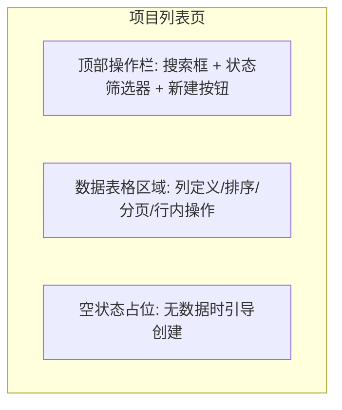
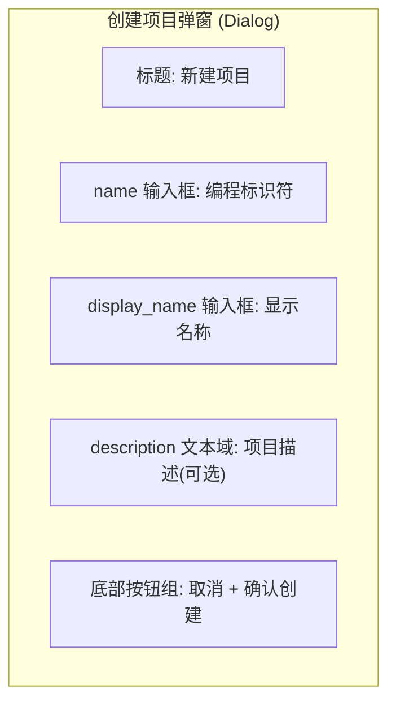
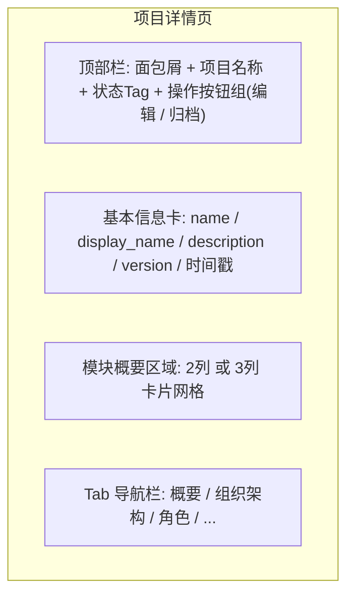
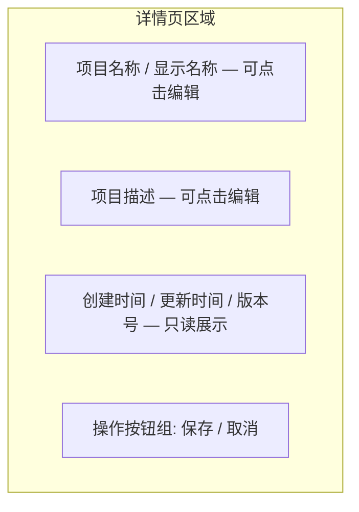
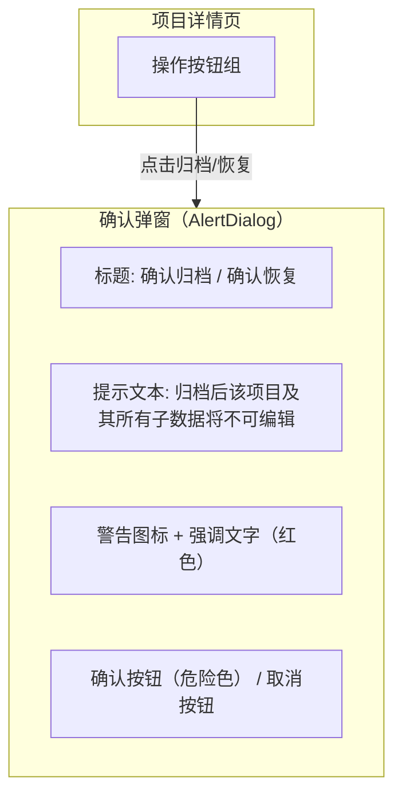
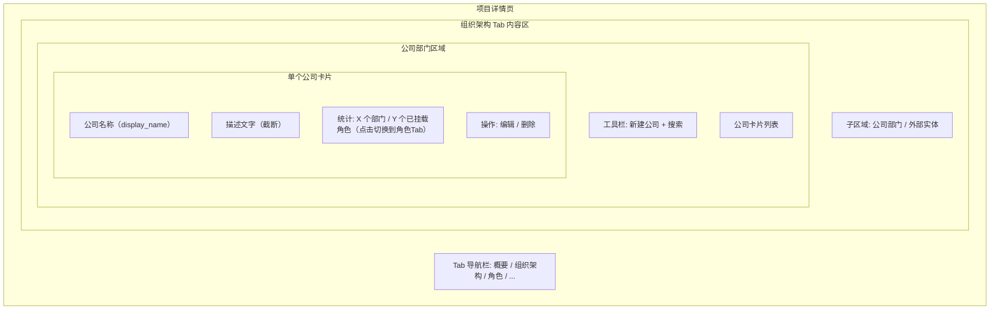
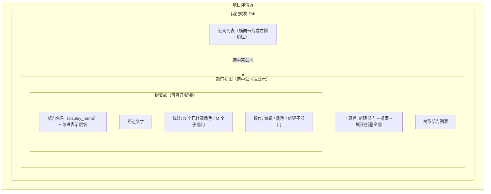
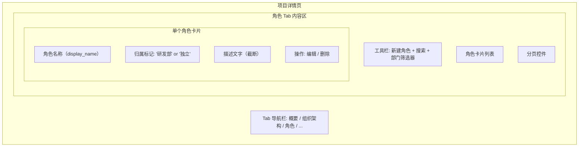
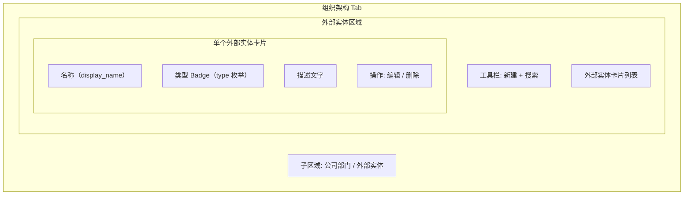
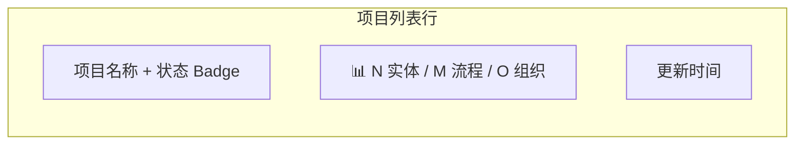

# 项目管理模块 交互设计文档

> **模块**：M1-项目管理
> **状态**：draft
> **版本**：v0.1
> **日期**：2026-05-26
> **作者**：PM + AI 协作
> **关联文档**：
>   - PRD（业务层） → `project-management-prd.md` + `project-management-prd-2.md`
>   - 领域模型 → `docs/02-domain-model/domain-model.md`（域一：项目管理）
>   - 设计语言规范 → `docs/04-tech-design/design-language.md`

---

## 1. 整体页面结构

### 1.1 模块页面导航

```
项目列表页（/projects）
└── 项目详情页（/projects/:id）
    ├── 概要 Tab
    ├── 组织架构 Tab
    │   ├── 公司部门区域（公司列表 + 部门树）
    │   └── 外部实体区域
    └── 角色 Tab
```

### 1.2 全局交互约定

| 约定编号 | 约定内容 | 适用场景 |
|---------|---------|---------|
| UI-M1-01 | **确认弹窗模式**：所有破坏性操作（归档/删除）使用 `AlertDialog`（非普通 Dialog），确认按钮使用危险色（红色），取消按钮使用次要样式 | 归档、恢复、删除 |
| UI-M1-02 | **Loading 态**：所有异步操作的触发按钮在请求期间显示 loading 指示器（spinner 或禁用态），防止重复提交 | 所有 POST/PUT/DELETE/PATCH |
| UI-M1-03 | **乐观更新策略**：列表操作（新建/删除）成功后，优先使用乐观更新（本地立即更新 UI），然后后台 revalidate；失败时回滚并提示 | 列表页新建/删除 |
| UI-M1-04 | **空状态引导**：所有列表空状态包含「新建」入口按钮和友好提示文案，不能只显示空白 | 公司/部门/角色/外部实体/项目列表 |
| UI-M1-05 | **防抖搜索**：所有搜索框输入后 300ms 防抖再发起请求 | 所有搜索框 |
| UI-M1-06 | **Esc 取消**：所有模态对话框（Dialog/AlertDialog）支持 Esc 键关闭，等同于点击「取消」 | 所有对话框 |
| UI-M1-07 | **归档视觉区分**：归档项目和归档项目下的子实体在列表/详情页有明确视觉标识（灰色 Badge / 降低透明度 / 隐藏操作按钮） | 项目列表/详情/所有子实体列表 |

---

## 2. 项目列表页（F-M1-01）

### 2.1 页面布局



### 2.2 元素清单

| 区域 | 元素 | 类型 | 说明 |
|------|------|------|------|
| 顶部操作栏 | 搜索框 | Search | name 字段模糊搜索，300ms 防抖 |
| 顶部操作栏 | 状态筛选器 | Tag/Badge 切换组 | 三态切换: 全部 / 活跃 / 已归档 |
| 顶部操作栏 | 新建按钮 | Button (主要) | 触发创建项目弹窗（F-M1-02） |
| 数据表格 | 表头行 | Table Header | 可排序列: 名称 / 创建时间 / 更新时间；点击切换升序/降序 |
| 数据表格 | 数据行 | Table Row | 显示: display_name / name / status Tag / version / updated_at / summary 统计 |
| 数据表格 | 行内操作列 | Button Group | hover 显示: 编辑(跳转详情) / 归档(确认弹窗) |
| 数据表格 | 分页器 | Pagination | 默认 20 条/页, 可选 10/50/100 |
| 底部 | 空状态 | Empty | "暂无项目, 点击新建" + 新建按钮 |

### 2.3 交互行为

| 步骤 | 用户操作 | 系统响应 | 异常处理 |
|------|---------|---------|---------|
| 1 | 进入系统首页 / 点击侧边栏"项目" | 渲染项目列表页，发起 GET /api/v1/projects 请求 | 显示 Skeleton 加载状态 |
| 2 | 在搜索框输入关键词 | 300ms 防抖后重新请求，携带 search 参数 | 输入清空时自动重置筛选 |
| 3 | 点击状态筛选 Tag | 切换筛选条件，重新请求，携带 status 参数 | 默认选中"全部" |
| 4 | 点击表头排序 | 切换排序方向，重新请求，携带 sort+order 参数 | 循环: 升序 → 降序 → 默认 |
| 5 | 切换分页 | 跳转到对应页，重新请求，携带 page+pageSize 参数 | 边界保护: 首页/末页不越界 |
| 6 | 点击某项目行或"编辑"按钮 | 跳转到项目详情页 /projects/:id | — |
| 7 | 点击行内"归档"按钮 | 弹出归档确认弹窗（AlertDialog） | 已归档项目隐藏归档按钮 |
| 8 | 在确认弹窗中点击"确认" | 调用 DELETE API，成功后从列表移除该行并 Toast 提示 | 取消则关闭弹窗，无操作 |

**快捷操作**：
- 快速归档：行内归档按钮 → 二次确认弹窗 → 确认后软删除
- 快速新建：顶部新建按钮 → 打开创建项目弹窗

### 2.4 AI 编码提示

- **防抖搜索**：使用 `useDebouncedValue` 或 `lodash.debounce`，300ms 防抖
- **排序状态管理**：用 `{ sort: string; order: 'asc'|'desc' }` 对象统一管理
- **Tag 筛选器"全部"语义**："全部"= 不传 status 参数（非传特殊值）
- **行内操作 hover 显示**：用 CSS `group-hover` 实现，不需要 JS 控制
- **空状态边界**：首次加载显示 Skeleton，加载完成后 data 为空才显示 Empty

---

## 3. 创建项目弹窗（F-M1-02）

### 3.1 布局结构



### 3.2 元素清单

| 区域 | 元素 | 类型 | 说明 |
|------|------|------|------|
| 弹窗容器 | Dialog / Modal | Modal | 居中弹出，点击遮罩或 ESC 可关闭 |
| 标题区域 | 弹窗标题 | Text | "新建项目" |
| 表单区域 | name 输入框 | Input | 编程标识符，placeholder: "如 my-project"，唯一性校验 |
| 表单区域 | display_name 输入框 | Input | 显示名称，placeholder: "如 换电站管理系统" |
| 表单区域 | description 文本域 | Textarea | 可选，placeholder: "简要描述这个项目..."，最大 500 字符 |
| 底部操作区 | 取消按钮 | Button (次要) | 关闭弹窗，不保存 |
| 底部操作区 | 确认创建按钮 | Button (主要) | 触发表单校验 → 调用创建 API |
| 表单区域 | 字段级错误提示 | Text (错误态) | 校验失败时显示在对应字段下方 |

### 3.3 交互行为

| 步骤 | 用户操作 | 系统响应 | 异常处理 |
|------|---------|---------|---------|
| 1 | 点击"新建"按钮 | 弹出创建项目 Dialog | — |
| 2 | 输入 name | 失焦后前端即时校验格式 | 格式错误时字段下方显示红色提示 |
| 3 | 输入 display_name | 失焦后前端即时校验非空 | 为空时显示"请输入显示名称" |
| 4 | 输入 description（可选） | 无即时校验，仅最大长度限制 | 超过 500 字符时截断并提示 |
| 5 | 点击"确认创建" | 前端完整校验 → 通过后调用 POST API | 校验不通过时聚焦到第一个错误字段 |
| 6 | 等待 API 响应 | 按钮显示 loading 状态，禁用重复点击 | — |
| 7a | 创建成功（201） | 关闭弹窗 → Toast 提示 → 自动跳转详情页 | — |
| 7b | 名称冲突（409） | 在 name 字段下方显示"该名称已被使用，请更换" | 用户修改后可重新提交 |
| 7c | 校验失败（400） | 显示服务端返回的字段级错误信息 | 按字段定位展示 |
| 7d | 网络异常 | 显示通用错误提示 + 重试按钮 | — |

### 3.4 AI 编码提示

- **name 的正则校验**：前端和后端都要做，两边正则必须保持一致
- **唯一性预检**：可在停止输入 500ms 后发轻量 GET 请求预检（可选优化）
- **弹窗关闭**：创建成功后立即关闭弹窗，不要等 Toast 动画结束
- **表单重置**：弹窗每次打开时必须是空白状态，close 时重置 form 状态

---

## 4. 项目详情页（F-M1-03）

### 4.1 布局结构



### 4.2 元素清单

| 区域 | 元素 | 类型 | 说明 |
|------|------|------|------|
| 顶部栏 | 面包屑导航 | Breadcrumb | "首页 > 项目 > XXX" |
| 顶部栏 | 项目名称 | Text (大标题) | display_name，后面附 name 小字标注 |
| 顶部栏 | 状态标签 | Tag/Badge | active=绿色 / archived=灰色 |
| 顶部栏 | 编辑按钮 | Button (次要) | 触发内联编辑模式（F-M1-04） |
| 顶部栏 | 归档按钮 | Button (危险) | 触发归档确认弹窗（F-M1-05）；已归档时隐藏或禁用 |
| 基本信息卡 | 各字段 | Text | name / display_name / description / version(格式"v{N}") / created_at / updated_at |
| 模块概要 | 卡片容器 | Card Grid | 响应式网格布局，2 列（宽屏可 3 列） |
| 模块概要 | 领域模型卡片 | Card | 图标 + "领域模型" + 统计数 + 箭头入口 → 点击进入 M2 |
| 模块概要 | 业务流程卡片 | Card | 图标 + "业务流程" + 统计数 + 箭头入口 → 点击进入 M3 |
| 模块概要 | 组织架构卡片 | Card | 图标 + "组织架构" + 统计数 → 点击滚动到组织管理区域 |
| 模块概要 | 外部实体卡片 | Card (P1) | 图标 + "外部实体" + 统计数 → 点击进入 F-M1-09 |

### 4.3 交互行为

| 步骤 | 用户操作 | 系统响应 | 异常处理 |
|------|---------|---------|---------|
| 1 | 从列表页点击某项目行 | 路由跳转 `/projects/:id` | — |
| 2 | 页面加载 | 并行请求详情 + summary（Promise.all） | 显示 Skeleton 加载态 |
| 3a | 详情加载成功 | 渲染完整页面 | — |
| 3b | 详情加载失败（404） | 显示 404 错误页，提供"返回列表"按钮 | — |
| 4 | 浏览模块概要卡片 | 各卡片显示对应模块统计数 | summary 失败时显示"—" |
| 5 | 点击"领域模型"卡片 | 路由跳转 M2 模块列表页 | Phase 1 M2 未实现时 Toast 提示"该功能正在开发中" |
| 6 | 点击"业务流程"卡片 | 路由跳转 M3 模块 | 同上 |
| 7 | 点击"组织架构"卡片 | 页面平滑滚动到组织管理区域 | — |
| 8 | 点击顶部"编辑"按钮 | 进入编辑模式（F-M1-04） | — |
| 9 | 点击顶部"归档"按钮 | 弹出归档确认弹窗（F-M1-05） | 已归档时隐藏此按钮 |

### 4.4 AI 编码提示

- **并行请求**：详情和摘要用 `Promise.all([getDetail(id), getSummary(id)])` 并行发起
- **404 边界**：需要友好的 404 页面，不要用通用 Error Boundary 兜底
- **归档项目 UI 差异**：通过 status prop 控制，归档时隐藏编辑/归档按钮，顶部增加灰色"已归档"Badge
- **模块卡片降级**：M2/M3 未实现时，点击卡片 Toast 提示而非 404 或白屏

---

## 5. 编辑项目基本信息（F-M1-04）

### 5.1 布局结构

编辑采用**行内编辑模式**（Inline Edit）——不跳转独立页面，在详情页内直接修改字段值。



### 5.2 元素清单

| # | 元素 | 类型 | 交互说明 |
|---|------|------|---------|
| 1 | `name` 字段 | 可编辑文本框 | 编程标识符，仅允许英文/数字/下划线/连字符 |
| 2 | `display_name` 字段 | 可编辑文本框 | 显示名称，支持中英文 |
| 3 | `description` 字段 | 可编辑多行文本 | 项目描述，可为空 |
| 4 | `created_at` | 只读文本 | 创建时间，不可修改 |
| 5 | `updated_at` | 只读文本 | 最后更新时间，自动刷新 |
| 6 | `version` | 只读文本 | 版本号，乐观锁依据 |
| 7 | 「保存」按钮 | 主按钮 | 提交修改到后端 |
| 8 | 「取消」按钮 | 次按钮 | 放弃修改，恢复原值 |

### 5.3 交互行为

| 步骤 | 操作 | 系统/页面响应 |
|------|------|-------------|
| 1 | 点击 name / display_name / description 字段 | 字段切换为可编辑状态，出现「保存」「取消」按钮 |
| 2 | 修改字段值 | 输入框实时显示，触发前端校验 |
| 3 | 点击「保存」 | 前端完整校验 → 调用 PUT /api/v1/projects/:id |
| 4 | 后端乐观锁校验通过，更新成功 | 字段恢复只读态，显示新值，updated_at 和 version 刷新 |
| 5 | （异常 A）name 重复 | 409 Conflict → name 输入框下方显示错误，不关闭编辑态 |
| 6 | （异常 B）乐观锁冲突 | 409 Conflict → 弹窗提示"数据已被其他人修改，请刷新"，关闭编辑态 |
| 7 | （异常 C）归档项目 | 400 Bad Request → 归档项目不展示编辑入口 |

**快捷操作**：
- `Esc` 键：等同于点击「取消」
- `Enter` 键（仅单行输入框）：等同于点击「保存」
- 多行文本域不支持 Enter 快捷保存

### 5.4 AI 编码提示

- **行内编辑状态管理**：用 `isEditing` + `editForm` 快照控制，进入编辑时深拷贝当前值
- **取消快照还原**：点击「取消」时还原到进入编辑时的原始值，不是"上一次保存的值"
- **乐观锁实现**：PUT 请求必须携带 `version`，后端 `WHERE id=:id AND version=:currentVersion`
- **归档防御**：`project.status === 'archived'` 时不显示编辑入口

---

## 6. 归档 / 恢复项目（F-M1-05）

### 6.1 布局结构



### 6.2 元素清单

| # | 元素 | 类型 | 交互说明 |
|---|------|------|---------|
| 1 | 「归档项目」按钮 | 危险按钮（红色） | 仅活跃项目显示 |
| 2 | 「恢复项目」按钮 | 主按钮 | 仅归档项目显示 |
| 3 | 弹窗标题 | 文本 | 动态"确认归档"或"确认恢复" |
| 4 | 弹窗提示正文 | 文本 | 说明归档/恢复后果 |
| 5 | 警告强调区 | 文本（红色） | 归档时"不可编辑"；恢复时"将重新可编辑" |
| 6 | 「确认」按钮 | 危险/主按钮 | 执行操作 |
| 7 | 「取消」按钮 | 次按钮 | 关闭弹窗，无操作 |
| 8 | 弹窗遮罩层 | 半透明背景 | 点击遮罩 = 取消 |

### 6.3 交互行为

**归档主流程（6 步）**：

| 步骤 | 操作 | 系统/页面响应 |
|------|------|-------------|
| 1 | 点击「归档项目」 | 弹出 AlertDialog，显示警告文案 |
| 2 | 点击「确认」 | 弹窗关闭，按钮 loading，禁用其他操作 |
| 3 | 前端调用 PATCH /api/v1/projects/:id/status { status: 'archived' } | 发起请求 |
| 4 | 后端更新成功（version+1） | — |
| 5 | 响应成功 | 详情页刷新：「已归档」Badge，「归档」替换为「恢复」，编辑入口隐藏 |
| 6 | （异常）乐观锁冲突 | Toast 提示"数据已被修改，请刷新重试" |

**恢复主流程**：镜像归档流程，调用 `{ status: 'active' }`。

**快捷操作**：Esc 键 / 点击遮罩层 = 关闭弹窗（取消）

### 6.4 AI 编码提示

- **确认弹窗**：使用 shadcn/ui 的 `AlertDialog`（非普通 Dialog），有更强的视觉警示
- **列表页联动**：归档/恢复成功后通过 query client 失效或 event bus 更新列表数据

---

## 7. 公司管理（F-M1-06）

### 7.1 布局结构

公司管理采用**项目详情页内嵌「组织架构」Tab** 的形式。



### 7.2 元素清单

| # | 元素 | 类型 | 交互说明 |
|---|------|------|---------|
| 1 | 「组织架构」Tab | Tab 项 | 切换到组织架构视图，内含公司部门和外部实体两个子区域 |
| 2 | 「新建公司」按钮 | 主按钮 | 打开新建公司对话框 |
| 3 | 搜索框 | 输入框 | 按 display_name 或 name 模糊搜索，实时过滤 |
| 4 | 公司卡片 | 卡片组件 | 展示公司名称/描述/统计 |
| 5 | 公司名称 | 文本 | display_name，可点击 |
| 6 | 公司描述 | 文本（截断） | description，超过 2 行省略号 |
| 7 | 统计信息 | 徽章文本 | "N 个部门 / M 个已挂载角色"，点击角色数可切换到「角色」Tab 并筛选 |
| 8 | 「编辑」按钮 | 图标按钮 | 打开编辑公司对话框 |
| 9 | 「删除」按钮 | 危险图标按钮 | 弹出删除确认弹窗 |
| 10 | 分页控件 | 分页器 | 默认每页 20 条，支持 10/20/50 |
| 11 | 空状态 | 占位提示 | "暂无公司，点击新建开始添加" |

### 7.3 交互行为

**查看公司列表（4 步）**：

| 步骤 | 操作 | 系统/页面响应 |
|------|------|-------------|
| 1 | 进入项目详情页，点击「组织架构」Tab | Tab 切换，内容区加载公司列表 |
| 2 | 前端调用 GET /api/v1/projects/:id/companies | 加载公司列表 |
| 3 | 页面渲染公司卡片，每张显示名称/描述/部门数/角色数 | 用户浏览 |
| 4 | 无数据 | 返回空列表，显示空状态 |

**新建公司（7 步）**：

| 步骤 | 操作 | 系统/页面响应 |
|------|------|-------------|
| 1 | 点击「新建公司」 | 弹出对话框，含 name / display_name / description |
| 2 | 填写表单，前端实时校验 | — |
| 3 | 点击「提交」 | 按钮 loading → POST /api/v1/projects/:id/companies |
| 4 | 后端校验 name 唯一性（同一 project_id 范围），创建记录 | 返回新公司数据 |
| 5 | 前端收到成功响应，关闭对话框，列表顶部插入新卡片 | — |
| 6 | （异常 A）name 同项目内已存在 | 409 → 输入框红字"该公司标识符在此项目中已存在" |
| 7 | （异常 B）项目已归档 | 400 → Toast 提示 |

**删除公司（4 步）**：

| 步骤 | 操作 | 系统/页面响应 |
|------|------|-------------|
| 1 | 点击「删除」 | 弹出 AlertDialog，提示"删除后关联部门将被删除，关联角色将变为独立角色" |
| 2 | 点击「确认删除」 | 调用 DELETE /api/v1/companies/:companyId |
| 3 | 后端级联删除 departments，解绑 roles（department_id SET NULL），删 company | 返回 204 |
| 4 | （异常）公司被领域实体/流程引用 | 409 ENTITY_IN_USE → 弹窗展示引用清单 |

### 7.4 AI 编码提示

- **归档项目的只读态**：组织架构 Tab 内容可见，但工具栏新建按钮和卡片编辑/删除按钮隐藏，用 `isReadOnly` prop 控制
- **统计字段**：`department_count` / `role_count` 是虚拟字段，每次列表查询需 COUNT 子查询

---

## 8. 部门管理（F-M1-07）

### 8.1 布局结构

部门管理入口在公司卡片内部，采用两级导航：项目详情 → 组织架构 Tab → 选择公司 → 部门树形列表。



### 8.2 元素清单

| # | 元素 | 类型 | 交互说明 |
|---|------|------|---------|
| 1 | 公司选择器 | 卡片列表 / 下拉选择 | 选中高亮，切换公司时刷新部门视图 |
| 2 | 「新建部门」按钮 | 主按钮 | 打开新建部门对话框（可选父部门） |
| 3 | 搜索框 | 输入框 | 按 display_name / name 模糊搜索 |
| 4 | 展开/折叠全部 | 按钮 | 一键展开或折叠所有树节点 |
| 5 | 部门树节点 | 树形组件 | 可展开/折叠，缩进表示层级深度 |
| 6 | 角色统计 | 徽章文本 | "N 个已挂载角色"，点击切换到「角色」Tab 并筛选 |
| 7 | 「编辑」按钮 | 图标按钮 | 打开编辑对话框 |
| 8 | 「新建子部门」按钮 | 图标按钮 | 在当前部门下新建子部门，parent_id 预填充 |
| 9 | 「删除」按钮 | 危险图标按钮 | 弹出删除确认（有子部门时增强警告） |

### 8.3 交互行为

**查看部门列表（3 步）**：

| 步骤 | 操作 | 系统/页面响应 |
|------|------|-------------|
| 1 | 点击某个公司卡片 | 公司高亮，加载该公司的部门树形列表 |
| 2 | 前端调用 GET /api/v1/companies/:companyId/departments?tree=true | 加载树形数据 |
| 3 | 页面渲染树形部门列表，根据 parent_id 构建缩进/展开关系 | 可展开/折叠节点 |

**新建部门（6 步）**：

| 步骤 | 操作 | 系统/页面响应 |
|------|------|-------------|
| 1 | 点击「新建部门」或某部门的「新建子部门」 | 弹出对话框，company_id 预填充；子部门入口时 parent_id 预填充 |
| 2 | 填写 name / display_name / description，选择父部门（可选，含"无（顶级部门）"） | — |
| 3 | 点击「提交」→ POST /api/v1/companies/:companyId/departments | — |
| 4 | 后端校验，创建成功 | 对话框关闭，树形列表新增节点 |
| 5 | （异常 A）name 同公司内已存在 | 409 → 红字提示 |
| 6 | （异常 B）项目已归档 | 400 → Toast 提示 |

**删除部门（4 步）**：

| 步骤 | 操作 | 系统/页面响应 |
|------|------|-------------|
| 1 | 点击「删除」 | 弹出 AlertDialog；若有子部门或关联角色，显示增强警告："该部门下有 N 个子部门和 M 个关联角色（将变为独立角色）" |
| 2 | 确认 | 调用 DELETE /api/v1/departments/:deptId |
| 3 | 后端 CASCADE 删子部门 → SET NULL 解绑 roles → 删本身 | 返回 204 |
| 4 | （异常）被引用 | 409 ENTITY_IN_USE → 展示引用清单 |

### 8.4 AI 编码提示

- **多级部门是必须支持的**：UI 必须使用树形组件（如 Collapsible + 递归渲染，或 react-arborist）
- **树形数据两种模式**：API 支持 `?tree=true` 返回嵌套 JSON，Phase 1 建议前端用 tree=true
- **循环引用防御**：编辑 parent_id 时，下拉选择器中过滤掉当前部门自身及其后代节点

---

## 9. 角色管理（F-M1-08）

### 9.1 布局结构

角色管理作为**项目详情页的独立一级 Tab**，与「概要」「组织架构」平级。



### 9.2 元素清单

| # | 元素 | 类型 | 交互说明 |
|---|------|------|---------|
| 1 | 「角色」Tab | Tab 项（一级，与"组织架构"平级） | 切换到角色视图，加载该项目全部角色 |
| 2 | 「新建角色」按钮 | 主按钮 | 打开新建角色对话框 |
| 3 | 搜索框 | 输入框 | 按 name / display_name ILIKE 模糊搜索 |
| 4 | 部门筛选器 | 下拉选择 | 选项含"全部"/"独立"(null)/各部门名称 |
| 5 | 角色卡片 | 卡片组件 | 名称 + 归属标记 + 描述 + 操作按钮 |
| 6 | 归属标记 | Badge 标签 | 有 department_id 显示部门名；无则显示"独立"标签（不同颜色） |
| 7 | 「编辑」按钮 | 图标按钮 | 打开编辑对话框 |
| 8 | 「删除」按钮 | 危险图标按钮 | 弹出删除确认 |
| 9 | 分页控件 | 分页器 | 默认每页 20 条 |
| 10 | 空状态 | 占位提示 | "暂无角色，点击新建开始添加" |

### 9.3 交互行为

**查看角色列表（3 步）**：

| 步骤 | 操作 | 系统/页面响应 |
|------|------|-------------|
| 1 | 点击「角色」Tab | Tab 切换，加载该项目全部角色 |
| 2 | 前端调用 GET /api/v1/projects/:projectId/roles | 加载角色数据（含归属信息） |
| 3 | 渲染角色卡片，显示名称/归属标记/描述 | — |

**筛选角色**：

| 步骤 | 操作 | 系统/页面响应 |
|------|------|-------------|
| 1 | 在部门筛选器中选择某部门或"独立" | URL 追加 ?departmentId=xxx 或 ?departmentId=__none__ |
| 2 | 前端调用 API 携带筛选参数 | 返回筛选后列表 |
| 3 | 从公司/部门卡片点击挂载数字跳转时 | 自动设置对应筛选值并加载 |

**新建角色（7 步）**：

| 步骤 | 操作 | 系统/页面响应 |
|------|------|-------------|
| 1 | 点击「新建角色」 | 弹出对话框，含 name / display_name / description / 部门（可选） |
| 2 | "部门"字段为下拉选择，含"不挂载（独立角色）"选项 | — |
| 3 | 点「提交」→ POST /api/v1/projects/:projectId/roles | — |
| 4 | 后端校验 name 唯一性（同一 project_id 范围），创建 | 返回新角色 |
| 5 | 前端关闭对话框，列表顶部插入新卡片 | — |
| 6 | （异常 A）name 同项目内已存在 | 409 → 输入框红字 |
| 7 | （异常 B）项目已归档 | 400 → Toast 提示 |

**与组织架构的联动**：组织架构 Tab 中的公司/部门卡片显示已挂载角色数，点击数字切换到「角色」Tab 并自动应用对应部门筛选。

### 9.4 AI 编码提示

- **独立 Tab 入口**：角色是项目详情页的一级 Tab，不是组织架构的子 Tab
- **department_id 可空**：新建对话框"部门"下拉应有"不挂载（独立角色）"选项
- **归属标记**：有 department_id 显示部门名，无的显示"独立"标签（不同颜色）
- **部门筛选器数据**：调用 `GET /api/v1/projects/:projectId/departments?flat=true` 获取跨公司的全部门列表，加上"全部"和"独立"两个固定选项

---

## 10. 外部实体管理（F-M1-09）

### 10.1 布局结构

外部实体管理作为「组织架构」Tab 下的一个子区域（与公司部门并列）。



### 10.2 元素清单

| # | 元素 | 类型 | 交互说明 |
|---|------|------|---------|
| 1 | 「外部实体」子 Tab | Tab 项 | 切换到外部实体视图 |
| 2 | 「新建外部实体」按钮 | 主按钮 | 打开新建对话框 |
| 3 | 搜索框 | 输入框 | 按名称模糊搜索 |
| 4 | 外部实体卡片 | 卡片组件 | 名称 + 类型 Badge + 描述 |
| 5 | 类型 Badge | 标签组件 | 显示 type 枚举值的中文映射 |
| 6 | 「编辑」按钮 | 图标按钮 | 编辑对话框 |
| 7 | 「删除」按钮 | 危险图标按钮 | 删除确认 |
| 8 | 空状态 | 占位 | "暂无外部实体" |

### 10.3 交互行为

CRUD 流程与公司管理基本一致，差异：
- 父实体：Project（直接隶属，无需选择父实体）
- 额外字段：`type`（实体类型枚举，下拉选择）
- 级联删除：删外部实体→直接删（无子实体）

### 10.4 AI 编码提示

- **无父实体选择器**：新建时不需要选父实体，project_id 来自 URL 路径
- **type 枚举同步**：前端下拉选项和后端校验名单必须保持一致

---

## 11. 项目摘要统计（F-M1-10）

### 11.1 布局位置

**位置 1 — 项目列表页（行内摘要）**：

每个项目表格行右侧展示统计徽章：



**位置 2 — 项目详情页概要区**：模块摘要卡片网格（2x2 或 3x2 布局），每张卡片显示统计数 + 入口。

### 11.2 交互行为

| 步骤 | 操作 | 系统/页面响应 |
|------|------|-------------|
| 1 | 用户打开项目列表页 | 列表 API 返回时内嵌 summary 统计数据（避免 N+1 查询） |
| 2 | 浏览列表，每行看到摘要数字 | 数字来自列表响应的内嵌字段 |
| 3 | 进入项目详情页 | 并行请求详情 + 摘要（Promise.all） |
| 4 | 某类对象数为 0 | 对应徽章/卡片显示 "0"，不隐藏 |

### 11.3 AI 编码提示

- **避免 N+1 查询**：列表 SQL 中用子查询或 LEFT JOIN + COUNT 一次性计算
- **0 值不隐藏**：显示 "0 领域实体" 而非完全隐藏，避免用户困惑

---

## 12. UI/UX 验收标准

| 编号 | 验收标准 | 对应约定 |
|------|---------|---------|
| AC-M1-U01 | 所有破坏性操作的确认弹窗均为 AlertDialog 样式（红色确认按钮 + 警告图标） | UI-M1-01 |
| AC-M1-U02 | 所有异步操作期间，触发按钮显示 spinner + 禁用点击，操作完成后恢复正常 | UI-M1-02 |
| AC-M1-U03 | 所有列表的空状态包含「新建」入口按钮 + 友好提示文案 | UI-M1-04 |
| AC-M1-U04 | 所有对话框支持 Esc 键关闭，效果等同于点击「取消」 | UI-M1-06 |
| AC-M1-U05 | 归档项目在列表页有灰色「已归档」Badge，在详情页所有编辑/归档按钮隐藏 | UI-M1-07 |
| AC-M1-U06 | 项目详情页 Tab 导航包含"概要""组织架构""角色"等一级 Tab（角色与组织架构平级）；组织架构 Tab 内含公司部门子区（树形部门 + 外部实体子 Tab），公司/部门卡片显示已挂载角色数可点击跳转到角色 Tab 并自动筛选 | F-M1-06~08 |
| AC-M1-U07 | 公司/部门/角色/外部实体的新建对话框中，name 输入框有 placeholder 示例（如 `state-grid`），display_name 有 placeholder（如 `国家电网`） | 全局 UX 一致性 |
| AC-M1-U08 | 项目列表每行的摘要统计数字使用 Badge/Micro-charts 样式展示，0 值显示为灰色 "0" 而非隐藏 | F-M1-10 |
